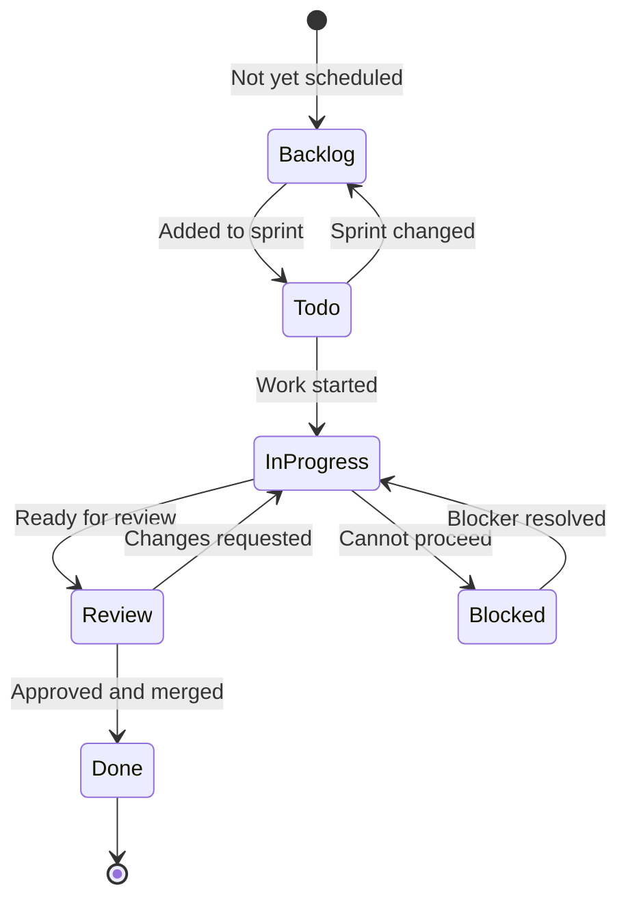

# ✅ Task Tracking — Sprint Tasks, Assignments & Completion

> **Purpose:** Track individual tasks through a sprint or project — assignee, status, due date, and completion. Tasks map to features in `feature-tracking.md` and feed into meeting agendas.
> **Last updated:** 2026-09-10 (Sprint 2 defined)

---

## 🔄 Task Status Lifecycle




### Status definitions

| Status | Meaning | Typical next action |
|--------|---------|---------------------|
| **Backlog** | Not yet scheduled for any sprint | Wait for sprint planning |
| **Todo** | In the current sprint, not started | Pick up when capacity allows |
| **In Progress** | Actively being worked on | Update progress, note blockers |
| **Review** | Implementation done, needs review | Request review, address feedback |
| **Done** | Merged, tested, and verified | Close task, update feature status |
| **Blocked** | Cannot progress due to external factor | Document blocker, escalate if needed |

---

## 📝 Task Entry Template

```markdown
### [Short task title]

| Field | Value |
|-------|-------|
| **Status** | Backlog / Todo / In Progress / Review / Done / Blocked |
| **Assignee** | @team-member |
| **Sprint** | Sprint X (dates) |
| **Due** | YYYY-MM-DD (if any) |
| **Priority** | P0 / P1 / P2 / P3 |
| **Feature** | Links to feature-tracking.md entry (if any) |
| **Estimate** | T-shirt size (S/M/L/XL) or story points |
| **Blocked by** | (if any) |

**Description:** What needs to be done.

**Acceptance criteria:**
- [ ] Criterion 1
- [ ] Criterion 2

**Notes:** Progress updates, decisions, links.
```

---

## 📋 Active Task Board

### Current Sprint — Sprint 1 (2026-09-01 to 2026-09-14)

**Sprint goal:** Stand up the agenda tracking system with initial feature entries and first case study.

| Task | Status | Assignee | Priority | Due | Feature | Notes |
|------|--------|:--------:|:--------:|:---:|---------|-------|
| Create MAIN.md hub document | ✅ Done | — | P0 | 2026-08-31 | — | Hub with architecture diagrams |
| Create feature-tracking.md with lifecycle | ✅ Done | — | P0 | 2026-08-31 | All features | Full lifecycle from Proposed to Shipped |
| Create case-studies.md template | ✅ Done | — | P0 | 2026-08-31 | — | Template with mermaid diagram patterns |
| Create task-tracking.md | ✅ Done | — | P0 | 2026-08-31 | — | Sprint task board |
| Create team-notes.md | ✅ Done | — | P0 | 2026-08-31 | — | Meeting notes + first entry |
| Create meeting-agenda.md | ✅ Done | — | P0 | 2026-08-31 | — | 6 meeting templates |
| Create completion-checklist.md | ✅ Done | — | P0 | 2026-08-31 | — | Project closeout checklist |
| Create README.md for agenda directory | ✅ Done | — | P0 | 2026-08-31 | — | Overview + Anytype inspiration |
| Populate Cypercloud/Syntara features | ✅ Done | — | P0 | 2026-08-31 | Stripe Billing, API Tokens, Customer Dashboard, System Templates, AI Prompt Library, Agent Templates, Usage Analytics, App Marketplace, Multi-tenant, White-label, Webhooks | P0-P3 entries with full detail |
| Populate Formint POS features | ✅ Done | — | P0 | 2026-08-31 | All shipped POS features | 20 shipped features with acceptance criteria |
| Populate LMS features | ✅ Done | — | P1 | 2026-08-31 | Video, Quizzes, Progress, Certificates, Email, Live Classes, Forums, Peer Review, Gamification, API, SCORM, Multi-language, White-label | P1-P3 entries |
| Populate Portfolio features | ✅ Done | — | P1 | 2026-08-31 | ATS Export, Cover Letter, Gallery, Custom Domains, Job Board, Analytics, Multi-language, LinkedIn Import | P1-P2 entries |
| Populate Infrastructure features | ✅ Done | — | P1 | 2026-08-31 | WebAuthn, Backups, Health Dashboard, Multi-region, Blue/Green, Secret Rotation, Rate Limiting, Load Testing, Cost Optimization, Disaster Recovery | P1-P3 entries |
| Populate django-fusion features | ✅ Done | — | P1 | 2026-08-31 | MCP, Storybook, Hot Reload, TypeScript, Visual Builder, Analytics | P1-P2 entries |
| Create Django-Bolt case study with mermaid diagrams | ✅ Done | — | P0 | 2026-08-31 | API Access (Formint POS) | Architecture, deployment, sequence, state diagrams |
| Update INDEX.md with agenda references | ✅ Done | — | P0 | 2026-08-31 | — | Legacy Blinko index updated |
| Create SUMMARY.md | ✅ Done | — | P0 | 2026-08-31 | — | Quick reference for team |

> **All Sprint 1 tasks complete.** ← Update with new sprint tasks below.

---

### Sprint 1.5 — interim (2026-09-03 → 2026-09-10)

> **Bookkeeping note (2026-09-10):** Rows below were logged under "Sprint 2" as
> they were completed 2026-09-03 → 2026-09-06, i.e. while Sprint 1 was still
> running. They are back-labeled **Sprint 1.5** here (interim sprint). The five
> open rows were moved into Sprint 2 as its seed — see below.
>
> **ملاحظة حفظ (2026-09-10):** سُجّلت الصفوف أدناه تحت "السباق 2" لأنها أُنجزت
> بين 2026-09-03 و2026-09-06، أي أثناء سريان السباق 1. سُمّيت هنا **السباق
> 1.5** (سباق انتقالي). نُقلت الصفوف الخمسة غير المنجزة لتكون بذرة السباق 2
> الذي يبدأ 2026-09-15 — انظر أدناه.

**Sprint goal:** Complete POS case studies with mermaid diagrams + DataToken sync tagging case study + land the content-model and business reorganization passes.

| Task | Status | Assignee | Priority | Due | Feature | Notes |
|------|--------|:--------:|:--------:|:---:|---------|-------|
| Write Multi-terminal Sync case study | ✅ Done | — | P0 | 2026-09-15 | Multi-terminal Sync | [pos-multi-terminal-sync.md](case-studies/pos-multi-terminal-sync.md) with 4 mermaid diagrams |
| Write Offline Queue case study | ✅ Done | — | P0 | 2026-09-15 | Offline Queue | [pos-offline-queue.md](case-studies/pos-offline-queue.md) with 4 mermaid diagrams |
| Write QR Menu case study | ✅ Done | — | P0 | 2026-09-15 | QR Menu | [pos-qr-menu.md](case-studies/pos-qr-menu.md) with 4 mermaid diagrams |
| Write DataToken Sync Tagging case study | ✅ Done | — | P0 | 2026-09-15 | django-fusion | [data-token-sync-tagging.md](case-studies/data-token-sync-tagging.md) with 3 mermaid diagrams |
| Add assets-ignore to worker/scheduler stacks | ✅ Done | — | P0 | 2026-09-03 | — | Shared tasks worker/scheduler + CTC scheduler no longer mount monorepo assets/media; CTC worker keeps media mount (content tasks write Wagtail media). Validated `docker compose config -q` |
| Deploy databases + Coder; redeploy & health-check | ✅ Done | — | P0 | 2026-09-03 | — | Postgres/Redis + Coder up on host; Coder healthy; Precis scheduler restarted cleanly with both scheduled jobs registered |
| Fix CTC MEDIA_ROOT default drift → canonical shared tree | ✅ Done | — | P0 | 2026-09-03 | — | Default now resolves to projects/assets/media/ctc-research (matches compose/docstring/CHANGELOG); `manage.py check` clean |
| Rewrite shared-media test to current assets-proxy topology | ✅ Done | — | P0 | 2026-09-03 | — | tests/test_shared_media.py asserts application/tools assets-proxy contract; 26/26 pass incl. live container checks |
| Research anytype.io extensibility + record proposals | ✅ Done | — | P1 | 2026-09-03 | — | [anytype-extensibility.md](anytype-extensibility.md) — Anytype model mapped to agenda/mono-repo + project separation |
| Close Loop-CRM finance integration plan → milestone | ✅ Done | — | P0 | 2026-09-05 | Loop-CRM § Formint finance integration | Deleted `formint-integration-finance-workflows.md` (git history = archive); milestone in feature-tracking.md § Loop-CRM |
| Close Loop-CRM demo-state plan → milestone | ✅ Done | — | P0 | 2026-09-05 | Loop-CRM § Demo state & auth gap fixing | Deleted `demo-state-gap-fixing.md`; milestone in feature-tracking.md § Loop-CRM; server-half deploy verification remains pending |
| Close Twenty/Postiz research doc → milestone | ✅ Done | — | P1 | 2026-09-05 | Loop-CRM § Twenty/Postiz DNA research | Deleted `twenty-postiz-comparison.md`; milestone in feature-tracking.md § Loop-CRM |
| Update plans registry + references after Loop-CRM closeout | ✅ Done | — | P1 | 2026-09-05 | — | `plans/README.md`, loop-crm README, REFERENCE.md, ar-content, product audit now point at agenda milestones |
| Define the agenda content model (Anytype glossary + packaging) | ✅ Done | — | P0 | 2026-09-05 | Agenda Content Model | [CONTENT_MODEL.md](CONTENT_MODEL.md) — object/markdown packaging (4 packages), reference contract, first-meeting agenda |
| Fix broken audit links + malformed fence/unclosed headings | ✅ Done | — | P0 | 2026-09-10 | Agenda | `dev-team-plans.md` `../../audit/` → `../audit/` (2×); `feature-tracking.md` fence line 97 + `**API Token Management` / `**Customer Dashboard` closings |
| Merge backend-plans.md into dev-team-plans.md | ✅ Done | — | P1 | 2026-09-10 | Agenda | Non-duplicated content (invoicing/reports tasks, LMS gates, cadence) merged § Backend delivery workstreams; stub left as pointer; INDEX updated |
| Reconcile feature-tracking.md with 2026-09-06 truth table | ✅ Done | — | P0 | 2026-09-10 | Precis, CTC | Added Precis Landing + CTC Research sections; renamed LMS → Precis (precis-main) — LMS with ✅ Shipped core-platform milestone; Portfolio marked legacy; Loop-CRM AI-hub milestone entry added; Product labels `LMS` → `Precis (LMS)` |
| Rewrite MAIN.md as business star-schema hub (bilingual) | ✅ Done | — | P1 | 2026-09-10 | Agenda | Facts (milestones/tasks/leads/claims) × dimensions (products/teams/sprints/plans); full inventory incl. plans family; EN/AR blocks throughout |
| Rewrite README.md with full file inventory (bilingual) | ✅ Done | — | P1 | 2026-09-10 | Agenda | All agenda files grouped by business role incl. plans family; backend-plans merge note |
| Add Arabic summary blocks to plans-family files | ✅ Done | — | P2 | 2026-09-10 | Agenda | dev-team-plans, pricing-plans, marketing-plans, data-analyst-plans — business-level summaries after EN content |
| Refresh stale dates (sprints, claims, headers) | ✅ Done | — | P1 | 2026-09-10 | Agenda | Sprint 1.5 bookkeeping note; marketing claims re-baselined → 2026-Q4; Formint Cloud launch → 2027-Q1; Last-updated headers corrected |
| Clarify Arabic-parity policy in INDEX.md | ✅ Done | — | P2 | 2026-09-10 | Agenda | Hub+plans: inline AR blocks; case studies: EN-only by design; product docs: ar-content mirror |
| Update agenda indexes to reference the content model | ✅ Done | — | P1 | 2026-09-05 | Agenda Content Model | README.md, MAIN.md, INDEX.md now link to CONTENT_MODEL.md |
| De-duplicate agenda top-level docs | ✅ Done | — | P1 | 2026-09-05 | Agenda | SUMMARY.md slimmed, INDEX tail removed, case-studies.md → pointer to case-studies/INDEX.md |
| Create agenda diagrams package (rendered images) | ✅ Done | — | P0 | 2026-09-05 | Agenda Diagrams | [diagrams/README.md](diagrams/README.md) — API UML, Django/Rust ERDs, Blinko SurrealDB; 59 SVGs rendered into docs/public/agenda/diagrams/ |
| Add render script + wire diagrams into indexes | ✅ Done | — | P1 | 2026-09-05 | Agenda Diagrams | [render-agenda-diagrams.mjs](../scripts/render-agenda-diagrams.mjs); README/MAIN/INDEX/CONTENT_MODEL updated |
| Fix dangling image refs in mono-repo plans/tasks | ✅ Done | — | P2 | 2026-09-05 | Agenda | business-model + timeline now use rendered mermaid diagrams |
| Add object types + objects separation (Anytype schema) | ✅ Done | — | P0 | 2026-09-05 | Agenda Content Model | 15 new type defs in [objects/](mono-repo/objects/) + 20 type dirs with repo-tied content (projects, editions, sprints, releases, integrations, apis, tools, modules…) — 87 files |
| Complete all mono-repo prompts (graph, relations, guides) | ✅ Done | — | P1 | 2026-09-05 | Agenda Content Model | [_prompts.md](mono-repo/_prompts.md) ledger all ✅; [_relations.md](mono-repo/objects/_relations.md) extended; CONTENT_MODEL package B updated |
| Record Loop-CRM AI hub + locale + connectors as milestone | ✅ Done | — | P0 | 2026-09-06 | Loop-CRM § AI Hub, locale & connectors | Commit `61893cc7` recorded as ✅ Shipped milestone in [feature-tracking.md](feature-tracking.md) § Loop-CRM |
| Backend × frontend implementation-status reconciliation | ✅ Done | — | P1 | 2026-09-06 | dev-team-plans.md | Status-truth matrix + "couldn't add" blockers added to [dev-team-plans.md](dev-team-plans.md) |
| Frontend component placeholder audit (all products) | ✅ Done | — | P1 | 2026-09-06 | Component audit | Report in docs/audit/frontend-components-2026-09-06.md — CTC lorem demo templates, precis-main brand tagline, Formint Pro "coming soon" Add forms |
| Add Loop-CRM ERD tooling + docs/erd README | ✅ Done | — | P0 | 2026-09-06 | Loop-CRM models | `django_extensions` + `make erd`/`erd-all` in backend; docs/erd README; graph_models DOT generated incl. crm (sales) + marketing apps |
| Update per-project docs + agenda indexes | ✅ Done | — | P2 | 2026-09-06 | Agenda docs | SUMMARY/team-notes/dev-team-plans updated; plans README + loop-crm docs pointed at the audit |
| Implement Formint Pro create/edit modals replacing "coming soon" toasts | ✅ Done | — | P1 | 2026-09-06 | Formint Pro | suppliers, hr/roles, hr/schedules, hr/payroll, admin/notes, kitchen/recipes wired to /suppliers/, /roles/, /employee-schedules/, /payroll/, /notes/, /recipes/ + /ingredients/; `astro check` clean (audit doc § 2.3) |
| Formint Pro modal verification: stale display fields + Vitest payload contracts | ✅ Done | — | P1 | 2026-09-06 | Formint Pro | Removed `item.*_name` bindings → `empName()`/`prodName()` FK resolution; new create-forms.contract.test.ts; vitest 86/86 pass, astro check 0 errors/0 warnings. Backend suite blocked in sandbox (lockfile needs libs/django-bolt absent from checkout) — run `make test` in the product image (audit doc § 2.3) |

---

### Sprint 2 — 2026-09-15 to 2026-09-28

**Sprint goal (EN):** Close the agenda's open loops — hold the kickoff meeting,
validate the docs pipeline, and clear the deploy-gated Loop-CRM verifications —
while seeding the sales pipeline for the Formint Professional launch.

**هدف السباق (عربي):** إغلاق الحلقات المفتوحة في الأجندة — عقد اجتماع الانطلاق،
والتحقق من خط توثيق المستندات، وتصفية تحققات Loop-CRM المعوقة على النشر — مع
تهيئة خط البيع لإطلاق Formint الاحترافي.

| Task | Status | Assignee | Priority | Due | Feature | Notes |
|------|--------|:--------:|:--------:|:---:|---------|-------|
| Hold first agenda meeting from the kickoff reference | ✅ Done | @mammhoud | P0 | 2026-09-10 (was 09-12) | Agenda Content Model | Held early per [CONTENT_MODEL.md](CONTENT_MODEL.md) § 5; recorded in [team-notes.md](team-notes.md) § 2026-09-10; contract adopted team-wide |
| Validate all mermaid diagrams render correctly | 🔁 Carried (Sprint 1.5) | @mahmoud | P1 | 2026-09-18 | Agenda Diagrams | Run `npm run validate-content` in the docs pipeline; 60 SVGs currently render (last render pass 2026-09-10: 0 failed) |
| Review all case studies for completeness | 🔁 Carried (Sprint 1.5) | @asmaa | P1 | 2026-09-18 | Case studies | Check Context → Architecture → Implementation → Results → Lessons on all 8 studies |
| Update feature tracking with case study references | 🔁 Carried (Sprint 1.5) | @yahia | P1 | 2026-09-19 | POS, django-fusion | Verify every ✅ Shipped entry links its case study (cross-checked 2026-09-10 — mostly done; confirm) |
| Configure live OAuth provider credentials + publish E2E | 📥 From backlog | @mahmoud | P0 | 2026-09-26 | Loop-CRM § AI Hub, locale & connectors | Requires deployed `crm.structa.cloud` + secrets; deploy-gated, not code work |
| Verify demo-state server half on deployed stack | 📥 From backlog | @mahmoud | P0 | 2026-09-26 | Loop-CRM § Demo state | Real deploy required; closes the open acceptance criterion on the milestone |
| Review Sprint 1.5 action items closure | 🔁 Carried (Sprint 1.5) | @moustafa | P2 | 2026-09-21 | — | Verify all interim-sprint open items are either done or carried with a reason |
| Seed sales pipeline: assign owners + convert-pilot plan | 📥 From backlog | @mammhoud | P0 | 2026-09-22 | Sales pipeline | Fill `Owner`/`Next Step` on the 3 pilot-restaurant rows + ThemeForest listing step in [sales-pipeline.md](sales-pipeline.md); targets per [pricing-plans.md](pricing-plans.md) |
| Assign owners to the 3 P0 Syntara features | 📥 From backlog | @moustafa | P1 | 2026-09-22 | Stripe Billing, API Tokens, Customer Dashboard | Every P0 is `Owner: TBD` — assign real owners or explicitly mark unowned-blocked in [feature-tracking.md](feature-tracking.md) |
| Run docs content validation + link check | 🆕 Sprint 2 | @mahmoud | P1 | 2026-09-19 | Agenda | `npm run validate-content`; covers all 2026-09-10 edits (schema, sales-pipeline, AR mirrors) |
| Backlog refinement: schedule remaining 11 rows | 🆕 Sprint 2 | @moustafa | P1 | 2026-09-24 | — | Assign each backlog row to Sprint 3 or mark Parked with a reason (see Backlog below) |

---

### Backlog (post Sprint-2 refinement)

> Pruned 2026-09-10: rows promoted to Sprint 2 removed; conditional case-study
> rows re-baselined to their triggering event.

| Task | Priority | Feature | Notes |
|------|----------|---------|-------|
| Populate mono-repo subdirectory plans | P1 | dev-team-plans.md | Review existing dev-team-plans and align with agenda |
| Write case study for Stripe Billing | P1 | Stripe Billing | Real case study with mermaid diagrams |
| Write case study for API Token Management | P1 | API Token Management | Real case study with mermaid diagrams |
| Write case study for Customer Dashboard | P1 | Customer Dashboard | Real case study with mermaid diagrams |
| Review feature-tracking entries for completeness | P1 | — | Check all features have acceptance criteria (partially covered by Sprint 2 case-study review) |
| Add Arabic translations for case studies | P2 | — | Follow bilingual docs convention (case studies are EN-only by design — needs policy decision first, see INDEX.md) |
| Add mermaid diagrams to feature-tracking.md | P2 | — | Architecture diagrams for feature lifecycle |
| Write case study for System Templates | P2 | System Templates | Trigger: Stripe Billing ships (2026-Q4) |
| Write case study for LMS Video Hosting | P2 | Video Hosting | Trigger: implementation starts |
| Quarantine CTC `blog/*-details*.html` lorem demo templates | P2 | CTC | Static theme pages, not view-referenced — delete or move out of templates/ |
| Fix precis-main brand.ts "coming soon" Loop-CRM tagline | P2 | Precis LMS | Content copy refresh |

> **Sprint 3 seed (pre-marked):** Define Sprint 3 goal and tasks — hold at the
> Sprint 2 review (2026-09-28).

---

## 🎯 Mapping Tasks to Features

Tasks should link to features when they're part of a larger feature effort:

```
Feature: Stripe Billing (feature-tracking.md)
├── Task: Add Stripe checkout flow
├── Task: Implement webhook handlers
├── Task: Write API token docs
└── Task: Add customer dashboard billing section
```

When a feature's tasks are all Done, the feature can move to Review in `feature-tracking.md`.

---

## 📊 Task Metrics

> Computed from the sprint tables above on 2026-09-10 (Sprint 1 + Sprint 1.5
> interim). Recompute at each sprint review.

| Metric | Value | Last updated |
|--------|-------|--------------|
| Total tasks in Sprint 1 | 17 (17 done — 100%) | 2026-09-10 |
| Total tasks in Sprint 1.5 | 41 (36 done, 5 carried → Sprint 2) | 2026-09-10 |
| Sprint 2 committed | 11 (5 carried, 4 from backlog, 2 new) | 2026-09-10 |
| Open across active sprints | 11 (Sprint 2) | 2026-09-10 |
| Backlog (unscheduled) | 11 + 1 pre-marked Sprint 3 seed | 2026-09-10 |
| In Progress | 0 | 2026-09-10 |
| Review | 0 | 2026-09-10 |
| Done (Sprint 1 + 1.5) | 53 | 2026-09-10 |
| Blocked | 0 | 2026-09-10 |
| Completion rate (last sprint) | 88% (36/41, Sprint 1.5) | 2026-09-10 |

---

## 🔗 Related

| Topic | Path |
|-------|------|
| Feature tracking (parent features) | [./feature-tracking.md](./feature-tracking.md) |
| Meeting agenda (sprint planning template) | [./meeting-agenda.md](./meeting-agenda.md) |
| Team notes (task decisions) | [./team-notes.md](./team-notes.md) |
| Completion checklist (when all done) | [./completion-checklist.md](./completion-checklist.md) |

---

## 🔄 Maintenance

- **Add tasks at:** Sprint planning (meeting-agenda.md template)
- **Update status daily:** During standup (meeting-agenda.md template)
- **Close tasks at:** Sprint review (meeting-agenda.md template)
- **Carry over tasks:** Move back to Todo or Backlog with a note about why

---

## Remarks & Notes

- Task titles should be short and action-oriented — "Add X" not "Work on X"
- If a task grows beyond a reasonable size, split it into smaller tasks
- Blocked tasks must have a documented blocker — "waiting on X" is not enough, say what X is and who owns it
- Completed tasks should have a link to the PR, commit, or deployment for verification

<!-- AI-generated: review needed -->
