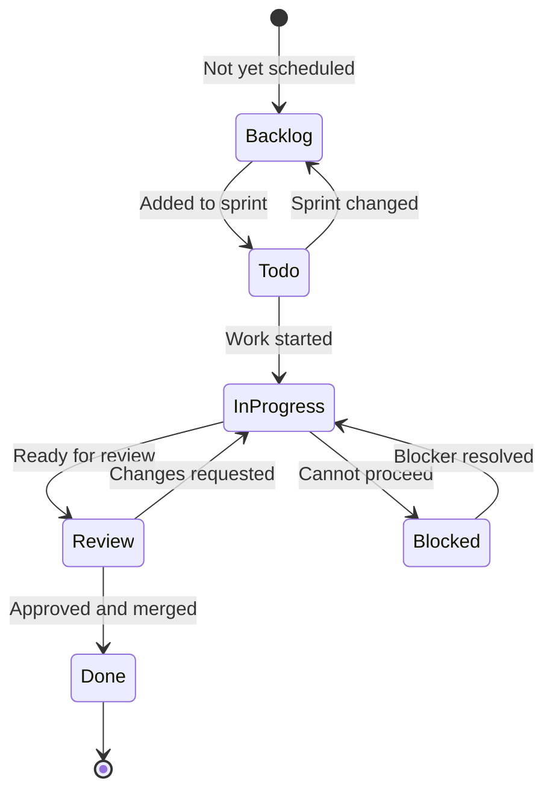

# ✅ Task Tracking — Sprint Tasks, Assignments & Completion

> **Purpose:** Track individual tasks through a sprint or project — assignee, status, due date, and completion. Tasks map to features in `feature-tracking.md` and feed into meeting agendas.
> **Last updated:** 2026-08-31

---

## 🔄 Task Status Lifecycle



### Status definitions

| Status | Meaning | Typical next action |
|--------|---------|---------------------|
| **Backlog** | Not yet scheduled for any sprint | Wait for sprint planning |
| **Todo** | In the current sprint, not started | Pick up when capacity allows |
| **In Progress** | Actively being worked on | Update progress, note blockers |
| **Review** | Implementation done, needs review | Request review, address feedback |
| **Done** | Merged, tested, and verified | Close task, update feature status |
| **Blocked** | Cannot progress due to external factor | Document blocker, escalate if needed |

---

## 📝 Task Entry Template

```markdown
### [Short task title]

| Field | Value |
|-------|-------|
| **Status** | Backlog / Todo / In Progress / Review / Done / Blocked |
| **Assignee** | @team-member |
| **Sprint** | Sprint X (dates) |
| **Due** | YYYY-MM-DD (if any) |
| **Priority** | P0 / P1 / P2 / P3 |
| **Feature** | Links to feature-tracking.md entry (if any) |
| **Estimate** | T-shirt size (S/M/L/XL) or story points |
| **Blocked by** | (if any) |

**Description:** What needs to be done.

**Acceptance criteria:**
- [ ] Criterion 1
- [ ] Criterion 2

**Notes:** Progress updates, decisions, links.
```

---

## 📋 Active Task Board

### Current Sprint — Sprint 1 (2026-09-01 to 2026-09-14)

**Sprint goal:** Stand up the agenda tracking system with initial feature entries and first case study.

| Task | Status | Assignee | Priority | Due | Feature | Notes |
|------|--------|:--------:|:--------:|:---:|---------|-------|
| Create MAIN.md hub document | ✅ Done | — | P0 | 2026-08-31 | — | Hub with architecture diagrams |
| Create feature-tracking.md with lifecycle | ✅ Done | — | P0 | 2026-08-31 | All features | Full lifecycle from Proposed to Shipped |
| Create case-studies.md template | ✅ Done | — | P0 | 2026-08-31 | — | Template with mermaid diagram patterns |
| Create task-tracking.md | ✅ Done | — | P0 | 2026-08-31 | — | Sprint task board |
| Create team-notes.md | ✅ Done | — | P0 | 2026-08-31 | — | Meeting notes + first entry |
| Create meeting-agenda.md | ✅ Done | — | P0 | 2026-08-31 | — | 6 meeting templates |
| Create completion-checklist.md | ✅ Done | — | P0 | 2026-08-31 | — | Project closeout checklist |
| Create README.md for agenda directory | ✅ Done | — | P0 | 2026-08-31 | — | Overview + Anytype inspiration |
| Populate Cypercloud/Syntara features | ✅ Done | — | P0 | 2026-08-31 | Stripe Billing, API Tokens, Customer Dashboard, System Templates, AI Prompt Library, Agent Templates, Usage Analytics, App Marketplace, Multi-tenant, White-label, Webhooks | P0-P3 entries with full detail |
| Populate Formint POS features | ✅ Done | — | P0 | 2026-08-31 | All shipped POS features | 20 shipped features with acceptance criteria |
| Populate LMS features | ✅ Done | — | P1 | 2026-08-31 | Video, Quizzes, Progress, Certificates, Email, Live Classes, Forums, Peer Review, Gamification, API, SCORM, Multi-language, White-label | P1-P3 entries |
| Populate Portfolio features | ✅ Done | — | P1 | 2026-08-31 | ATS Export, Cover Letter, Gallery, Custom Domains, Job Board, Analytics, Multi-language, LinkedIn Import | P1-P2 entries |
| Populate Infrastructure features | ✅ Done | — | P1 | 2026-08-31 | WebAuthn, Backups, Health Dashboard, Multi-region, Blue/Green, Secret Rotation, Rate Limiting, Load Testing, Cost Optimization, Disaster Recovery | P1-P3 entries |
| Populate django-fusion features | ✅ Done | — | P1 | 2026-08-31 | MCP, Storybook, Hot Reload, TypeScript, Visual Builder, Analytics | P1-P2 entries |
| Create Django-Bolt case study with mermaid diagrams | ✅ Done | — | P0 | 2026-08-31 | API Access (Formint POS) | Architecture, deployment, sequence, state diagrams |
| Update INDEX.md with agenda references | ✅ Done | — | P0 | 2026-08-31 | — | Legacy Blinko index updated |
| Create SUMMARY.md | ✅ Done | — | P0 | 2026-08-31 | — | Quick reference for team |

> **All Sprint 1 tasks complete.** ← Update with new sprint tasks below.

---

### Sprint 2 — 2026-09-15 to 2026-09-28

**Sprint goal:** Complete POS case studies with mermaid diagrams + DataToken sync tagging case study + validate all diagrams in docs pipeline.

| Task | Status | Assignee | Priority | Due | Feature | Notes |
|------|--------|:--------:|:--------:|:---:|---------|-------|
| Write Multi-terminal Sync case study | ✅ Done | — | P0 | 2026-09-15 | Multi-terminal Sync | [pos-multi-terminal-sync.md](case-studies/pos-multi-terminal-sync.md) with 4 mermaid diagrams |
| Write Offline Queue case study | ✅ Done | — | P0 | 2026-09-15 | Offline Queue | [pos-offline-queue.md](case-studies/pos-offline-queue.md) with 4 mermaid diagrams |
| Write QR Menu case study | ✅ Done | — | P0 | 2026-09-15 | QR Menu | [pos-qr-menu.md](case-studies/pos-qr-menu.md) with 4 mermaid diagrams |
| Write DataToken Sync Tagging case study | ✅ Done | — | P0 | 2026-09-15 | django-fusion | [data-token-sync-tagging.md](case-studies/data-token-sync-tagging.md) with 3 mermaid diagrams |
| Validate all mermaid diagrams render correctly | ⚪ Todo | — | P1 | 2026-09-20 | — | Run docs validation pipeline |
| Review all case studies for completeness | ⚪ Todo | — | P1 | 2026-09-20 | — | Context, architecture, implementation, results, lessons |
| Update feature tracking with case study references | ⚪ Todo | — | P1 | 2026-09-20 | POS, django-fusion | Link case studies from feature entries |
| Review Sprint 1 action items closure | ⚪ Todo | — | P2 | 2026-09-20 | — | Verify all Sprint 1 backlog items addressed |
| Add assets-ignore to worker/scheduler stacks | ✅ Done | — | P0 | 2026-09-03 | — | Shared tasks worker/scheduler + CTC scheduler no longer mount monorepo assets/media; CTC worker keeps media mount (content tasks write Wagtail media). Validated `docker compose config -q` |
| Deploy databases + Coder; redeploy & health-check | ✅ Done | — | P0 | 2026-09-03 | — | Postgres/Redis + Coder up on host; Coder healthy; Precis scheduler restarted cleanly with both scheduled jobs registered |
| Fix CTC MEDIA_ROOT default drift → canonical shared tree | ✅ Done | — | P0 | 2026-09-03 | — | Default now resolves to projects/assets/media/ctc-research (matches compose/docstring/CHANGELOG); `manage.py check` clean |
| Rewrite shared-media test to current assets-proxy topology | ✅ Done | — | P0 | 2026-09-03 | — | tests/test_shared_media.py asserts application/tools assets-proxy contract; 26/26 pass incl. live container checks |
| Research anytype.io extensibility + record proposals | ✅ Done | — | P1 | 2026-09-03 | — | [anytype-extensibility.md](anytype-extensibility.md) — Anytype model mapped to agenda/mono-repo + project separation |

---

### Backlog (not yet scheduled)

| Task | Priority | Feature | Notes |
|------|----------|---------|-------|
| Define Sprint 3 goal and tasks | P0 | — | Sprint planning session needed |
| Populate mono-repo subdirectory plans | P1 | dev-team-plans.md | Review existing dev-team-plans and align with agenda |
| Write case study for Stripe Billing | P1 | Stripe Billing | Real case study with mermaid diagrams |
| Write case study for API Token Management | P1 | API Token Management | Real case study with mermaid diagrams |
| Write case study for Customer Dashboard | P1 | Customer Dashboard | Real case study with mermaid diagrams |
| Add Arabic translations for case studies | P2 | — | Follow bilingual docs convention |
| Add mermaid diagrams to feature-tracking.md | P2 | — | Architecture diagrams for feature lifecycle |
| Review feature-tracking entries for completeness | P1 | — | Check all features have acceptance criteria |
| Write case study for System Templates | P2 | System Templates | After Stripe Billing ships |
| Write case study for LMS Video Hosting | P2 | Video Hosting | After implementation starts |

---

## 🎯 Mapping Tasks to Features

Tasks should link to features when they're part of a larger feature effort:

```
Feature: Stripe Billing (feature-tracking.md)
├── Task: Add Stripe checkout flow
├── Task: Implement webhook handlers
├── Task: Write API token docs
└── Task: Add customer dashboard billing section
```

When a feature's tasks are all Done, the feature can move to Review in `feature-tracking.md`.

---

## 📊 Task Metrics (Optional Tracking)

| Metric | Value | Last updated |
|--------|-------|--------------|
| Total tasks in sprint | X | — |
| In Progress | X | — |
| Review | X | — |
| Done | X | — |
| Blocked | X | — |
| Completion rate (last sprint) | X% | — |

---

## 🔗 Related

| Topic | Path |
|-------|------|
| Feature tracking (parent features) | [./feature-tracking.md](./feature-tracking.md) |
| Meeting agenda (sprint planning template) | [./meeting-agenda.md](./meeting-agenda.md) |
| Team notes (task decisions) | [./team-notes.md](./team-notes.md) |
| Completion checklist (when all done) | [./completion-checklist.md](./completion-checklist.md) |

---

## 🔄 Maintenance

- **Add tasks at:** Sprint planning (meeting-agenda.md template)
- **Update status daily:** During standup (meeting-agenda.md template)
- **Close tasks at:** Sprint review (meeting-agenda.md template)
- **Carry over tasks:** Move back to Todo or Backlog with a note about why

---

## Remarks & Notes

- Task titles should be short and action-oriented — "Add X" not "Work on X"
- If a task grows beyond a reasonable size, split it into smaller tasks
- Blocked tasks must have a documented blocker — "waiting on X" is not enough, say what X is and who owns it
- Completed tasks should have a link to the PR, commit, or deployment for verification

<!-- AI-generated: review needed -->
