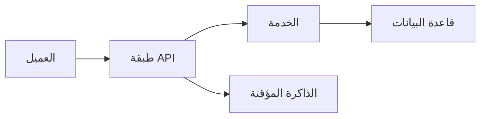
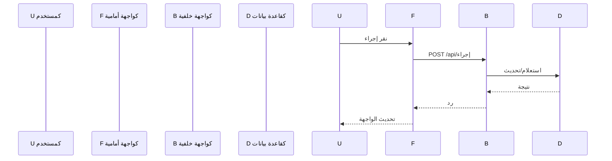
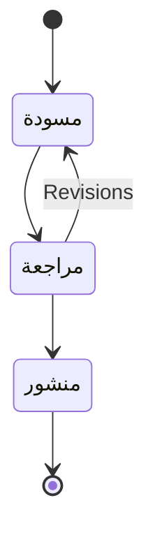
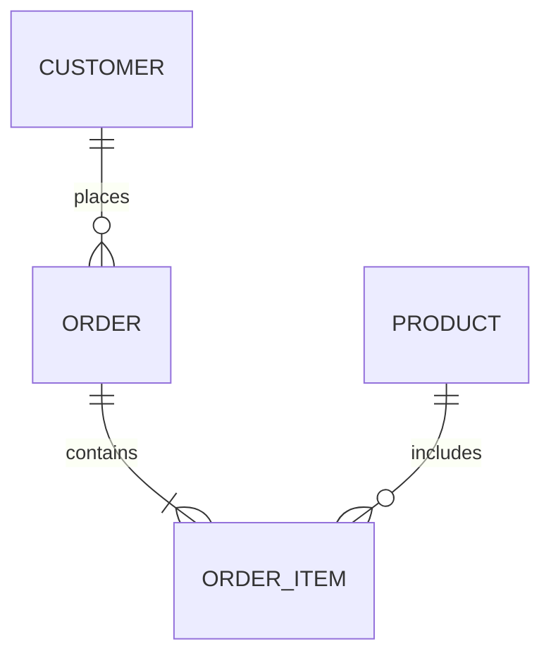
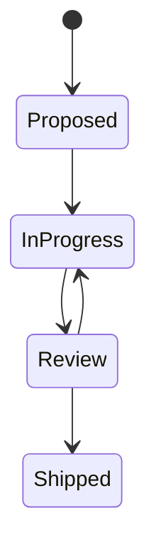

# 📊 دراسات الحالة — تنفيذات حقيقية مع مخططات

> **الغرض:** توثيق تنفيذاتworth ذكر كدراسات حالة مع مخططات عمارة (mermaid)، القرارات الرئيسية، النتائج، والدروس المستفادة. تصبح هذه الذكاء المؤسسي للفريق وتُرجع من الخطط وخارطة الميزات.
> **آخر تحديث:** 2026-08-31

---

## 📖 كيفية كتابة دراسة حالة

كل دراسة حالة تتبع هذا الهيكل:

```markdown
# [عنوان قصير] — [المنتج/مشروع]

> **التاريخ:** YYYY-MM-DD | **الحالة:** نشط / أرشيف
> **النطاق:** ما يغطيه هذا الدراسة

---

## 1. السياق

ما كان الموقف؟ ما المشكلة التي كنا نحلها؟ ما القيود الموجودة؟

- قيد 1
- قيد 2
- توقعات أصحاب المصلحة

## 2. العمارة

```mermaid
[مخطط graph يوضح عمارة الحل]
```

المكونات الرئيسية:
- المكون A: المسؤولية
- المكون B: المسؤولية

## 3. التنفيذ

ما بُني، بالترتيب، مع ما قرارات رئيسية؟

### 3.1 قرار: X مقابل Y

لماذا اخترنا X على Y.

### 3.2 تفصيلة تنفيذية رئيسية

قطعة كود أو config توضح النمط الحرج.

## 4. النتائج

ما حدث؟ مقاييس إن توفرت.

- نتيجة 1
- نتيجة 2
- Before → After مقارنة

## 5. دروس مستفادة

ما كنت سيفعله بشكل مختلف؟ ما فاجأنا؟

- درس 1
- درس 2

---

## ملاحظات وإرشادات

- أحكام، حالات حدية، أشياء يجب الانتباه لها
- روابط للخطط أو التوثيق أو الكود ذات الصلة

<!-- AI-generated: review needed -->
```

---

## 🏗️ أنماط مخططات Mermaid

### مخطط العمارة/تدفق



### مخطط التسلسل



### مخطط الحالة



### مخطط الكيان-علاقة



### تتبع المهام/الحالة



---

## ✍️ قالب إضافة دراسة حالة جديدة

انسخ هذا القالب عند إضافة دراسة حالة جديدة:

```markdown
# [اسم الميزة/مشروع] — [المنتج]

> **التاريخ:** YYYY-MM-DD | **الحالة:** نشط
> **النطاق:** [نطاق بسطر واحد]
> **الخطة ذات الصلة:** [`path/to/plan.md`](../path/to/plan.md)
> **تتبع الميزة:** [./feature-tracking.md](./feature-tracking.md) § [اسم الميزة]

---

## 1. السياق

[ما كان الموقف؟ ما المشكلة؟ ما القيود؟]

## 2. العمارة

```mermaid
graph [LR/TB]
    [عقد وحواف توضح الحل]
```

المكونات الرئيسية:
- **[المكون A]:** [المسؤولية]
- **[المكون B]:** [المسؤولية]

## 3. التنفيذ

[ما بُني، القرارات الرئيسية، قطع كود إن كانت قيمة غير واضحة]

### [اسم القرار]

[لماذا تم هذا القرار]

## 4. النتائج

[النتائج، المقاييس، before→after]

## 5. دروس مستفادة

[ما كنت سيفعله بشكل مختلف؟ مفاجآت؟]

---

## ملاحظات وإرشادات

- [أحكام، حالات حدية، انتبه لـ]
- ذات الصلة: [`رابط`](../path)

<!-- AI-generated: review needed -->
```

---

## 🔄 الصيانة

- **أضف دراسة حالة عندما:** تُنشَر ميزة، تُتخذ قرار كبير، تُحل حادثة، تكتمل هجرة
- **حدّث دراسة حالة عندما:** تتغير facts، تظهر دروس جديدة، تتغير الحالة إلى أرشيف
- **أرشيف دراسة حالة عندما:** التقنية أو النهج يُستَبدَل (احتفظ للتاريخ، عيّن أرشيف)

---

## ملاحظات وإرشادات

- مخططات mermaid يجب أن تظهر في خط أنابيب Docus — جرب مع `npm run validate-content`
- حافظ على المخططات مركزة: رسالة واضحة واحدة لكل مخطط، ليس كل المسار可能
- قطع الكود اختيارية — أضف فقط عندما توضح نمط غير واضح
- قسم "الدروس المستفادة" هو الجزء الأكثر قيمة للفريق — لا تتجاوزه

<!-- AI-generated: review needed -->
