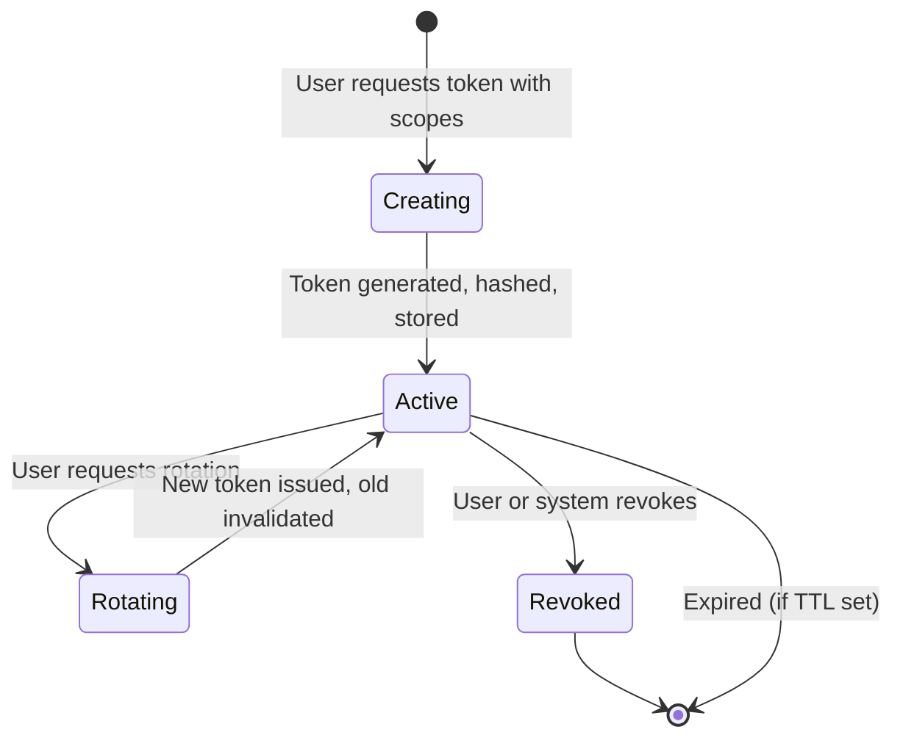
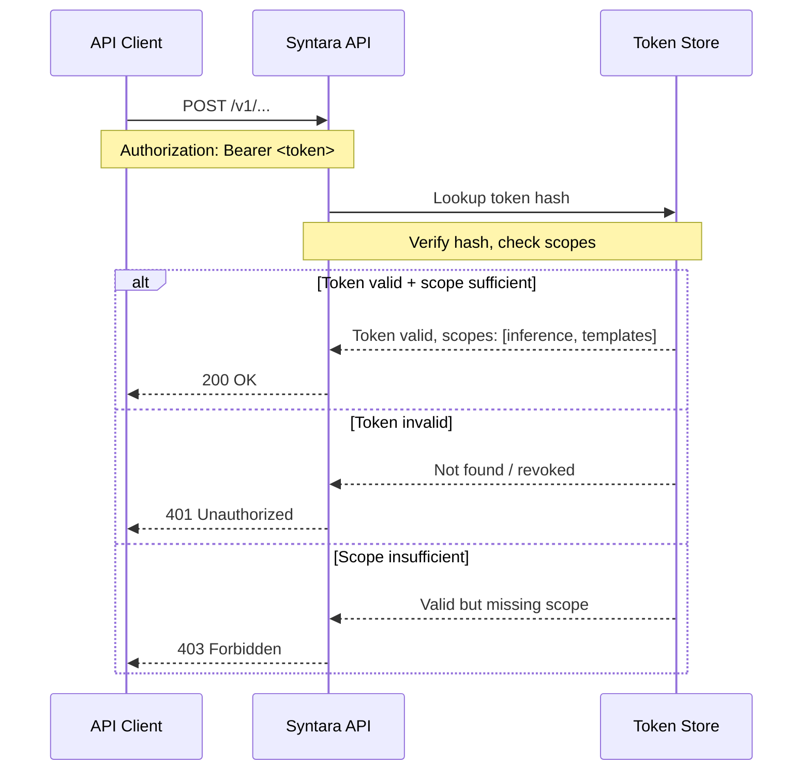
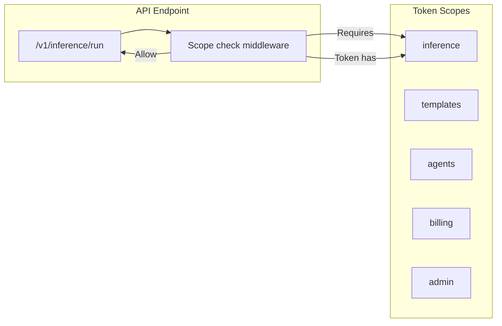

# إدارة رموز API — دراسة حالة Cypercloud/Syntara

> **التاريخ:** 2026-08-31 | **الحالة:** نشطة | **الأولوية:** P0
> **النطاق:** نموذج الرمز مع النطاقات، وإجراءات التوليد/التدوير/الإبطال، وواجهة قائمة الرموز، وفرض الصلاحيات المُحدَّدة النطاق
> **تتبّع الميزات:** [`feature-tracking/syntara.md`](../feature-tracking/syntara.md) § إدارة رموز API

---

## 1. السياق

توفّر منصّة Syntara واجهة REST لاستدلال الذكاء الاصطناعي وإدارة القوالب وتنفيذ
الوكلاء. ويحتاج المكاملون الخارجيون والمستخدمون المتقدّمون إلى رموز API للمصادقة
على الوصول البرمجي. ويجب أن تكون الرموز مُحدَّدة النطاق لقدرات بعينها، وقابلة
للتدوير بلا توقف، وقابلة للإبطال عند اختراقها.

**القيود:**
- الرموز هي آلية المصادقة الأساسية للوصول إلى API (لا OAuth — تُتبَّع منفصلة)
- يجب أن تكون النطاقات دقيقة: inference، templates، agents، billing، admin
- يجب أن يُبطل التدوير الرمز القديم ويصدر جديداً ذرّياً
- يجب أن يسري الإبطال فوراً
- واجهة قائمة الرموز في لوحة العميل

---

## 2. البنية

### 2.1 دورة حياة الرمز




### 2.2 تدفّق مصادقة الرمز




### 2.3 فرض النطاقات




---

## 3. التنفيذ

### 3.1 نموذج الرمز

| الحقل | النوع | الغرض |
|-------|------|---------|
| `id` | UUID | المفتاح الرئيسي |
| `name` | String | تسمية يمنحها المستخدم (مثل «Production API») |
| `hash` | String | قيمة الرمز المُجزَّأة (مُخزَّنة، ونصها الصريح أبداً) |
| `scopes` | JSON/Array | النطاقات الممنوحة: ["inference", "templates"] |
| `created_at` | DateTime | طابع الإنشاء |
| `last_used_at` | DateTime | آخر استخدام لـ API (لكشف الرموز غير النشطة) |
| `status` | Enum | active / revoked |
| `created_by` | FK | المستخدم الذي أنشأ الرمز |

**مهم:** يُعاد النص الصريح للرمز إلى المستخدم مرة واحدة فقط عند الإنشاء. ولا
يُخزَّن نصاً صريحاً أبداً.

### 3.2 إنشاء الرمز

```python
# POST /api/v1/tokens/create
{
    "name": "Production API",
    "scopes": ["inference", "templates", "agents"]
}

# Response (plaintext token returned ONCE):
{
    "token": "synt-...",
    # Store this securely, shown only once
    "name": "Production API",
    "scopes": ["inference", "templates", "agents"],
    "created_at": "2026-08-31T12:00:00Z"
}
```

### 3.3 تدوير الرمز

```python
# POST /api/v1/tokens/{id}/rotate

# Process:
# 1. Invalidate current token (set status = revoked)
# 2. Generate new token with same scopes
# 3. Store new token hash
# 4. Return new plaintext token ONCE

# Response:
{
    "old_token_id": "uuid-1",
    "new_token": "synt-...",
    # New plaintext, shown once
    "scopes": ["inference", "templates", "agents"],
    "rotated_at": "2026-08-31T13:00:00Z"
}
```

### 3.4 إبطال الرمز

```python
# POST /api/v1/tokens/{id}/revoke

# Process:
# 1. Set token status = revoked
# 2. Immediate effect — next API call with this token fails

# Response:
{
    "token_id": "uuid-1",
    "status": "revoked",
    "revoked_at": "2026-08-31T14:00:00Z"
}
```

### 3.5 وسيط فرض النطاقات

```python
# Per-endpoint scope requirements:
ENDPOINT_SCOPES = {
    "/v1/inference/run": ["inference"],
    "/v1/templates/*": ["templates"],
    "/v1/agents/*": ["agents"],
    "/v1/billing/*": ["billing"],
    "/v1/admin/*": ["admin"],
}

# Middleware checks:
# 1. Extract token from Authorization header
# 2. Lookup token hash, verify not revoked
# 3. Check required scope present in token scopes
# 4. 401 if invalid, 403 if scope insufficient
```

---

## 4. النتائج

### 4.1 ما ينجح

| النتيجة | الدليل |
|---------|----------|
| إنشاء رمز بنطاقات | يختار المستخدم النطاقات وقت الإنشاء |
| تدوير الرمز | يُبطل القديم ويُصدر الجديد ذرّياً |
| إبطال الرمز | أثر فوري على الطلب التالي لـ API |
| فرض النطاقات | يفرض الوسيط النطاقات لكل نقطة |
| واجهة قائمة الرموز | تعرض اللوحة الرموز النشطة/المُبطَلة |

### 4.2 الخصائص الأمنية

| الخاصية | التنفيذ |
|----------|----------------|
| لا تخزين للنص الصريح | يُخزَّن التجزئة، ويُعاد النص الصريح مرة واحدة |
| التدوير ذرّي | إبطال القديم + إنشاء الجديد في المعاملة نفسها |
| الإبطال فوري | فحص الحالة في كل طلب API |
| دقة النطاقات | متطلبات نطاق لكل نقطة |
| مسار تدقيق | تتبّع `created_by` و `last_used_at` |

---

## 5. الدروس المستفادة

### 5.1 لا تخزّن النصوص الصريحة للرموز

تخزين النصوص الصريحة للرموز يعني أن أي اختراق لقاعدة البيانات يكشف كل رموز API.
جزّئ الرموز (كالكلمات السرية) وأعِد النص الصريح مرة واحدة فقط.

**الدرس:** عامل رموز API ككلمات سرية — جزّئها ولا تخزّن نصها الصريح.

### 5.2 يجب أن يكون التدوير ذرّياً

إذا أبطل التدوير الرمز القديم وفشل في إنشاء الجديد، يُقفل المستخدم خارج النظام.
ويجب أن تكون الخطوتان في المعاملة نفسها.

**الدرس:** دوّر داخل معاملة — أبطل القديم وأنشئ الجديد معاً.

### 5.3 فحص النطاق لكل نقطة، لا لكل رمز

تحمل الرموز النطاقات الممنوحة. وتُعلن النقاط نطاقاتها المطلوبة. ويطابق الوسيط
بينهما. وهذا يُبقي منطق النطاقات مركزياً وقابلاً للاختبار.

**الدرس:** تُعلن النقاط احتياجاتها من النطاقات؛ وتحمل الرموز منحها؛ والوسيط يفرض.

---

## 6. الوثائق ذات الصلة

| المستند | المسار |
|----------|------|
| تتبّع الميزات — إدارة رموز API | [`../feature-tracking/syntara.md`](../feature-tracking/syntara.md) § إدارة رموز API |
| دراسة حالة — فواتير Stripe | [./stripe-billing.md](./stripe-billing.md) |
| خارطة ميزات Syntara | [`../../features/feature-roadmap.md`](../../features/feature-roadmap.md) |
| وثائق منتج Syntara | [`../../projects/syntara/`](../../projects/syntara/) |

---

## ملاحظات وإرشادات

- إدارة رموز API بدرجة P0 لـ Syntara — تحجب تكاملات Webhook والتكاملات القائمة على API
- تدوير الرموز وإبطالها ميزتان أمنيتان حرجتان
- النطاقات مصمّمة لتكون قابلة للتوسّع — تُضاف نطاقات جديدة مع نمو سطح API
- يُعرض النص الصريح للرمز مرة واحدة فقط؛ والمستخدم مسؤول عن تخزينه بأمان

<!-- AI-generated: review needed -->
