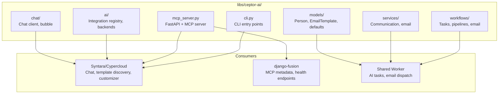
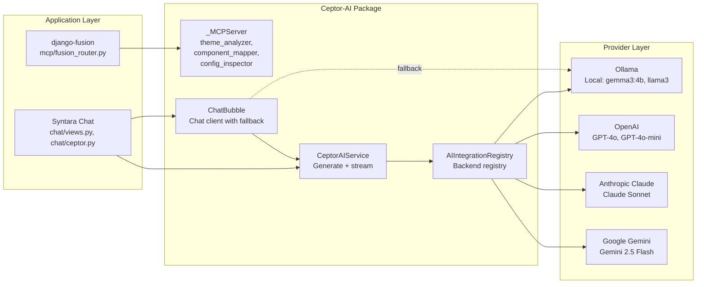
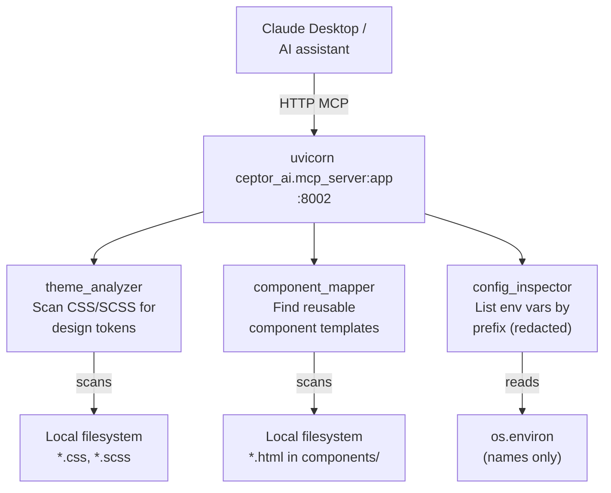
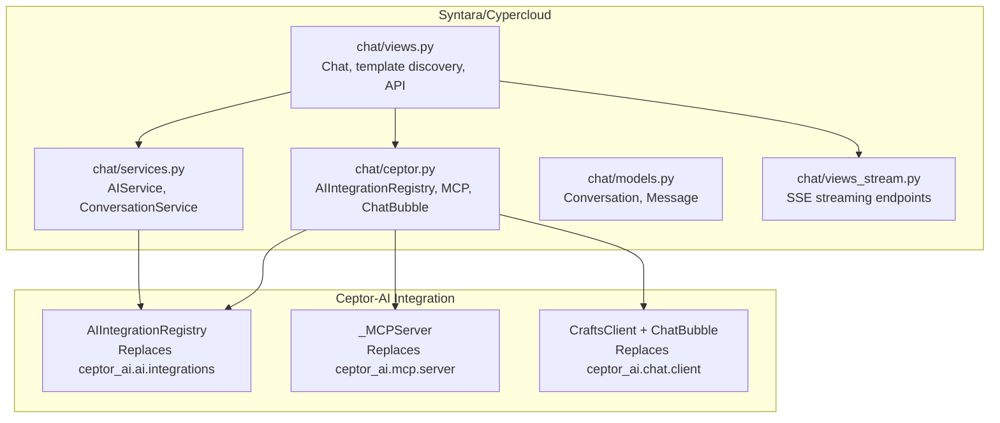
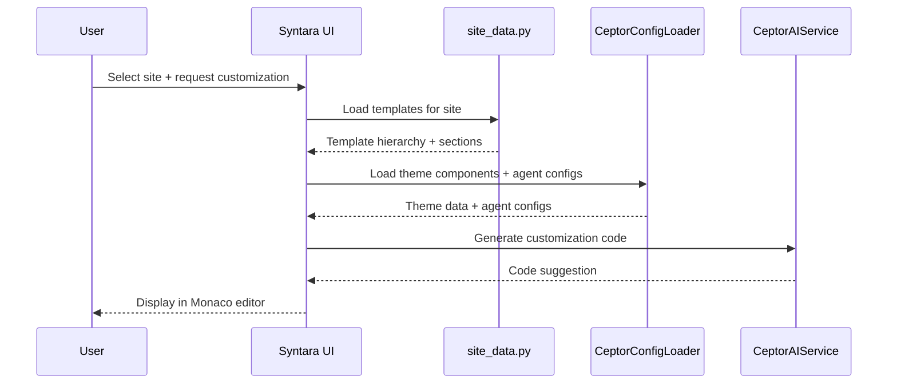

# Ceptor-AI — حالات استخدام الحزمة ودراسة حالة

> **التاريخ:** 2026-08-31 | **الحالة:** نشطة
> **النطاق:** حزمة Ceptor-AI (`libs/ceptor-ai/`) — عميل محادثة ذكاء اصطناعي، وخادم MCP، ومحوّل BEM، وتوليد وكلاء — حالات الاستخدام عبر مستودع Structa Cloud مع مخططات معمارية وتفاصيل تنفيذ.
> **المستودع:** [github.com/mammhoud/ceptor-ai](https://github.com/mammhoud/ceptor-ai)
> **المستهلكون:** Syntara/Cypercloud (الأساسي)، وdjango-fusion (ميتاداتا MCP)، وعامل Structa المشترك

---

## 1. السياق

Ceptor-AI حزمة Python مستقلة توفّر:

| القدرة | الغرض |
|------------|---------|
| **عميل محادثة ذكاء اصطناعي** | محادثة متعددة النماذج مع بثّ (Ollama، OpenAI، Claude، Gemini) |
| **خادم MCP** | خادم بروتوكول سياق النموذج (MCP) لتكامل أدوات الذكاء الاصطناعي |
| **محوّل BEM** | توليد CSS للمكوّنات انطلاقاً من موجّه |
| **توليد الوكلاء** | توليد وكلاء ذكاء اصطناعي من القوالب |
| **محمل الإعدادات** | التحميل المسبق لإعدادات YAML/JSON للنماذج والوكلاء والثيمات |

تُصان الحزمة في مستودع منفصل ([mammhoud/ceptor-ai](https://github.com/mammhoud/ceptor-ai))
وتُستهلك كوحدة فرعية في `libs/ceptor-ai/`.

**لماذا يهم:** Syntara/Cypercloud هو المستهلك الأساسي — إذ يستخدم Ceptor-AI
للمحادثة واكتشاف القوالب وتخصيص الكود. ويستخدمه django-fusion لميتاداتا MCP.
وتستخدمه منظومة العامل المشترك لمهام نماذج الذكاء الاصطناعي وإرسال البريد.

**القيود:**
- يجب أن يكون قابلاً للاستيراد دون إعدادات Django (Python مستقل)
- يجب أن يدعم خلفيات ذكاء اصطناعي متعددة (Ollama محلي، ومزوّدو السحابة)
- يجب أن تكون أدوات MCP للقراءة فقط وتعمل على نظام الملفات/البيئة المحلية
- يجب ألّا يتطلّب Django في مسار خادم MCP

---

## 2. البنية

### 2.1 بنية الحزمة




### 2.2 بنية خلفيات الذكاء الاصطناعي




### 2.3 بنية أدوات MCP




### 2.4 نقاط تكامل Syntara




---

## 3. حالات الاستخدام

### حالة الاستخدام 1: محادثة ذكاء اصطناعي بدعم خلفيات متعددة

**المستهلك:** Syntara/Cypercloud (`projects/syntara/`)

**المشكلة:** يحتاج المستخدمون إلى محادثة الذكاء الاصطناعي بخلفيات مختلفة
(Ollama محلي، OpenAI، Claude، Gemini) مع استجابات مبثوثة.

**الحل:** توفّر `AIIntegrationRegistry` و `CeptorAIService` في Ceptor-AI واجهة موحّدة:

```python
# projects/syntara/chat/ceptor.py
svc = CeptorAIService()
reply = svc.generate("openai", "Explain Django class-based views")
for chunk in svc.stream("claude", "Summarize this code"):
    print(chunk, end="")
```

**الميزات الأساسية:**
- حلّ الخلفية من `configs/models.yml`
- بثّ الرموز رمزاً برمز لواجهة فورية
- رجوع إلى Ollama المحلي عند عدم إتاحة مزوّدي السحابة
- حلّ معرّفات النماذج من إعدادات YAML

**نقاط API في Syntara:**

| النقطة | الطريقة | الغرض |
|----------|--------|---------|
| `/api/ceptor/ai/complete/` | POST | إكمال ذكاء اصطناعي (بثّ أو بلا بثّ) |
| `/chat/{id}/ceptor-stream/` | GET | بثّ SSE لاستجابات Ceptor AI |
| `/api/ceptor/health/` | GET | فحص حالة Ceptor AI |
| `/api/ceptor/config/preload/` | GET | جلب إعدادات الذكاء الاصطناعي (وكلاء، نماذج) |

**مثال طلب بثّ:**

```bash
curl -X POST http://localhost:5073/api/ceptor/ai/complete/?stream=1 \
  -H "Content-Type: application/json" \
  -d '{
    "backend": "openai",
    "model": "gpt-4o",
    "prompt": "Generate a React component for..."
  }'
```

---

### حالة الاستخدام 2: تنفيذ أدوات MCP

**المستهلك:** Syntara/Cypercloud + Claude Desktop

**المشكلة:** يحتاج مساعدو الذكاء الاصطناعي إلى وصول للقراءة فقط إلى نظام ملفات
المشروع وبيئته لتحليل الثيمات وإيجاد المكوّنات وفحص الإعدادات.

**الحل:** يوفّر `_MCPServer` في Ceptor-AI ثلاث أدوات MCP للقراءة فقط:

| الأداة | الغرض | ما تقرأه |
|------|---------|---------------|
| `theme_analyzer` | فحص CSS/SCSS لرموز التصميم (`--color-*`، `--spacing-*`) | ملفات `*.css` و `*.scss` المحلية |
| `component_mapper` | إيجاد قوالب المكوّنات القابلة لإعادة الاستخدام | `*.html` في `components/` أو `fragments/` |
| `config_inspector` | سرد متغيّرات البيئة حسب البادئة (قيم مُخفَّاة) | أسماء `os.environ` فقط |

**الاستخدام من Syntara:**

```python
# projects/syntara/chat/ceptor.py
mcp = CeptorMCPService()
result = mcp.run_tool("theme_analyzer", root="/path/to/project")
config = mcp.run_tool("config_inspector", prefix="DJANGO")
```

**نشر خادم MCP:**

```bash
# Start MCP server for AI assistant integration
PYTHONPATH=libs/ceptor-ai/src \
  uvicorn ceptor_ai.mcp_server:app \
  --host 127.0.0.1 --port 8002
```

**تنفيذ الأداة من API:**

```bash
# Execute MCP tool via Syntara API
curl "http://localhost:5073/api/ceptor/mcp/theme_analyzer/?root=/home/project"
```

---

### حالة الاستخدام 3: اكتشاف القوالب + التخصيص بالذكاء الاصطناعي

**المستهلك:** Syntara/Cypercloud TemplateTinker

**المشكلة:** يحتاج المستخدمون إلى اكتشاف القوالب عبر مواقع متعددة (CTC Research،
LMS Demo، VResume) واستخدام الذكاء الاصطناعي لتخصيصها.

**الحل:** `site_data.py` و `customizer.py` في Syntara + محمل الإعدادات في Ceptor-AI:




**المواقع المهيّأة لاكتشاف القوالب:**

```python
# projects/syntara/settings.py
CUSTOMIZER_APPS = [
    {"slug": "precis-ctc", "name": "CTC Research", "template_root": "..."},
    {"slug": "lms", "name": "LMS Demo", "template_root": "..."},
    {"slug": "VResume", "name": "VResume", "template_root": "..."},
]
```

---

### حالة الاستخدام 4: مهام ذكاء اصطناعي في العامل المشترك

**المستهلك:** منظومة العامل المشترك (`projects/www/`)

**المشكلة:** تحتاج مهام نماذج الذكاء الاصطناعي، وأتمتة سير العمل، وإرسال البريد
إلى العمل عبر كل المواقع من عامل واحد.

**الحل:** وحدات Ceptor-AI مسجّلة في سجل المهام المشترك:

```python
# projects/www/worker/modules.py
TASK_MODULES = [
    "ceptor_ai.tasks",                      # AI model tasks
    "ceptor_ai.workflows.tasks",            # Workflow automation
    "ceptor_ai.services.communication.tasks",  # Email/notifications
]
```

**ما يعمل:**
- توليد محتوى بالذكاء الاصطناعي بإعدادات نماذج خاصة بكل موقع
- قوالب البريد من `ceptor_ai.workflows.models.settings.templates.EmailTemplate`
- مهام أتمتة سير العمل

---

### حالة الاستخدام 5: ميتاداتا MCP في django-fusion

**المستهلك:** django-fusion (`libs/django-fusion/`)

**المشكلة:** يحتاج django-fusion إلى كشف ميتاداتا MCP دون استيراد Django في خادم
MCP الخاص بـ ceptor-ai.

**الحل:** يخدم django-fusion نقطة MCP الخاصة به على `/fusion/mcp/` داخل تطبيق
Django. ولا يُستخدم خادم MCP في Ceptor-AI إلا لأدوات نظام الملفات/البيئة للقراءة فقط.

```python
# libs/django-fusion/src/django_fusion/mcp/fusion_router.py
# Checks if ceptor_ai is importable for metadata
"ceptor_ai": _find_spec("ceptor_ai") is not None,
```

**الحدّ:** يجب ألّا تُسجَّل أدوات MCP في django-fusion داخل خادم MCP في ceptor-ai.
فيتجنّب Ceptor-AI استيرادات Django صراحةً.

---

## 4. تفاصيل التنفيذ

### 4.1 AIIntegrationRegistry (بديل ceptor_ai.ai.integrations)

```python
# libs/ceptor-ai equivalent — in-project implementation at projects/syntara/chat/ceptor.py
class AIIntegrationRegistry:
    """Registry for AI provider integrations.

    Replaces ``ceptor_ai.ai.integrations.AIIntegrationRegistry``.
    Backends are resolved to real model configs from ``configs/models.yml``
    and executed through the in-project AI service.
    """

    _backends: set[str] = set(BACKEND_MODEL_MAP.keys())

    @classmethod
    def register(cls, name: str) -> None:
        cls._backends.add(name)

    @classmethod
    def get(cls, backend: str, **inst_kwargs: Any) -> _AIProviderBackend:
        model_id = _resolve_model_id(backend, inst_kwargs.pop("model", None))
        return _AIProviderBackend(backend, model_id, **inst_kwargs)

    @classmethod
    def list_integrations(cls) -> list[str]:
        return sorted(cls._backends)
```

**خريطة خلفيات النماذج:**

```python
BACKEND_MODEL_MAP: dict[str, str] = {
    "ollama": "gemma3-4b",
    "openai": "gpt4o",
    "claude": "claude-sonnet",
    "gemini": "gemini-2.5-flash",
    "openai_compatible": "gpt4o",
}
```

### 4.2 ChatBubble مع رجوع محلي

```python
# projects/syntara/chat/ceptor.py
class ChatBubble:
    """Real chat bubble with server + local AI fallback.

    Sends messages to the configured chat server. When the server is
    unreachable it falls back to the local AI service (Ollama by default).
    """

    def send(self, message: str, **kwargs: Any) -> _ChatReply:
        try:
            # Try chat server first
            with httpx.Client(timeout=self.timeout) as client:
                response = client.post(f"{self.server_url}/chat", ...)
                return _ChatReply(...)
        except Exception as exc:
            # Fall back to local Ollama
            logger.warning("Chat server unreachable; falling back to local AI")
            reply = AIService.chat(_resolve_model_id("ollama", None), ...)
            return _ChatReply(text=str(reply), ...)
```

### 4.3 أدوات MCP (للقراءة فقط)

```python
# projects/syntara/chat/ceptor.py — _MCPServer
class _MCPServer:
    """Real in-project MCP tool server — read-only tools."""

    def list_tools(self) -> list[str]:
        return ["theme_analyzer", "component_mapper", "config_inspector"]

    def call_tool(self, tool_name: str, **kwargs: Any) -> Any:
        if tool_name == "theme_analyzer":
            return _theme_analyzer(kwargs.get("root", "."))
        if tool_name == "component_mapper":
            return _component_mapper(kwargs.get("root", "."), ...)
        if tool_name == "config_inspector":
            return _config_inspector(kwargs.get("prefix"))
```

### 4.4 محمل الإعدادات

```python
# projects/syntara/chat/ceptor.py — CeptorConfigLoader
class CeptorConfigLoader:
    """Preload and cache AI configuration from YAML/JSON files."""

    def load_agent_configs(self) -> dict[str, Any]:
        """Load application/kilo/agent/*.json configs (cached)."""

    def load_models_config(self) -> dict[str, Any]:
        """Load models.yml from customizer configs directory."""

    def load_website_templates(self, website_slug: str) -> list[dict[str, Any]]:
        """Discover template files for a website from AI config."""
```

---

## 5. النتائج

### 5.1 ما ينجح

| النتيجة | الدليل |
|---------|----------|
| **محادثة ذكاء اصطناعي متعددة الخلفيات** | Ollama وOpenAI وClaude وGemini متاحة كلها عبر واجهة موحّدة |
| **استجابات مبثوثة** | SSE + بثّ الرموز لواجهة محادثة فورية |
| **تنفيذ أدوات MCP** | ثلاث أدوات للقراءة فقط (theme_analyzer، component_mapper، config_inspector) |
| **رجوع محلي** | يرجع ChatBubble إلى Ollama عند تعذّر الوصول إلى الخادم |
| **اكتشاف القوالب** | يكتشف Syntara القوالب من 3 مواقع مهيّأة |
| **استيراد مستقل** | `ceptor_ai` قابل للاستيراد دون إعدادات Django |

### 5.2 الحالة الحالية

| المكوّن | الحالة | الموقع |
|-----------|--------|----------|
| AIIntegrationRegistry | داخل المشروع (Syntara) | `projects/syntara/chat/ceptor.py` |
| _MCPServer | داخل المشروع (Syntara) | `projects/syntara/chat/ceptor.py` |
| ChatBubble + CraftsClient | داخل المشروع (Syntara) | `projects/syntara/chat/ceptor.py` |
| CeptorAIService | داخل المشروع (Syntara) | `projects/syntara/chat/ceptor.py` |
| CeptorConfigLoader | داخل المشروع (Syntara) | `projects/syntara/chat/ceptor.py` |
| AIService (Ollama + OpenAI) | داخل المشروع (Syntara) | `projects/syntara/chat/services.py` |
| الوحدة الفرعية libs/ceptor-ai | معلّقة | `git submodule add mammhoud/ceptor-ai` |
| مهام العامل المشترك | نشطة | `projects/www/worker/modules.py` |
| ميتاداتا MCP في django-fusion | نشطة | `libs/django-fusion/src/django_fusion/mcp/fusion_router.py` |

---

## 6. الدروس المستفادة

### 6.1 التنفيذات داخل المشروع حلّت محل الاعتماديات الخارجية

استُبدلت `ceptor_ai.ai.integrations.AIIntegrationRegistry` و
`ceptor_ai.mcp.server.server` و `ceptor_ai.chat.client.ChatBubble` الأصلية بتنفيذات
داخل المشروع في `projects/syntara/chat/ceptor.py`. وهذا:

- يُلغي الحاجة إلى حزمة `ceptor-ai` الخارجية وقت التشغيل
- يُبقي كل منطق المزوّد في مكان واحد
- يسهّل الاختبار (بلا اعتماد على حزمة خارجية)

**الدرس:** عندما توفّر حزمة واجهات لكن المشروع يحتاج سلوكاً مخصّصاً، فقد تكون التنفيذات داخل المشروع أبسط من محاربة تجريد الحزمة.

### 6.2 أدوات MCP للقراءة فقط هي الحدّ الصحيح

أدوات MCP (`theme_analyzer`، `component_mapper`، `config_inspector`) للقراءة فقط
عن قصد. وهي تعمل على نظام الملفات المحلي ومتغيّرات البيئة (الأسماء فقط، والقيم
مُخفَّاة). وهذا:

- يجعلها آمنة للكشف لمساعدي الذكاء الاصطناعي
- يتجنّب عمليات الكتابة التي قد تُفسد المشاريع
- يُبقي خادم MCP بلا حالة وقابلاً للاختبار

**الدرس:** يجب أن تكون أدوات MCP للقراءة فقط افتراضياً. وتحتاج عمليات الكتابة تأكيداً صريحاً من المستخدم وأن تمرّ عبر API التطبيق نفسه، لا مباشرة عبر MCP.

### 6.3 الرجوع المحلي ضروري لتجربة المستخدم

يعني رجوع ChatBubble إلى Ollama المحلي عند تعذّر الوصول إلى خادم المحادثة أن
المستخدمين يحصلون دائماً على استجابة. وهذا حرج لواجهة محادثة — فإظهار «الخادم غير
متاح» تجربة سيئة.

**الدرس:** يجب أن تتدهوّر ميزات الذكاء الاصطناعي بلطف. فالنماذج المحلية (حتى الأصغر) أفضل من لا استجابة.

---

## 7. الوثائق ذات الصلة

| المستند | المسار |
|----------|------|
| دليل Syntara/Cypercloud | [`projects/syntara/README.md`](https://github.com/mammhoud/structa.cloud/tree/generic/projects/syntara) |
| AGENTS.md في Syntara | [`projects/syntara/AGENTS.md`](https://github.com/mammhoud/structa.cloud/tree/generic/projects/syntara) |
| مستودع Ceptor-AI الخارجي | [github.com/mammhoud/ceptor-ai](https://github.com/mammhoud/ceptor-ai) |
| دليل المكتبات | [`libs/README.md`](../../libs/README.md) |
| دراسة حالة Django-Bolt | [`case-studies/django-bolt-fusion.md`](./django-bolt-fusion.md) |
| حالات الاستخدام المشتركة | [`../../shared/use-cases.md`](../../shared/use-cases.md) |
| الطرق المشتركة | [`../../shared/shared-methods.md`](../../shared/shared-methods.md) |
| ترحيل ceptor-ai في CTC Research | ✅ مكتمل — مُسجَّل كإنجاز منتهٍ في [`../../agenda/feature-tracking/ctc-research.md`](../../agenda/feature-tracking/ctc-research.md) (حُذف ملف الخطة؛ وسجلّ git هو الأرشيف) |

---

## ملاحظات وإرشادات

- الوحدة الفرعية `libs/ceptor-ai/` معلّقة التهيئة — الحزمة مُشار إليها لكنها غير مستخرَجة بعد
- التنفيذات داخل المشروع في `chat/ceptor.py` و `chat/services.py` هي كود الإنتاج الحالي في Syntara
- واجهات حزمة `ceptor_ai` الأصلية موثّقة هنا للرجوع، لكن الكود العامل هو كود المشروع
- أدوات MCP في django-fusion تُخدَم من `/fusion/mcp/`، وليس من خادم MCP في ceptor-ai
- يستخدم العامل المشترك `ceptor_ai.tasks` و `ceptor_ai.workflows.tasks` — وهما يحتاجان بيئة المشروع الكاملة

<!-- AI-generated: review needed -->
