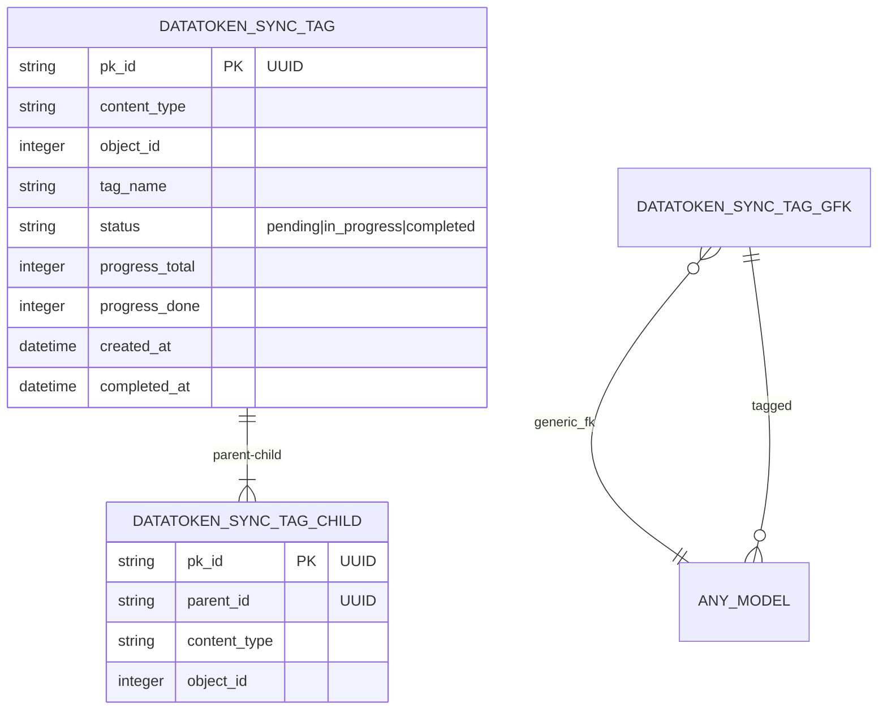
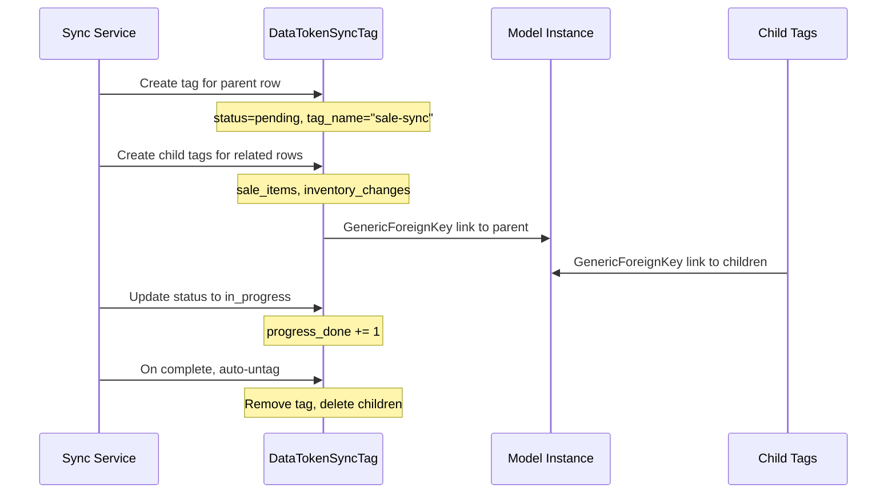
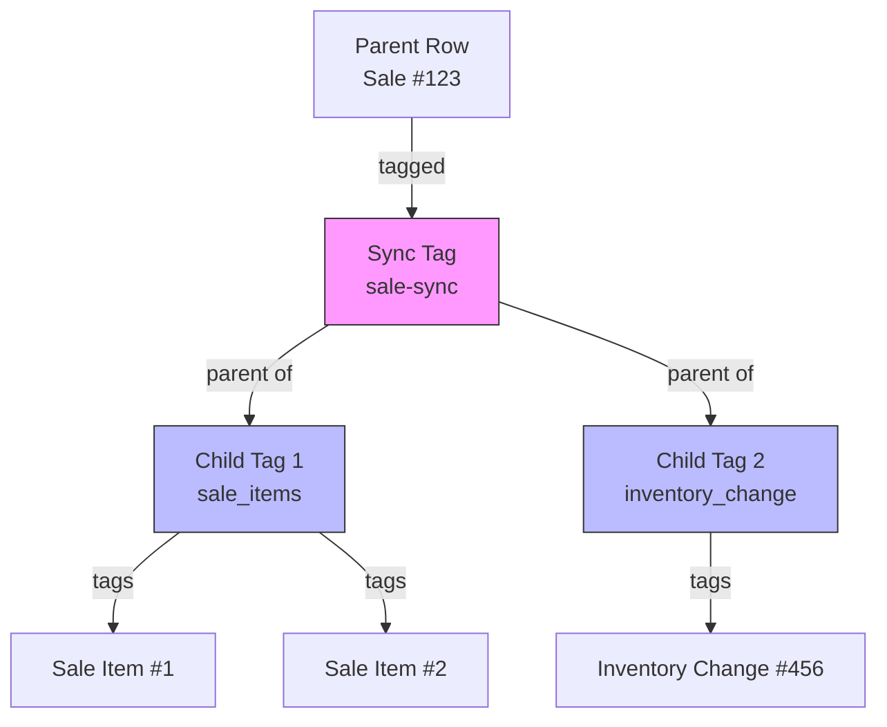

# وسم مزامنة DataToken — دراسة حالة django-fusion

> **التاريخ:** 2026-08-31 | **الحالة:** نشطة
> **النطاق:** وسم صفوف المزامنة عبر GenericForeignKey مع شجرة أصل/فرع، وتتبّع تقدّم، وإزالة وسم تلقائية، ودعم مفاتيح UUID الرئيسية
> **تتبّع الميزات:** [`feature-tracking/django-fusion.md`](../feature-tracking/django-fusion.md) § django-fusion
> **ذو صلة:** [`case-studies/django-bolt-fusion.md`](./django-bolt-fusion.md)، [`case-studies/pos-multi-terminal-sync.md`](./pos-multi-terminal-sync.md)

---

## 1. السياق

تحتاج عمليات مزامنة نقطة البيع إلى تتبّع الصفوف التي زُومنت، والتي قيد التنفيذ،
والتي لها أفرع تعتمد عليها. فعملية البيع لها عناصر بيع. وتحويل المخزون له قيود
مصدر ووجهة. وعند المزامنة، تحتاج إلى:

- وسم الصفوف التي تُزامَن (منع المزامنة المكررة)
- تتبّع التقدّم (كم صفاً زُومَن من الإجمالي)
- معالجة علاقات الأصل/الفرع (زامن الأصل أولاً، ثم الأفرع)
- إزالة الوسم تلقائياً عند اكتمال المزامنة (تنظيف)
- دعم مفاتيح UUID الرئيسية (تستخدم محطات نقطة البيع UUIDs لتوليد المعرّفات الموزّع)

**القيود:**
- يجب أن يعمل مع أي نموذج Django (GenericForeignKey)
- يجب أن يدعم مفاتيح UUID والأعداد الصحيحة
- يجب أن يكون فعّالاً — فقد تشمل عمليات المزامنة آلاف الصفوف
- يجب أن ينظّف بعد نفسه — بلا وسوم معلّقة

---

## 2. البنية

### 2.1 نموذج وسم المزامنة




### 2.2 تدفّق وسم المزامنة




### 2.3 شجرة الأصل/الفرع




---

## 3. التنفيذ

### 3.1 نموذج DataTokenSyncTag

```python
# libs/django-fusion — simplified representation
class DataTokenSyncTag(models.Model):
    id = models.UUIDField(primary_key=True, default=uuid.uuid4)
    content_type = models.ForeignKey(ContentType, ...)
    object_id = models.PositiveIntegerField(...)
    content_object = GenericForeignKey("content_type", "object_id")

    tag_name = models.CharField(max_length=100)
    status = models.CharField(
        choices=[
            ("pending", "Pending"),
            ("in_progress", "In Progress"),
            ("completed", "Completed"),
        ]
    )
    progress_total = models.PositiveIntegerField(default=0)
    progress_done = models.PositiveIntegerField(default=0)
    created_at = models.DateTimeField(auto_now_add=True)
    completed_at = models.DateTimeField(null=True, blank=True)

    class Meta:
        indexes = [
            models.Index(fields=["content_type", "object_id"]),
            models.Index(fields=["tag_name", "status"]),
        ]
```

### 3.2 وسوم الأفرع (شجرة الأصل/الفرع)

```python
class DataTokenSyncTagChild(models.Model):
    parent = models.ForeignKey(
        DataTokenSyncTag,
        on_delete=models.CASCADE,
        related_name="children",
    )
    content_type = models.ForeignKey(ContentType, ...)
    object_id = models.PositiveIntegerField(...)
    content_object = GenericForeignKey("content_type", "object_id")
```

### 3.3 خدمة وسم المزامنة

```python
class SyncTaggingService:
    def tag_for_sync(self, obj, tag_name: str, total_children: int = 0):
        """Create a sync tag for a row and its children."""
        parent_tag = DataTokenSyncTag.objects.create(
            content_object=obj,
            tag_name=tag_name,
            status="pending",
            progress_total=total_children + 1,  # +1 for parent itself
        )

        # Create child tags for related rows
        for child_obj in self.get_children(obj):
            DataTokenSyncTagChild.objects.create(
                parent=parent_tag,
                content_object=child_obj,
            )

        return parent_tag

    def mark_progress(self, tag_id: UUID, done: int = 1):
        """Update progress on a sync tag."""
        tag = DataTokenSyncTag.objects.get(pk=tag_id)
        tag.status = "in_progress"
        tag.progress_done += done
        tag.save()

        if tag.progress_done >= tag.progress_total:
            tag.status = "completed"
            tag.completed_at = now()
            tag.save()
            self.auto_untag(tag)

    def auto_untag(self, tag: DataTokenSyncTag):
        """Remove tag and child tags when sync completes."""
        tag.children.all().delete()  # Delete child tags
        tag.delete()  # Delete parent tag
```

### 3.4 دعم مفاتيح UUID الرئيسية

يستخدم النموذج مفاتيح UUID رئيسية، مما يجعله متوافقاً مع محطات نقطة البيع التي
تولّد UUIDs لإنشاء المعرّفات الموزّع. وحقل `object_id` عدد صحيح (لأجل
GenericForeignKey)، أما الوسم نفسه فله مفتاح UUID رئيسي.

```python
# POS terminal creates a sale with UUID PK
sale = Sale.objects.create(id=uuid.uuid4(), ...)

# Sync tagging works regardless of PK type
tag = SyncTaggingService().tag_for_sync(sale, "sale-sync")
# tag.pk is a UUID, tag.content_object references the sale
```

---

## 4. النتائج

### 4.1 ما ينجح

| النتيجة | الدليل |
|---------|----------|
| وسم عبر GenericForeignKey | يعمل مع أي نموذج Django |
| شجرة أصل/فرع | يمكن أن يكون لوسوم المزامنة وسوم أفرع لصفوف مرتبطة |
| تتبّع التقدّم | يتتبّع progress_total و progress_done تقدّم المزامنة |
| إزالة وسم تلقائية | تُنظَّف الوسوم تلقائياً عند الاكتمال |
| دعم مفاتيح UUID | متوافق مع مفاتيح UUID الرئيسية من محطات نقطة البيع |
| استعلامات فعّالة | مفهرسة على content_type + object_id، وtag_name + status |

### 4.2 عمليات المزامنة التي تستخدم DataToken

| العملية | استخدام الوسم |
|-----------|-----------|
| مزامنة البيع | وسم صف البيع + وسوم أفرع لعناصر البيع |
| مزامنة المخزون | وسم صف المخزون + وسوم أفرع للتغييرات |
| مزامنة التحويل | وسم صف التحويل + وسوم أفرع للمصدر/الوجهة |
| مزامنة الفرع | وسم صف الفرع + وسوم أفرع لكل التغييرات |

---

## 5. الدروس المستفادة

### 5.1 GenericForeignKey هو التجريد الصحيح

يحتاج وسم المزامنة إلى العمل مع أي نموذج — مبيعات، مخزون، تحويلات، فروع. ومفتاح
أجنبي ملموس لنموذج بعينه سيحدّ من الفائدة. ويوفّر GenericForeignKey المرونة
المطلوبة.

**الدرس:** استخدم GenericForeignKey عندما يكون نوع الكيان الموسوم غير معروف وقت التصميم.

### 5.2 تتبّع التقدّم يتيح تجربة المستخدم والمراقبة

معرفة أن مزامنة بلغت «37 من 50 صفاً» مفيدة لأشرطة التقدّم وللإشراف على عمليات
المزامنة. وبدون تتبّع التقدّم لا تعرف إلا «بدأت» و«انتهت» — بلا رؤية للعمليات الطويلة.

**الدرس:** تتبّع التقدّم في عمليات المزامنة. فهو يتيح تجربة أفضل ورؤية تشغيلية.

### 5.3 إزالة الوسم التلقائية تمنع تراكم الوسوم

بدون إزالة الوسم التلقائية، تتراكم وسوم المزامنة المكتملة إلى ما لا نهاية، فتزدحم
قاعدة البيانات وتبطؤ الاستعلامات. وإزالة الوسم عند الاكتمال تُبقي جدول الوسوم صغيراً.

**الدرس:** نظّف دائماً بعد عمليات المزامنة. فالوسوم المعلّقة دين تقني.

---

## 6. الوثائق ذات الصلة

| المستند | المسار |
|----------|------|
| تتبّع الميزات — django-fusion | [`../feature-tracking/django-fusion.md`](../feature-tracking/django-fusion.md) § django-fusion |
| دراسة حالة — دمج Django-Bolt | [./django-bolt-fusion.md](./django-bolt-fusion.md) |
| دراسة حالة — مزامنة المحطات المتعددة | [./pos-multi-terminal-sync.md](./pos-multi-terminal-sync.md) |
| خارطة الميزات | [`../../features/feature-roadmap.md`](../../features/feature-roadmap.md) |
| وثائق django-fusion | [`../../libs/django-fusion/`](../../libs/django-fusion/) |

---

## ملاحظات وإرشادات

- وسم مزامنة DataToken بدرجة P1، ومُشحون في مكتبة django-fusion (🔧)
- يستخدم النموذج مفاتيح UUID رئيسية — متوافق مع توليد المعرّفات الموزّع
- تحذف الإزالة التلقائية وسمَي الأصل والفرع معاً
- تتبّع التقدّم اختياري — اضبط progress_total=0 للمزامنة البسيطة

<!-- AI-generated: review needed -->
