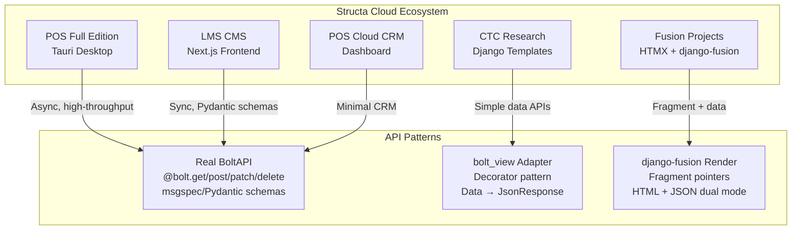
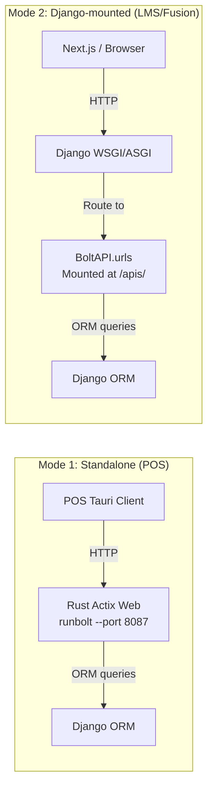
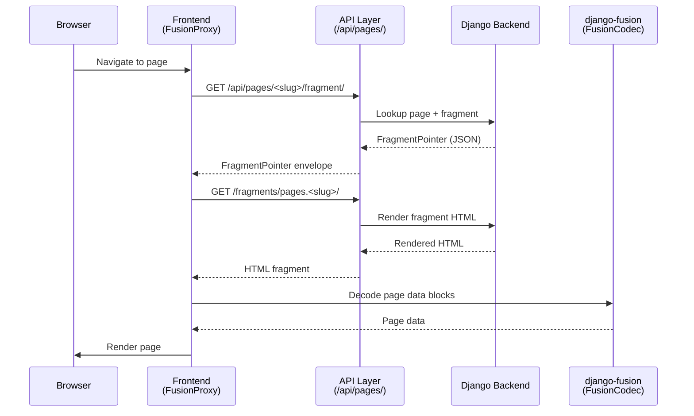
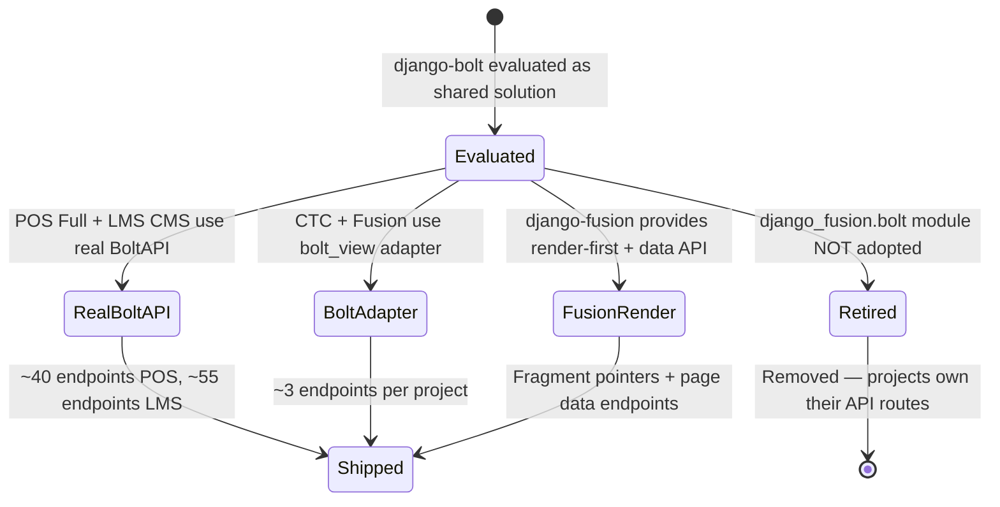

# دمج Django-Bolt و django-fusion — دراسة حالة

> **التاريخ:** 2026-07-26 | **التحديث:** 2026-08-31
> **الحالة:** نشطة — سجل تاريخي ذو صلة حالية
> **النطاق:** تحليل أنماط API في django-bolt عبر مواقع Structa Cloud وإصدارات نقطة البيع
> **الميزة ذات الصلة:** الوصول إلى API (Formint POS)، [`feature-tracking/formint-pos.md`](../feature-tracking/formint-pos.md) § الوصول إلى API

---

## 1. السياق

احتاج نظام Structa Cloud البيئي إلى نقاط API عالية الأداء لعدة منتجات:

- **إصدار نقطة البيع الكامل** — واجهات فورية للمنتجات والمبيعات والمخزون لعملاء Tauri المكتبيين
- **نظام LMS CMS** — واجهات للمقررات والمصادقة والمحتوى لواجهات Next.js
- **مشاريع CTC Research / Fusion** — واجهات بيانات خفيفة لمحتوى الصفحات
- **POS Cloud CRM** — واجهة CRM مصغّرة للوحة السحابة

والتحدّي: كانت احتياجات المشاريع مختلفة. بعضها احتاج نقاطاً غير متزامنة عالية
الإنتاجية. وبعضها احتاج تغليفاً بسيطاً للبيانات إلى JSON. وقُيّم django-bolt
كحل مشترك محتمل، لكن الواقع كان أكثر دقة.

**القيود:**
- Django ORM هو طبقة البيانات في كل المنتجات
- تتراوح الواجهات بين Tauri (Rust) وNext.js وHTML عادي
- بعض المشاريع تحتاج عدم التزامن، وأخرى تعمل جيداً بشكل متزامن
- تختلف احتياجات المصادقة: JWT، ومفاتيح API، وجلسات

---

## 2. البنية

### 2.1 خريطة الأنماط العامة




### 2.2 أنماط النشر




### 2.3 مسار عرض الأجزاء (django-fusion)




### 2.4 ما دُرِس مقابل ما بُني




---

## 3. التنفيذ

### 3.1 القرار: BoltAPI حقيقي مقابل محوّل bolt_view

**القرار:** استخدم BoltAPI الحقيقي حيث تلزم نقاط غير متزامنة عالية الإنتاجية.
واستخدم محوّل `bolt_view` الأبسط حيث تحتاج المشاريع فقط إلى تغليف البيانات إلى JSON.

**لماذا هذا القرار:**

- يحتاج إصدار نقطة البيع الكامل إلى نقاط غير متزامنة مدعومة بـ Django ORM `aget/acreate` — وBoltAPI الحقيقي بمخططات msgspec مناسب
- يملك LMS CMS نحو 55 نقطة بمخططات Pydantic — وBoltAPI الحقيقي مناسب، لكن المعالجات المتزامنة تعمل جيداً
- تحتاج CTC Research ومشاريع Fusion نحو 3 نقاط لكل مشروع — ومحوّل `bolt_view` أبسط وأقل اعتماديات
- POS Cloud CRM إثبات مفهوم — نسخة BoltAPI مصغّرة

**ما كنّا سنفعله مختلفاً:** لو بدأنا من جديد، لتوحّدنا على نمط واحد لكل منتج بدلاً من
الخلط. فمحوّل `bolt_view` هو في جوهره BoltAPI مبسّط — واختيار أحدهما كان سيقلّل التعقيد.

### 3.2 تنفيذ رئيسي: bolt_api.py في إصدار نقطة البيع الكامل

```python
# projects/pos/pos-full/sidecar/bolt_api.py
from django_bolt import BoltAPI, Request
from django_bolt.auth import JWTAuthentication, APIKeyAuthentication, IsAuthenticated

bolt = BoltAPI(prefix="/bolt", namespace="pos-bolt")

@bolt.get("/products", response_model=list[ProductResponse], 
          guards=[IsAuthenticated()])
async def list_products(request: Request) -> list[ProductResponse]:
    return [...]
```

**الحجم:** نحو 40 نقطة عبر 7 مجموعات موارد (الفئات، المنتجات، العملاء، المبيعات، المخزون، الموظفون، المصادقة)

**الأنماط الأساسية:**
- نقاط غير متزامنة مع Django ORM `aget/acreate`
- `response_model` لتوليد مخطط OpenAPI
- مصادقة مزدوجة: JWT + X-API-Key
- `msgspec.Struct` لمخططات الطلب/الاستجابة (أداء عالٍ)
- وثائق OpenAPI على `/bolt/docs`

### 3.3 تنفيذ رئيسي: محوّل bolt_view

```python
# www/api/data_adapter.py — CTC Research / Fusion projects
def bolt_view(view_func):
    """Decorator that converts data-returning views into Django JsonResponse."""
    def wrapper(request, *args, **kwargs):
        result = view_func(request, *args, **kwargs)
        if isinstance(result, tuple):
            data, status = result
            return JsonResponse(data, status=status)
        return JsonResponse(result, status=200)
    return wrapper

@bolt_view
def page_detail(request, slug):
    return STATIC_PAGES.get(normalized)
```

**الحجم:** نحو 3 نقاط لكل مشروع (الصحة، تفاصيل الصفحة، جزء الصفحة، بيانات الصفحة)

**الأنماط الأساسية:**
- واجهات Django خالصة — بلا اعتماد على django-bolt
- تغليف بسيط للبيانات إلى JSON
- يعمل جنباً إلى جنب مع `FusionCodec` و `FusionSessionChecker` و `fusion_response`
- يتعايش مع عرض أجزاء django-fusion

### 3.4 المقترح السابق: django_fusion.bolt (متقاعد)

كان المقترح الأصلي إنشاء وحدة `django_fusion.bolt` تكشف كل `RoutableComponent`
تلقائياً كنقطة BoltAPI:

```python
# RETIRED — do not import this removed package
# django_fusion/bolt/api.py (former)
class FusionBoltAPI(BoltAPI):
    def register_component(self, component_class: type[RoutableComponent]):
        """Auto-generate bolt endpoints for a RoutableComponent."""
        ...
```

**لماذا تقاعد:** المشاريع المستهلكة أقدر على امتلاك مسارات API ومُسلسِلاتها
ومصادقتها ومحوّلات إطارها. وكانت الحزمة المشتركة ستخلق اقتراناً وتسريباً للتجريد.

**المقاربة الحالية:** كل مشروع يملك طبقة API الخاصة به. ويوفّر django-fusion
أوليات HTML المعروض واستجابات البيانات. ويبقى أي API على نمط Bolt مملوكاً للمشروع
المستهلك.

---

## 4. النتائج

### 4.1 ما نجح

| النتيجة | الدليل |
|---------|----------|
| **إصدار نقطة البيع الكامل له API إنتاجي** | 32 نقطة، ونحو 30 نوع struct، ومصادقة مزدوجة، و60k+ RPS عبر Rust Actix Web |
| **LMS CMS له واجهات بيانات** | نحو 55 نقطة عبر 10+ مجموعات موارد بمخططات Pydantic |
| **CTC/Fusion لهما واجهات خفيفة** | نحو 3 نقاط لكل مشروع بلا اعتماد على django-bolt |
| **django-fusion يوفّر العرض المزدوج** | تعمل مؤشرات الأجزاء ونقاط بيانات الصفحات مع عميلَي HTML وJSON |
| **تكامل الواجهة يعمل** | نظير FusionDecoder في TypeScript يفكّ أظرفة FusionCodec |

### 4.2 الأداء

| المقياس | القيمة | المصدر |
|--------|-------|--------|
| إنتاجية BoltAPI في نقطة البيع | 60k+ RPS | Rust Actix Web عبر `runbolt` |
| التسلسل | JSON بلا نسخ | `msgspec.Struct` |
| عبء الاختبار | لا شيء | `TestClient` داخل العملية (بلا TCP) |

### 4.3 قبل ← بعد

**قبل:** كان لكل مشروع نمط API عشوائي — بعضها بواجهات Django خام تُعيد JSON،
وبعضها بمُسلسِلات مخصّصة، بلا اتساق.

**بعد:** برزت ثلاثة أنماط واضحة:
1. BoltAPI حقيقي لاحتياجات الإنتاجية العالية (نقطة البيع، LMS)
2. محوّل bolt_view لواجهات البيانات البسيطة (CTC، Fusion)
3. django-fusion بعرض أولاً + واجهة بيانات للصفحات القائمة على الأجزاء

الأنماط ليست موحّدة تحت حزمة واحدة، لكنها موثّقة ومفهومة.

---

## 5. الدروس المستفادة

### 5.1 الحزم المشتركة قد تكون التجريد الخطأ

افترض مقترح `django_fusion.bolt` أن كشف المكوّنات كنقاط Bolt ذو قيمة شاملة. وفي
الواقع:
- لاحتياجات API مختلفة لكل مشروع
- ومتطلبات مصادقة تختلف
- وبعض المشاريع لا تحتاج عدم التزامن إطلاقاً
- وكانت الحزمة المشتركة ستفرض تجريدات لا تناسب كل المستهلكين

**الدرس:** دع المشاريع المستهلكة تملك طبقة API الخاصة بها. ووفّر أوليات (مثل `FusionCodec` وعرض الأجزاء) بدلاً من أطر إلزامية.

### 5.2 وثّق الأنماط حتى وهي غير موحّدة

تتعايش الأنماط الثلاثة (BoltAPI الحقيقي، ومحوّل bolt_view، وعرض django-fusion).
وهي غير موحّدة تحت حزمة واحدة، لكنها:
- موثّقة في دراسة الحالة هذه
- مُشار إليها من خارطة الميزات
- مفهومة لدى الفريق

**الدرس:** التوثيق ذو قيمة حتى بلا توحيد. فمعرفة *لماذا* توجد أنماط مختلفة أفضل من تظاهر وجود طريقة واحدة.

### 5.3 تكامل الواجهة كان القيمة الحقيقية

تبيّن أن نظير `FusionDecoder` في TypeScript، ومكوّن `FusionProxy`، ونمط العرض
المزدوج (جزء HTML أو بيانات JSON) أكثر فائدة على نطاق أوسع من تكامل BoltAPI نفسه.
وهذه تعمل عبر كل مشاريع django-fusion بغضّ النظر عن طبقة API.

**الدرس:** استثمر في الأوليات التي يستطيع كل مشروع استخدامها. فالأجزاء الخاصة بـ BoltAPI مملوكة للمشاريع؛ وأجزاء فكّ وترميز fusion قيمة مشتركة.

---

## 6. الوثائق ذات الصلة

| المستند | المسار |
|----------|------|
| تتبّع الميزات — الوصول إلى API (Formint POS) | [`../feature-tracking/formint-pos.md`](../feature-tracking/formint-pos.md) § الوصول إلى API |
| خارطة الميزات — منصّة Syntara | [`../../features/feature-roadmap.md`](../../features/feature-roadmap.md) |
| سجل الخطط — الخطط المعيارية | [`../../plans/README.md`](../../plans/README.md) |
| دراسة حالة Django-Bolt الأصلية (تاريخية) | [`../../plans/DJANGO_BOLT_FUSION_CASE_STUDY.md`](../../plans/DJANGO_BOLT_FUSION_CASE_STUDY.md) |
| خطة المهام و MCP لـ django-fusion | [`../../plans/django-fusion/django-fusion-tasks-mcp-plan.md`](../../plans/django-fusion/django-fusion-tasks-mcp-plan.md) |

---

## ملاحظات وإرشادات

- تستخلص دراسة الحالة هذه الأصل `DJANGO_BOLT_FUSION_CASE_STUDY.md` وتحسّنه بمخططات mermaid وبنية أوضح
- يبقى المستند الأصلي مرجعاً تاريخياً بأمثلة كود كاملة وقائمة تحقّق الترحيل
- أُزيلت حزمة `django_fusion.plugins.bolt` — لا تستوردها من django-fusion
- أبقِ تكاملات Bolt في المشاريع المستهلكة؛ فمسارات API المملوكة للمشاريع هي النمط الحالي
- مسار عرض الأجزاء (مخطط التتابع أعلاه) هو النمط الأوسع قابلية للتطبيق — يعمل مع أي مشروع django-fusion

<!-- AI-generated: review needed -->
