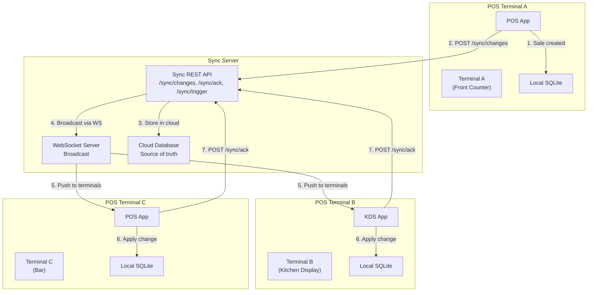
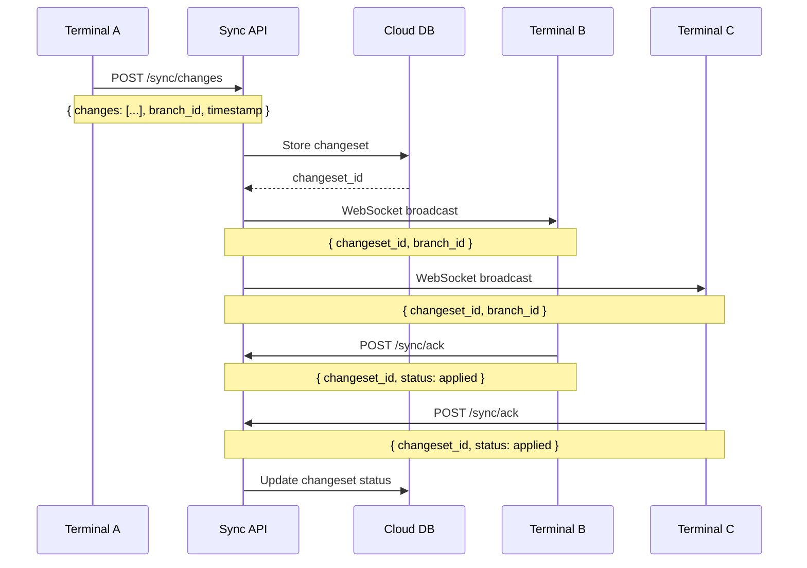
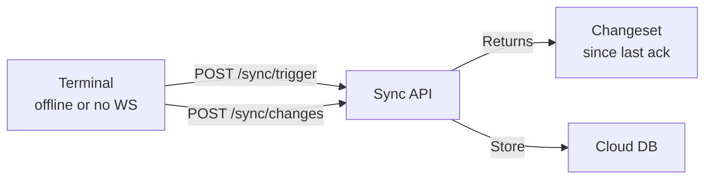
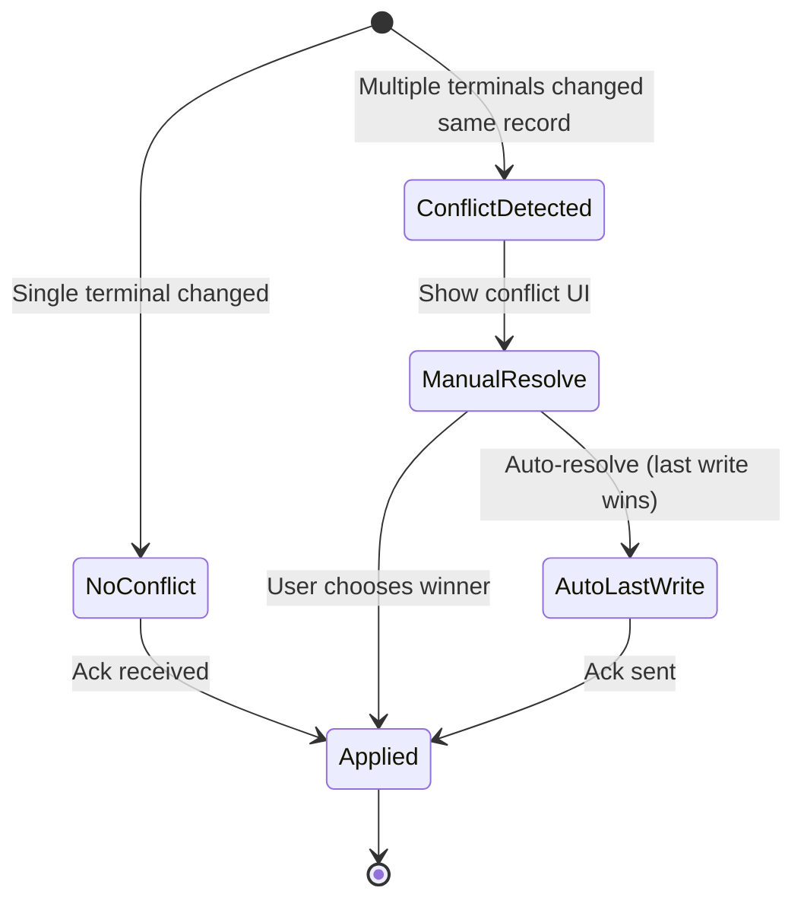
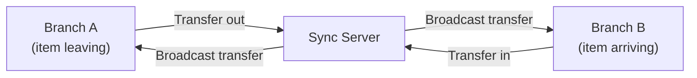

# مزامنة المحطات المتعددة — دراسة حالة POS

> **التاريخ:** 2026-08-31 | **الحالة:** نشطة
> **النطاق:** بث WebSocket فوري + سحب حِزم التغييرات (`/sync/changes`، `/sync/ack`، `/sync/trigger`) بين محطات نقطة البيع
> **تتبّع الميزات:** [`feature-tracking/formint-pos.md`](../feature-tracking/formint-pos.md) § إدارة المحطات المتعددة
> **ذو صلة:** [`pos-offline-queue.md`](./pos-offline-queue.md)، [`pos-qr-menu.md`](./pos-qr-menu.md)

---

## 1. السياق

تحتاج نقطة بيع في مطعم إلى عدة محطات (الكاشير، المطبخ، البار، الطلبات الخارجية)
تبقى متزامنة. فعند إنشاء عملية بيع على محطة، يجب أن تراها الأخريات فوراً — تظهر
تذاكر المطبخ، ويتحدّث المخزون، وتنعكس تحويلات الفروع على كل المحطات.

**القيود:**
- قد تكون المحطات على شبكات مختلفة (شبكة محلية، واي فاي، هاتف)
- بعض المحطات تعمل دون اتصال (انظر [دراسة حالة طابور عدم الاتصال](./pos-offline-queue.md))
- الفورية مفضّلة لكنها غير إلزامية — الاتساق النهائي مقبول
- يجب التعامل مع انهيار المحطات وإعادة اتصالها بسلاسة

---

## 2. البنية

### 2.1 نظرة عامة على تدفّق المزامنة




### 2.2 بروتوكول حِزم التغييرات




### 2.3 سحب حِزم التغييرات (بديل الاستطلاع)




### 2.4 حلّ التعارضات




---

## 3. التنفيذ

### 3.1 بث WebSocket

**النقطة:** اتصال WebSocket لإشعار التغييرات الفوري.

**ما يبثّه:**
- `changeset_id` — معرّف فريد لدفعة التغييرات
- `branch_id` — الفرع الذي أتى منه التغيير
- `change_type` — بيع، مخزون، تحويل، إلخ

**سلوك إعادة الاتصال:** تُعيد المحطات الاشتراك عند إعادة الاتصال، وتسحب أي حِزم
تغييرات فاتتها منذ آخر إقرار لها.

### 3.2 واجهة سحب حِزم التغييرات

```python
# POST /sync/changes — submit changes from terminal
{
    "branch_id": "branch-1",
    "timestamp": "2026-08-31T12:00:00Z",
    "changes": [
        {"type": "sale", "sale_id": "sale-123", "data": {...}},
        {"type": "inventory", "product_id": "prod-456", "delta": -1},
    ]
}

# POST /sync/ack — acknowledge changeset applied
{
    "changeset_id": "cs-789",
    "status": "applied",  # or "conflict"
    "conflict_info": {...}  # if status is conflict
}

# POST /sync/trigger — request pending changesets
{
    "branch_id": "branch-1",
    "since": "2026-08-31T11:00:00Z"  # last ack timestamp
}
```

### 3.3 مزامنة آمنة التكرار

حِزم التغييرات آمنة التكرار — فتطبيق الحِزمة نفسها مرتين لا يكرّر البيانات. ويحمل
كل تغيير معرّفاً فريداً، وتتتبّع المحطة الحِزم التي طبّقتها بالفعل.

### 3.4 تحويلات الفروع




---

## 4. النتائج

### 4.1 ما ينجح

| النتيجة | الدليل |
|---------|----------|
| مزامنة فورية بين المحطات | يوصل بث WebSocket التغييرات في أقل من 100ms على الشبكة المحلية |
| حِزم تغييرات آمنة التكرار | إعادة تطبيق الحِزمة نفسها آمنة |
| كشف التعارض | تحرير عدة محطات للسجل نفسه يُشغّل واجهة التعارض |
| صمود دون اتصال | تُصطف المحطات التغييرات عند عدم الاتصال (انظر دراسة حالة طابور عدم الاتصال) |
| تحويلات الفروع | تنتقل الأصناف بين الفروع مع المزامنة |

### 4.2 الأداء

| المقياس | القيمة |
|--------|-------|
| زمن بث WebSocket (شبكة محلية) | أقل من 100ms |
| سحب حِزم التغييرات (بديل الاستطلاع) | عند الطلب، نحو 100-500ms |
| أقصى حجم لحِزمة تغييرات | قابل للتهيئة لكل فرع |

---

## 5. الدروس المستفادة

### 5.1 المزيج الهجين (WebSocket + استطلاع) أكثر متانة من WebSocket وحده

تفشل مزامنة WebSocket الصرفة عندما تنقطع المحطات أو تكون اتصالاتها متذبذبة. أما
المقاربة الهجينة (WebSocket للدفع، واستطلاع `/sync/trigger` كبديل) فتعني أن
المحطات تتقارب دائماً.

**الدرس:** احتفظ دائماً ببديل سحب للمزامنة الفورية. فالشبكات غير موثوقة.

### 5.2 الأمان التكراري غير قابل للتفاوض

بدون حِزم تغييرات آمنة التكرار، تؤدي إعادة المزامنة بعد خطأ شبكي إلى تكرار
المبيعات ومضاعفة احتساب المخزون. ويجب أن يحمل كل تغيير معرّفاً فريداً وأن تتتبّع
المحطة ما طبّقته.

**الدرس:** صمّم المزامنة لتكون آمنة عند إعادة المحاولة. مفاتيح أمان تكراري على كل تغيير.

### 5.3 حلّ التعارضات يحتاج واجهة، لا منطقاً فقط

عندما تعدّل محطتان السجل نفسه، يستطيع النظام كشف التعارض، لكن الحلّ قرار تجاري.
وعرض التعارض للمستخدم مع النسختين أنفع من اختيار فائز بصمت.

**الدرس:** اكشف التعارضات آلياً، وحُلّها بمشاركة المستخدم.

---

## 6. الوثائق ذات الصلة

| المستند | المسار |
|----------|------|
| تتبّع الميزات — إدارة تعدد الفروع | [`../feature-tracking/formint-pos.md`](../feature-tracking/formint-pos.md) § إدارة تعدد الفروع |
| دراسة حالة — طابور عدم الاتصال | [./pos-offline-queue.md](./pos-offline-queue.md) |
| دراسة حالة — قائمة QR | [./pos-qr-menu.md](./pos-qr-menu.md) |
| دراسة حالة — وسم مزامنة DataToken | [./data-token-sync-tagging.md](./data-token-sync-tagging.md) |
| خارطة الميزات | [`../../features/feature-roadmap.md`](../../features/feature-roadmap.md) |
| وثائق منتج نقطة البيع | [`../../projects/formints/`](../../projects/formints/) |

---

## ملاحظات وإرشادات

- مزامنة المحطات المتعددة جزء من ميزة إدارة تعدد الفروع (P0، مُشحونة)
- يستخدم بروتوكول المزامنة REST + WebSocket — بلا بروتوكول مخصّص
- المحطات مسؤولة عن تتبّع آخر طابع زمني لإقرارها
- واجهة التعارض لكل منتج — طبقة المزامنة تكشف، وطبقة المنتج تحلّ

<!-- AI-generated: review needed -->
