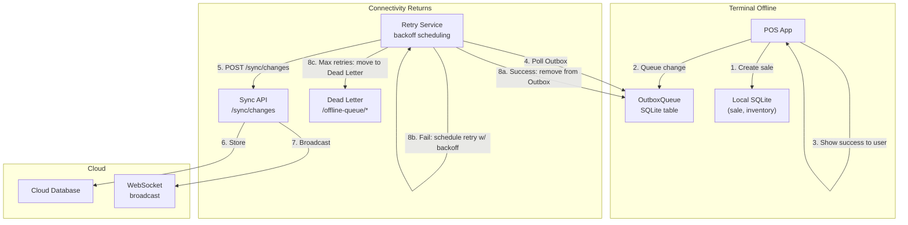
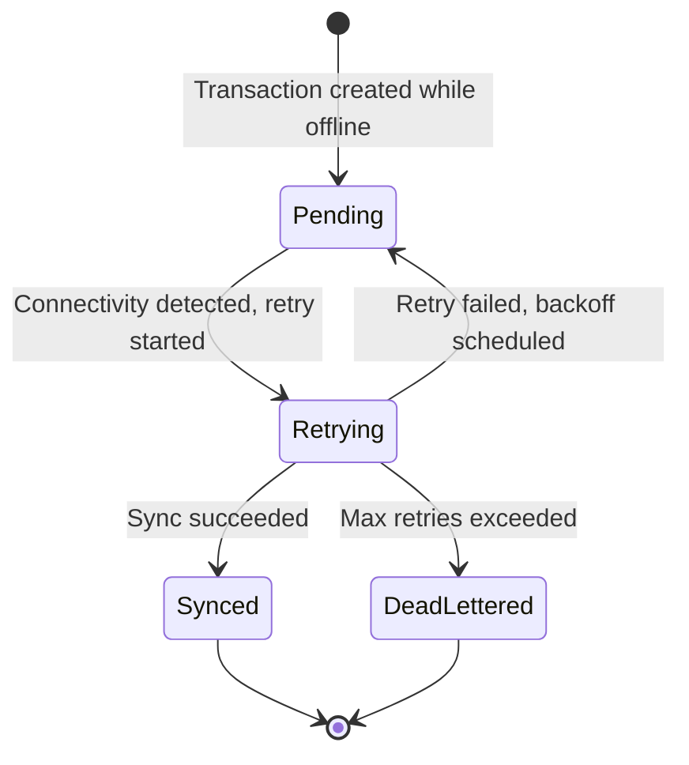
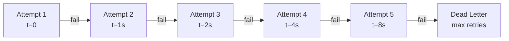
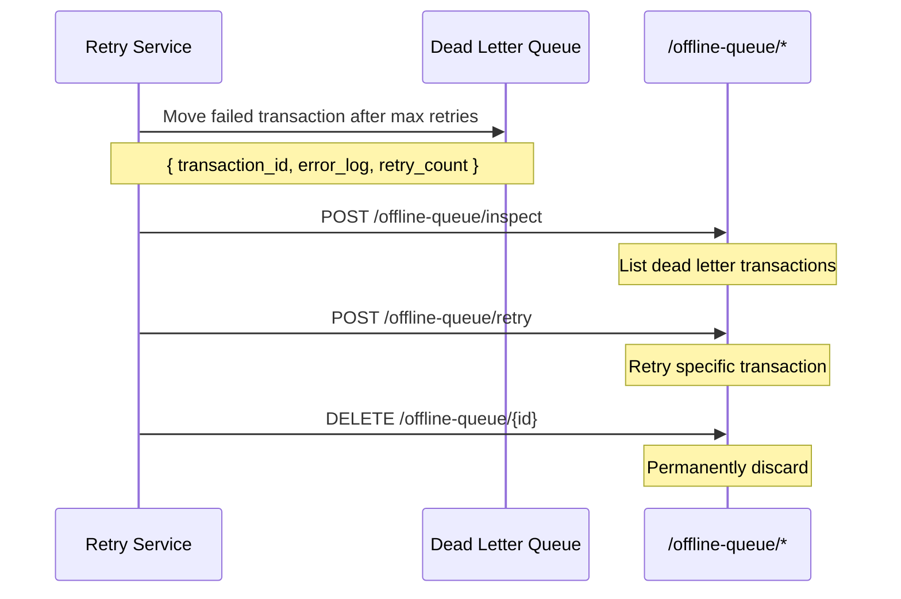

# طابور عدم الاتصال — دراسة حالة POS

> **التاريخ:** 2026-08-31 | **الحالة:** نشطة
> **النطاق:** `OutboxQueue` متين + إعادة محاولة/تراجع/طابور رسائل ميتة (`/offline-queue/*`) — أوقف المعاملات في وضع عدم الاتصال، وزامنها عند عودة الشبكة
> **تتبّع الميزات:** [`feature-tracking/formint-pos.md`](../feature-tracking/formint-pos.md) § إدارة المحطات المتعددة
> **ذو صلة:** [`pos-multi-terminal-sync.md`](./pos-multi-terminal-sync.md)، [`pos-qr-menu.md`](./pos-qr-menu.md)

---

## 1. السياق

قد تفقد محطة نقطة البيع في مطعم اتصالها بالشبكة — ينقطع الواي فاي، أو تخفت إشارة
الهاتف، أو يُعاد تشغيل الموجّه. ويجب أن تستمر المبيعات في العمل دون اتصال. وعند
عودة الاتصال، يجب أن تُزامَن المعاملات المُصطفَّة بموثوقية ودون تكرار أو فقدان بيانات.

**القيود:**
- يجب إنشاء المبيعات وتخزينها محلياً أثناء عدم الاتصال
- لا فقدان للبيانات — يجب أن تُزامَن كل معاملة في النهاية
- لا تكرار — يجب أن تكون إعادة المحاولة آمنة التكرار (idempotent)
- إعادة محاولة بتراجع تدريجي — لا تُثقل الخادم عند إعادة الاتصال
- معالجة الرسائل الميتة — قد تفشل بعض المعاملات نهائياً (بيانات غير صالحة مثلاً)

---

## 2. البنية

### 2.1 تدفّق المعاملات في وضع عدم الاتصال




### 2.2 تصميم طابور الصادر




### 2.3 إعادة المحاولة بتراجع أُسّي




### 2.4 معالجة الرسائل الميتة




---

## 3. التنفيذ

### 3.1 نموذج OutboxQueue

```python
# Simplified representation
class OutboxQueue(models.Model):
    transaction_type = models.CharField(...)  # sale, inventory, transfer
    payload = models.JSONField(...)            # The change data
    retry_count = models.IntegerField(default=0)
    next_retry_at = models.DateTimeField(...)  # Exponential backoff
    status = models.CharField(choices=[
        "pending", "retrying", "synced", "dead_lettered"
    ])
    created_at = models.DateTimeField(auto_now_add=True)
    error_log = models.JSONField(default=list)  # Last errors
```

### 3.2 خدمة إعادة المحاولة

```python
# Pseudocode — retry loop with exponential backoff
def retry_outbox():
    pending = OutboxQueue.objects.filter(
        status__in=["pending", "retrying"],
        next_retry_at__lte=now()
    )

    for txn in pending:
        try:
            response = post_sync_changes(txn.payload)
            if response.success:
                txn.status = "synced"
                txn.save()
            else:
                txn.retry_count += 1
                txn.next_retry_at = now() + exponential_backoff(txn.retry_count)
                txn.error_log.append(response.error)
                txn.save()
        except Exception as e:
            txn.retry_count += 1
            txn.next_retry_at = now() + exponential_backoff(txn.retry_count)
            txn.error_log.append(str(e))
            txn.save()

        if txn.retry_count >= MAX_RETRIES:
            txn.status = "dead_lettered"
            txn.save()
```

### 3.3 واجهة الرسائل الميتة

```python
# /offline-queue/inspect — list dead letter transactions
GET /offline-queue/inspect

# /offline-queue/retry — retry a specific dead letter
POST /offline-queue/retry
{ "transaction_id": "txn-123" }

# /offline-queue/{id} — discard permanently
DELETE /offline-queue/{id}
```

---

## 4. النتائج

### 4.1 ما ينجح

| النتيجة | الدليل |
|---------|----------|
| إنشاء مبيعات دون اتصال | تُنشأ المبيعات وتُخزَّن محلياً أثناء عدم الاتصال |
| طابور متين | يبقى OutboxQueue في SQLite ويصمد أمام إعادة تشغيل المحطة |
| إعادة محاولة تلقائية | تستطلع خدمة إعادة المحاولة وتزامن عند عودة الاتصال |
| تراجع أُسّي | تتباعد محاولات إعادة المحاولة لتجنّب إرهاق الخادم |
| معالجة الرسائل الميتة | تُعرض المعاملات الفاشلة للمراجعة اليدوية |
| لا فقدان بيانات | كل معاملة إما تُزامَن أو تنتقل إلى الرسائل الميتة |

### 4.2 الموثوقية

| السيناريو | النتيجة |
|----------|---------|
| المحطة دون اتصال 5 دقائق | تُزامَن كل المعاملات عند إعادة الاتصال |
| المحطة دون اتصال 24 ساعة | تُصطف المعاملات وتُزامَن على دفعات عند إعادة الاتصال |
| الخادم غير متاح أثناء إعادة المحاولة | يزداد التراجع، دون إغراق السجلّات |
| بيانات معاملة غير صالحة | تنتقل إلى الرسائل الميتة بعد استنفاد المحاولات |

---

## 5. الدروس المستفادة

### 5.1 اصطفّ كل شيء، لا المبيعات وحدها

تحتاج تغييرات المخزون والتحويلات وتحديثات تذاكر المطبخ أيضاً إلى الاصطفاف دون
اتصال. ويعالج OutboxQueue كل أنواع المعاملات بالطريقة نفسها.

**الدرس:** عرّف صادراً واحداً لكل التغييرات القابلة للمزامنة، لا طابوراً لكل ميزة.

### 5.2 التراجع الأُسّي يمنع عواصف إعادة المحاولة

بدون تراجع، تؤدي إعادة اتصال 10 محطات إلى إرسال 10 طلبات مزامنة متزامنة، وقد
تُرهق الخادم. أما التراجع الأُسّي فيباعد المحاولات طبيعياً.

**الدرس:** استخدم دائماً تراجعاً أُسّياً لإعادة المحاولة. فالتراجع الخطي أو الثابت مخاطرة حجب خدمة.

### 5.3 الرسائل الميتة ميزة، لا خلل

ستفشل بعض المعاملات نهائياً — بيانات غير صالحة، أو عدم تطابق مخطط، أو حِمل تالف.
ودفعها إلى طابور رسائل ميتة مع تسجيل كامل للأخطاء يتيح للمشغّلين فحصها وإعادة
محاولتها يدوياً بدلاً من فقدانها بصمت.

**الدرس:** طابور الرسائل الميتة ضروري لموثوقية الإنتاج. سجّل كل شيء.

---

## 6. الوثائق ذات الصلة

| المستند | المسار |
|----------|------|
| تتبّع الميزات — إدارة تعدد الفروع | [`../feature-tracking/formint-pos.md`](../feature-tracking/formint-pos.md) § إدارة تعدد الفروع |
| دراسة حالة — مزامنة المحطات المتعددة | [./pos-multi-terminal-sync.md](./pos-multi-terminal-sync.md) |
| دراسة حالة — قائمة QR | [./pos-qr-menu.md](./pos-qr-menu.md) |
| دراسة حالة — وسم مزامنة DataToken | [./data-token-sync-tagging.md](./data-token-sync-tagging.md) |
| خارطة الميزات | [`../../features/feature-roadmap.md`](../../features/feature-roadmap.md) |

---

## ملاحظات وإرشادات

- طابور عدم الاتصال جزء من إدارة تعدد الفروع (P0، مُشحونة)
- إصدارات Community وما فوقها تملك OutboxQueue متيناً
- تعمل خدمة إعادة المحاولة كمهمة خلفية على المحطة
- واجهة الرسائل الميتة للاستخدام التشغيلي — وليست موجّهة للمستخدم

<!-- AI-generated: review needed -->
