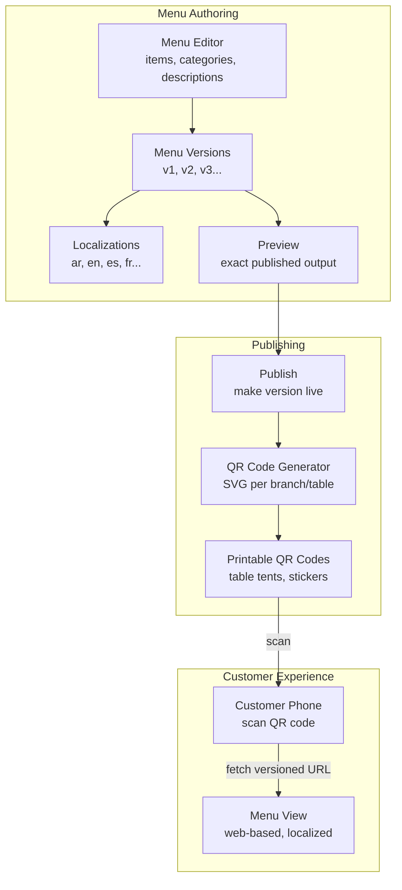
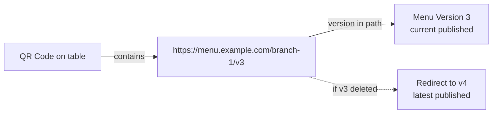
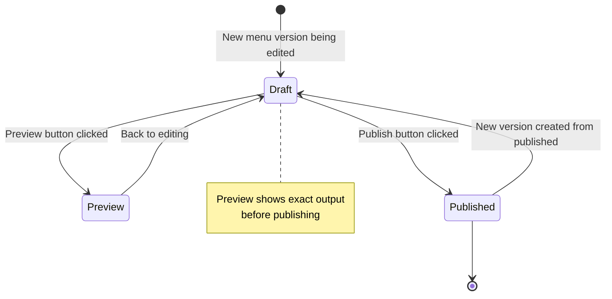
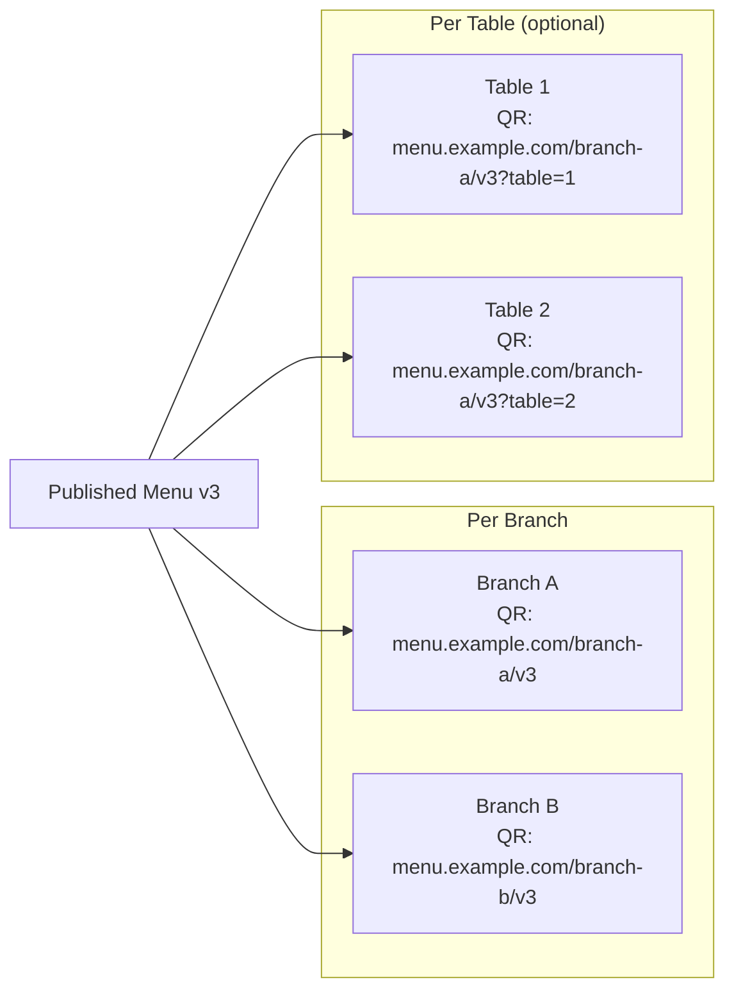

# قائمة QR — دراسة حالة POS

> **التاريخ:** 2026-08-31 | **الحالة:** نشطة
> **النطاق:** قائمة مُصدَّرة بلغات متعددة، وسير معاينة/نشر، وتوليد أكواد QR للفروع/الطاولات
> **تتبّع الميزات:** [`feature-tracking/formint-pos.md`](../feature-tracking/formint-pos.md) § قائمة QR
> **ذو صلة:** [`pos-multi-terminal-sync.md`](./pos-multi-terminal-sync.md)، [`pos-offline-queue.md`](./pos-offline-queue.md)

---

## 1. السياق

تريد المطاعم الحديثة أن يعرض العملاء القوائم عبر كود QR — يمسح العميل كوداً على
الطاولة فيرى القائمة على هاتفه. ويجب أن تكون القائمة:

- **متعددة اللغات** — لغات متعددة (العربية، الإنجليزية، وغيرها)
- **مُصدَّرة بالإصدارات** — تحديث القائمة دون تعطيل عمليات المسح النشطة
- **قابلة للمعاينة** — رؤية شكلها قبل النشر
- **خاصة بالفرع/الطاولة** — قد تختلف القائمة بين فرع وآخر أو طاولة وأخرى

**القيود:**
- يجب أن تكون أكواد QR قابلة للطباعة (حوامل الطاولات، الملصقات)
- يجب ألا تتطلّب تحديثات القائمة إعادة طباعة أكواد QR (استخدم روابط مُصدَّرة)
- يجب أن تطابق المعاينة المخرجات المنشورة تماماً
- يجب أن تكون الترجمة قابلة للإدارة — فليس كل طبق يحتاج كل اللغات

---

## 2. البنية

### 2.1 إصدارات القائمة + تدفّق كود QR




### 2.2 استراتيجية الرابط المُصدَّر




**النقطة الجوهرية:** تحتوي أكواد QR روابط مُصدَّرة. وعندما تتحدّث القائمة من v3
إلى v4، تبقى الأكواد القديمة عاملة — إذ تعيد التوجيه إلى أحدث إصدار. وتُولَّد
أكواد جديدة للإصدار v4.

### 2.3 سير المعاينة / النشر




### 2.4 توليد كود QR للفرع/الطاولة




---

## 3. التنفيذ

### 3.1 نموذج إصدار القائمة

```python
# Simplified representation
class MenuVersion(models.Model):
    branch = models.ForeignKey(Branch, ...)
    version_number = models.IntegerField(...)
    status = models.CharField(choices=["draft", "published"])
    published_at = models.DateTimeField(null=True)

class MenuItem(models.Model):
    menu_version = models.ForeignKey(MenuVersion, ...)
    category = models.ForeignKey(MenuCategory, ...)
    name = models.JSONField(...)  # {"en": "Burger", "ar": "برجر"}
    description = models.JSONField(null=True)
    price = models.DecimalField(...)
    images = models.JSONField(default=list)  # image URLs
```

### 3.2 توليد كود QR

```python
# GET /qr/<branch_id>/<label> — generate QR SVG
# QR encodes: https://menu.example.com/{branch_slug}/v{version}

def generate_qr_svg(branch_slug: str, version: int, label: str = "") -> SVG:
    menu_url = f"https://menu.example.com/{branch_slug}/v{version}"
    qr = QRCode(menu_url)
    return qr.to_svg(label=label)  # SVG with optional text label
```

**المخرجات:** كود QR بصيغة SVG مناسب للطباعة. ويتضمّن اختيارياً نصاً أسفل الكود
(مثل «امسح لعرض القائمة»).

### 3.3 نقطة المعاينة

```python
# GET /menu/preview/<menu_version_id>
# Returns exact HTML that will be served when published
# Same rendering pipeline as published menu
```

### 3.4 استراتيجية الترجمة

```python
# Menu item with localized fields
{
    "name": {"en": "Grilled Salmon", "ar": "سمك سالم مشوي", "es": "Salmón a la Plancha"},
    "description": {"en": "Fresh Atlantic salmon with lemon butter", "ar": "سمك سالم طازج مع زبدة الليمون"},
    "price": 24.99,
    "category": "main_course"
}
```

**كشف اللغة:** تكشف صفحة القائمة لغة متصفح العميل وتقدّم الترجمة المناسبة.
وترجع إلى الإنجليزية إذا لم تكن اللغة متاحة.

---

## 4. النتائج

### 4.1 ما ينجح

| النتيجة | الدليل |
|---------|----------|
| قوائم متعددة اللغات | مدعومة: العربية، الإنجليزية، الإسبانية، الفرنسية |
| أكواد QR مُصدَّرة | تحتوي الأكواد روابط مُصدَّرة — فتبقى الأكواد القديمة عاملة بعد التحديثات |
| معاينة قبل النشر | عرض المخرجات المنشورة تمّاماً قبل الإطلاق |
| أكواد QR لكل فرع | لكل فرع كود QR خاص |
| أكواد QR لكل طاولة (اختياري) | يمكن أن يكون لكل طاولة كود فريد مع معامل الطاولة |
| SVG قابل للطباعة | تُولَّد الأكواد بصيغة SVG لطباعة عالية الجودة |

### 4.2 سير تحديث القائمة

| الخطوة | الإجراء |
|------|--------|
| 1 | حرِّر عناصر القائمة في لوحة الإدارة |
| 2 | أنشئ إصداراً جديداً (v4) |
| 3 | عاين v4 — وتحقق من التخطيط والترجمة |
| 4 | انشر v4 |
| 5 | ولّد أكواد QR جديدة للإصدار v4 |
| 6 | تُعيد الأكواد القديمة (v3) التوجيه إلى v4 تلقائياً |

---

## 5. الدروس المستفادة

### 5.1 روابط مُصدَّرة > إعادة طباعة أكواد QR

لو احتوت أكواد QR رابطاً عاماً (بلا إصدار)، لتعطّلت عمليات المسح النشطة عند
تحديث القائمة إلى أن تُطبَع أكواد جديدة وتُوزَّع. أما الروابط المُصدَّرة فتعني:

- تبقى الأكواد القديمة عاملة (تعيد التوجيه إلى الأحدث)
- يمكن طباعة أكواد جديدة للإصدار المحدَّث
- لا داعي للاستعجال في استبدال حوامل الطاولات عند تغيّر القائمة

**الدرس:** صدِّر دائماً الروابط في أكواد QR. فتكلفة طباعة أكواد جديدة أقل من تكلفة تعطيل تجربة العميل.

### 5.2 يجب أن تكون المعاينة مطابقة تماماً

إذا لم تطابق المعاينة ما يراه العملاء بعد النشر، فالمعاينة بلا قيمة. وتستخدم
نقطة المعاينة مسار العرض نفسه المستخدم في القائمة المنشورة — فلا وجود لقالب
معاينة منفصل.

**الدرس:** المعاينة = المخرجات المنشورة. بلا مسار عرض منفصل للمعاينة.

### 5.3 الترجمة جزئية، لا كلية

ترجمة كل عنصر قائمة إلى كل لغة مكلفة وغالباً غير ضرورية. ويدعم النظام الترجمة
الجزئية — اعرض اللغة المتاحة، وارجع إلى الإنجليزية (أو افتراضي آخر) للترجمات
الناقصة.

**الدرس:** ادعم الترجمة الجزئية. وارجع بلطف بدلاً من طلب ترجمة كاملة.

---

## 6. الوثائق ذات الصلة

| المستند | المسار |
|----------|------|
| تتبّع الميزات — قائمة QR | [`../feature-tracking/formint-pos.md`](../feature-tracking/formint-pos.md) § قائمة QR |
| دراسة حالة — مزامنة المحطات المتعددة | [./pos-multi-terminal-sync.md](./pos-multi-terminal-sync.md) |
| دراسة حالة — طابور عدم الاتصال | [./pos-offline-queue.md](./pos-offline-queue.md) |
| دراسة حالة — وسم مزامنة DataToken | [./data-token-sync-tagging.md](./data-token-sync-tagging.md) |
| خارطة الميزات | [`../../features/feature-roadmap.md`](../../features/feature-roadmap.md) |

---

## ملاحظات وإرشادات

- قائمة QR بدرجة P0، ومُشحونة في إصدار Professional
- تُولَّد أكواد QR بصيغة SVG — جاهزة للطباعة
- صفحة القائمة متجاوبة — تعمل على الهواتف
- الترجمة قائمة على JSON — تسهّل إضافة اللغات

<!-- AI-generated: review needed -->
