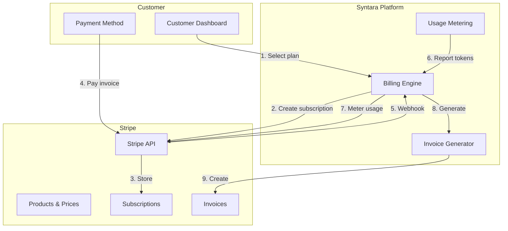
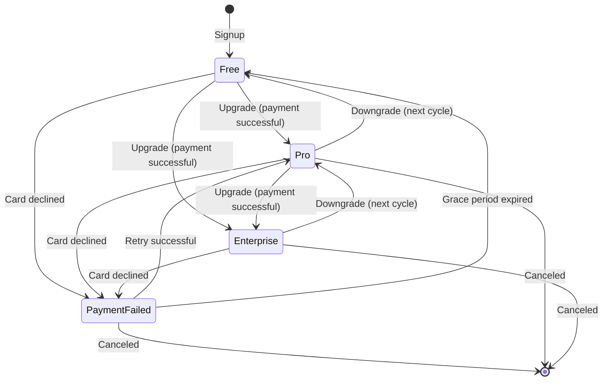
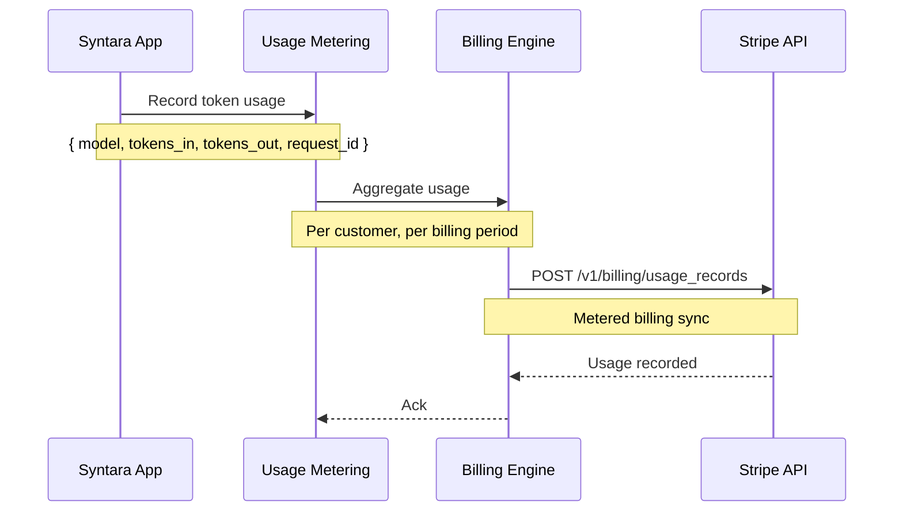

# فوترة Stripe — دراسة حالة Cypercloud/Syntara

> **التاريخ:** 2026-08-31 | **الحالة:** نشطة | **الأولوية:** P0
> **النطاق:** نموذج خطة الاشتراك (Free/Pro/Enterprise)، تكامل Stripe، قياس الاستخدام، توليد الفواتير
> **تتبّع الميزات:** [`feature-tracking/syntara.md`](../feature-tracking/syntara.md) § فوترة Stripe

---

## 1. السياق

تحتاج منصة Syntara طبقة تحقيق دخل قبل أن تبيع أي شيء. فبلا فوترة، لا توجد طبقات
اشتراك، ولا تتبّع استخدام لحساب التكلفة، ولا فواتير للعملاء.

**القيود:**
- يجب أن تدعم طبقات Free وPro وEnterprise
- فوترة حسب الاستخدام لاستهلاك رموز الذكاء الاصطناعي (فوترة مقيسة)
- توليد فواتير لكل دورة فوترة
- يجب أن تتولّى Webhooks Stripe تغييرات الخطط وفشل الدفع وأحداث دورة حياة الاشتراك

---

## 2. البنية

### 2.1 نظرة عامة على تدفّق الفوترة




### 2.2 دورة حياة الاشتراك




### 2.3 قياس الاستخدام




---

## 3. التنفيذ

### 3.1 نموذج الخطة

| الخطة | السعر | الميزات |
|------|-------|----------|
| Free | $0/شهر | طلبات محدودة، بلا قوالب مخصّصة |
| Pro | $X/شهر | حدود أعلى، قوالب مخصّصة، دعم أساسي |
| Enterprise | مخصّص | بلا حدود، دعم مخصّص، SLA، علامة بيضاء |

### 3.2 نقاط تكامل Stripe

1. **المنتجات والأسعار** — كتالوج منتجات Stripe يطابق طبقات الخطط
2. **إنشاء الاشتراك** — يختار العميل خطة، وتنشئ المنصة اشتراك Stripe
3. **قياس الاستخدام** — يُبلَّغ استخدام الرموز إلى الفوترة المقيسة في Stripe
4. **Webhooks** — معالجة `customer.subscription.updated`، `invoice.payment_succeeded`، `invoice.payment_failed`

### 3.3 معالجة Webhook

```python
# Stripe webhook events handled:
WEBHOOK_EVENTS = [
    "customer.subscription.created",
    "customer.subscription.updated",
    "customer.subscription.deleted",
    "invoice.payment_succeeded",
    "invoice.payment_failed",
    "invoice.upcoming",
]

# Each event updates local subscription state
# Idempotency keys prevent double-processing
```

### 3.4 توليد الفواتير

- يُولّد Stripe الفواتير لكل دورة فوترة
- تنزّل المنصة ملفات PDF للفواتير من Stripe
- يتوفّر سجل الفواتير في لوحة العميل

---

## 4. النتائج

### 4.1 ما ينجح

| النتيجة | الدليل |
|---------|----------|
| طبقات الخطط قابلة للتكوين | Free/Pro/Enterprise معرَّفة في Stripe |
| فوترة حسب الاستخدام | استخدام الرموز مقيس لكل عميل |
| توليد الفواتير | فواتير Stripe + تنزيل PDF من المنصة |
| موثوقية Webhook | معالجات عديمة الأثر، وإعادة محاولة عند الفشل |

### 4.2 نقاط التكامل

| التكامل | الاتجاه | الغرض |
|-------------|-----------|--------|
| Stripe Products API | المنصة ← Stripe | إنشاء/تحديث كتالوج الخطط |
| Stripe Subscription API | المنصة ← Stripe | إنشاء/إدارة الاشتراكات |
| Stripe Metered Billing | المنصة ← Stripe | الإبلاغ عن الاستخدام |
| Stripe Webhooks | Stripe ← المنصة | إشعارات الأحداث |
| Stripe Invoice API | المنصة ← Stripe | تنزيل الفواتير |

---

## 5. الدروس المستفادة

### 5.1 الأثر الصفري (idempotency) في Webhook حرج

قد يسلّم Stripe الـ Webhook نفسه عدة مرات. ويجب أن تكون المعالجات عديمة الأثر — استخدم معرّفات الأحداث لإزالة التكرار.

**الدرس:** خزّن معرّفات أحداث Webhook المعالَجة، وتخطَّ المكرّرة.

### 5.2 قياس الاستخدام يجب أن يكون متسقاً في النهاية

يحدث استخدام الرموز باستمرار. ومزامنته إلى Stripe مع كل طلب ستكون بطيئة جداً. فجمّع الاستخدام وزامنه دورياً.

**الدرس:** جمّع الاستخدام محلياً، وزامنه إلى Stripe على دفعات.

### 5.3 تغييرات الخطط تؤثر على الفوترة داخل الدورة

قد تكون الترقيات/الخفض بنسب تناسبية. ويجب أن تتولّى المنصة الرسوم التناسبية بشكل صحيح وتعكسها في الفواتير.

**الدرس:** اترك Stripe يتولّى التناسب، وزامن النتيجة إلى الحالة المحلية.

---

## 6. الوثائق ذات الصلة

| المستند | المسار |
|----------|------|
| تتبّع الميزات — فوترة Stripe | [`../feature-tracking/syntara.md`](../feature-tracking/syntara.md) § فوترة Stripe |
| دراسة حالة — إدارة رموز API | [./api-token-management.md](./api-token-management.md) |
| خارطة الميزات — Syntara | [`../../features/feature-roadmap.md`](../../features/feature-roadmap.md) |
| وثائق منتج Syntara | [`../../projects/syntara/`](../../projects/syntara/) |

---

## ملاحظات وإرشادات

- فوترة Stripe بدرجة P0 لـ Syntara — تعطّل لوحة العميل وقوالب النظام
- قياس الاستخدام مرتبط باستهلاك رموز الذكاء الاصطناعي
- يجب أن تكون معالجات Webhook عديمة الأثر
- تنزيل PDF الفواتير من Stripe

<!-- AI-generated: review needed -->
