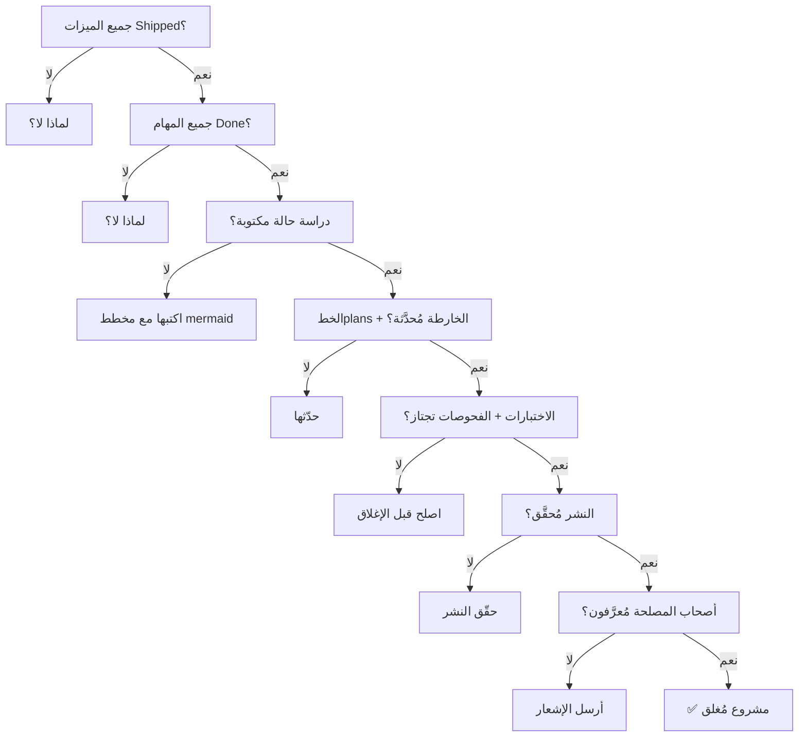

# 🏁 قائمة تحقق الإتمام — إغلاق المشروع وتعريف "مكتمل"

> **الغرض:** البوابة بين "انتهينا من البرمجة" و"المشروع مُغلق رسميًا". شغّل كل عنصر قبل إغلاق مشروع أو تعليم مجموعة ميزات رئيسية كـ Shipped.
> **آخر تحديث:** 2026-08-31

---

## ✅ تعريف "مكتمل"

مشروع أو مجموعة ميزات **مكتمل** عندما:

1. جميع الميزات المخططة مُعَلَّمة **Shipped** في `feature-tracking.md`
2. جميع المهام مُعَلَّمة **Done** في `task-tracking.md`
3. دراسة حالة موجودة في `case-studies.md` مع적어도 مخطط mermaid واحد
4. سجل الخطplans (`plans/README.md`) مُحدَّث مع النتيجة
5. خارطة ميزات (`features/feature-roadmap.md`) تعكس حالة الإطلاق
6. التوثيق مُ Validated
7. أصحاب المصلحة مُعرَّفون

---

## 📋 قائمة إغلاق المشروع

### 1. حالة الميزات

| الفحص | الحالة | ملاحظات |
|-------|--------|----------|
| جميع الميزات مُعَلَّمة **Shipped** في `feature-tracking.md` | ⬜ / ✅ | |
| لا ميزات متبقية في **In Progress** أو **Review** | ⬜ / ✅ | إن وُجدت، لماذا؟ |
| خارطة ميزات مُحدَّثة لتعكس حالة الإطلاق | ⬜ / ✅ | |
| ترتيبات الأولويات لا تزال دقيقة | ⬜ / ✅ | |

### 2. حالة المهام

| الفحص | الحالة | ملاحظات |
|-------|--------|----------|
| جميع المهام مُعَلَّمة **Done** في `task-tracking.md` | ⬜ / ✅ | |
| لا مهام متبقية في **In Progress** أو **Review** | ⬜ / ✅ | إن وُجدت، لماذا؟ |
| المهام المحظورة مُحَلَّة أو تأجيل Explicitly | ⬜ / ✅ | |
| عناصر العمل من ال_retrospectives مُعامَلَة | ⬜ / ✅ | |

### 3. التوثيق

| الفحص | الحالة | ملاحظات |
|-------|--------|----------|
| دراسة حالة مكتوبة في `case-studies.md` | ⬜ / ✅ | |
| دراسة الحالة تشمل적어도 مخطط mermaid واحد | ⬜ / ✅ | عمارة، تدفق، أو مخطط حالة |
| دراسة الحالة تغطي: السياق، التنفيذ، النتائج، الدروس | ⬜ / ✅ | |
| سجل الخطplans مُحدَّث (`plans/README.md`) | ⬜ / ✅ | أضف مدخلة أو حدّث الحالة |
| وثائق الخplans ذات الصلة مُحدَّثة | ⬜ / ✅ | |
| ملاحظات الفريق تسجل قرار الإتمام | ⬜ / ✅ | مدخلة في `team-notes.md` |
| frontmatter صحيح على جميع التوثيق الجديد/المحدث | ⬜ / ✅ | شغّل `npm run validate-content` |

### 4. التحقق من الجودة

| الفحص | الحالة | ملاحظات |
|-------|--------|----------|
| الاختبارات تجتاز (pytest / cargo test / playwright حسب مناسب) | ⬜ / ✅ | |
| الفحص النحوي نظيف (ruff / cargo clippy / eslint حسب مناسب) | ⬜ / ✅ | |
| فحوصات النوع نظيفة (إن وُجدت) | ⬜ / ✅ | |
| النشر مُحقَّق (staging أو production) | ⬜ / ✅ | |
| لا أخطاء حرجة معروفة | ⬜ / ✅ | |

### 5. تواصل أصحاب المصلحة

| الفحص | الحالة | ملاحظات |
|-------|--------|----------|
| الفريق مُعرَّف بالإتمام | ⬜ / ✅ | |
| أصحاب المصلحة مُعرَّفون (إن وُجد) | ⬜ / ✅ | |
| التوثيق الموجه للمستخدم مُحدَّث (إن وُجد) | ⬜ / ✅ | |
| ملاحظات الإصدار مكتوبة (إن وُجد) | ⬜ / ✅ | |

### 6. ما بعد الإتمام

| الفحص | الحالة | ملاحظات |
|-------|--------|----------|
| مالك الصيانة المستمرة مُعيَّن | ⬜ / ✅ | |
| المراقبة/التنبيهات مُعدَّة (إن وُجد) | ⬜ / ✅ | |
| ميزات المتابعة مُسجَّلة في الخارطة | ⬜ / ✅ | |
| ملفات المشروع مُأرشفة أو مُترَكة حسب سياسة الدورة | ⬜ / ✅ | |

---

## 🏆 التوقيع

```
المشروع: [اسم المشروع / مجموعة الميزات]
مُكمل بـ: @شخص
التاريخ: YYYY-MM-DD
السبرينت: [رقم السبرينت أو "مستقل"]

جميع عناصر القائمة أعلاه مُؤكَّدة:
- [ ] الميزات Shipped
- [ ] المهام Done
- [ ] دراسة حالة مكتوبة مع مخططات
- [ ] الخطplans + الخارطة مُحدَّثة
- [ ] التوثيق مُ Validated
- [ ] الاختبارات + الفحوصات تجتاز
- [ ] النشر مُحقَّق
- [ ] أصحاب المصلحة مُعرَّفون
- [ ] المالك المستمر مُعيَّن

التوقيع: _________________  التاريخ: _________
```

---

## 🔄 استخدام هذه القائمة

### قبل اجتماع إغلاق المشروع

1. **قم بتعبئة القائمة مسبقًا** — شغّل كل عنصر وعلّم ⬜ أو ✅
2. **سجّل الفجوات** — أي عنصر ليس ✅ يحتاج خطة
3. **أحضر القائمة للاجتماع** — استخدمها كجدول

### أثناء اجتماع الإغلاق

1. **راجع كل قسم** — أُكد أو ناقش كل checkbox
2. **حل الفجوات** — أنشئ مهام لأي شيء غير مكتمل
3. **تخذ قرار التوقيع** — جميع ✅ تعني يمكنك الإغلاق

### بعد الإغلاق

1. **سجّل القرار** في `team-notes.md`
2. **أرشيف أو حدّث ملفات التتبع** حسب سياسة الدورة
3. **احتفل** — لقد نشرت شيء

---

## 📊 تدفق قائمة الإتمام



---

## 🔗 ذات الصلة

| الموضوع | المسار |
|---------|--------|
| تتبع الميزات (تحقّق جميع Shipped) | [./feature-tracking.md](./feature-tracking.md) |
| دراسات الحالة (اكتب واحدة لكل ميزة منشورة) | [./case-studies.md](./case-studies.md) |
| تتبع المهام (تحقّق جميع Done) | [./task-tracking.md](./task-tracking.md) |
| جدول الاجتماعات (قالب إغلاق المشروع) | [./meeting-agenda.md](./meeting-agenda.md) |
| ملاحظات الفريق (سجّل القرار) | [./team-notes.md](./team-notes.md) |
| سجل الخطplans (تحديث بالنتيجة) | [`../plans/README.md`](../../plans/README.md) |
| دورة حياة التوثيق (سياسة الأرشيف) | [`../plans/document-lifecycle.md`](../../plans/document-lifecycle.md) |

---

## ملاحظات وإرشادات

- القائمة هي الحد الأدنى — أضف عناصر خاصة بالمشروع حسب الحاجة
- "Shipped" تعني نُشرت AND فُحصت، ليس مجرد مُerge إلى main
- دراسة حالة بدون مخطط mermaid غير مكتملة — المخطط ما يجعلها قيمة للفريق
- إذا لم تستطع فحص عنصر، لا تُغَلِّق المشروع — أنشئ مهمة وحلها أولاً
- التوقيع ليس مجرد شكلية — هو توافق الفريق أن المشروع مكتمل

<!-- AI-generated: review needed -->
