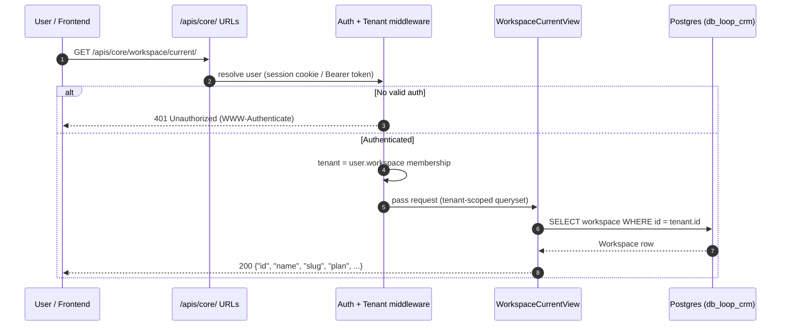
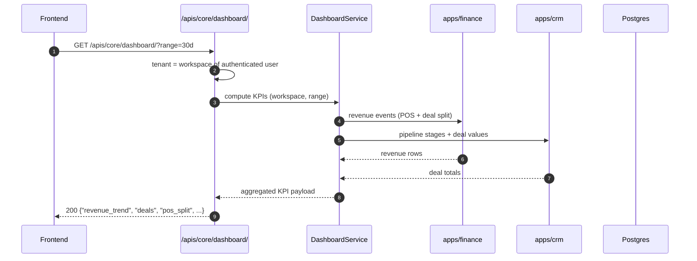
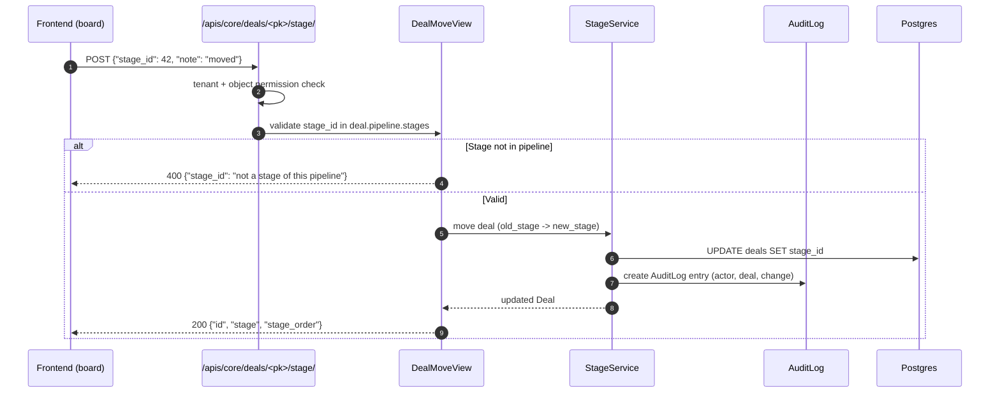
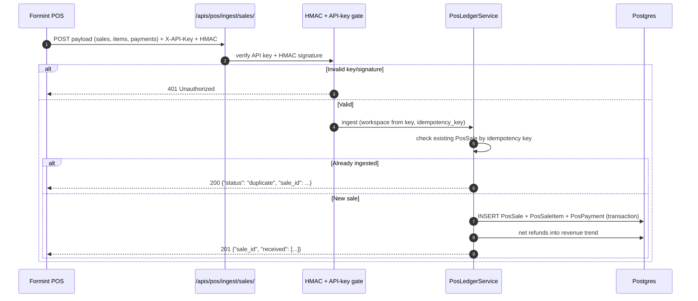
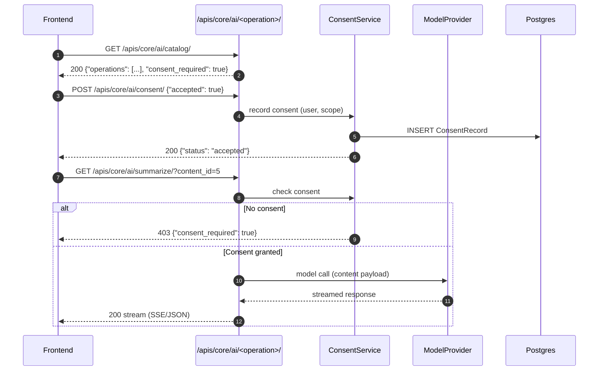
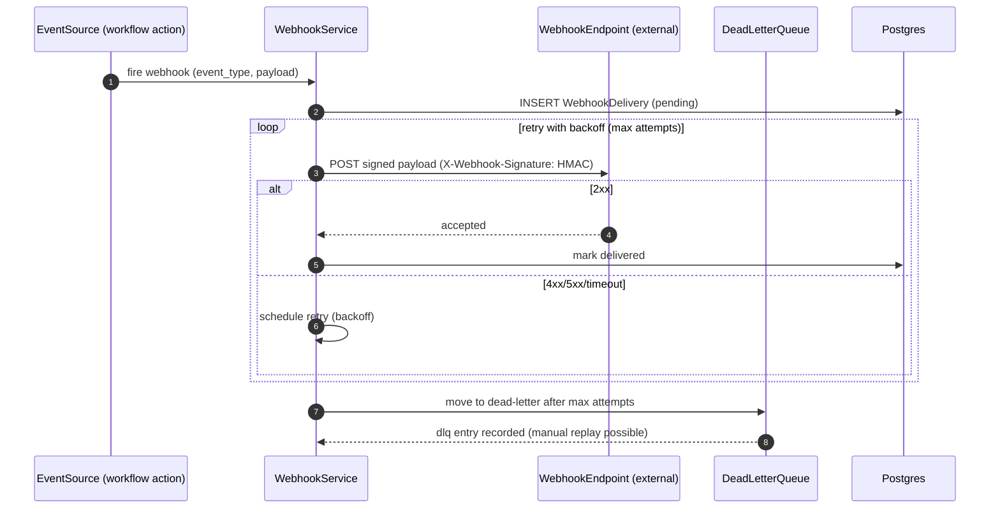

# 🔄 تدفقات طلبات Loop-CRM API — مخططات تسلسل UML

> **الغرض:** تحديد دورة حياة الطلب/الاستجابة لواجهة بيانات Loop-CRM
> (`/apis/core/`، `/apis/pos/`، `/apis/finance/`، `/apis/billing/`)،
> بما يشمل المصادقة وتحديد المستأجر ومسارات الأخطاء.
> **الحالة:** نشط · **المالك:** خلفية Loop-CRM

---

## 1. اكتشاف المساحة — `GET /apis/core/workspace/current/`

تحلّ جزيرة WebSocket وكل نداء مقصوص على مستأجر مساحة المستدعي أولاً. المصادقة
عبر كوكي الجلسة أو `Authorization: Bearer`؛ ويُستنبط المستأجر من عضوية
المستخدم المُصادَق عليه — لا من العميل أبداً.

**عقد الطلب**

| الحقل | القيمة |
|-------|-------|
| **الطريقة + المسار** | `GET /apis/core/workspace/current/` |
| **المصادقة** | كوكي الجلسة أو `Authorization: Bearer <token>` |
| **مصدر المستأجر** | مُستنبَط من الخادم من المستخدم المُصادَق عليه |
| **النجاح** | `200` — JSON للمساحة (id، name، slug، plan، settings) |
| **الفشل** | `401` غير مُصادَق · `403` بلا عضوية مساحة |
| **الترويسات** | `Accept: application/json` اختياري؛ ولا يثق أبداً بترويسات المستأجر من العميل |

---

## 2. مؤشرات اللوحة — `GET /apis/core/dashboard/`

مؤشرات RevOps: اتجاه الإيراد، وإجماليات خط الصفقات، وتقسيم POS + الصفقات.
يستخدم المساحة المقصوصة على المستأجر من الطلب 1.

---

## 3. نقل مرحلة الصفقة — `POST /apis/core/deals/<pk>/stage/`

السحب والإفلات في كانبان. يتحقق من أن المرحلة الهدف تنتمي إلى خط الصفقة ويسجّل
التغيير في سجل التدقيق.

---

## 4. إدخال مبيعات POS — `POST /apis/pos/ingest/sales/`

إدخال عديم الأثر (idempotent) من Formints POS. محميّ بـ `X-API-Key` (سرّ الخادم)
وحمولات موقّعة بـ HMAC؛ وتستخدم إعادات المحاولة مفتاح الأثر نفسه.

---

## 5. عملية ذكاء اصطناعي — `GET /apis/core/ai/<operation>/`

تتطلّب نقاط الذكاء الاصطناعي (الكتالوج، الموافقة، كل عملية) موافقة صريحة من
المستخدم. تُشغَّل بوابة الموافقة قبل أي نداء نموذج؛ وتتدفّق الاستجابات عندما
تدعم العملية ذلك.

---

## 6. تسليم Webhook — Webhooks صادرة من `apps/core`

تُوقَّع الـ Webhooks بـ HMAC وتُعاد محاولتها بتراجع أُسّي إلى طابور الرسائل
الميتة بعد بلوغ الحد الأقصى للمحاولات.

---

## خريطة النقاط

| المسار | النقطة | الطريقة | المصادقة | ملاحظات |
|------|----------|--------|------|-------|
| `/apis/core/` | `workspace/current/` | GET | session/bearer | اكتشاف المستأجر |
| `/apis/core/` | `dashboard/` | GET | session/bearer | مؤشرات RevOps |
| `/apis/core/` | `reports/` | GET | session/bearer | كتالوج التقارير |
| `/apis/core/` | `ai/` · `ai/consent/` · `ai/<op>/` | GET/POST | session/bearer + consent | بوابة الذكاء الاصطناعي |
| `/apis/core/` | `employees/` · `employees/<pk>/report/` | GET | session/bearer | سطح الموارد البشرية |
| `/apis/core/` | `search/` | GET | session/bearer | بحث شامل |
| `/apis/core/` | `badges/` | GET | session/bearer | عدّادات الشريط الجانبي |
| `/apis/core/` | `locale/` | GET | session/bearer | التدويل |
| `/apis/core/` | `board/` | GET | session/bearer | حمولة كانبان |
| `/apis/core/` | `deals/<pk>/stage/` | POST | session/bearer | نقل صفقة |
| `/apis/pos/` | `ingest/sales/` | POST | API key + HMAC | إدخال POS عديم الأثر |
| `/apis/billing/` | plan/account/seat surface | GET/POST | session/bearer | مسار الفوترة |

> تبقى نسخ `/api/v1/` القديمة قابلة للقراءة لكنها تحمل ترويسات
> `Deprecation/Sunset` عبر `APIV1DeprecationMiddleware` — وعلى المستدعين
> الجدد استخدام مسارات `/apis/*`.

<!-- AI-generated: review needed -->
