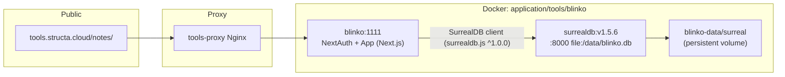
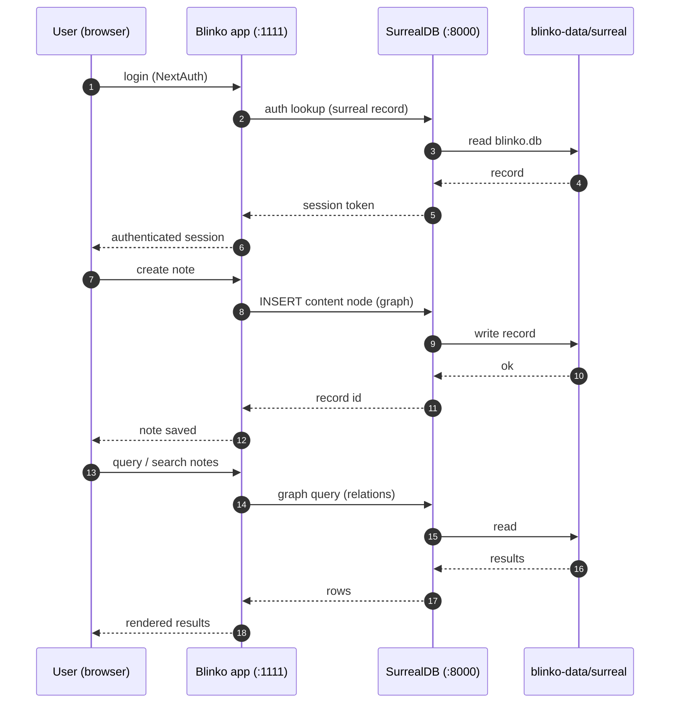

# 🗒️ Blinko — طوبولوجيا SurrealDB وتدفّق البيانات

> **الغرض:** توثيق خدمة ملاحظات Blinko بالذكاء الاصطناعي المستضافة ذاتياً
> (`application/tools/blinko/`) — طوبولوجيا الخدمة، وطبقة تخزين SurrealDB،
> وكيف تتدفّق المصادقة والمحتوى والاستعلامات عبرها.
> **الحالة:** نشط · **المالك:** البنية التحتية

---

## 1. طوبولوجيا الخدمة

## 2. تدفّق البيانات — المصادقة، مخطط المحتوى، الاستعلامات

## 3. ترحيل SurrealDB (M1–M4)

وفق ترويسة Compose، انتقل Blinko من Prisma + PostgreSQL إلى SurrealDB:

| الترحيل | ما تغيّر |
|-----------|--------------|
| **M1** | انتقلت المصادقة إلى سجلات SurrealDB |
| **M2** | انتقل مخطط المحتوى (ملاحظات، روابط، وسوم) إلى SurrealDB |
| **M3** | انتقل محرّك الاستعلامات إلى SurrealDB |
| **M4** | لم تعد PostgreSQL مطلوبة وقت التشغيل |

**قيود يجب مراعاتها:**
- **ثبّت SurrealDB على خط الإصدار 1.x** — إذ يثبّت الخادم المضمَّن
  `surrealdb.js@^1.0.0`، وهو يرفض محرّكات v2/v3
  (`UnsupportedVersion`).
- يستخدم `server/lib/scheduler.ts` دلالات upsert المتوافقة مع v1
  (`UPDATE ... MERGE` على معرّف سجل صريح).
- صورة `surrealdb` بلا صدفة (scratch) — لذا تعتمد الجاهزية على فحص
  `/surreal isready` المدمج في الملف التنفيذي، لا على `wget`/`curl`.
- تأتي بيانات الاعتماد من `.env` (`SURREALDB_PASS`، `BLINKO_NEXTAUTH_SECRET`، …).

## 4. ذو صلة

- Compose وMakefile: `application/tools/blinko/`
- سجل قواعد البيانات: `application/databases/README.md` (صف قاعدة `blinko`)
- البدء السريع في الوثائق: `docs/guides/01-quickstart.md` (خدمة Blinko Notes)

<!-- AI-generated: review needed -->
