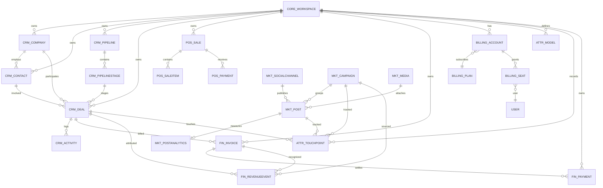

# 🐍 مخطط Django ERD — Loop-CRM

> **الغرض:** المخطط المعياري (ERD) لنماذج Django في Loop-CRM
> (`projects/loop-crm/backend/apps/`)، مع عرض نماذج كل تطبيق وعلاقاتها.
> مُولَّد من مصدر النماذج (مخرجات بنمط django-extensions).
> **الحالة:** نشط · **المالك:** خلفية Loop-CRM

---

## 1. المخطط المعروض

## 2. التطبيقات والنماذج والعلاقات

### `apps/core` — المساحة وعناصر المنصة الأولية

| النموذج | العلاقات الأساسية |
|-------|---------------|
| `Workspace` | المستأجر الجذر — كل نموذج نطاق يربط إليه بمفتاح أجنبي |
| `UserProfile` | 1—1 مع `auth.User` (حقول الملف الشخصي) |
| `AuditLog` | الفاعل + الهدف (عام) |
| `WorkflowDefinition` / `WorkflowRun` / `TaskExecution` | محرّك سير العمل |
| `SavedView`، `Webhook`، `WebhookDelivery` | الواجهة + Webhooks الصادرة |
| `EmailAccount`، `EmailMessage` | مزامنة البريد |

### `apps/crm` — نطاق CRM الأساسي

| النموذج | العلاقات الأساسية |
|-------|---------------|
| `Company` | `workspace`، `owner`(User) |
| `Contact` | `workspace`، `company`، `owner` |
| `Pipeline` | `workspace` |
| `PipelineStage` | `pipeline` |
| `Deal` | `workspace`، `company`، `contact`، `pipeline`، `stage`، `campaign`، `owner` |
| `Activity` | `workspace`، `deal`، `contact`، `created_by` |
| `CustomFieldDefinition`، `CustomObjectDefinition`، `CustomObjectRecord` | `workspace` (حقول/كائنات يعرّفها المستأجر + سجلاتها) |

### `apps/pages` — صفحات Wagtail للهبوط/البناء

| النموذج | العلاقات الأساسية |
|-------|---------------|
| `LandingPage` / `BuilderPage` | تدرّج صفحات Wagtail + مقاطع StreamField |
| `HomePage`، `PricingPage`، `FaqPage`، `LegalPage` (الخصوصية/الشروط) | مسار عام `/apis/pages/<slug>/` |

### `apps/pos` — دفتر POS

| النموذج | العلاقات الأساسية |
|-------|---------------|
| `PosSale` | `workspace`، `contact` |
| `PosSaleItem` | `pos_sale` |
| `PosPayment` | `pos_sale` |

### `apps/finance` — الفوترة والإيراد

| النموذج | العلاقات الأساسية |
|-------|---------------|
| `Invoice` | `workspace`، `company`(PROTECT)، `contact`، `deal`، `created_by` |
| `Payment` | `workspace`، `invoice`(PROTECT)، `created_by` |
| `RevenueEvent` | `workspace`، `deal`، `campaign`، `invoice` |

### `apps/billing` — فوترة SaaS

| النموذج | العلاقات الأساسية |
|-------|---------------|
| `Plan` | مستقل (Free/Pro/Enterprise) |
| `BillingAccount` | 1—1 مع `workspace`، `plan` |
| `Seat` | `workspace`، `user` |

### `apps/attribution` — الإسناد التسويقي

| النموذج | العلاقات الأساسية |
|-------|---------------|
| `AttributionModel` | `workspace` |
| `AttributionTouchpoint` | `workspace`، `deal`(CASCADE)، `post`، `campaign` |

### `apps/marketing` — النشر الاجتماعي

| النموذج | العلاقات الأساسية |
|-------|---------------|
| `SocialChannel` | `workspace` |
| `Campaign` | `workspace`، `owner` |
| `Media` | `workspace` |
| `Post` | `workspace`، `campaign`، `channel`، `media`، `created_by` |
| `PostAnalytics` | 1—1 مع `post` |

## 3. قاعدة عزل المستأجرين

كل نموذج نطاق يحمل مفتاحاً أجنبياً `workspace`؛ وكل قراءات الخدمات/الـ
queryset تُرشَّح حسب مساحة المستخدم المُصادَق عليه — وهي القاعدة نفسها التي
تفترضها مخططات تسلسل الـ API (`/apis/core/workspace/current/` هو نداء اكتشاف
المستأجر).

## 4. كيف أُنتج هذا

مصدران يصفان مخطط النماذج نفسه:

1. **كتلة mermaid أعلاه** هي الملخّص القابل للتحرير والعرض في أي مكان (المبيعات،
   التسويق، المالية، POS، الفوترة، الإسناد، النواة). وهي مصدر صورة SVG في
   `/agenda/diagrams/diagrams-django-loop-crm-er-1.svg`.
2. **`graph_models` من `django-extensions`** يُصدر المخطط الكامل المعياري من
   مصدر النماذج — شغّل `cd projects/loop-crm/backend && make erd` (PNG مدمج)
   أو `make erd-all` (PNG لكل تطبيق فريق: `crm.png` = المبيعات،
   `marketing.png` = التسويق، إضافة إلى attribution/finance/pos/billing/pages/
   core). تخرج الملفات في `projects/loop-crm/docs/erd/` (ملف README هو العقد
   المُلتزَم به؛ وملفات PNG أصول مشتقة مُتجاهَلة في git). تم التحقق في
   2026-09-06: تظهر نماذج كل تطبيق نطاق في المخطط المولَّد.

<!-- AI-generated: review needed -->
