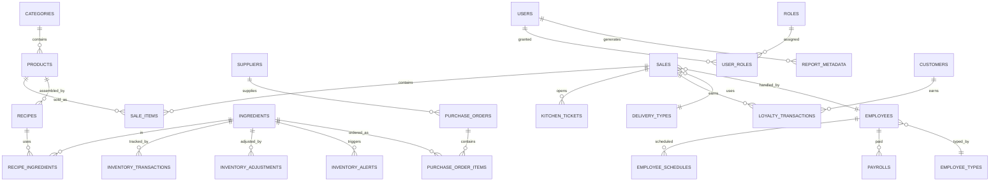

# 🦀 مخطط Rust SQLite ERD — Formint Community (Diesel)

> **الغرض:** توثيق قاعدة SQLite في Formint Community (`restaurant.db`)
> — كل جدول Diesel وعلاقاته، إضافة إلى خريطة وحدات Rust التي تملك كل جانب.
> **الحالة:** نشط · **المالك:** Formints (إصدار Community)

---

## 1. المخطط المعروض

## 2. الجداول والعلاقات

| الجدول | المفتاح الأساسي | العلاقات (FK ← الجدول) |
|-------|----|------------------------|
| `settings` | `id` | صف واحد (تكوين التطبيق) |
| `categories` | `id` | 1—N مع `products.category_id` |
| `products` | `id` | `category_id ← categories` · 1—N `sale_items` · 1—N `recipes` |
| `delivery_types` | `id` | N—1 مع `sales.delivery_type_id` |
| `employee_types` | `id` | N—1 مع `employees.employee_type_id` |
| `employees` | `id` | `employee_type_id ← employee_types` · 1—N `sales` · 1—N `employee_schedules` · 1—N `payrolls` |
| `sales` | `id` | `employee_id ← employees` · `delivery_type_id ← delivery_types` · 1—N `sale_items` · 1—N `kitchen_tickets` · 1—N `loyalty_transactions` |
| `sale_items` | `id` | `product_id ← products` (عبر مفتاح sale الأجنبي) |
| `ingredients` | `id` | 1—N `recipe_ingredients` · 1—N `inventory_transactions` · 1—N `inventory_adjustments` · 1—N `inventory_alerts` · 1—N `purchase_order_items` |
| `recipe_types` | `id` | N—1 مع `recipes.recipe_type_id` |
| `recipes` | `id` | `product_id ← products` · `recipe_type_id ← recipe_types` · 1—N `recipe_ingredients` |
| `recipe_ingredients` | `id` | `recipe_id ← recipes` · `ingredient_id ← ingredients` |
| `inventory_transactions` | `id` | `ingredient_id ← ingredients` |
| `inventory_adjustments` | `id` | `ingredient_id ← ingredients` |
| `inventory_alerts` | `id` | `ingredient_id ← ingredients` |
| `users` | `id` | 1—N `user_roles` · 1—N `report_metadata.generated_by` |
| `roles` | `id` | 1—N `user_roles.role_id` |
| `user_roles` | `id` | `user_id ← users` · `role_id ← roles` |
| `report_metadata` | `id` | `generated_by ← users` |
| `suppliers` | `id` | 1—N `purchase_orders.supplier_id` |
| `purchase_orders` | `id` | `supplier_id ← suppliers` · 1—N `purchase_order_items` |
| `purchase_order_items` | `id` | `purchase_order_id ← purchase_orders` · `ingredient_id ← ingredients` |
| `kitchen_tickets` | `id` | `sale_id ← sales` |
| `customers` | `id` | 1—N `loyalty_transactions.customer_id` |
| `loyalty_transactions` | `id` | `customer_id ← customers` · `sale_id ← sales` |
| `employee_schedules` | `id` | `employee_id ← employees` |
| `payrolls` | `id` | `employee_id ← employees` |

جداول إضافية بلا علاقات: `coupons`، `user_actions`،
`receipt_templates`، `support_messages`، `tax_reports`، `delivery_zones`،
`finance_transactions`، `budgets`، `badges`.

## 3. خريطة الوحدات (`src-tauri/src/`)

| الوحدة | تملك | الرموز الأساسية |
|--------|------|-------------|
| `main.rs` / `lib.rs` | تهيئة Tauri، تسجيل الأوامر | `invoke_handler` |
| `db/mod.rs` | فتح الاتصال، الترحيلات | `open_conn`، `run_migrations` |
| `db/schema.rs` | تعريفات جداول Diesel (مولَّدة + محرَّرة يدوياً) | كل كتل `table!` |
| `db/models.rs` | البنى + نماذج الإدراج/التحديث `New*`/`Update*` | `User`، `Product`، `Sale`، `SaleItem`، `Recipe`، `Ingredient`، `Employee`، … |
| `operations/` | عمليات النطاق لكل كيان | `sales.rs` (`add_sale`، `refund_sale`)، المخزون، الوصفات، الموظفون، الرواتب |
| `email.rs` | إرسال الإيصالات/الإشعارات عبر SMTP | `send_*` |
| `macros.rs` | وحدات ماكرو مشتركة | — |

> يشارك إصدار Standard هذه النواة نفسها (Diesel) (قدرات Community + تعدد
> العملات، والملفات الضريبية، والأدوار المخصّصة، والتصدير، وطابور المزامنة دون
> اتصال)؛ والمخطط أعلاه هو القاعدة المعيارية للإصدارين.

<!-- AI-generated: review needed -->
