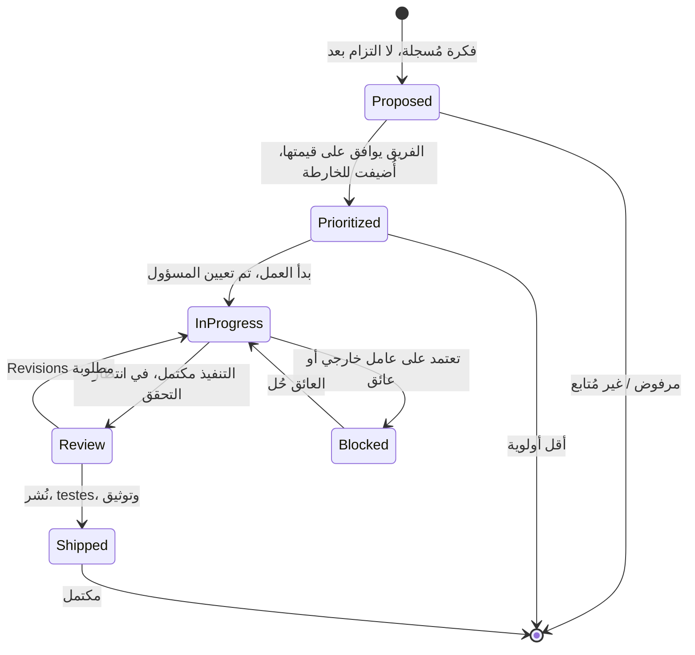

# 🎯 تتبع الميزات — دورة الحياة من الفكرة حتى الإطلاق

> **الغرض:** تتبع كل ميزة через دورة حياتها الكاملة: Proposed → Prioritized → In Progress → Review → Shipped. يتناغم مع خارطة الأولويات وسجل الخطط.
> **آخر تحديث:** 2026-08-31

---

## 🔄 دورة حياة حالة الميزة



### تعريفات الحالات

| الحالة | المعنى | إجراء المالك |
|--------|--------|--------------|
| **Proposed** | فكرة مُسجلة، لم تُتَعهد بعد | اكتب وصفًا قصيرًا + لماذا matter |
| **Prioritized** | الفريق وافق على القيام بها، على الخارطة | عيّن الأولوية (P0/P1/P2/P3)، النطاق التقريبي |
| **In Progress** | تنفيذ نشط | المسؤول، التقدير، السبرينت المستهدف |
| **Review** | التنفيذ انتهى، يحتاج تحقق | QA/اختبار، مراجعة التوثيق، توقيع أصحاب المصلحة |
| **Shipped** | نُشر وفُحص | حدّث الخارطة، اكتب دراسة حالة، أغلِق المهمة |
| **Blocked** | لا يمكن المضي بسبب عامل خارجي | وثّق العائق، المالك، حل بديل إن وُجد |

---

## 📝 قالب مدخلة الميزة

```markdown
### اسم الميزة

| الحقل | القيمة |
|-------|-------|
| **الحالة** | Proposed / Prioritized / In Progress / Review / Shipped / Blocked |
| **الأولوية** | P0 / P1 / P2 / P3 |
| **المنتج** | Precis / POS / Syntara / CTC / django-fusion / Infra |
| **المالك** | @فرد-الفريق |
| **الهدف** | سبرينت X / ربع سنة X / Backlog |
| **محظور بـ** | (إن وُجد) |
| **يعتمد على** | (إن وُجد) |

**لماذا matter:** جملة واحدة عن القيمة.

**النطاق:** ما هو مدرج في نسخة هذه الميزة.

**غير شامل:** ما هو مستبعد explicitly.

**معايير القبول:**
- [ ] معيار 1
- [ ] معيار 2
- [ ] معيار 3

**ملاحظات:** دروس، قرارات، روابط للخطط، مرجع دراسة الحالة.
```

---

## 🔄 الحفاظ على التناسق

1. **عند انتقال ميزة إلى Shipped:**
   - حدّث الحالة في هذا الملف
   - أضف مدخلة إلى `case-studies.md` مع مخطط mermaid
   - حدّث `features/feature-roadmap.md` جدول الأولويات
   - أنشئ أو حدّث مدخلة خطة في `plans/README.md`
   - علّم المهام ذات الصلة في `task-tracking.md` كمكتملة

2. **عند اقتراح ميزة جديدة:**
   - أضف مدخلة هنا مع الحالة `Proposed`
   - أضف إلى `features/feature-roadmap.md` تحت الأولوية المناسبة
   - ناقش في تخطيط السبرينت القادم

3. **عند تغيير الأولويات:**
   - حدّث كل من هذا الملف و `features/feature-roadmap.md`
   - سجّل السبب في `team-notes.md`

---

## Remarks & Notes

- قيم الحالة تكون lowercase في القالب لكن مُسبَقَة بـ emoji في الجداول للقراءة
- مواءمة الأولوية مع `feature-roadmap.md` إلزامي — الانحراف يسبب الارتباك
- "Shipped" تعني نُشرت AND فُحصت، ليس مجرد مُerge
- الميزات المحظورة يجب أن يكون لها عائق موثَّق ومالك في عمود الملاحظات

<!-- AI-generated: review needed -->
