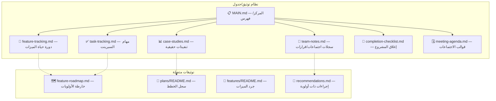
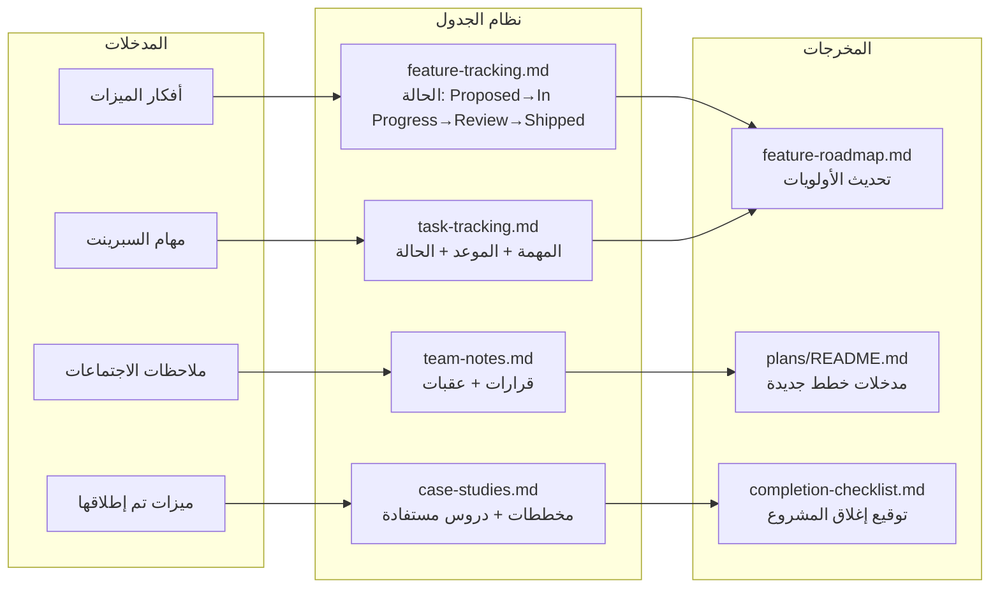
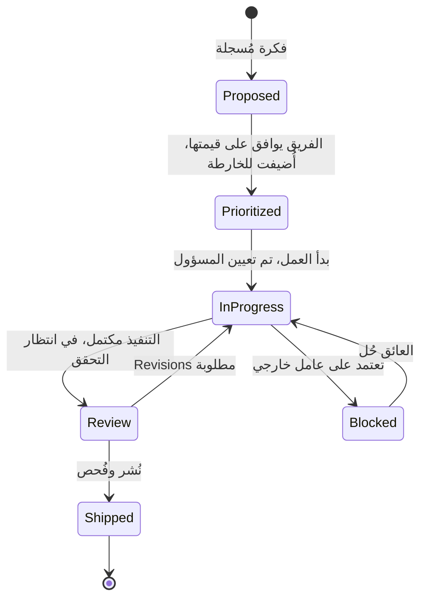

# 📋 جدول المشروع — تتبع الفريق، دراسات حالة وإتمام العمل

> **الغرض:** نظام جدول مشروع متكامل لتتبع الميزات، وتسجيل ملاحظات الفريق، وإدارة المهام، وتوثيق دراسات الحالة مع المخططات، ودفع المشاريع towards الإتمام عبر منتجات Structa Cloud.
> **تم الإنشاء:** 2026-08-31
> **الحالة:** نشط — مرجع عمل للفريق

---

## 🎯 ما يغطيه هذا النظام

يعتبر هذا الجدول مركز قيادة فريقك لـ:

| المجال | الغرض | الملف الرئيسي |
|--------|-------|---------------|
| **تتبع المشاريع** | تتبع الميزات من الفكرة حتى الإطلاق | [`feature-tracking.md`](./feature-tracking.md) |
| **دراسات الحالة** | توثيق تنفيذات حقيقية مع مخططات | [`case-studies.md`](./case-studies.md) |
| **المخططات** | مخططات العمارة، تدفق البيانات، ERD باستخدام mermaid | مضمن في دراسات الحالة والخطط |
| **ملاحظات الفريق** | ملاحظات الاجتماعات، القرارات، العقبات | [`team-notes.md`](./team-notes.md) |
| **إدارة المهام** | مهام السبرينت، قائمة تحقق الإتمام | [`task-tracking.md`](./task-tracking.md) |
| **إتمام المشروع** | تعريف "مكتمل"، قائمة تحقق الإغلاق | [`completion-checklist.md`](./completion-checklist.md) |
| **اجتماعات الجدول** | تخطيط السبرينت، المراجعة، ال	retrospective | [`meeting-agenda.md`](./meeting-agenda.md) |

---

## 🧭 كيفية استخدام هذا الجدول

```
عضو الفريق يحتاج إلى...
├── تتبع ميزة → feature-tracking.md
├── توثيق دراسة حالة → case-studies.md (إضافة مدخلة + مخطط mermaid)
├── إجراء اجتماع → meeting-agenda.md (اختيار القالب)
├── تسجيل ملاحظات الفريق → team-notes.md (مدخلة بتاريخ)
├── تتبع مهام السبرينت → task-tracking.md
└── إغلاق مشروع → completion-checklist.md
```

### البدء السريع

1. **ميزة جديدة؟** أضفها إلى `feature-tracking.md` مع الحالة `Proposed`
2. **تعمل على شيء؟** أنشئ مدخلة مهمة في `task-tracking.md`
3. **أنهيت شيئًا Worth ذكره؟** اكتب مدخلة دراسة حالة مع مخطط mermaid
4. **لديك اجتماع؟** انسخ القالب من `meeting-agenda.md`
5. **المشروع اكتمل؟** شغّل `completion-checklist.md`

---

## 🏗️ العمارة: كيف ترتبط التوثيقات





---

## 📊 دورة حياة تتبع الميزات

راجع [`feature-tracking.md`](./feature-tracking.md) للنظام الكامل.



---

## 📈 هيكل قالب دراسة الحالة

كل مدخلة دراسة حالة تشمل:

1. **السياق** — ما كان المشكلة/الموقف؟
2. **مخطط العمارة** — مخطط mermaid للحل
3. **التنفيذ** — ما بُني، القرارات الرئيسية
4. **النتائج** — مقاييس، نتائج، ما يعني
5. **الدروس** — ما كنت سيفعله بشكل مختلف

راجع [`case-studies.md`](./case-studies.md) للعينات والقالب الكامل.

---

## 🏁 قائمة تحقق إتمام المشروع

راجع [`completion-checklist.md`](./completion-checklist.md) للقائمة الكاملة.

**تعريف "مكتمل":**

- [ ] جميع الميزات في `feature-tracking.md` مُعَلَّمة بـ `Shipped`
- [ ] دراسة حالة مكتوبة مع مخطط عمارة
- [ ] سجل الخطط مُحدَّث (`plans/README.md`)
- [ ] خارطة ميزات مُحدَّثة (`features/feature-roadmap.md`)
- [ ] ملاحظات الفريق تسجل قرار الإتمام
- [ ] الاختبارات تجتاز، الفحص أخضر
- [ ] التوثيق مُ Validated (`npm run validate-content`)
- [ ] أصحاب المصلحة مُعرَّفون

---

## 🗓️ قوالب جدول الاجتماعات

راجع [`meeting-agenda.md`](./meeting-agenda.md) للقوالب الجاهزة للاستخدام:

| نوع الاجتماع | القالب | التكرار |
|-------------|--------|---------|
| **تخطيط السبرينت** | قالب تخطيط السبرينت | بداية كل سبرينت |
| **الاجتماع اليومي** | قالب الاجتماع اليومي | يوميًا |
| **مراجعة السبرينت** | قالب المراجعة | نهاية كل سبرينت |
| **ال	retrospective** | قالب ال	retrospective | نهاية كل سبرينت |
| **مراجعة الميزة** | قالب مراجعة الميزة | كل إتمام ميزة |
| **إغلاق المشروع** | قالب الإغلاق | كل إغلاق مشروع |

---

## 🔗 التوثيق المتصل

| الموضوع | المسار |
|---------|--------|
| خارطة ميزات (الأولويات) | [`features/feature-roadmap.md`](../features/feature-roadmap.md) |
| جرد الميزات | [`features/README.md`](../features/README.md) |
| سجل الخطط (الكانيكي) | [`plans/README.md`](../plans/README.md) |
| التوصيات (ترتيب العمل) | [`recommendations.md`](../recommendations.md) |
| نظرة عامة على العمارة | [`ARCHITECTURE.md`](../ARCHITECTURE.md) |
| دورة حياة التوثيق | [`plans/document-lifecycle.md`](../plans/document-lifecycle.md) |
| ادعاءات التسويق | [`plans/marketing-claims.md`](../plans/marketing-claims.md) |

---

## 🔄 الصيانة

- **المالك:** قادة workspace / المنتجات
- **تكرار المراجعة:** كل سبرينت + بوابات الإصدار الرئيسية
- **مُحفزات التحديث:** ميزة جديدة، ميزة منشورة، دراسة حالة مكتملة، مشروع مُغلق
- **سياسة الأرشيف:** اتبع `docs/plans/document-lifecycle.md`

---

## ملاحظات وإرشادات

- نظام الجدول هذا أداة **عمل**، ليس بديلاً عن سجل الخطط الكانيكي في `docs/plans/README.md`
- دراسات الحالة مع مخططات mermaid هي المخرجات الأكثر قيمة — استثمر فيها عندما تُنشَر الميزات
- يجب أن يعكس تتبع الميزات خارطة الأولويات؛ حافظ على تناسقهما
- ملاحظات الفريق هي ذكاء المشروع — اكتبها حتى عندما تسير الأمور بشكل جيد
- قائمة تحقق الإتمام هي البوابة بين "انتهينا من البرمجة" و"المشروع مُغلق"

<!-- AI-generated: review needed -->
