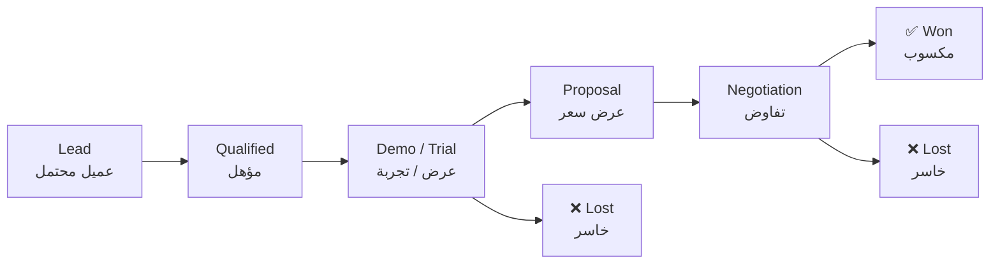

# 👥 خط البيع — العملاء المحتملون والصفقات

> **جدول العملاء المحتملين** في المخطط النجمي للأجندة. كل عميل محتمل كائن واحد
> هنا يتحرك في الخط من اليسار إلى اليمين. الأهداف تأتي من
> [`pricing-plans.md`](./pricing-plans.md)؛ وما يُسمح قولُه للعميل من
> [`marketing-plans.md`](./marketing-plans.md).
>
> **آخر تحديث:** 2026-09-10 · **الملكية:** المبيعات / المؤسس
> **ملاحظة الترجمة:** ترجمة عربية لملف `agenda/sales-pipeline.md` — المصدر
> الإنجليزي هو النسخة الرسمية عند أي تعارض.

---

## 1. مراحل خط البيع

ست مراحل؛ يقع العميل المحتمل في واحدة منها في أي لحظة. أعمدة الخروج تسجّل
النتيجة حتى تعلّمنا من الصفقات الخاسرة.

| المرحلة | المعنى | إجراء المالك |
|---|---|---|
| **عميل محتمل (Lead)** | تم التقاط جهة الاتصال، والاهتمام غير مؤكد | سجّل المصدر وأضف حاجة العميل في سطر واحد |
| **مؤهل (Qualified)** | الحاجة + الميزانية + التوقيت مؤكدة | حدّد موعد عرض أو أرسل نسخة تجربة |
| **عرض / تجربة (Demo / Trial)** | يرى المنتج | حدّد المتابعة قبل إغلاق المكالمة |
| **عرض سعر (Proposal)** | أُرسل السعر والنطاق | أكّد تاريخ قرار العميل |
| **تفاوض (Negotiation)** | الشروط تحت المناقشة | احصل على مسار التوقيع كتابياً |
| **✅ مكسوب (Won)** | وُقّع العقد وأُنشئ الحساب | أضف مهمة استيعاب إلى [`task-tracking.md`](./task-tracking.md) |
| **❌ خاسر (Lost)** | رفض / لا قرار | سجّل السبب — دائماً |

---

## 2. الأهداف (12 شهراً، من خطط التسعير)

يقاس خط البيع بهذه الأرقام فقط: **القياسي 60، الاحترافي 30، السحابي 5** عملاء
خلال 12 شهراً. خطط Precis وLoop-CRM تنتظر بوابات إطلاقها قبل البيع النشط.

| المنتج / الإصدار | الحسابات المستهدفة | الحالي في الخط | الفجوة |
|---|---:|---:|---:|
| Formint القياسي | 60 | 0 | 60 |
| Formint الاحترافي | 30 | 3 (تجربة) | 27 |
| Formint السحابي | 5 | 0 | 5 |
| Precis نظام التعلّم — Instructor Pro | — (بانتظار بوابات الإطلاق) | 0 | — |
| Loop-CRM | — (معقول على النشر) | 0 | — |

---

## 3. خط البيع النشط

بُذرت هذه الصفوف في 2026-09-10 من نشاط مسجَّل مسبقاً في الأجندة (التجربة،
وقائمة السوق، وعملاء صفحة الهبوط). حدّث في المكان؛ **لا تحذف عميلاً أبداً** —
انقله إلى § 4.

| العميل المحتمل | المنتج / الإصدار | المرحلة | المصدر | المالك | الخطوة التالية | منذ |
|---|---|---|---|---|---|---|
| مطعم تجربة 1 (العمل دون اتصال) | Formint الاحترافي | عرض / تجربة | تجربة (3 مطاعم) | TBD | تحويل التجربة → مدفوع عند الإطلاق (2026-Q4) | 2026-09 |
| مطعم تجربة 2 (العمل دون اتصال) | Formint الاحترافي | عرض / تجربة | تجربة (3 مطاعم) | TBD | تحويل التجربة → مدفوع عند الإطلاق (2026-Q4) | 2026-09 |
| مطعم تجربة 3 (العمل دون اتصال) | Formint الاحترافي | عرض / تجربة | تجربة (3 مطاعم) | TBD | تحويل التجربة → مدفوع عند الإطلاق (2026-Q4) | 2026-09 |
| متصفحو ThemeForest | Formint القياسي | عميل محتمل | قائمة السوق | TBD | نشر القائمة والتقاط الاستفسارات | Q4 2026 |
| زوار Precis Landing | Precis نظام التعلّم | عميل محتمل | التقاط عملاء صفحة الهبوط | TBD | تعزيز حتى فتح التسجيل | مستمر |

> مطاعم التجربة الثلاثة هي **أثمن أصل في خط البيع** — تتحول إلى أولى حسابات
> الاحترافي المدفوعة وتنتج الدليل الذي يفتح ادعاء «العمل دون اتصال أولاً».

---

## 4. سجل المكسوب والخاسر

لا شيء مكسوب أو خاسر بعد — اللوحة حديثة. كل مدخل مستقبلي هنا يجب أن يحمل
**سبب** (سعر، توقيت، منافس، لا قرار)؛ الأسباب هي المادة الخام لإصلاح التسعير
والتموضع.

| التاريخ | العميل المحتمل | المنتج | النتيجة | السبب |
|---|---|---|---|---|
| — | — | — | — | — |

---

## 5. مصادر العملاء المحتملين وخطوات التوليد

من أين يأتي العملاء المحتملون، والخطوة التالية لفتح كل مصدر. **المصدر بلا
مسار التقاط حقيقي أمنية لا قناة.**

| المصدر | يغذّي | الحالة الحالية | الخطوة التالية |
|---|---|---|---|
| تجارب المطاعم (3) | الاحترافي | جارٍ | عرض تحويل عند بوابة الإطلاق |
| قائمة ThemeForest | القياسي | غير منشورة | نشر القائمة + قمع الدعم |
| التقاط عملاء Precis Landing | نظام التعلّم | حيّ | سلسلة تعزيز بعد فتح التسجيل |
| عرض `crm.structa.cloud` | Loop-CRM | جاهز للعرض، معقول على النشر | تواصل عرضي بعد النشر |
| GitHub / المجتمع (Formint المجتمعي) | ترقية للقياسي | حيّ | إضافة مسار «ترقية» في README |
| منتديات المطاعم / مجموعات مشغّلي MENA | كل Formint | غير مستغل | محتوى عربي أولاً وفق الخطط التسويقية |

---

## 6. الإيقاع الأسبوعي

تستغرق مراجعة خط البيع **15 دقيقة**: حدّث المراحل، وحدّث جدول فجوة الأهداف،
واختر الخطوة التالية الواحدة لكل صفقة مفتوحة، وسجّل أي قرار في
[`team-notes.md`](./team-notes.md).

1. تغيّر المراحل → انقل الصفوف، لا تكرّرها
2. جدول الفجوة → أعد حساب «الحالي في الخط»
3. خطوة تالية واحدة لكل صفقة مفتوحة، مع تاريخ
4. الصفقات الخاسرة → § 4 مع السبب

---

## ملاحظات وترقيمات

- عميل محتمل واحد = صف واحد؛ خط البيع **جدول حقائق لا مذكرات** — أبقِ المدخلات
  موجزة
- كل عميل يحمل مالكاً وخطوة تالية بتاريخ؛ وإلا فهو ليس في خط البيع بل في قائمة
  أمنيات
- أهداف التحويل ترجع دائماً إلى [`pricing-plans.md`](./pricing-plans.md) — لا
  تخترع أرقاماً هنا
- عندما تُغلق بوابات إطلاق Formint الاحترافي (في الخطط التسويقية)، تصبح صفوف
  المطاعم الثلاثة أول مدخلات ✅ مكسوب

<!-- AI-generated: review needed -->
