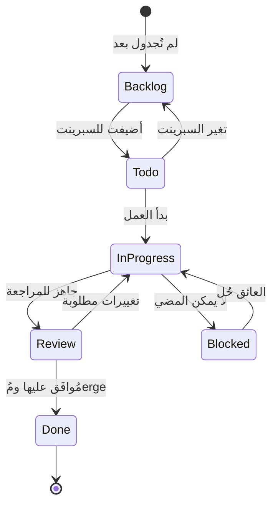

# ✅ تتبع المهام — مهام السبرينت، التعيينات والإتمام

> **الغرض:** تتبع المهام الفردية عبر السبرينت أو المشروع — المسؤول، الحالة، الموعد النهائي، والإتمام. المهام ترتبط بالميزات في `feature-tracking.md` وتغذي جداول الاجتماعات.
> **آخر تحديث:** 2026-08-31

---

## 🔄 دورة حياة حالة المهمة



### تعريفات الحالات

| الحالة | المعنى | الإجراء التالي النموذجي |
|--------|-------|--------------------------|
| **Backlog** | لم تُجدول لأي سبرينت بعد | انتظر تخطيط السبرينت |
| **Todo** | في السبرينت الحالي، لم يبدأ | خذها عندما يسمح السعة |
| **In Progress** | يتم العمل عليها نشطًا | حدّث التقدم، سجّل العقبات |
| **Review** | التنفيذ انتهى، يحتاج مراجعة | اطلب مراجعة، تعامل مع التغذية |
| **Done** | مُerge، testes، وفُحص | أغلِق المهمة، حدّث حالة الميزة |
| **Blocked** | لا يمكن المضي بسبب عامل خارجي | وثّق العائق، قم بالتصعيد إن لزم |

---

## 📝 قالب مدخلة المهمة

```markdown
### [عنوان المهمة القصير]

| الحقل | القيمة |
|-------|-------|
| **الحالة** | Backlog / Todo / In Progress / Review / Done / Blocked |
| **المسؤول** | @فرد-الفريق |
| **السبرينت** | سبرينت X (التواريخ) |
| **الموعد** | YYYY-MM-DD (إن وُجد) |
| **الأولوية** | P0 / P1 / P2 / P3 |
| **الميزة** | رابط لمدخلة feature-tracking.md (إن وُجد) |
| **التقدير** | حجم T-shirt (S/M/L/XL) أو نقاط قصة |
| **محظور بـ** | (إن وُجد) |

**الوصف:** ما يحتاج إلى أن يُفعل.

**معايير القبول:**
- [ ] معيار 1
- [ ] معيار 2

**ملاحظات:** تحديثات التقدم، قرارات، روابط.
```

---

## ✍️ إضافة ملاحظات جديدة

عندما يكون لديك اجتماع أو تتخذ قرارًا مهمًا:

1. **انسخ قالب المدخلة** أعلاه
2. **أَثْنِ التاريخ** بتاريخ الاجتماع
3. **صنّف** — نوع الاجتماع (تخطيط سبرينت، اجتماع يومي، مراجعة، retrospective، قرار، حادثة)
4. **اربط خارجيًا** — رجّع الميزة أو المهمة أو الخطة ذات الصلة
5. **سجّل عناصر العمل** مع المسؤولين والمواعيد النهائية
6. **سجّل العقبات** مع المالكين

---

## 🔍 البحث في الملاحظات

| تبحث عنه | تبحث في |
|----------|----------|
| قرار حول ميزة X | `rg "اسم الميزة" docs/agenda/team-notes.md` |
| من تم تعيينه مهمة Y | `rg "عنوان المهمة" docs/agenda/team-notes.md` |
| متى رُفع عائق | `rg "Blocked" docs/agenda/team-notes.md` |
| ما الذي تمَّ قراره في السبرينت N | `rg "سبرينت N" docs/agenda/team-notes.md` |

---

## 🔗 ذات الصلة

| الموضوع | المسار |
|---------|--------|
| جدول الاجتماعات (قوالب) | [./meeting-agenda.md](./meeting-agenda.md) |
| تتبع الميزات (القرارات تؤثر الميزات) | [./feature-tracking.md](./feature-tracking.md) |
| تتبع المهام (القرارات تؤثر المهام) | [./task-tracking.md](./task-tracking.md) |
| سجل الخطط (القرارات الكبيرة تصبح خطط) | [`../plans/README.md`](../../plans/README.md) |

---

## 🔄 الصيانة

- **أضف ملاحظات بعد:** كل اجتماع، كل قرار مهم، كل حادثة
- **حدّث الملاحظات عندما:** عناصر العمل تُكمل، العقبات تُحل، القرارات تتغير
- **رَجِّع في PRs:** ربط بالملاحظة ذات الصلة عندما PR ينفذ قرارًا
- **أرشيف ملاحظات قديمة:** عندما يُغَلَّق مشروع، انقل الملاحظات لقسم أرشيف أو ملف

---

## ملاحظات وإرشادات

- ملاحظات الفريق ليست بديلًا للخطط التفصيلية — هي سجل القرارات
- إذا قرار يؤثر ملفات multiple، اكتبها هنا AND حدّث خطة
- عناصر العمل بدون مالكين ومواعيد نهائية هي مجرد أمنيات — assignها دائمًا
- قالب الملاحظة خفيف نيابة عنه — لا تبالغ في هندسته

<!-- AI-generated: review needed -->
