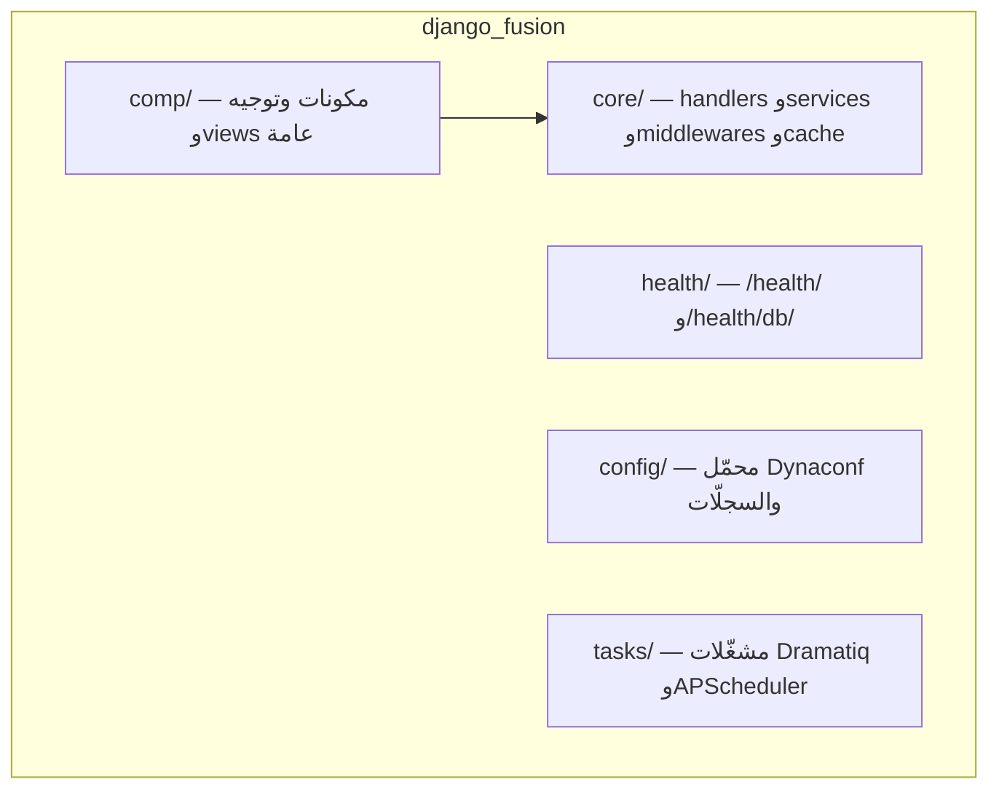

# 🧩 django-fusion — `libs/django-fusion/`

> **مستوى التخصيص:** 🔴 غير قابل للتخصيص — استخدم واجهته العامة ولا تعدّل داخلياته.

django-fusion هي مكتبة Django + Wagtail المشتركة التي تُبنى عليها كل منتجات
Structa Cloud: **نظام مكونات (``)**، **توجيه صريح (Viewset)**،
**مزيجات النماذج والجداول**، **مصادقة allauth**، **تكامل Wagtail**،
**فحوصات الصحة**، و**إعدادات Dynaconf**.

## 🗺️ أين وكيف تُستخدم

| المشروع | المسار | الاستخدام |
|---------|--------|-----------|
| 🎓 Precis (الرئيسي) | `projects/structa.cloud/backend/` | المستهلك المرجعي: المكونات والـ viewsets والشظايا |
| 🏥 CTC Research | `projects/precis/precis-ctc/backend/` | أكبر مستهلك (194 ملفاً): الصحة والجدولة والإعدادات |
| 🤝 Loop-CRM | `projects/loop-crm/backend/` | الصفحات وأوامر البذر (`seed_demo`, `seed_pages`) |
| 🤖 Syntara | `projects/syntara/` | سجلّات `django_fusion.config.loader` |
| 💳 Formint Pro | `projects/formints/formint-pro/server/` | Ninja API + viewsets |
| ☁️ Formint Cloud | `projects/formints/formint-cloud/backend/` | إدارة Unfold + عقد fusion |
| 💻 Formint client | `projects/formints/formint-client/backend/` | تطبيق الشراء |

## 🏗️ خريطة الحزمة



## الاستيراد الأساسي

```python
from django_fusion.comp.routes import (
    Site, Application, Viewset, ModelViewset,
    RoutableComponent, FragmentComponent,
)
from django_fusion.comp.generic import ListModelView, TableView, Action
from django_fusion.core.handlers import PageHandler
```

## 📚 وثائق الحزمة الكاملة (DF-0NN)

وثائق الحزمة الكاملة موجودة في [`libs/django-fusion/docs/`](../../../libs/django-fusion/docs/INDEX.md)
بمعرّفات مستقرة `DF-0NN` — ابدأ من [دليل الحزمة](../../../libs/django-fusion/docs/00-package-guide.md)
ثم [البدء السريع DF-001](../../../libs/django-fusion/docs/01-getting-started.md).

## Remarks & Notes

- استورد الرمز الحقيقي من الوحدة المالكة له — لا shims ولا إعادة تصدير.
- النسخة الإنجليزية الكاملة: [`/docs/en/libs/django-fusion`](/docs/en/libs/django-fusion).
- تغييرات الإطار تنتمي إلى `libs/django-fusion/`، وليس إلى كود المنتجات.
