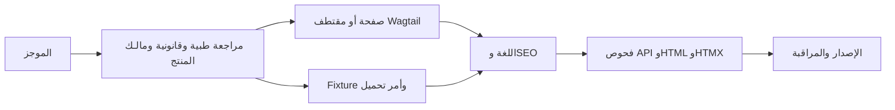

# 📝 CTC Research — سير النشر وملاحظات الإنتاج

> **المشروع canonical:** `projects/precis/precis-ctc/`  
> **الموقع العام:** `ctc-research.com`  
> **ينطبق على:** المقالات والمنشورات والدورات وصفحات Wagtail والترجمات والإصدارات.

<!-- AI-generated: review needed -->

## 🧭 مبدأ التشغيل

النشر في CTC عملية محتوى منضبطة، وليس مجرد نسخ ولصق. يأتي الموجز من
[استراتيجية المحتوى](/docs/en/precis-ctc/content-strategy)، ويحافظ الإصدار على
مصدر Wagtail، وعقود HTML وواجهة البيانات وHTMX، وتكافؤ اللغات، والمراجعة الطبية.

يوجد مساران للمحتوى لكن انضباط إصدار واحد:



لا يعد المحتوى منشوراً لمجرد حفظه؛ بل بعد اجتياز المحتوى والترجمة والبيانات
الوصفية والمسارات والاستجابات العامة للفحوص المطلوبة.

## 👥 الأدوار والمسؤوليات

| الدور | المسؤولية | لا يمكنه تجاوز |
|---|---|---|
| منتج المحتوى | الموجز والمسودة والمصادر والروابط والدعوة | المراجعة الطبية أو القانونية |
| مراجع الموضوع الطبي | الدقة الطبية والمنهجية والمخاطر | التحقق التقني |
| المراجع القانوني والخصوصية | الأخلاقيات والخصوصية والحقوق | فحوص الإصدار |
| المراجع اللغوي | المعنى والمصطلحات ووضوح RTL | الدقة الطبية |
| محرر الموقع | إدخال Wagtail والبيانات الوصفية وحالة النشر | الموافقات المطلوبة |
| مسؤول الإصدار | تحميل Fixtures وفحوص smoke والتراجع | الموافقات الناقصة |

يجب تعيين شخص محدد لكل دور في الموجز. عبارة «راجعه الفريق» ليست سجلاً قابلاً
للتدقيق.

## 📨 1. الاستقبال والموجز

يجب أن يتضمن الموجز قبل الكتابة:

- العنوان والمسار أو slug والصيغة واللغة المستهدفة؛
- ICP التحريري الأساسي، والمهمة، ونية البحث، والخلاصة؛
- سطح المنتج والدعوة الأساسية؛
- قائمة المصادر وملاحظات الحقوق؛
- مستوى المخاطر: عادي أو طبي/منهجي أو قانوني/خصوصية أو خاص بالعميل؛
- هدف Wagtail أو Fixture؛
- أسماء المراجعين ومواعيدهم؛
- فحوص القبول ومسؤول التراجع.

أعد الموجز إذا كان الجمهور أو المصدر أو المسار أو المالك غير واضح.

## ✍️ 2. المسودة وفحص الأدلة

اتبع قواعد المحتوى الطبي في
`projects/precis/docs/precis-ctc/CONTENTS.md`:

1. ابدأ بسؤال البحث والسكان والمنهج والدليل والنتيجة عند الحاجة.
2. ضع مصدراً لكل ادعاء واقعي، أو عرّفه كتفسير أو رأي.
3. لا تخترع إحصاءات أو نتائج تجارب أو موافقات أو شهادات.
4. ميّز المادة التعليمية ولا توحِ بأنها نصيحة سريرية فردية.
5. حافظ على توافق الدعوة الأساسية مع الموجز.

### قائمة القبول التحريري

- [ ] الجمهور والمهمة والخلاصة والدعوة محددة.
- [ ] المصادر موثقة وحديثة بما يكفي وآمنة من ناحية الحقوق.
- [ ] العنوان والوصف يطابقان المحتوى الحقيقي.
- [ ] الروابط الداخلية تصل بين الركيزة والدورة/المنشور والخطوة التالية.
- [ ] الصور لها حالة حقوق ونص بديل مفيد وتعليق مناسب.
- [ ] لا يوجد محتوى طبي غير مدعوم أو معلومات تعريفية عن المرضى.

## ✅ 3. بوابات المراجعة الحاجبة

| البوابة | متى تلزم | دليل الاكتمال |
|---|---|---|
| **طبية** | أي ادعاء سريري أو بحثي أو صحي أو نتيجة | مراجع وتاريخ وتعليقات مغلقة |
| **قانونية وخصوصية** | الأخلاقيات والحقوق والشهادات والادعاءات المنظمة | سجل المراجع والمصدر/الحقوق |
| **مالك CTC** | التموضع والتسعير والخدمات ودراسة الحالة | موافقة المالك في الموجز |
| **لغوية** | أي نسخة عامة غير إنجليزية | موافقة مراجع اللغة |
| **تقنية** | كل صفحة أو Fixture أو مسار أو قالب | نتيجة الفحص وسجل smoke |

إذا تخطيت بوابة مطلوبة، اترك المحتوى في المسودة وسجّل السبب.

## 🗃️ 4. اختيار مصدر الحقيقة

| المسار | مصدر الحقيقة | سطح التحرير | الاستخدام |
|---|---|---|---|
| صفحات Wagtail | شجرة صفحات Wagtail المترجمة | لوحة `/admin/` | الصفحات المؤسسية والهبوط |
| مقتطفات Wagtail | نماذج المقتطفات المسجلة | لوحة Wagtail | Publication وPublicationCategory |
| Fixtures | `backend/assets/fixtures/*.json` | Fixture مراجع وأمر تحميل | الدورات والمناهج والمنشورات |
| الترجمات | ملفات `django.po` | makemessages ثم compilemessages | نصوص الواجهة والمحتوى المشترك |
| القوالب والكود | شجرة مصدر المنتج | Pull request وفحوص | السلوك والواجهات والمسارات |

لا تعدّل الحزم المولدة أو static المجمعة أو `content/` أو media التشغيلية كمصادر
مؤلفة.

## 🌐 5. الترجمة وSEO

لكل لغة:

1. تحقق من وجود الصفحة أو السجل في شجرة اللغة ومن حل الـ slug.
2. راجع المصطلحات الطبية في المسرد المعتمد.
3. راجع اتجاه RTL والفواصل والأرقام ودعوات الإجراء في الصفحة المرسومة.
4. اضبط `seo_title` و`search_description` في Wagtail.
5. تحقق من الرابط canonical واللغات البديلة والصورة الاجتماعية والنص البديل.
6. شغّل compilemessages بعد تعديل ملفات PO وتأكد من حداثة MO.

المجلدات الحالية للكتالوج:

```text
projects/precis/precis-ctc/assets/locale/{en,sv,fr,de,es,ar,pt_BR}/LC_MESSAGES/django.po
```

وجود سجل في الكتالوج لا يثبت أن محتوى الدورة أو المنشور راجعه محرر.

## 🚀 6. إجراء الإصدار

### صفحة أو مقتطف Wagtail

1. أدخل المحتوى المترجم في Wagtail.
2. احفظه كمسودة، ثم نفّذ البوابات وانشره أو جدولته.
3. تحقق من API واستجابة HTML وHTMX.
4. تحقق من SEO والدعوة الأساسية لكل لغة.
5. سجّل الرابط والمحرر ووقت النشر ونتيجة الفحص.

### دورة أو منهج أو منشور قائم على Fixture

1. عدّل Fixture المصدري في مسار backend الصحيح.
2. شغّل أمر الإدارة في بيئة محلية أو staging آمنة.
3. تحقق من المعرفات والسجلات المترجمة والترتيب وحالة النشر.
4. نفّذ فحوص API والمسارات قبل التحميل في الإنتاج.
5. لا تستخدم `--replace` على قاعدة مشتركة أو إنتاجية دون موافقة صريحة.

### تغيير كود أو قالب

```bash
cd projects/precis/precis-ctc
make check
make frontend-check

cd projects
make check WEBSITE=precis-ctc
```

راجع [خطة نشر CTC](/docs/en/plans/repository/ctc-research-publish-2026-08-18)
لترتيب الإصدار الحالي.

## 🔍 7. التحقق بعد الإصدار

تحقق من بيئة محلية أو staging معتمدة؛ لا يكفي نجاح طريق واحد:

```bash
curl -sS 'http://localhost:5070/apis/research/publications/?lang=en&q=cohort&limit=10'
curl -sS http://localhost:5070/apis/pages/about/
curl -sS http://localhost:5070/fragment/pages/about/
curl -sS http://localhost:5070/apis/openapi.json
```

تحقق من العنوان والمحتوى واللغة وSEO والدعوة والروابط canonical والتبديل اللغوي
والصور، ومن عدم وجود أقسام Wagtail فارغة أو نصوص fallback في Astro.

## ↩️ 8. التراجع وملاحظات الحوادث

1. ألغِ نشر صفحة أو مقتطف Wagtail أو أعده إلى آخر نسخة معتمدة.
2. بالنسبة للـ Fixtures، أعد النسخة السابقة واتبع إجراء التحميل الآمن المعتمد.
3. إذا كان الخلل في الكود أو الأصول، استخدم آخر إصدار سليم واحتفظ بالسجلات.
4. أعد فحوص API وHTML وHTMX واللغة وSEO.
5. سجّل الرابط واللغة والسبب والمراجع والإجراء التصحيحي.

صعّد مشكلات الطب والخصوصية والحقوق ومعلومات العميل فوراً، ولا تصلح النص العام
بصمت.

## ملاحظات وإرشادات

- عقود HTML وواجهة البيانات وHTMX منفصلة؛ لا تستبدل Fragment مرسوماً بـ JSON ولا
  تضف fallback في الواجهة لإخفاء بيانات Wagtail الناقصة.
- `backend/assets/fixtures/dump-data.json` هو مصدر تحميل backend المعتمد.
- الحزم المولدة وstatic المجمعة وmedia التشغيلية والمحتوى المؤلف أصناف مختلفة.
- كل ادعاء طبي أو قانوني أو بحثي أو متعلق بحقوق الصور أو العميل يحتاج إلى موافقة
  مناسبة؛ هذا الدليل يشرح آلية الإصدار ولا يثبت الصلاحية السريرية.
