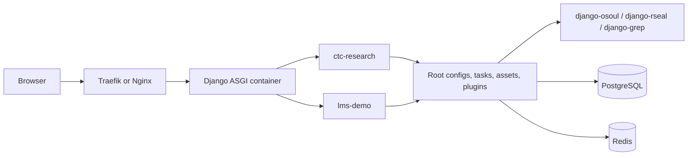

# Architecture Overview

This repository uses a **multi-site, thin-layer architecture**. Each site directory contains its own Django/Wagtail project surface, while shared infrastructure lives at the repository root.

## Core architecture documents

- [Unique Architecture](unique_architecture.md): what makes the project different, including multi-site selection, thin-layer delegation, shared assets, and stability boundaries.
- [Project Structure](project_structure.md): current root, site, Docker, and shared tooling layout.
- [Configuration System](configuration.md): YAML/settings/environment loading concepts.
- [Request & Render Flow](request_flow.md): how requests move through proxy, ASGI, Django, templates, and HTMX.
- [Templates & HTMX](templates_flow.md): centralized template and fragment patterns.
- [Shared Background Tasks](shared_tasks.md): shared Celery/task design.

## High-level system

## Stability principles

1. **Deploy one site explicitly** by setting `PROJECT_PATH` and `DJANGO_SITE` to `ctc-research` or `lms-demo`.
2. **Keep reusable behavior out of site glue** by delegating business logic to shared packages and plugins.
3. **Validate before traffic** with Django checks, migrations, static collection, compose config validation, and `scripts/verify_runtime.py`.
4. **Keep Docker paths real**: Docker and uv workspace configuration must reference directories that exist in this checkout.
