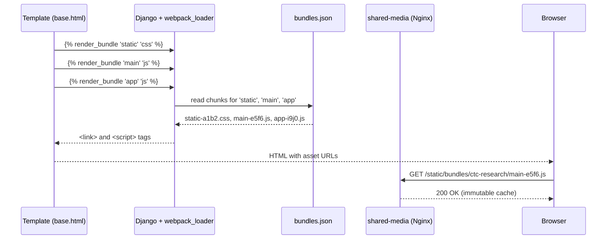
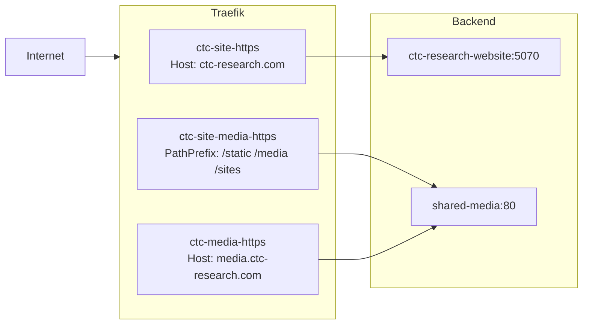
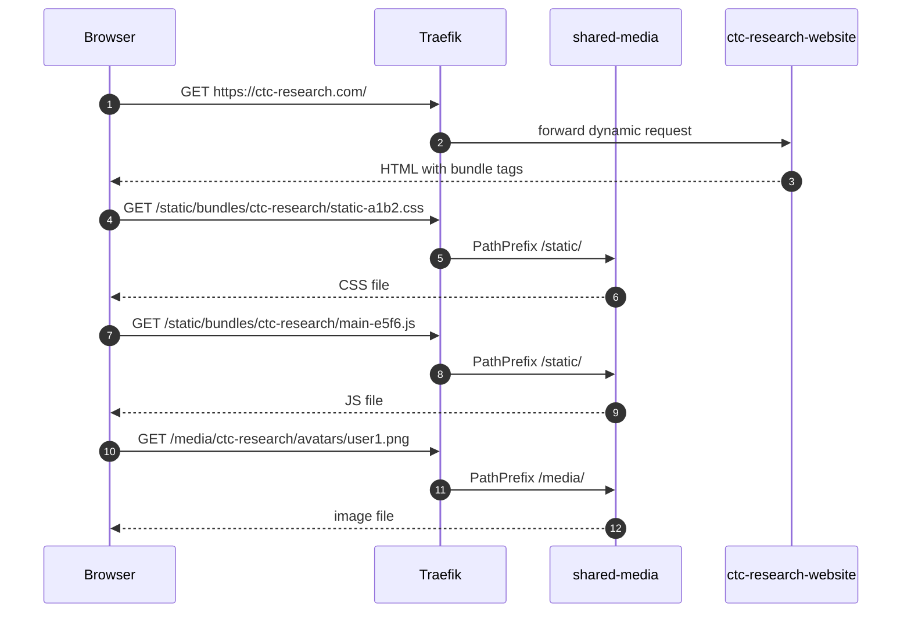
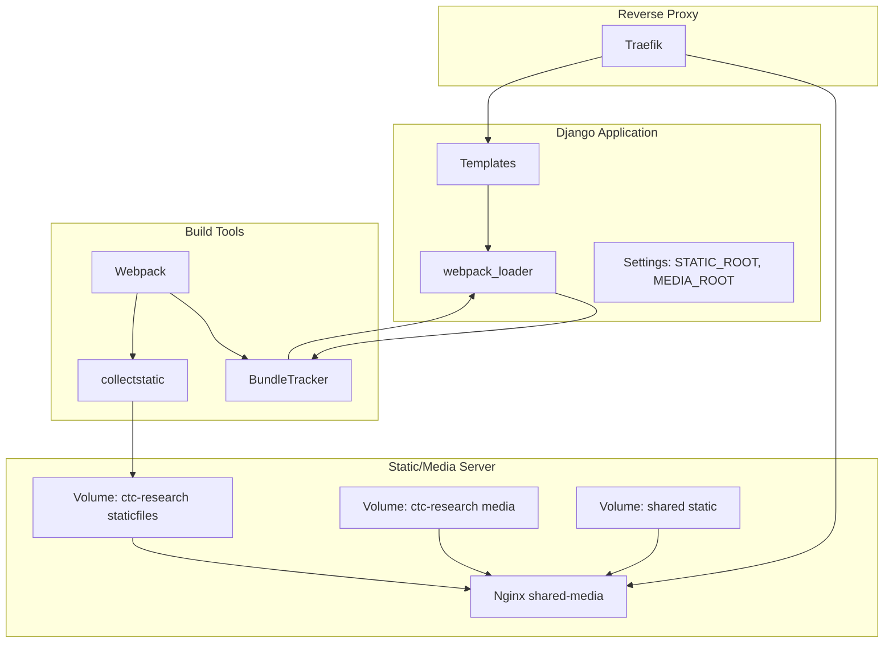

# CTC Research — Asset & Media Architecture

> Visual reference for how `ctc-research.com` frontend assets, static files, and media files flow from source code to the browser.

**Date:** 2026-07-12  
**Status:** Current  
**Companion guide:** [`GUIDE.md`](./GUIDE.md)

---

## 1. High-Level Asset Flow

```mermaid
flowchart LR
    subgraph Source
        A1[Django Templates]
        A2[SCSS / JS Sources]
    end

    subgraph Build
        B1[Webpack]
        B2[bundles.json]
        B3[collectstatic]
    end

    subgraph Serve
        C1[Traefik]
        C2[shared-media Nginx]
        C3[Django App]
    end

    subgraph Browser
        D1[HTML / CSS / JS]
    end

    A1 -->|| B2
    A2 -->|import| B1
    B1 -->|hashed chunks| B2
    B2 -->|manifest| A1
    B1 --> B3
    B3 -->|staticfiles/| C2
    C1 -->|/static /media /sites| C2
    C1 -->|dynamic pages| C3
    C2 --> D1
    C3 --> D1
```

**Explanation:**
1. Developers write templates with `` and SCSS/JS sources.
2. Webpack compiles sources into hashed chunks and writes `bundles.json`.
3. Django uses `bundles.json` to render the correct `<script>` / `<link>` tags.
4. `collectstatic` copies all static assets into `staticfiles/`.
5. Traefik routes static/media requests to the `shared-media` Nginx container.
6. Nginx serves files directly from the mounted volumes.

---

## 2. Template to Bundle Mapping



---

## 3. Directory & URL Mapping

```mermaid
flowchart TB
    subgraph Host
        H1[core/ctc-research/assets/staticfiles/]
        H2[core/ctc-research/assets/media/]
        H3[core/assets/static/]
    end

    subgraph Container
        C1[/var/www/sites/ctc-research/static/]
        C2[/var/www/media/ctc-research/]
        C3[/var/www/static/]
    end

    subgraph URL
        U1[/static/bundles/ctc-research/...]
        U2[/sites/ctc-research/static/...]
        U3[/media/ctc-research/...]
        U4[/static/...]
    end

    H1 -->|volume mount| C1
    H2 -->|volume mount| C2
    H3 -->|volume mount| C3
    C1 --> U1
    C1 --> U2
    C2 --> U3
    C3 --> U4
```

---

## 4. Traefik Routing



---

## 5. Webpack Entry Points

```mermaid
flowchart LR
    subgraph Inputs
        I1[ctc-research/assets/static/js/static.js]
        I2[core/assets/static/js/core/main.js]
        I3[ctc-research/assets/static/js/app.js]
    end

    subgraph Outputs
        O1[static-[hash].css]
        O2[static-[hash].js]
        O3[main-[hash].js]
        O4[app-[hash].js]
    end

    I1 -->|MiniCssExtractPlugin| O1
    I1 --> O2
    I2 --> O3
    I3 --> O4
```

---

## 6. Request Lifecycle Example



---

## 7. Component Diagram



---

## 8. Cache & Security Headers

| Location | Cache-Control | Notes |
|----------|---------------|-------|
| `/static/bundles/ctc-research/` | `public, immutable` | 1 year — hashed filenames never change |
| `/sites/ctc-research/static/` | `public, immutable` | 1 year — versioned by collectstatic |
| `/media/ctc-research/` | `public` | 30 days — user content may change |
| `/static/` (shared) | `public, immutable` | 1 year — shared vendor files |

All static/media responses also include:
- `X-Content-Type-Options: nosniff`
- `gzip` for text assets
- `access_log off` for static/media requests

---

## 9. Related Files

- [`core/assets/templates/base.html`](../../../core/assets/templates/base.html)
- [`core/ctc-research/assets/static/js/app.js`](../../../core/ctc-research/assets/static/js/app.js)
- [`core/ctc-research/assets/static/js/static.js`](../../../core/ctc-research/assets/static/js/static.js)
- [`core/webpack/main.config.js`](../../../core/webpack/main.config.js)
- [`core/configs/base/assets.py`](../../../core/configs/base/assets.py)
- [`applications/proxy/nginx/default.conf`](../../../applications/proxy/nginx/default.conf)
- [`applications/proxy/docker-compose.nginx.yml`](../../../applications/proxy/docker-compose.nginx.yml)
- [`applications/proxy/traefik/dynamic/ctc-research.yml`](../../../applications/proxy/traefik/dynamic/ctc-research.yml)
- [`applications/proxy/traefik/dynamic/media-servers.yml`](../../../applications/proxy/traefik/dynamic/media-servers.yml)
