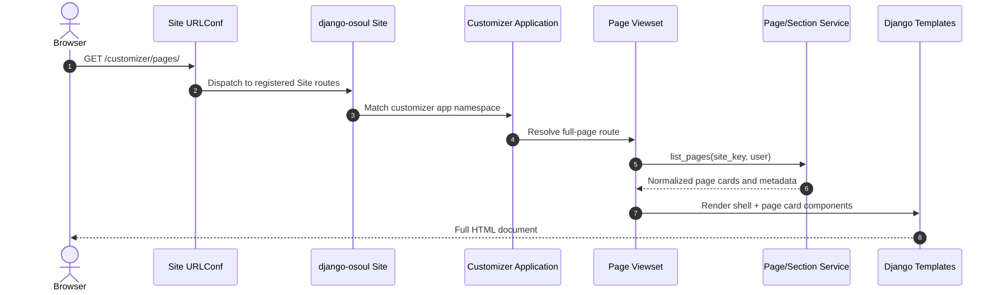
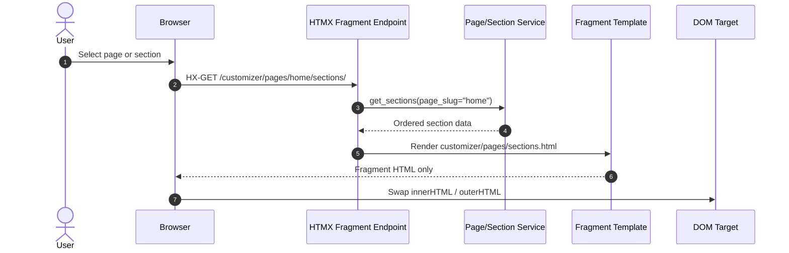
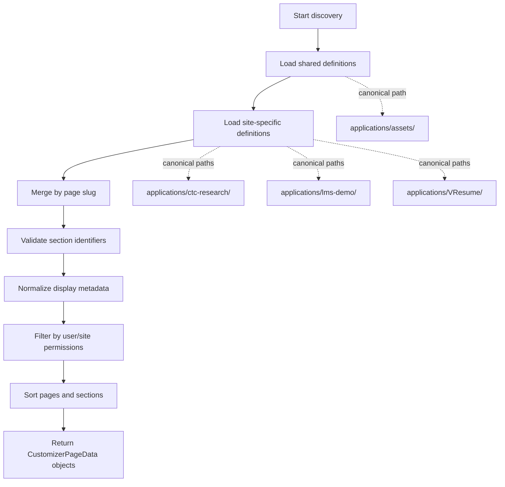

# Customizer, django-osoul, and Component Architecture Guide

This guide explains how to connect **django-osoul routable viewsets**, **component tags**, **HTMX fragments**, **customizer page/section metadata**, and **site-specific templates** in the Structa Cloud monorepo.

It is intentionally written against the repository layout used here, not a generic Django layout. Use these canonical paths when applying the examples:

- `applications/libs/django-osoul/` — local reusable django-osoul package and routable component primitives.
- `applications/customizer/` — customizer app, templates, views, and page-building UI.
- `applications/assets/` — shared frontend assets, shared templates, static files, scripts, and locale files.
- `applications/configs/` — shared Django settings and test settings.
- `applications/www/` — shared/core Django code used by the application stack.
- `applications/ctc-research/` — CTC Research site.
- `applications/lms-demo/` — Structa/LMS demo site.
- `applications/VResume/` — VResume site; keep the directory capitalized.
- `applications/Makefile` — canonical dispatcher for site checks, tests, migrations, assets, and `WEBSITE=...` selection.

## Architecture

### 1. django-osoul viewsets

`django-osoul` supplies routable viewset and site primitives from `applications/libs/django-osoul/`. A site project registers one or more application-level viewsets, and each application exposes page viewsets or fragment viewsets.

A typical site tree looks like this:

1. A site module creates a `Site` object.
2. The `Site` contains application objects such as `CustomizerApp`, `LMSApp`, or `BlogApp`.
3. Each application returns viewset instances from `viewsets`.
4. Viewsets expose full-page routes, fragment-only routes, form endpoints, or model-backed routes.
5. Site URL configuration includes the site routes under a prefix such as `/osoul/` or `/customizer/`.

Keep reusable framework behavior in `applications/libs/django-osoul/`. Keep site-specific registration in the relevant site path such as `applications/ctc-research/`, `applications/lms-demo/`, or `applications/VResume/`.

### 2. Component tags

Component tags render reusable templates from named component paths. Existing site templates commonly load component tag libraries such as `components` or `routable_components`.

Use component tags or `` when a template represents a reusable card, navigator, panel, form field, pagination block, or layout primitive. Place templates according to how broadly they are reused:

- Shared components: `applications/assets/templates/`.
- Site root templates: `applications/<site>/templates/`.
- Site asset templates: `applications/<site>/assets/templates/`.
- Site Django app templates: `applications/<site>/www/**/templates/`.
- Plugin templates: `applications/<site>/plugins/**/templates/`.

For shared UI, prefer `applications/assets/templates/`. For visual differences between sites, keep site-specific overrides under the relevant canonical site path.

### 3. HTMX fragments

HTMX fragments are partial responses rendered without the full page layout. In django-osoul, use `fragment_name` as the single identifier for fragment routes and context keys. Do not introduce parallel names such as `fragment`, `fragment_slug`, or `fragment_key` unless preserving compatibility with existing code.

Recommended conventions:

- `fragment_name = "customizer.pages.navigator"` maps to a template path like `customizer/pages/navigator.html`.
- `route_path = "pages/navigator/"` exposes a stable endpoint.
- Templates declare `hx-get`, `hx-post`, `hx-target`, and `hx-swap` on interactive controls.
- Fragment endpoints return only the HTML that should replace the target element.
- Full-page routes render the shell, then let HTMX update individual panels.

### 4. Customizer pages and sections

Customizer pages describe editable page-level experiences. Sections describe the ordered pieces inside a customizer page. A data service should discover available page and section definitions, normalize them, and return plain data to viewsets and templates.

A recommended split is:

- **Page/section service**: discovers and normalizes definitions.
- **Customizer page viewset**: renders the full customizer shell and page cards.
- **Section navigator fragment**: renders the ordered section navigator for the selected page.
- **Section editor fragment**: renders one selected section editor.
- **Message/form endpoint**: accepts HTMX submissions and returns a focused fragment response.

This keeps business logic out of templates and makes discovery testable.

### 5. Site-specific templates

Templates are intentionally layered. Before adding a new template, check shared templates, site root templates, site asset templates, site Django app templates, and plugin templates. Avoid duplicated folder names in component paths. For example, use:

```text
components/blocks/contact/contact_profile.html
```

Do not add paths like:

```text
components/blocks/contact/contact/contact_profile.html
```

Use shared templates for cross-site customizer UI, and only add site-specific templates when the customizer presentation must differ for CTC Research, LMS Demo, or VResume.

## Full page request flow



## HTMX fragment swap flow



## Customizer page/section discovery flow



## Code examples

The examples below are illustrative and should be adapted to the exact classes available in the site being changed. Keep shared framework code in `applications/libs/django-osoul/` and site-specific code in the appropriate canonical site path.

### `site.py` viewset registration

Place site-specific registration in a site module such as `applications/ctc-research/www/core/site.py` or equivalent. The exact import path can vary by site.

```python
from __future__ import annotations

from django_osoul.comp.routes import Application, Site, viewprop


class CustomizerApp(Application):
    """Customizer routes for one site."""

    title = "Customizer"
    icon = "palette"
    app_name = "customizer"

    @viewprop
    def viewsets(self):
        from applications.customizer.viewsets import (
            CustomizerPageViewSet,
            MessageFormFragment,
            SectionNavigatorFragment,
        )

        return [
            CustomizerPageViewSet(site_key="ctc-research"),
            SectionNavigatorFragment(site_key="ctc-research"),
            MessageFormFragment(site_key="ctc-research"),
        ]

    def has_view_permission(self, user, obj=None) -> bool:
        return user.is_authenticated and user.is_staff


site = Site(
    title="CTC Research",
    viewsets=[CustomizerApp()],
)
```

Then include the registered routes from the site URL configuration:

```python
from django.urls import include, path

from www.core.site import site

urlpatterns = [
    path(
        "customizer/",
        include((site.urls[0], site.urls[1]), namespace=site.urls[2]),
    ),
]
```

### Page card component

A shared page card can live under `applications/assets/templates/customizer/components/page_card.html` unless a site needs its own visual override.

```django
{# applications/assets/templates/customizer/components/page_card.html #}
<article class="customizer-page-card" data-page-slug="{{ page.slug }}">
  <header class="customizer-page-card__header">
    <h2 class="customizer-page-card__title">{{ page.title }}</h2>
    
      <p class="customizer-page-card__description">{{ page.description }}</p>
    
  </header>

  <dl class="customizer-page-card__meta">
    <div class="customizer-page-card__meta-item">
      <dt>Sections</dt>
      <dd>{{ page.sections|length }}</dd>
    </div>
    <div class="customizer-page-card__meta-item">
      <dt>Template</dt>
      <dd><code>{{ page.template_name }}</code></dd>
    </div>
  </dl>

  <button
    class="customizer-page-card__action"
    type="button"
    hx-get=""
    hx-target="#customizer-section-panel"
    hx-swap="innerHTML"
  >
    Customize sections
  </button>
</article>
```

### Navigator component

A navigator component renders the sections for one selected page. It can be shared if every site has the same customizer experience.

```django
{# applications/assets/templates/customizer/components/section_navigator.html #}
<nav class="customizer-section-nav" aria-label="Page sections">
  <h2 class="customizer-section-nav__title">{{ page.title }} sections</h2>

  <ol class="customizer-section-nav__list">
    
      <li class="customizer-section-nav__item">
        <button
          class="customizer-section-nav__button"
          type="button"
          hx-get=""
          hx-target="#customizer-editor-panel"
          hx-swap="innerHTML"
        >
          <span class="customizer-section-nav__label">{{ section.title }}</span>
          
            <span class="customizer-section-nav__status">{{ section.status }}</span>
          
        </button>
      </li>
    
      <li class="customizer-section-nav__empty">No editable sections found.</li>
    
  </ol>
</nav>
```

### Message form HTMX endpoint

Use a fragment endpoint for forms that update one target in the customizer UI. The endpoint validates input, performs the action, and returns a partial template.

```python
from __future__ import annotations

from typing import Any

from django import forms
from django.http import HttpRequest, HttpResponse

from django_osoul.comp.routes.fragments import FragmentViewset


class CustomizerMessageForm(forms.Form):
    subject = forms.CharField(max_length=120)
    body = forms.CharField(widget=forms.Textarea)


class MessageFormFragment(FragmentViewset):
    route_name = "message-form"
    route_path = "messages/form/"
    fragment_name = "customizer.fragments.message_form"

    def __init__(self, *, site_key: str, **kwargs: Any) -> None:
        super().__init__(**kwargs)
        self.site_key = site_key

    def get_fragment_context(self, **kwargs: Any) -> dict[str, Any]:
        context = super().get_fragment_context(**kwargs)
        context["form"] = CustomizerMessageForm()
        return context

    def post(self, request: HttpRequest, *args: Any, **kwargs: Any) -> HttpResponse:
        form = CustomizerMessageForm(request.POST)
        context = {"form": form, "site_key": self.site_key}

        if form.is_valid():
            # Call a service here instead of putting business logic in the view.
            context["message_sent"] = True
            context["form"] = CustomizerMessageForm()

        return self.render_fragment_response(context)
```

The corresponding template can target a message panel:

```django
{# applications/assets/templates/customizer/fragments/message_form.html #}
<form
  class="customizer-message-form"
  method="post"
  hx-post=""
  hx-target="#customizer-message-panel"
  hx-swap="innerHTML"
>
  
  {{ form.as_p }}

  <button class="customizer-message-form__submit" type="submit">
    Send message
  </button>

  
    <p class="customizer-message-form__success">Message sent.</p>
  
</form>
```

### Page/section data service

A service should return plain, predictable data structures that viewsets and templates can consume. Keep discovery and normalization out of views.

```python
from __future__ import annotations

from dataclasses import dataclass, field
from typing import Iterable


@dataclass(frozen=True)
class CustomizerSectionData:
    slug: str
    title: str
    template_name: str
    status: str = "draft"


@dataclass(frozen=True)
class CustomizerPageData:
    slug: str
    title: str
    template_name: str
    description: str = ""
    sections: tuple[CustomizerSectionData, ...] = field(default_factory=tuple)


class CustomizerDiscoveryService:
    """Discovers customizer pages and editable sections for one site."""

    def __init__(self, *, site_key: str) -> None:
        self.site_key = site_key

    def list_pages(self) -> tuple[CustomizerPageData, ...]:
        shared_pages = self._load_shared_pages()
        site_pages = self._load_site_pages()
        return tuple(self._merge_pages(shared_pages, site_pages))

    def get_page(self, page_slug: str) -> CustomizerPageData | None:
        return next((page for page in self.list_pages() if page.slug == page_slug), None)

    def list_sections(self, page_slug: str) -> tuple[CustomizerSectionData, ...]:
        page = self.get_page(page_slug)
        if page is None:
            return ()
        return page.sections

    def _load_shared_pages(self) -> tuple[CustomizerPageData, ...]:
        return (
            CustomizerPageData(
                slug="home",
                title="Home page",
                template_name="customizer/pages/home.html",
                description="Shared home page customizer metadata.",
                sections=(
                    CustomizerSectionData(
                        slug="hero",
                        title="Hero",
                        template_name="customizer/sections/hero.html",
                    ),
                ),
            ),
        )

    def _load_site_pages(self) -> tuple[CustomizerPageData, ...]:
        # Load site-specific definitions from applications/<site>/ when needed.
        return ()

    def _merge_pages(
        self,
        shared_pages: Iterable[CustomizerPageData],
        site_pages: Iterable[CustomizerPageData],
    ) -> list[CustomizerPageData]:
        pages_by_slug = {page.slug: page for page in shared_pages}
        pages_by_slug.update({page.slug: page for page in site_pages})
        return sorted(pages_by_slug.values(), key=lambda page: page.title)
```

## What is added

A customizer/django-osoul integration typically adds:

- A site-level `Site` registration that mounts customizer page, section, and form viewsets.
- A small set of django-osoul viewsets for full-page shell rendering and HTMX fragments.
- Shared customizer component templates under `applications/assets/templates/` when reusable across sites.
- Site-specific templates under `applications/ctc-research/`, `applications/lms-demo/`, or `applications/VResume/` only when necessary.
- A page/section discovery service that returns normalized data for templates and viewsets.
- HTMX targets for section navigation, editor panels, form responses, and status messages.
- Tests or checks run through `applications/Makefile` with the appropriate `WEBSITE=...` value when implementation code is added.

## What is not added yet

This guide does not add the runtime implementation. It does not yet add:

- Database models for persisted customizer page or section state.
- A permissions matrix beyond the example `is_authenticated and is_staff` gate.
- A final URL namespace contract for every site.
- A complete template override map for CTC Research, LMS Demo, and VResume.
- A migration plan for existing customizer templates or legacy fragments.
- Browser-level tests for HTMX swaps.
- Screenshot-based visual regression coverage.
- Asset bundle entries in `applications/assets/scripts/` or `applications/webpack/`.

## Implementation checklist

When turning this guide into code, use this order:

1. Add or update shared service code in the correct reusable package or app.
2. Register viewsets in the relevant site path.
3. Add shared templates in `applications/assets/templates/`.
4. Add site-specific overrides only under the affected canonical site path.
5. Wire HTMX controls to named fragment routes.
6. Run narrow checks first, then site checks through `applications/Makefile`.
7. If the change affects a runnable web UI, capture a screenshot of the updated page.
