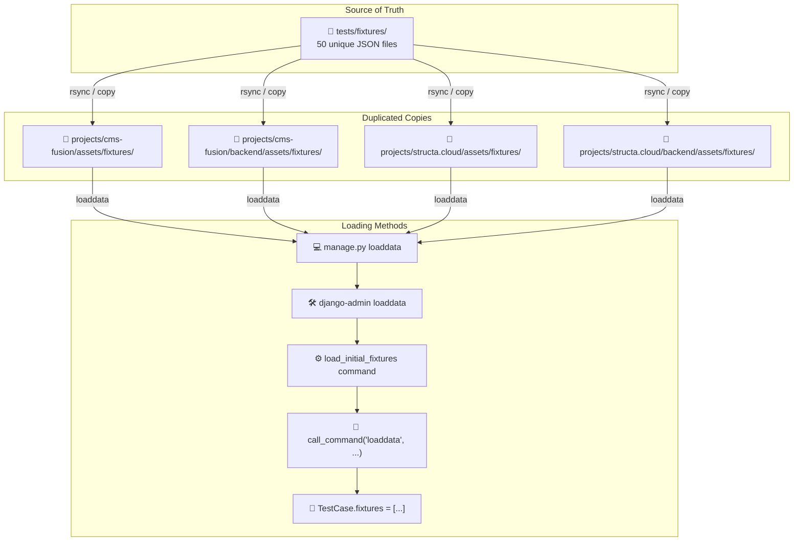
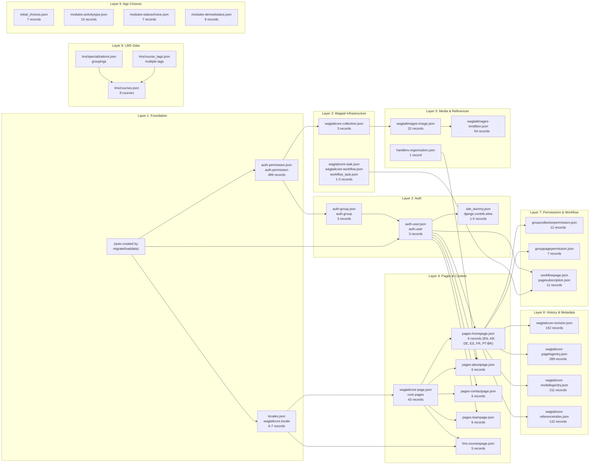
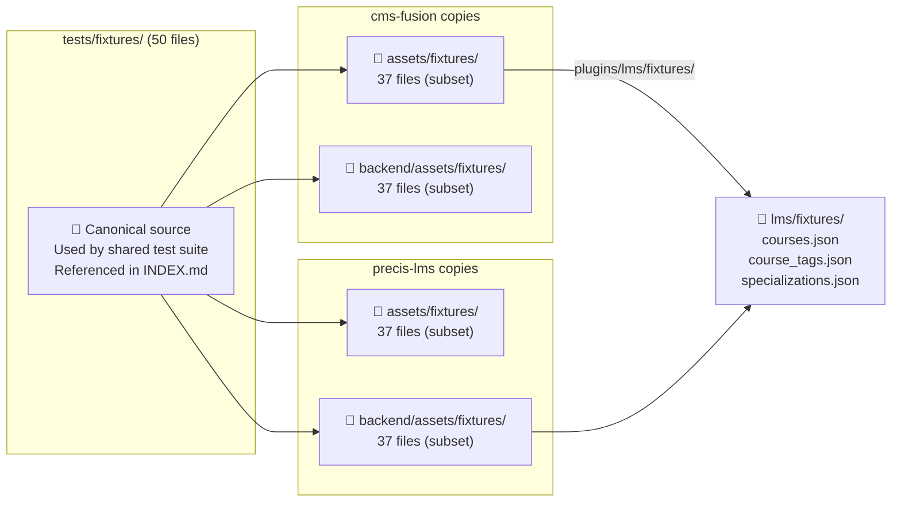

# Fixture Loading Pipeline Diagram

> This document describes the fixture loading pipeline for Django/Wagtail projects
> across cms-fusion, precis-lms, and the shared test suite.

---

## 1. 🗺️ Fixture Source Hierarchy

---

## 2. 📋 Fixture Dependency Graph (Load Order)

---

## 3. 🔄 Recommended Loading Sequence

```mermaid
flowchart TD
    START(["🚀 Start"])
    STEP1["Step 1: Fixture Validation
    Validate all JSON files are parseable
    Check model references exist"]
    STEP2["Step 2: Foundation
    ➜ auth-permission.json
    ➜ locales.json"]
    STEP3["Step 3: Auth
    ➜ auth-group.json
    ➜ auth-user.json
    ➜ site_dummy.json"]
    STEP4["Step 4: Infrastructure
    ➜ wagtailcore-collection.json
    ➜ wagtailcore-task.json
    ➜ wagtailcore-workflow*"]
    STEP5{"Step 5: Pages
    with --ignorenonexistent"}
    STEP5A["wagtailcore-page.json
    (43 core page records)"]
    STEP5B["Specific page types:
    ➜ pages-homepage.json
    ➜ pages-aboutpage.json
    ➜ pages-contactpage.json
    ➜ pages-teampage.json
    ➜ lms-coursespage.json"]
    STEP6["Step 6: Media
    ➜ wagtailimages-image.json
    ➜ wagtailimages-rendition.json"]
    STEP7["Step 7: Content
    ➜ handlers-organization.json
    ➜ lms/courses.json
    ➜ lms/course_tags.json
    ➜ lms/specializations.json
    ➜ seed/homepage_content.json"]
    STEP8["Step 8: History & Metadata
    ➜ revisions.json
    ➜ pagelogentry.json
    ➜ modellogentry.json
    ➜ referenceindex.json"]
    STEP9["Step 9: Permissions
    ➜ collectionpermission.json
    ➜ grouppagepermission.json
    ➜ workflowpage.json"]
    DONE(["✅ Done!
    Verify:
    - Page count > 1
    - Locale count > 0
    - Users exist"])

    START --> STEP1
    STEP1 --> STEP2
    STEP2 --> STEP3
    STEP3 --> STEP4
    STEP4 --> STEP5
    STEP5 -->|loaddata pages| STEP5A
    STEP5A --> STEP5B
    STEP5B --> STEP6
    STEP6 --> STEP7
    STEP7 --> STEP8
    STEP8 --> STEP9
    STEP9 --> DONE

    style STEP1 stroke:#f90,stroke-width:2px
    style STEP5 stroke:#fa0,stroke-width:2px,stroke-dasharray: 5 5
    style DONE stroke:#090,stroke-width:3px
```

---

## 4. 🏗️ Project-Canonical Fixture Mapping

---

## 5. 📊 Fixture Counts by Category

| Category | Files | Objects (approx) | Primary Models |
|---|---|---|---|
| **Foundation** (layer 1) | 3 | 510 | `auth.permission`, `wagtailcore.locale`, content types |
| **Auth** (layer 2) | 4 | 12 | `auth.user`, `auth.group`, `django.site` |
| **Wagtail Infra** (layer 3) | 4 | 8 | Collection, Task, Workflow |
| **Pages** (layer 4) | 6 | 72 | `wagtailcore.page` + specific page types |
| **Media** (layer 5) | 3 | 77 | Image, Rendition, Organization |
| **History** (layer 6) | 4 | 784 | Revision, PageLog, ModelLog, ReferenceIndex |
| **Permissions** (layer 7) | 4 | 31 | CollectionPerm, PagePerm, WorkflowPage |
| **LMS** (layer 8) | 3 | ~15 | Course, CourseTag, Specialization |
| **App Choices** (layer 9) | 5 | 38 | ActivityType, StatusChoice, DerivedStatus |
| **Dump files** | 4 | ~2,500 | Mixed/archived dumps |
| **Seed data** | 2 | ~10 | Homepage demo content |
| **Test assets** | 6 | ~150 | Blog posts, comments, categories |
| **Blog test data** | 6 | ~150 | Blog posts, users, comments, tags |
| **Total (unique)** | **50** | **~4,000** | |

---

## 6. 🔧 Validation & Loading Scripts

| Script | Location | Purpose |
|---|---|---|
| `load_fixtures_correct.sh` | `tests/load_fixtures_correct.sh` | Shell script loading fixtures in dependency order via Docker |
| `load_fixtures.py` | `tests/scripts/testing/load_fixtures.py` | Python script loading test fixtures in order |
| `load_initial_fixtures.py` | `projects/*/backend/www/apps/management/commands/` | Django management command with step-based loading |
| `load_course_fixtures.py` | `projects/*/backend/plugins/lms/management/commands/` | LMS course-specific fixture loading |
| `load_dumped_data.py` | `tests/scripts/dev/load_dumped_data.py` | Dev script for loading production dumps |
| `setup_initial_data.py` | `tests/scripts/testing/setup_initial_data.py` | Setup script with fixture loading + post-setup |
| `check_user_configs.py` | `tests/scripts/helpers/check_user_configs.py` | User consistency checker for fixtures |

---

## 7. 💡 Design Decisions

1. **Canonical → Copy pattern**: `tests/fixtures/` is the single source of truth. Project-specific copies exist at each site's `assets/fixtures/` for Docker context isolation.

2. **Dependency ordering**: Fixtures MUST load in the order: permissions → groups → users → sites → locales → pages → images → content → revisions → permissions. Violating this order causes FK violations.

3. **`--ignorenonexistent`**: Required for some page fixtures that reference model classes not yet migrated. Used in production loading scripts.

4. **Multi-locale pages**: HomePage, AboutPage, ContactPage, TeamPage fixtures contain 6 records each (1 per locale). The English locale (pk=1) must load first.

5. **50 unique fixtures** in canonical directory, but **349 total JSON files** across all projects including duplicates.

---

*Last updated: July 2026*
