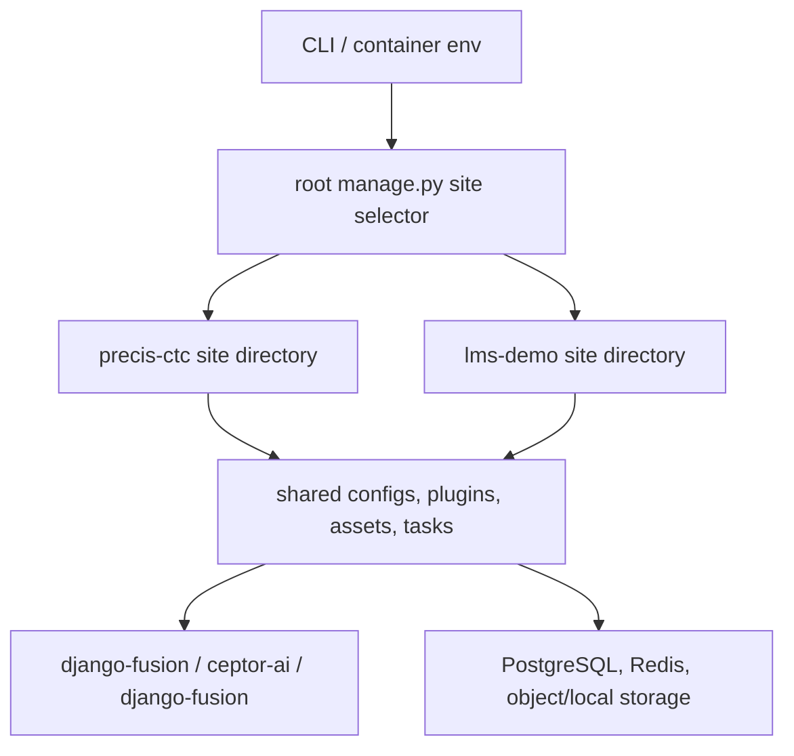
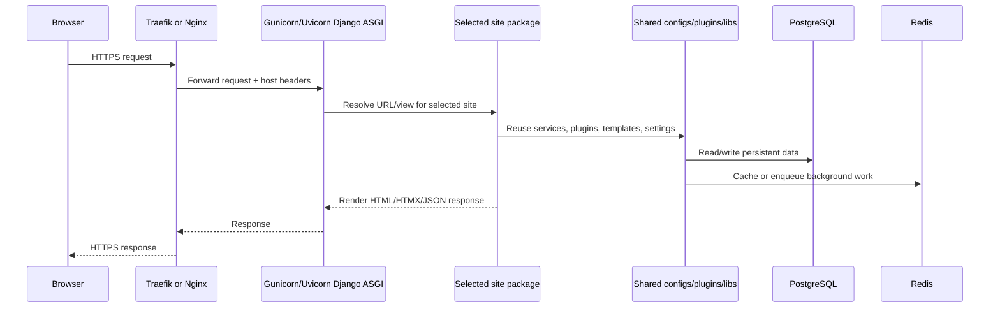

# Unique Architecture

This repository is unique because it is not a single monolithic Django site. It is a **multi-site, thin-layer Django/Wagtail workspace** that keeps product-specific code small while moving reusable behavior into shared packages and plugins.

## What makes it different

| Capability | Design choice | Stability benefit |
|---|---|---|
| Multi-site runtime | One repository serves the `precis-ctc` and `lms-demo` site directories. The root `manage.py` selects a site with `--site`, `DJANGO_SITE`, or `SITE`. | Operators can run checks, migrations, and fixtures for one site without duplicating tooling. |
| Thin application layer | Site apps subclass or configure reusable behavior from `django-fusion`, `ceptor-ai`, and `django-fusion`. | Business rules stay reusable and easier to patch across sites. |
| Shared configuration layer | Root `configs/` modules and site-local `settings.py` files compose settings from YAML, environment variables, and Django settings modules. | Environment differences are explicit instead of hard-coded. |
| Shared frontend pipeline | Root `assets/` and `webpack/` build shared assets while each site keeps only site-specific overrides. | Reduces drift between sites and makes asset verification repeatable. |
| Modular Docker stack | Compose files split the application, warehouse services, reverse proxies, docs, and workers. | Operators can deploy the minimum required services, scale workers independently, and replace proxy layers. |
| Runtime verification scripts | `scripts/verify_runtime.py`, `scripts/load_dumped_data.py`, and Makefile wrappers standardize checks after setup. | Deployments can verify assets, pages, and seed data before traffic is routed. |

## Runtime selection flow

## Request flow

## Stability boundaries

- **Site directories are deployment units**: `precis-ctc/` and `lms-demo/` contain their own `manage.py`, `pyproject.toml`, `settings.py`, `www/`, `plugins/`, templates, and assets.
- **Root tooling is orchestration**: the root `Makefile`, root `manage.py`, `compose/`, `configs/`, `tasks/`, and `scripts/` provide shared operation paths.
- **Shared libraries are external contracts**: `django-fusion`, `ceptor-ai`, and `django-fusion` must remain importable in the active environment before URL import checks and runtime checks can pass.
- **Docker images must copy real workspace members**: the image build now references the actual `precis-ctc` and `lms-demo` directories so `uv sync` and Docker builds use files that exist in this repository.
