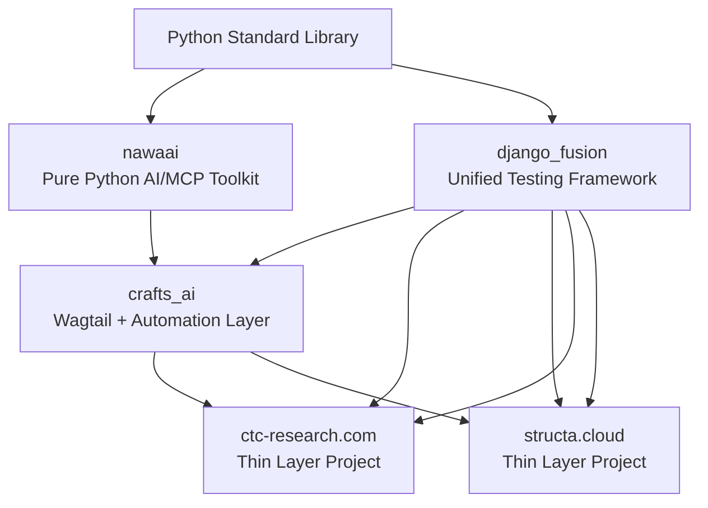

# Ecosystem Architecture

## Package Dependency Graph



**Dependency direction**: stdlib → nawaai → django_fusion → crafts_ai → projects

`django_fusion` is a test-only dependency — it must never be imported by production code.

---

## Package Responsibilities

### nawaai — Pure Python AI/MCP Toolkit

- **Purpose**: Pure Python AI and MCP toolkit with zero Django dependencies
- **Contains**:
  - `crafts_ai.ai/` — AI integrations and adapters
    - `integrations.py` — AI provider integrations (OpenAIIntegration, ClaudeIntegration, AIIntegrationRegistry)
    - `newsletter.py` — Newsletter content enhancement (NewsletterAI)
  - `crafts_ai.chat/` — Chat client (Rasa and generic)
    - `client.py` — REST API client and chat interface (CraftsClient, ChatBubble, ChatMessage)
    - `rasa.py` — Rasa-specific chat client (RasaClient)
  - `crafts_ai.mcp/` — MCP server integration
    - `server.py` — MCP server implementation (MCPServer)
  - `crafts_ai.orchestrator/` — Spec orchestrator CLI
    - `orchestrator.py` — Core orchestration logic (SpecTaskOrchestrator)
    - `config.py` — Configuration management (OrchestratorConfig)
    - `cli.py` — CLI interface (OrchestratorCLI)
    - `models.py` — Data models (TaskStatus, Spec, Task)
    - `executor.py` — Task execution engine (TaskExecutor)
    - `parser.py` — File parsing (SpecParser, TaskParser)
    - `scanner.py` — Directory scanning (SpecScanner)
    - `tracker.py` — Status tracking (TaskTracker)
    - `progress.py` — Progress reporting (ProgressReporter)
    - `pbt.py` — Property-based testing helpers (PBTValidator)
    - `errors.py` — Error types (OrchestratorError)
  - `crafts_ai.seeder/` — Data seeding utilities
    - `simple_seeder.py` — Framework-agnostic seeder (SimpleSeeder)
    - `providers.py` — Extended Faker providers (FakerProvider)
- **Boundary Rule**: Must not import Django, Wagtail, Celery, or any Django packages
- **Dependencies**: Python standard library only
- **Key Exports**:
  ```python
  from crafts_ai.ai.integrations import AIIntegration, OpenAIIntegration, ClaudeIntegration
  from crafts_ai.chat.client import CraftsClient, ChatBubble
  from crafts_ai.mcp.server import MCPServer
  from crafts_ai.orchestrator.orchestrator import SpecTaskOrchestrator
  from crafts_ai.seeder.simple_seeder import SimpleSeeder
  ```

### django_fusion — Pure Django Foundation Layer

- **Purpose**: Pure Django/Python foundation layer — models, managers, mixins, utils, comp, contrib
- **Contains**:
  - `handlers/` — Pure Django handler base and core classes
    - `base.py` — Base handler class (BaseHandler)
    - `core.py` — Core handler class (CoreHandler)
    - `search.py` — Search handler (SearchHandler)
    - `mixins/fragment.py` — Fragment handler mixin (FragmentMixin)
    - `mixins/page.py` — Page handler mixin (PageMixin)
  - `managers/` — Custom model managers
    - `role_hierarchy.py` — RoleHierarchyManager
    - `group_access.py` — GroupAccessControl
    - `user.py` — UserManager
    - `group.py` — GroupManager
    - `base.py` — Base manager class (BaseManager)
  - `mixins/` — Pure Django view and model mixins
    - `user.py` — UserMixin
    - `group.py` — GroupMixin
    - `models.py` — Model mixins (TimestampedModel, SoftDeleteMixin, AuditMixin, StatusMixin, UUIDPrimaryKeyModel)
    - `views.py` — View mixins (CacheMixin, SearchMixin, TokenMixin)
  - `models/` — Foundation model base classes
    - `base.py` — Base model classes (BaseModel, TimeStampedModel, UUIDModel)
    - `mixins.py` — Model mixin classes
  - `services/` — Business logic services
    - `user.py` — UserService
    - `group.py` — GroupService
    - `tagging.py` — TaggingService
    - `validators.py` — ValidationService
  - `backends/` — Custom authentication and storage backends
    - `auth.py` — Custom authentication backends (CustomAuthBackend)
    - `storage.py` — Custom storage backends (CustomStorageBackend)
  - `adapters/` — Auth adapters
    - `allauth.py` — django-allauth account adapter (CustomAccountAdapter)
    - `social.py` — django-allauth social account adapter (CustomSocialAccountAdapter)
  - `middlewares/` — Pure Django middleware
    - `error_tracker.py` — ErrorTrackerMiddleware
    - `site.py` — SiteMiddleware
    - `language.py` — LanguageMiddleware
    - `freeze.py` — FreezeMiddleware
  - `filters/` — Form validators and filters
    - `validators.py` — UniqueFieldValidator, SlugFieldValidator
    - `base.py` — BaseFilter
    - `cache.py` — CacheFilter
    - `token.py` — TokenFilter
  - `forms/` — Base form classes
    - `base.py` — BaseForm, BaseModelForm
  - `comp/` — Pure Django UI components
    - `widgets.py` — Pure Django widgets
    - `payloads.py` — Service payload classes (ServicePayload, TokenPayload)
  - `contrib/` — Contrib utilities
    - `enums.py` — Shared enumerations (StatusEnum)
    - `choices.py` — Field choice constants (RoleChoices)
    - `context.py` — Context processors (RequestContext)
    - `schemas.py` — Dataclass/schema definitions (BaseSchema)
    - `responses.py` — Response helpers (JsonResponse, HtmxResponse)
  - `utils/` — General utility functions
    - `text.py` — Text utilities (slugify_unique)
    - `datetime_utils.py` — Date/time utilities (format_date)
    - `decorators.py` — Decorators (cached_property)
    - `responses.py` — Response helpers (json_response)
    - `validators.py` — Validators (validate_email_domain)
  - `application/` — Application layer (use cases, DTOs)
  - `domain/` — Domain layer (entities, value objects, domain services)
  - `infrastructure/` — Infrastructure layer (repositories, adapters)
  - `interfaces/` — Interface layer (Web APIs, CLI, event handlers)
  - `views/` — View mixins and base views
  - `routes/` — URL routing utilities
  - `templatetags/` — Template tags and filters
  - `management/` — Management command base classes
- **Boundary Rules**:
  - Must not import Wagtail
  - Must not import Celery
  - Must not import crafts_ai
  - Pure Django only
- **Key Exports**:
  ```python
  from django_fusion.models.base import BaseModel, TimeStampedModel, UUIDModel
  from django_fusion.managers import RoleHierarchyManager, GroupAccessControl, UserManager, GroupManager
  from django_fusion.mixins import UserMixin, GroupMixin, CacheMixin, SearchMixin
  from django_fusion.middlewares.error_tracker import ErrorTrackerMiddleware
  from django_fusion.filters.validators import UniqueFieldValidator, SlugFieldValidator
  from django_fusion.forms import BaseForm, BaseModelForm
  from django_fusion.contrib.responses import JsonResponse, HtmxResponse
  ```

### crafts_ai — Wagtail + Automation Layer

- **Purpose**: Wagtail-specific components and automation pipelines built on django_fusion
- **Contains**:
  - `pipelines/` — Full pipeline stack
    - `models/` — Pipeline-specific models (can use Wagtail)
    - `services/` — All service base classes
      - `cart.py` — CartServiceBase
      - `person.py` — PersonServiceBase
      - `message.py` — MessageServiceBase
      - `form_submission.py` — FormSubmissionService
      - `certificate.py` — CertificateServiceBase
      - `crud.py` — CRUDService, BatchCRUDService
      - `search.py` — SearchService
      - `token.py` — TokenService, TokenProtectedService
      - `base.py` — BaseService, ServiceRegistry
      - `payments.py` — PaymentGateway, StripeGateway, PayPalGateway
      - `jobs.py` — Job utilities (dispatch_job, run_logged_job)
      - `newsletter.py` — Newsletter utilities (send_confirmation_email, send_campaign_email)
    - `views/` — Pipeline views
    - `forms/` — Pipeline forms
    - `signals/` — Django signals for automation (cart_updated, user_enrolled)
    - `snippets/` — Wagtail snippets
    - `adapters/` — Adapter patterns
    - `backends/` — Shim → django_fusion.backends
    - `filters/` — Shim → django_fusion.filters
    - `managers/` — Shim → django_fusion.managers
    - `middlewares/` — Shim → django_fusion.middlewares
    - `mixins/` — Shim → django_fusion.mixins
    - `utils/` — Utility functions
  - `comp/` — Wagtail UI components
    - `blocks/` — Wagtail StreamField blocks
      - `blocks.py` — MediaBlock, ContentBlock, ImageBlock
      - `base.py` — OrganizationChooserBlockBase
  - `email/` — Email automation
    - `selectors.py` — RoleBasedEmailTemplateSelector
    - `registry.py` — EmailTemplateRegistry
    - `services.py` — EmailService
  - `email_tools/` — Email management
    - `sender.py` — EmailSender
    - `extractor.py` — EmailExtractor
    - `csv_manager.py` — CsvEmailManager
  - `workflows/` — Orchestrator CLI
    - `orchestrator.py` — SpecTaskOrchestrator
  - `contrib/` — Contrib components
    - `admin_site/` — Admin customizations
      - `unfold.py` — Unfold admin configuration (UnfoldAdminConfig)
      - `wagtail.py` — Wagtail admin configuration (WagtailAdminConfig)
    - `cache/` — Cache utilities
      - `utils.py` — Cache utilities (cache_result, invalidate_cache)
    - `privacy/` — Privacy consent
      - `middleware.py` — PrivacyConsentMiddleware
    - `signals/` — Django signals
    - `snippets/` — Wagtail snippets (NavigationSnippetBase, FooterSnippetBase)
    - `wagtail_hooks.py` — Wagtail hooks (register_admin_menu_item, register_admin_urls)
    - `debug_tools/` — Debug utilities (debug_query, timing_decorator)
    - `email_config/` — Email configuration helpers (validate_email_settings)
  - `handlers/` — Wagtail handlers
    - `mixins/wagtail_page.py` — WagtailPageMixin
    - `mixins/wagtail_fragment.py` — WagtailFragmentMixin
    - `search.py` — WagtailSearchHandler
    - `snippets_base.py` — SnippetsBaseHandler
  - `chat/` — Chat functionality (Django app)
    - `models.py` — ChatSession, ChatMessage
    - `views.py` — ChatView
  - `newsletter/` — Newsletter enhancement
    - `enhancer.py` — NewsletterEnhancer
    - `designer.py` — NewsletterDesigner
  - `tasks/` — Task definitions
    - `celery.py` — Celery tasks (send_email_task, process_enrollment_task)
    - `django_q.py` — Django-Q tasks (schedule_report)
  - `seeder/` — Database seeding
    - `seeder.py` — Seeder class
    - `providers.py` — Data providers (UserProvider, ContentProvider)
  - `ai/` — AI adapter
    - `adapter.py` — AIAdapter (thin adapter to crafts_ai)
  - `mcp_designer/` — MCP designer (Django app)
  - `routes/` — URL routing
    - `api_patterns.py` — Standardized API URL patterns
    - `admin_patterns.py` — Standardized admin URL patterns
  - `scripts/` — Utility scripts
    - `cleanup_old_data.py` — Database cleanup script
  - `management/commands/` — Management commands
    - `seed_database.py` — Database seeding command
    - `backup_email_templates.py` — Email template backup command
    - `process_pending_tasks.py` — Task processing command
- **Boundary Rules**:
  - Must not import project-specific code (ctc-research.com, structa.cloud)
  - Can import Wagtail and Celery
  - Depends on django_fusion for pure Django foundation
- **Dependencies**: django_fusion, Wagtail, Celery, nawaai
- **Key Exports**:
  ```python
  from crafts_ai.pipelines.services.cart import CartServiceBase
  from crafts_ai.pipelines.services.person import PersonServiceBase
  from crafts_ai.pipelines.services.message import MessageServiceBase
  from crafts_ai.email.selectors import RoleBasedEmailTemplateSelector
  from crafts_ai.comp.blocks import OrganizationChooserBlockBase
  from crafts_ai.workflows.orchestrator import SpecTaskOrchestrator
  from crafts_ai.contrib.admin_site.unfold import UnfoldAdminConfig
  from crafts_ai.contrib.cache.utils import cache_result
  ```

### django_fusion — Unified Testing Framework

- **Purpose**: Unified testing framework and health check endpoints
- **Contains**:
  - `tests/` — Testing infrastructure
    - `base.py` — BaseTestCase with Hypothesis helpers (st_email, st_slug, st_uuid)
    - `assertions.py` — Custom assertion helpers (assert_redirects_to, assert_htmx_response, assert_json_response, assert_form_errors)
    - `factories.py` — Factory classes (UserFactory, GroupFactory, PersonFactory)
    - `fixtures.py` — Test fixtures (sample_user_data, sample_group_data, sample_content_data)
    - `mixins.py` — Test mixins (AuthenticatedTestMixin, AdminTestMixin, WagtailTestMixin)
    - `pytest_plugin.py` — pytest plugin registration with fixtures
    - `selenium_base.py` — Selenium test infrastructure (SeleniumTestCase)
  - `health/` — Health check endpoints
    - `views.py` — Health check views (HealthCheckView, DatabaseHealthView, AssetsHealthView, MediaHealthView)
    - `urls.py` — URL patterns for health endpoints
    - `tests.py` — Health check tests
  - `seeder/` — Database seeding
    - `seeder.py` — Seeder class
    - `providers.py` — Data providers (UserProvider, TextProvider, DateProvider, ChoiceProvider)
    - `guessers.py` — Field type guessers
    - `exceptions.py` — Seeder exceptions
  - `management/commands/` — Management commands
    - `backup_db.py` — Database backup command
    - `backup_media.py` — Media backup command
    - `load_fixtures.py` — Fixture loading command
- **Boundary Rules**:
  - Must only be imported by test code
  - Must not be imported by production code (enforced by import-linter)
- **Dependencies**: Django, pytest, Hypothesis
- **Key Exports**:
  ```python
  from django_fusion.tests.base import BaseTestCase, st_email, st_slug, st_uuid
  from django_fusion.tests.assertions import assert_redirects_to, assert_json_response
  from django_fusion.tests.factories import UserFactory, GroupFactory
  from django_fusion.health.views import HealthCheckView, DatabaseHealthView
  from django_fusion.seeder import Seeder
  ```

---

## Import Boundaries and Enforcement

### Boundary Rules Overview

The ecosystem enforces four strict boundary rules via import-linter in CI:

1. **nawaai-no-django**: nawaai must be pure Python with zero Django imports
2. **osoul-no-wagtail**: django_fusion must not import wagtail, celery, or crafts_ai
3. **rseal-no-projects**: crafts_ai must not import project-specific code
4. **grep-test-only**: django_fusion is test-only and must not be imported by production code

These rules are enforced by `.importlinter` configuration and run automatically in CI on every commit.

### Allowed Import Directions

| Package | Can import from |
|---------|----------------|
| `nawaai` | Python standard library only |
| `django_fusion` | Python standard library, Django framework |
| `crafts_ai` | Python standard library, Django, django_fusion, Wagtail, Celery, nawaai |
| `django_fusion` | Python standard library, Django, pytest, Hypothesis |
| Projects (`ctc-research.com`, `structa.cloud`) | All packages (nawaai, django_fusion, crafts_ai, django_fusion) |

### Forbidden Import Directions

| Package | Must NOT import |
|---------|----------------|
| `nawaai` | Django, Wagtail, Celery, django_fusion, crafts_ai, django_fusion |
| `django_fusion` | Wagtail, Celery, crafts_ai, django_fusion |
| `crafts_ai` | Project-specific code (`apps.`, `ctc-research`, `structa`) |
| `django_fusion` | Must not be imported by production code (test files only) |

### Detailed Boundary Rules with Examples

#### 1. nawaai-no-django: Pure Python AI/MCP Toolkit

**Rule**: nawaai must be pure Python with zero Django imports

**Purpose**: Keep AI/MCP toolkit framework-agnostic and reusable across any Python project

**Allowed Imports**:
```python
# In nawaai — ALLOWED
import json
import os
import sys
from typing import Dict, List, Optional
from dataclasses import dataclass
import httpx  # Pure Python HTTP client
import openai  # Pure Python AI client
```

**Forbidden Imports**:
```python
# In nawaai — FORBIDDEN (violates nawaai-no-django)
from django.db import models                    # Django ORM
from django.conf import settings                # Django settings
from django.contrib.auth.models import User     # Django auth
from wagtail.models import Page                 # Wagtail CMS
from celery import shared_task                  # Celery task queue
from django_fusion.models import BaseModel      # Django package
from crafts_ai.pipelines import CartServiceBase  # Django package
from django_fusion.tests.base import BaseTestCase # Testing framework
```

**Enforcement**: Import-linter checks all imports from `crafts_ai` modules and fails if any Django/Wagtail/Celery imports are detected.

#### 2. osoul-no-wagtail: Pure Django Foundation Layer

**Rule**: django_fusion must not import wagtail, celery, or crafts_ai

**Purpose**: Keep foundation layer pure Django for maximum reusability across Django projects (with or without Wagtail)

**Allowed Imports**:
```python
# In django_fusion — ALLOWED
from django.db import models
from django.contrib.auth.models import AbstractUser
from django.forms import ModelForm
from django.http import JsonResponse
from django.contrib.auth.backends import BaseBackend
import json
import os
from typing import Any, Dict, List
```

**Forbidden Imports**:
```python
# In django_fusion — FORBIDDEN (violates osoul-no-wagtail)
from wagtail.models import Page                 # Wagtail CMS
from wagtail.admin.panels import FieldPanel    # Wagtail admin
from wagtail.blocks import StructBlock          # Wagtail blocks
from celery import shared_task                  # Celery task queue
from crafts_ai.pipelines import CartServiceBase  # Automation layer
from crafts_ai.comp.blocks import MediaBlock    # Wagtail components
from django_fusion.tests.base import BaseTestCase # Test-only imports
```

**Enforcement**: Import-linter checks all imports from `django_fusion` modules and fails if any Wagtail/Celery/crafts_ai imports are detected.

#### 3. rseal-no-projects: Wagtail + Automation Layer

**Rule**: crafts_ai must not import project-specific code

**Purpose**: Keep automation layer reusable across all Django+Wagtail projects

**Allowed Imports**:
```python
# In crafts_ai — ALLOWED
from django_fusion.managers import RoleHierarchyManager  # Foundation layer
from django_fusion.mixins import UserMixin               # Foundation layer
from wagtail.models import Page                         # Wagtail CMS
from wagtail.blocks import StructBlock                  # Wagtail blocks
from celery import shared_task                          # Celery task queue
from crafts_ai.ai.integrations import OpenAIIntegration  # AI toolkit
import json
import os
```

**Forbidden Imports**:
```python
# In crafts_ai — FORBIDDEN (violates rseal-no-projects)
from apps.accounts.models import User                   # Project-specific
from apps.lms.models import Cart                       # Project-specific
from apps.content.models import BlogPost               # Project-specific
from ctc_research.configs.settings import DEBUG        # Project-specific
from structa.cloud.apps.lms.models import Course       # Project-specific
```

**Enforcement**: Import-linter checks all imports from `crafts_ai` modules and fails if any imports from `apps.`, `ctc_research`, or `structa` modules are detected.

#### 4. grep-test-only: Unified Testing Framework

**Rule**: django_fusion must not be imported by production code

**Purpose**: Keep testing infrastructure separate from production code

**Allowed Imports** (in test files only):
```python
# In test files — ALLOWED
from django_fusion.tests.base import BaseTestCase
from django_fusion.tests.factories import UserFactory
from django_fusion.tests.assertions import assert_json_response
from django_fusion.health.views import HealthCheckView
import pytest
from hypothesis import given, strategies as st
```

**Forbidden Imports** (in production code):
```python
# In production code — FORBIDDEN (violates grep-test-only)
from django_fusion.tests.base import BaseTestCase         # Test infrastructure
from django_fusion.tests.factories import UserFactory     # Test factories
from django_fusion.health.views import HealthCheckView    # Health checks (ok in projects)
```

**Special Case**: Health check views (`django_fusion.health`) are allowed in project URL configurations since they're part of the deployment infrastructure:
```python
# In project urls.py — ALLOWED
from django.urls import path, include

urlpatterns = [
    path('health/', include('django_fusion.health.urls')),  # OK - deployment infra
]
```

**Enforcement**: Import-linter checks imports from `django_fusion`, `crafts_ai`, and `apps` modules and fails if any `django_fusion` imports are detected (except health URLs).

### Dependency Direction Enforcement

**Rule**: stdlib → nawaai → django_fusion → crafts_ai → projects

**Purpose**: Enforce clean dependency hierarchy and prevent circular dependencies

**Valid Dependency Flow**:
```
stdlib (Python standard library)
  ↓
nawaai (pure Python AI toolkit)
  ↓
django_fusion (pure Django foundation)
  ↓
crafts_ai (Wagtail + automation)
  ↓
projects (ctc-research.com, structa.cloud)
```

**Invalid Dependency Examples**:
```python
# INVALID — violates dependency direction
from django_fusion.ai import OpenAIIntegration  # osoul importing nawaai content
from crafts_ai.models import BaseModel      # rseal should not define foundation models
from apps.accounts.managers import UserManager  # projects should not define reusable managers
```

### CI Enforcement Configuration

The boundary rules are enforced via `.importlinter` configuration:

```ini
[importlinter:contract:nawaai-no-django]
name = nawaai must not import Django, Wagtail, or Celery
type = forbidden
source_modules = crafts_ai
forbidden_modules = django, wagtail, celery

[importlinter:contract:osoul-no-wagtail]
name = django_fusion must not import Wagtail, Celery, or crafts_ai
type = forbidden
source_modules = django_fusion
forbidden_modules = wagtail, celery, crafts_ai

[importlinter:contract:rseal-no-projects]
name = crafts_ai must not import project-specific code
type = forbidden
source_modules = crafts_ai
forbidden_modules = apps, ctc_research, structa

[importlinter:contract:grep-test-only]
name = django_fusion must not be imported by production code
type = forbidden
source_modules = django_fusion, crafts_ai
forbidden_modules = django_fusion

[importlinter:contract:dependency-direction]
name = Dependency direction: crafts_ai -> django_fusion -> crafts_ai
type = layers
layers = crafts_ai, django_fusion, crafts_ai
```

**CI Integration**: The import-linter runs automatically on every commit via GitHub Actions workflow `.github/workflows/architecture-validation.yml`. Any boundary violation fails the build and prevents merging.

### Common Boundary Violation Patterns and Fixes

| Violation Pattern | Fix Strategy |
|-------------------|--------------|
| `nawaai` importing Django models | Move Django-dependent logic to `django_fusion` or `crafts_ai`, keep nawaai pure Python |
| `django_fusion` importing Wagtail | Move Wagtail-dependent code to `crafts_ai`, keep osoul pure Django |
| `crafts_ai` importing `apps.*` | Move reusable logic from projects to `crafts_ai`, keep project-specific code thin |
| Production code importing `django_fusion.tests` | Move test infrastructure imports to test files only |
| Circular imports between packages | Apply dependency injection, extract interfaces, or use event-based communication |

### Verification Commands

```bash
# Run all boundary checks
import-linter --config .importlinter

# Check specific boundary rules
import-linter --config .importlinter --contract nawaai-no-django
import-linter --config .importlinter --contract osoul-no-wagtail
import-linter --config .importlinter --contract rseal-no-projects
import-linter --config .importlinter --contract grep-test-only

# Run boundary checker script
python scripts/check_boundaries.py

# Check for circular dependencies
python scripts/detect_cycles.py
```

---

## Domain Organization

All business logic is organized by domain with consistent structure across both projects:

### Domain Overview

| Domain | App Name | Description | Key Components | Cross-Project Organization |
|--------|----------|-------------|----------------|----------------------------|
| `accounts` | `apps/accounts/` | User management, authentication, roles, permissions | User/Group models, authentication backends, role hierarchy, permissions system | **Both projects**: Identical structure. Uses `django_fusion` for foundation logic (managers, mixins, services) and `crafts_ai` for automation. |
| `content` | `apps/content/` | CMS content, pages, blog posts, media management | Wagtail pages, blog posts, media library, content blocks | **Both projects**: Identical structure. Uses `crafts_ai` for Wagtail components (blocks, snippets, hooks) and `django_fusion` for pure Django utilities. |
| `lms` | `apps/lms/` | Learning management system (ctc-research.com) | Courses, lessons, enrollments, progress tracking, certificates | **ctc-research.com only**: Uses `lms` AppConfig label. Contains cart functionality within this domain. |
| `alliance` | `apps/lms/` | Learning management system (structa.cloud) | Courses, lessons, enrollments, progress tracking, certificates | **structa.cloud only**: Uses `alliance` AppConfig label. Contains cart functionality within this domain. |
| `messaging` | `apps/messaging/` | Internal messaging, notifications, email communications | Message models, notification system, email templates | **Both projects**: Identical structure. Uses `crafts_ai` for email automation and `django_fusion` for foundation models. |
| `cart` | within lms/alliance | Shopping cart, checkout, orders, payments | Cart models, checkout workflows, payment processing | **Embedded domain**: Contained within `lms`/`alliance` apps. Uses `crafts_ai.pipelines.services.cart.CartServiceBase` as base class. |
| `forms` | within content | Form submissions and processing | Form models, submission handling, validation | **Embedded domain**: Contained within `content` app. Uses `crafts_ai.pipelines.services.form_submission.FormSubmissionService` as base class. |
| `blog` | `apps/blog/` | Blog functionality | Blog posts, categories, tags, comments | **Both projects**: Identical structure. Extends `content` domain with blog-specific features. |

### Detailed Domain Descriptions

#### 1. Accounts Domain
- **Purpose**: Centralized user identity and access management
- **Core Components**:
  - `User` and `Group` models extending Django auth models
  - `RoleHierarchyManager` for permission inheritance
  - `GroupAccessControl` for fine-grained access control
  - Authentication backends (custom, social auth, allauth)
  - `UserService` and `GroupService` for business logic
- **Package Dependencies**:
  - `django_fusion`: Pure Django models, managers, mixins, services
  - `crafts_ai`: Email automation, notification workflows
- **Project Implementation**: Thin subclasses in `apps/accounts/services/` delegating to package base classes

#### 2. Content Domain
- **Purpose**: CMS content management with Wagtail
- **Core Components**:
  - Wagtail `Page` subclasses for different content types
  - Wagtail snippets for reusable content blocks
  - StreamField blocks for flexible content composition
  - Media management (images, documents, videos)
- **Package Dependencies**:
  - `crafts_ai`: All Wagtail components (blocks, snippets, hooks, admin customizations)
  - `django_fusion`: Pure Django utilities, form base classes
- **Project Implementation**: Project-specific page models extending `crafts_ai` base classes

#### 3. LMS/Alliance Domain
- **Purpose**: Learning management with course delivery
- **Core Components**:
  - `Course` and `Lesson` models with hierarchical structure
  - `Enrollment` tracking with progress monitoring
  - `Certificate` generation upon completion
  - `Cart` functionality for course purchases (embedded domain)
- **Package Dependencies**:
  - `crafts_ai`: `CartServiceBase`, `PersonServiceBase`, automation workflows
  - `django_fusion`: Foundation models, mixins, utilities
- **Project Differences**:
  - `ctc-research.com`: Uses `lms` AppConfig label
  - `structa.cloud`: Uses `alliance` AppConfig label (same codebase, different branding)

#### 4. Messaging Domain
- **Purpose**: Internal communication and notifications
- **Core Components**:
  - `Message` models for user-to-user communication
  - Notification system for system alerts
  - Email template management with role-based selection
- **Package Dependencies**:
  - `crafts_ai`: `MessageServiceBase`, `RoleBasedEmailTemplateSelector`, email automation
  - `django_fusion`: Foundation message models, utilities

#### 5. Cart Domain (Embedded)
- **Purpose**: Shopping cart and checkout functionality
- **Location**: Embedded within `lms`/`alliance` apps
- **Core Components**:
  - `Cart` model with items and quantities
  - Checkout workflow with payment processing
  - Order management and fulfillment
- **Package Dependencies**:
  - `crafts_ai.pipelines.services.cart.CartServiceBase`: Base service class
  - Project-specific thin subclasses with model injection

#### 6. Forms Domain (Embedded)
- **Purpose**: Form submission and processing
- **Location**: Embedded within `content` app
- **Core Components**:
  - Form models with field definitions
  - Submission handling with validation
  - Data processing workflows
- **Package Dependencies**:
  - `crafts_ai.pipelines.services.form_submission.FormSubmissionService`: Base service class
  - Project-specific thin subclasses

### App Rename History

| Old Name | New Name | Both Projects | Migration Strategy |
|----------|----------|---------------|-------------------|
| `apps/handlers/` | `apps/accounts/` | Yes | Reversible migrations preserving table names (`handlers_person` → `accounts_person`), ContentType updates |
| `apps/LMS/` | `apps/lms/` | Yes (structa uses `alliance` AppConfig label) | Reversible migrations preserving table names (`lms_cart`), ContentType updates, different AppConfig labels |
| `apps/pages/` | `apps/content/` | Yes | Reversible migrations preserving table names (`pages_blogpost` → `content_blogpost`), ContentType updates |

**Migration Safety**: All app renames use `AlterModelTable` operations to preserve physical table names, ensuring zero data loss and full reversibility.

### Standard Sub-Module Layout

Each domain app follows this consistent structure across both projects:

```
apps/<domain>/
  ├── __init__.py
  ├── apps.py                      # AppConfig with domain-specific configuration
  ├── admin/                       # Django admin configuration
  │   ├── __init__.py
  │   └── site.py                  # Admin site customization
  ├── filters/                     # Form validators and filters
  │   ├── __init__.py
  │   └── validators.py            # Custom field validators
  ├── forms/                       # Django forms
  │   ├── __init__.py
  │   └── base.py                  # Form base classes
  ├── managers/                    # Custom model managers
  │   ├── __init__.py
  │   └── base.py                  # Manager base classes (delegates to django_fusion)
  ├── middleware/                  # Request/response middleware
  │   ├── __init__.py
  │   └── base.py                  # Middleware base classes
  ├── migrations/                  # Database migrations
  │   └── __init__.py
  ├── models/                      # Django models
  │   ├── __init__.py
  │   └── base.py                  # Model base classes (extend package models)
  ├── services/                    # Business logic services (THIN SUBCLASSES ONLY)
  │   ├── __init__.py
  │   └── base.py                  # Service base classes delegating to packages
  ├── views/                       # HTTP views
  │   ├── __init__.py
  │   └── base.py                  # View base classes
  └── wagtail_hooks.py             # Wagtail hooks (if applicable)
```

**Key Principles**:
1. **Thin Layer Pattern**: Project apps contain minimal code, delegating to shared packages
2. **Consistent Structure**: Identical layout across all domains and both projects
3. **Clear Responsibilities**: Each sub-module has a single, well-defined purpose
4. **Package Delegation**: Import from `django_fusion` and `crafts_ai` for reusable logic

### Cross-Project Domain Mapping

| Domain | ctc-research.com | structa.cloud | Package Dependencies |
|--------|------------------|--------------|----------------------|
| `accounts` | `apps/accounts/` | `apps/accounts/` | django_fusion, crafts_ai |
| `content` | `apps/content/` | `apps/content/` | crafts_ai, django_fusion |
| `lms/alliance` | `apps/lms/` (lms) | `apps/lms/` (alliance) | crafts_ai, django_fusion |
| `messaging` | `apps/messaging/` | `apps/messaging/` | crafts_ai, django_fusion |
| `cart` | within `apps/lms/` | within `apps/lms/` | crafts_ai.pipelines.services.cart |
| `forms` | within `apps/content/` | within `apps/content/` | crafts_ai.pipelines.services.form_submission |
| `blog` | `apps/blog/` | `apps/blog/` | crafts_ai, django_fusion |

**Consistency Enforcement**:
- Both projects maintain identical directory structures
- Same sub-module layouts across all domains
- Consistent naming conventions (snake_case for modules, PascalCase for classes)
- Same import patterns from shared packages

---

## Thin Layer Pattern

The thin layer pattern is a core architectural principle that ensures all business logic resides in shared packages, while projects remain minimal layers focused on presentation and project-specific configuration.

### What is the Thin Layer Pattern?

**Definition**: Projects contain only:
1. **Settings and configuration** - Project-specific Django settings, environment variables, and deployment configuration
2. **URL routing** - URL patterns that map to package views and project-specific views
3. **Project-specific models** - Models that extend package base models with project-specific fields
4. **Templates and static files** - HTML templates, CSS, JavaScript, images, and other presentation assets
5. **Thin service subclasses** - Minimal subclasses that inject project-specific models and override package defaults

**Anti-Pattern**: Projects MUST NOT contain:
- Reusable business logic (belongs in packages)
- Reusable managers, mixins, forms, or middleware (belongs in django_fusion or crafts_ai)
- Duplicated code across projects (single source of truth in packages)

### Why Use the Thin Layer Pattern?

1. **Maximum Reusability**: Shared packages can be used across multiple Django projects
2. **Zero Duplication**: Business logic exists in exactly one canonical location
3. **Clear Boundaries**: Strict separation between reusable logic and project-specific code
4. **Simplified Maintenance**: Changes to business logic affect all projects simultaneously
5. **Consistent Architecture**: All projects follow identical structural patterns

### Model Injection Pattern

The model injection pattern is a key technique used in thin service subclasses. Instead of hardcoding model references, base classes define abstract model attributes that subclasses must inject:

```python
# Base class pattern
class ServiceBase:
    model: type  # Abstract attribute - subclasses must inject

    @classmethod
    def create(cls, **kwargs):
        return cls.model.objects.create(**kwargs)

# Thin subclass pattern
class Service(ServiceBase):
    model = MyProjectSpecificModel  # Model injection
```

This pattern allows:
- **Decoupling**: Base classes don't depend on specific models
- **Flexibility**: Different projects can inject different models
- **Testability**: Base classes can be tested with mock models
- **Reusability**: Same base class works across all projects

### Detailed CartService Example

The CartService demonstrates the complete thin layer pattern with model injection:

```python
# crafts_ai/pipelines/services/cart.py (base class in shared package)
class CartServiceBase:
    """
    Base cart service with reusable business logic.
    Subclass in projects and inject cart_model.

    Canonical import: from crafts_ai.pipelines.services.cart import CartServiceBase

    This class contains all reusable cart logic that is identical across both
    ctc-research.com and structa.cloud projects.
    """
    cart_model: type  # Abstract attribute - injected by subclass

    @classmethod
    def add_to_cart(cls, user, item, quantity: int = 1, **kwargs):
        """
        Add item to cart. Reusable logic shared by both projects.

        Args:
            user: User adding the item
            item: Item to add to cart
            quantity: Quantity to add (default: 1)
            **kwargs: Additional through_defaults for cart item

        Returns:
            tuple: (success: bool, message: str, cart: Cart or None)
        """
        # Get or create cart for user using injected model
        cart, created = cls.cart_model.objects.get_or_create(user=user)

        # Add item with quantity
        cart.items.add(item, through_defaults={"quantity": quantity, **kwargs})

        message = "Created new cart" if created else "Added to existing cart"
        return (True, message, cart)

    @classmethod
    def remove_from_cart(cls, user, item):
        """Remove item from cart."""
        cart = cls.get_cart(user)
        if cart:
            cart.items.remove(item)
            return (True, "Removed from cart", cart)
        return (False, "No cart found", None)

    @classmethod
    def get_cart(cls, user):
        """Get cart for user, returns None if no cart exists."""
        try:
            return cls.cart_model.objects.get(user=user)
        except cls.cart_model.DoesNotExist:
            return None

    @classmethod
    def clear_cart(cls, user):
        """Clear all items from cart."""
        cart = cls.get_cart(user)
        if cart:
            cart.items.clear()
            return (True, "Cart cleared", cart)
        return (False, "No cart found", None)

    @classmethod
    def get_cart_total(cls, user):
        """Calculate total price of items in cart."""
        cart = cls.get_cart(user)
        if not cart:
            return 0

        total = 0
        for cart_item in cart.cartitem_set.all():
            total += cart_item.item.price * cart_item.quantity
        return total


# ctc-research.com/apps/lms/services/cart.py (thin subclass in ctc-research.com project)
from crafts_ai.pipelines.services.cart import CartServiceBase
from apps.lms.models import Cart

class CartService(CartServiceBase):
    """
    CTC Research cart service - thin subclass.

    Delegates all business logic to crafts_ai.pipelines.services.CartServiceBase.
    Contains only CTC Research-specific overrides and model injection.

    This file should be minimal - only what's different from the base class.
    """
    cart_model = Cart  # Project-specific model injection

    # Only add project-specific overrides here
    @classmethod
    def add_to_cart(cls, user, item, quantity: int = 1, **kwargs):
        """
        CTC Research-specific cart addition with enrollment validation.

        Overrides base method to add project-specific validation logic
        while reusing all base business logic.
        """
        # Project-specific validation
        if not cls._validate_ctc_enrollment(user, item):
            return (False, "CTC enrollment requirements not met", None)

        # Delegate to base class for reusable logic
        return super().add_to_cart(user, item, quantity, **kwargs)

    @classmethod
    def _validate_ctc_enrollment(cls, user, item) -> bool:
        """
        CTC Research-specific enrollment validation.

        This logic is specific to CTC Research and doesn't belong in
        the shared package. It stays in the project thin layer.
        """
        # Check if user is enrolled in the course containing this item
        from apps.lms.models import Enrollment
        return Enrollment.objects.filter(
            user=user,
            course=item.course
        ).exists()


# structa.cloud/apps/lms/services/cart.py (thin subclass in structa.cloud project)
from crafts_ai.pipelines.services.cart import CartServiceBase
from apps.lms.models import Cart

class CartService(CartServiceBase):
    """
    Structa Alliance cart service - thin subclass.

    Delegates all business logic to crafts_ai.pipelines.services.CartServiceBase.
    Contains only Structa Alliance-specific overrides and model injection.
    """
    cart_model = Cart  # Project-specific model injection

    # Structa Alliance might not need any overrides - that's perfectly fine!
    # The thin subclass can be empty if no project-specific behavior is needed.
    # The model injection alone provides all necessary customization.
```

### Other Thin Subclass Examples

```python
# PersonService thin subclass
from crafts_ai.pipelines.services.person import PersonServiceBase
from apps.accounts.models import Person

class PersonService(PersonServiceBase):
    """
    Person service - thin subclass.

    Delegates all business logic to crafts_ai.pipelines.services.PersonServiceBase.
    Contains only project-specific model injection.
    """
    person_model = Person


# MessageService thin subclass
from crafts_ai.pipelines.services.message import MessageServiceBase
from apps.messaging.models import Message

class MessageService(MessageServiceBase):
    """
    Message service - thin subclass.

    Delegates all business logic to crafts_ai.pipelines.services.MessageServiceBase.
    Contains only project-specific model injection.
    """
    message_model = Message


# FormSubmissionService thin subclass
from crafts_ai.pipelines.services.form_submission import FormSubmissionServiceBase
from apps.content.models import FormSubmission

class FormSubmissionService(FormSubmissionServiceBase):
    """
    Form submission service - thin subclass.

    Delegates all business logic to crafts_ai.pipelines.services.FormSubmissionServiceBase.
    Contains only project-specific model injection.
    """
    form_submission_model = FormSubmission


# CertificateService thin subclass
from crafts_ai.pipelines.services.certificate import CertificateServiceBase
from apps.lms.models import Certificate

class CertificateService(CertificateServiceBase):
    """
    Certificate service - thin subclass.

    Delegates all business logic to crafts_ai.pipelines.services.CertificateServiceBase.
    Contains only project-specific model injection.
    """
    certificate_model = Certificate
```

### Best Practices for Thin Layer Implementation

1. **Minimal Overrides**: Only override methods when project-specific behavior is required
2. **Clear Documentation**: Document canonical import path in module-level docstrings
3. **Model Injection**: Always use model injection pattern instead of hardcoding model references
4. **Delegation Pattern**: Call `super()` to delegate to base class for reusable logic
5. **Project-Specific Logic**: Keep project-specific logic in thin layer, reusable logic in packages
6. **Empty Subclasses**: It's acceptable to have empty subclasses with only model injection
7. **Consistent Structure**: Follow identical patterns across all services in both projects

### Verification Checklist

To verify your project follows the thin layer pattern:

- [ ] All business logic is in shared packages (django_fusion, crafts_ai)
- [ ] Project services are thin subclasses with model injection
- [ ] No duplicate managers, mixins, forms, or middleware in projects
- [ ] All imports reference package classes, not project-specific implementations
- [ ] Project-specific logic is minimal and clearly separated from reusable logic
- [ ] Both projects follow identical structural patterns

---

## Package Separation Summary

### django_fusion (Pure Django Foundation)

- All pure Django models, managers, mixins
- All utility functions with zero Wagtail/Celery dependencies
- All form base classes (no Wagtail form widgets)
- All authentication/authorization backends
- All middleware with zero Wagtail dependencies
- All pure Django UI components (widgets, payloads)

### crafts_ai (Wagtail + Automation)

- All Wagtail blocks, snippets, hooks
- All automation service base classes (CartServiceBase, PersonServiceBase, etc.)
- All email automation components
- All workflow/orchestrator logic
- All Celery task definitions
- All Wagtail admin customizations

### Key Separation Points

| Component | django_fusion | crafts_ai |
|-----------|-------------|-------------|
| Handlers | Pure Django handlers | Wagtail page handlers |
| Services | User/Group services | CartServiceBase, PersonServiceBase, etc. |
| Mixins | Pure Django mixins | Wagtail/automation mixins |
| Managers | All managers (pure Django) | — |
| Forms | All form base classes | Wagtail form widgets/panels |
| Middleware | ErrorTrackerMiddleware | PrivacyConsentMiddleware |
| Blocks | — | All Wagtail blocks |

---

## Verification Commands

```bash
# Run boundary checks
python scripts/check_boundaries.py

# Run import linter
import-linter --config .importlinter

# Run duplication analysis
python scripts/analyze_duplication.py --threshold 0.70

# Run full test suite
cd venv/libs/django-fusion && uv run pytest tests/ -v
cd venv/libs/crafts-ai && uv run pytest tests/ -v
cd venv/libs/django-fusion && uv run pytest tests/ -v
cd venv/libs/nawaai && uv run pytest tests/ -v
```

## Related Documentation

- [MIGRATION_GUIDE.md](../deployment/MIGRATION_GUIDE.md) — All changed import paths and app renames
- [BOUNDARY_VIOLATIONS.md](./BOUNDARY_VIOLATIONS.md) — Historical boundary violation report
- [DUPLICATION_REPORT.md](./DUPLICATION_REPORT.md) — Code duplication analysis
