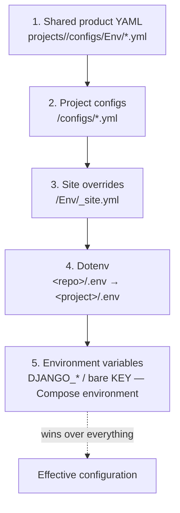
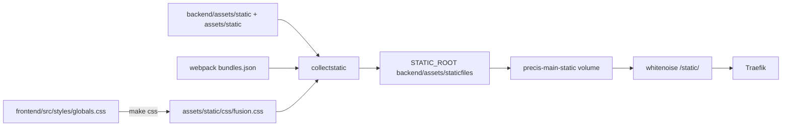

# 🧅 Config Cascade & Environments

> **Related:** `dev/back-env/settings-reference.md`, `COMMANDS.md`, `plans/config-cascade.md`,
> `libs/django-fusion/src/django_fusion/config/project.py`
> **Tags:** #configuration #dynaconf #docker #env #static-files #collectstatic

Every Structa Cloud product answers "what value is used and where does it come
from?" through one **layered cascade**. Defaults live in YAML, customization
lives in `.env`, deploy-time truth lives in Docker Compose `environment:`, and
the container always wins. This guide is the single reference for that model.

<!-- AI-generated: review needed -->

---

## 1. The cascade at a glance



| # | Layer | Location | Holds | Example |
|---|-------|----------|-------|---------|
| 1 | Shared product defaults | `projects/precis/configs/Env/*.yml` | site registry, database, security, storage, email, logging, payments | `sites.yml`, `database.yml` |
| 2 | Project configs | `<project>/configs/*.yml` | local-dev defaults, site identity/domains, admin panel, CSS panel | `defaults.yml`, `site.yml`, `admin.yml`, `theme.yml` |
| 3 | Site overrides | `<project>/Env/_site.yml` | per-site identity + feature contract | `_site.yml` |
| 4 | Dotenv | `<repo>/.env` → `<project>/.env` | uncommitted secrets + local customization | `DJANGO_DEBUG=1` |
| 5 | Environment | Compose `environment:` / container | deploy-time truth — **always wins** | `DJANGO_DEBUG=0` |

**Rule of thumb:** YAML = defaults, `.env` = customization, Compose `environment:`
= deployment truth. Never commit secrets to YAML; keep them in `.env` (gitignored)
or injected by Compose.

The loader that implements layers 1–5 for Django-Fusion projects is
`django_fusion.config.project.ProjectConfig` (pure Python, no Django
required). `make config-show` prints the merged result for the current
project, and `ProjectConfig.resolve(base_url, side)` applies **base-URL
priority** — given the front/back origin (e.g. `https://lms.structa.cloud` or
`http://localhost:3000`), the matching site identity (domains, allowed hosts,
admin URL) is overlaid on top of the cascade, still below environment
variables.

---

## 2. Docker environment cascade

Docker Compose resolves configuration in three separate cascades that combine
into the container environment:

### 2.1 Interpolation (`.env` → compose file)

Compose reads `${VAR}` / `${VAR:-default}` placeholders from the `.env` file in
the **current working directory**:

```bash
# <repo>/.env  (shared secrets, DNS tokens, DB password)
POSTGRES_USER=admin
POSTGRES_PASSWORD=super-secret

# <project>/.env  (project customization — copied from .env.example)
DJANGO_DEBUG=1
```

```yaml
# docker-compose.yml — defaults in the file, customization from .env
environment:
  DJANGO_DB_PASSWORD: ${POSTGRES_PASSWORD:?Set POSTGRES_PASSWORD (shared) in .env}
  DJANGO_DEBUG: ${DJANGO_DEBUG:-0}
```

### 2.2 `env_file` (files injected into the container)

`env_file:` entries are injected in order — **later files override earlier
ones**, and a missing file is fine when `required: false`:

```yaml
services:
  backend:
    env_file:
      - path: ../../../.env     # repo root — shared
        required: false
      - path: ./.env            # project — overrides the root file
        required: false
```

### 2.3 Precedence inside a service

| Source (low → high) | Notes |
|---------------------|-------|
| Image `ENV` (Dockerfile) | build-time baked values |
| `env_file:` entries | later files win |
| Compose `environment:` block | **wins over env_file and .env** |
| `docker compose run -e KEY=val` / `--env-file` CLI | highest, per-invocation |

### 2.4 Override files (the Docker cascade)

Compose auto-loads `docker-compose.override.yml` next to the base file. This is
the canonical place for **local-dev differences** (ports, debug flags, live
mounts) — production deploys ignore it:

```yaml
# projects/structa.cloud/docker-compose.override.yml
services:
  backend:
    ports: ["8074:8074"]
    environment:
      DJANGO_DEBUG: "1"
    volumes:
      - ./configs:/app/structa.cloud/configs:ro
```

```bash
cd projects/structa.cloud
docker compose up -d --build        # auto-loads the override
```

> ⚠️ Overrides apply automatically whenever the stack is brought up from that
> directory. Bring the production stack up from the proxy/root compose files
> (or with explicit `-f` flags) so the dev override never leaks into deploy.

---

## 3. Dynaconf / YAML cascade (Django-Fusion)

The backend reads its env-var **defaults** from a YAML cascade implemented in
`django_fusion.config.project` (`load_config` / `ProjectConfig`). Every file
may use Dynaconf-style environment sections (`default:`, `development:`,
`production:`); the active environment (`SERVER_ENV` / `DJANGO_ENV`) is
deep-merged on top of `default:`.

### 3.1 Project `configs/` directory (beside `frontend/` and `backend/`)

| File | Contents | Example keys |
|------|----------|--------------|
| `defaults.yml` | local-dev defaults + **static-files reference** | `DEBUG`, `ALLOWED_HOSTS`, `PORT`, `STATIC.*` |
| `site.yml` | identity + public domains | `SITE.primary_domain`, `SITE.domains`, `SITE.allowed_hosts` |
| `admin.yml` | admin panel + CSS panel | `ADMIN.panel_path`, `ADMIN.wagtailadmin_base_url`, `CSS_PANEL.*` |
| `theme.yml` | *(optional)* design tokens for the CSS panel | `THEME.colors`, `THEME.fonts` |

```yaml
# <project>/configs/site.yml
default:
  SITE:
    name: precis-main
    primary_domain: structa.cloud
    domains: [structa.cloud, www.structa.cloud, lms.structa.cloud]
    allowed_hosts: [structa.cloud, www.structa.cloud, localhost, 127.0.0.1]
```### 3.2 Consumers

- **Backend** — `backend/settings.py` calls `load_config(BASE_DIR)` and uses
the values as *fallbacks* for `os.environ.get(...)` reads. Environment
variables always win. Precis sites on the shared stack
(`projects/precis/configs/settings/conf.py`) load the same project YAMLs
before `Env/_site.yml` and resolve via `cfg()`.
- **Frontend** — Astro consumes the same identity via the generated
  `frontend/src/config/site-config.json` (created by `make config-front` and read
  by `frontend/src/config/project.ts`); the YAML files are the single source
  of truth for the defaults those `PUBLIC_*` env vars override.
- **Tooling** — `make config-show` / `make config-check` render the merged
  cascade; `docker-compose.yml` mounts `configs/` read-only into the container
  (and the image bakes them via the backend Dockerfile).

### 3.3 Precedence inside the cascade

```text
shared Env YAML  →  project configs/*.yml  →  Env/_site.yml  →  .env  →  env
     (low)                                                              (high)
```

Dotenv keys are normalized (`DJANGO_DEBUG=0` in `.env` drives the same `DEBUG`
key as YAML). Environment overlay maps every `DJANGO_*` var to its base key,
then a bare `KEY` beats the prefixed value.

### 3.4 Base-URL priority resolution (front & back roads)

`ProjectConfig.resolve(base_url=None, side=None)` answers "which site config
applies to this origin?". It parses the URL, matches the host against
`SITE.primary_domain` / `SITE.domains` / `SITE.allowed_hosts` (and, for
localhost, the well-known front/back dev ports), then overlays the matched
site identity on the cascade — still below environment variables.

```python
from django_fusion.config.project import load_config

config = load_config(project_dir="projects/structa.cloud")
backend_view = config.resolve("https://lms.structa.cloud", side="back")
frontend_view = config.resolve("http://localhost:3000", side="front")
```

`make config-show` prints the resolved views for the project's back/front
base URLs, so the effective identity is visible without reading YAML.

---

## 4. Static files reference (read → output → deploy)

The canonical static-files contract lives in `configs/defaults.yml` under
`STATIC:` and is printed by `make config-show` via
`staticfiles_plan()`. It mirrors the Django settings that produce each path:

| Stage | Setting | Path (precis-main) | Meaning |
|-------|---------|--------------------|---------|
| **Read** | `STATICFILES_DIRS` | `backend/assets/static`<br/>`assets/static`<br/>`frontend/public` | source assets `collectstatic` reads |
| **Bundle** | `WEBPACK_LOADER` / `FUSION_PIPELINE` | `backend/assets/static/bundles/bundles.json` | webpack bundle stats (+ `assets/static/bundles/`) |
| **CSS panel** | `make css` output | `assets/static/css/fusion.css` | compiled Tailwind design system (source: `frontend/src/styles/globals.css`) |
| **Output** | `STATIC_ROOT` | `backend/assets/staticfiles/` | collectstatic output — served by whitenoise |
| **Media** | `MEDIA_ROOT` | `backend/assets/media/` | editor/user uploads |
| **Deploy** | named volumes | `precis-main-static`<br/>`precis-main-media` | Docker volumes mounted in `docker-compose.yml` |
| **Serve** | URL + server | `/static/` → whitenoise (backend) behind Traefik<br/>`/media/` → shared-proxy nginx | request-time serving contract |

### 4.1 The `collectstatic` + bundle flow (action by action)



| Command | What it does | Action taken on files |
|---------|--------------|------------------------|
| `make css` | Compile the Tailwind design system (globals.css → `fusion.css`) | **writes** `assets/static/css/fusion.css` (committed) |
| `npm run build` (frontend) | Astro production build | **writes** `frontend/dist/` |
| `make build-assets` (webpack) | Bundle django-fusion SCSS/JS | **writes** `backend/assets/static/bundles/` + `bundles.json` |
| `make skeleton-manifest` | Generate the skeleton JSON manifest | **writes** `backend/assets/static/skeleton-manifest.json` |
| `python manage.py collectstatic --noinput` | Copy every `STATICFILES_DIRS` source + bundles into `STATIC_ROOT` | **copies** `STATICFILES_DIRS` → `STATIC_ROOT` |
| container startup (`docker compose up`) | `migrate` → `collectstatic` → `seed_pages` → `seed_learning` → `gunicorn` | **copies** into the `precis-main-static` volume, then serves |
| `make backend-check` / `manage.py check` | Django system checks | read-only validation |

> The startup command in `docker-compose.yml` runs `collectstatic --noinput`
> on every boot, so the named volume always matches the image's `STATIC_ROOT`.
> In local dev, `make css` + `make backend-dev` + the override's bind mounts
> keep the same files live without Docker.

---

## 5. Commands that act on the cascade

| Command | Reads | Writes / effect | Verifies |
|---------|-------|-----------------|----------|
| `make config-show` | cascade (YAML + .env + env) | prints merged cascade + static plan | nothing |
| `make config-check` | cascade | none | required identity keys resolve |
| `make css` | `frontend/src/styles/globals.css` | `assets/static/css/fusion.css` | Tailwind compile |
| `make build-assets` | webpack config + fusion SCSS | `backend/assets/static/bundles/` | bundle manifest |
| `make collectstatic` | `STATICFILES_DIRS` | `STATIC_ROOT` | file copy |
| `make migrate` | models | DB schema | Django migrations |
| `make check` | settings + apps | none | Django system checks |
| `make test` | test modules | none | pytest suite |
| `docker compose config -q` | compose + `.env` | none | compose file validity |
| `python application/proxy/scripts/validate-traefik-config.py` | traefik dynamic configs | none | router/service validity |

---

## 6. Per-product quick reference

| Product | Cascade root | `configs/` dir | Notes |
|---------|--------------|----------------|-------|
| Precis Main | `projects/structa.cloud/` | ✅ `defaults/site/admin` | env-file root `.env` → project `.env`; `docker-compose.override.yml`; `make config-front` wires the Astro road |
| CTC Research | `projects/precis/precis-ctc/` | ✅ `defaults/site/admin` | shared stack (`configs.settings` MainSettings) loads the project YAMLs before `Env/_site.yml`; `make config-show`/`config-check` |
| Loop-CRM | `projects/loop-crm/` | ✅ `defaults/site/admin` (+ env catalog) | env-first settings; `backend/configs/site.py` seeds env defaults from the cascade (`SITE`/`ADMIN` sections); `make config-show`/`config-check` |
| Syntara | `projects/syntara/` | ✅ `defaults/site/admin` (+ dynaconf loader files) | `settings.yml`/`models.yml` stay the AI-model source; identity defaults via `load_config`; `make config-show`/`config-check` |
| Formint Cloud | `projects/formints/formint-cloud/` | ✅ `defaults/site/admin` | env-driven settings (`backend/configs/__init__.py`); cascade YAMLs document defaults; `make config-show`/`config-check` |
| Formint Pro / Standard / Community | `projects/formints/formint-*/` | ⏳ optional | adopt the same layout when a Django backend is added |

---

## 7. Recommendations & guided plan

The companion planning document (`plans/config-cascade.md`) contains the
full recommendations and the rollout plan for the remaining products. Summary:

1. **Standardize the project `configs/` layout** across all Django-Fusion
   products (`defaults.yml` / `site.yml` / `admin.yml` / `theme.yml`) —
   done for Precis Main, CTC Research, Loop-CRM, Syntara, and Formint Cloud.
2. **Never grow `.env` beyond customization** — defaults belong in YAML so new
   developers get a working stack from `cp .env.example .env` alone.
3. **Keep `STATIC:` in sync with `settings.py` and the Docker volumes** —
   `make config-show` renders from the YAML, so the docs never drift.
4. **Use `docker-compose.override.yml` for local dev only**; keep production
   deploys on the explicit proxy/root compose files.

## Remarks & Notes

- Environment variables are the single source of truth at runtime; the cascade
  only supplies defaults. A checkout with no `configs/` dir behaves exactly as
  before.
- Never print or commit secrets: `.env` files are gitignored; `DJANGO_SECRET_KEY`,
  `POSTGRES_PASSWORD`, SMTP passwords, and social-auth secrets stay out of YAML.
- Keep this guide, each product's `configs/README.md`, and
  `django_fusion.config.project` docstrings in sync when adding a layer.
