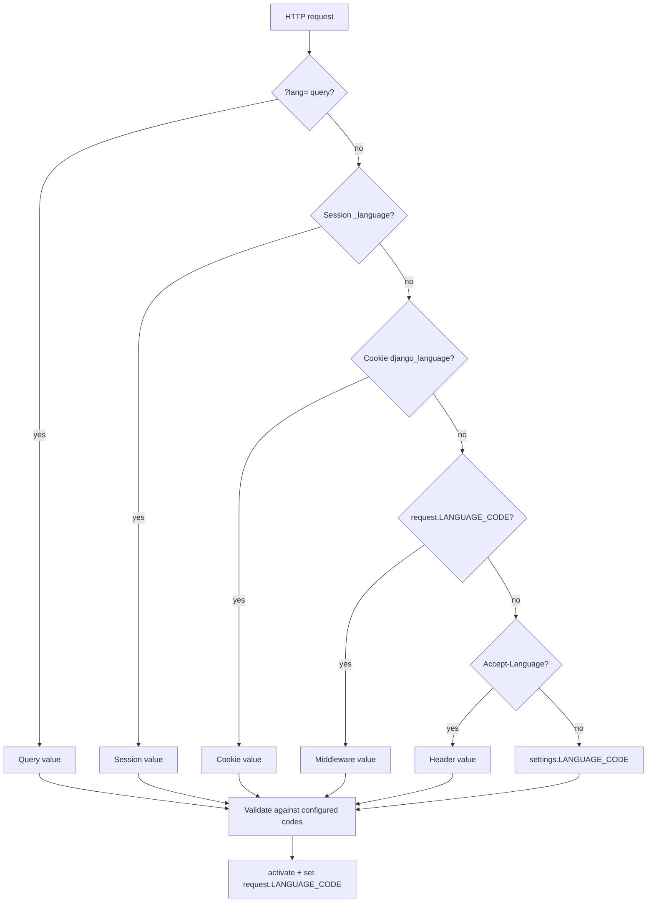
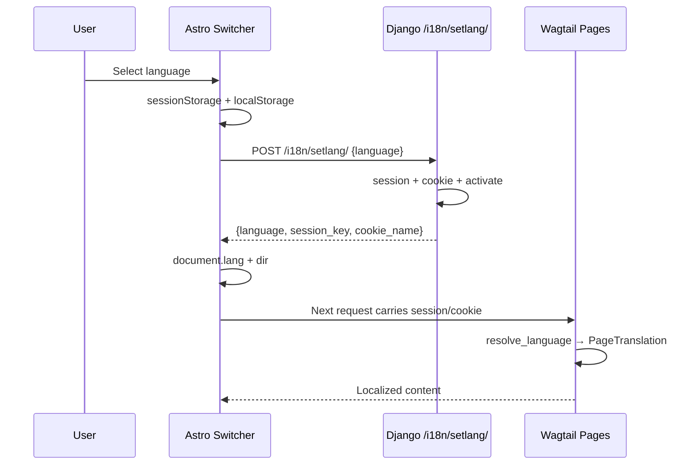
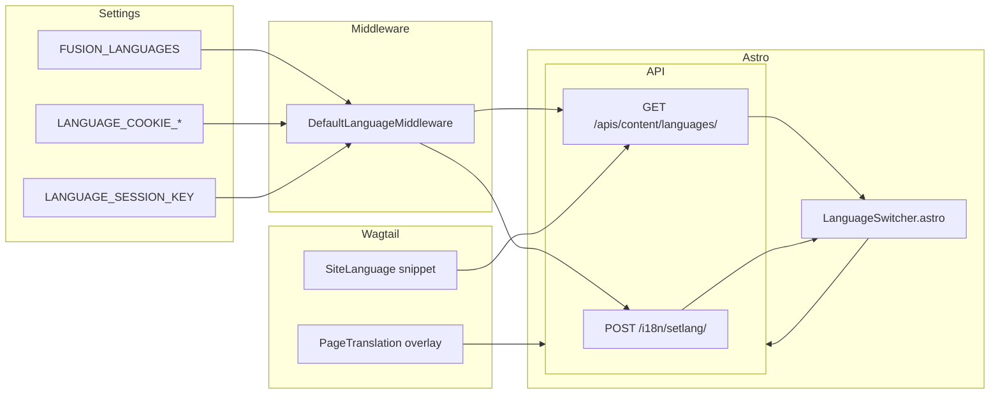

# 🌍 Shared Language Contract

> Every Structa Cloud Wagtail site (Precis Main, Precis Landing, CTC Research) shares one
> language resolution, persistence, and API contract from `django-fusion.core.middlewares.language`.

## How it works

### Language resolution priority

### Language switcher (Astro → Django)

### Settings → Middleware → API → Frontend diagram

## What changed in this session

1. **django-fusion** (`libs/django-fusion/src/django_fusion/core/middlewares/language.py`) now owns:
   - `resolve_language(request)` — unified resolution chain
   - `persist_language(request, response, language)` — session + cookie write
   - `set_language_api` — POST endpoint shared by all sites
   - `language_context(request)` — template/API metadata
   - `configured_language_codes()` — settings-level validation
   - `normalize_language(value)` — BCP-47 normalization with regional code handling

2. **Precis Main** (`projects/structa.cloud/backend/settings.py`) and **Precis Landing** (`projects/precis/precis-landing/backend/settings.py`) now:
   - Use `DefaultLanguageMiddleware` from django-fusion (no more duplicate `LandingLocaleMiddleware`)
   - Register `/i18n/setlang/` via the shared API
   - Share the same `FUSION_LANGUAGES` catalog

3. **CTC Research** (`projects/precis/precis-ctc/backend/apps/pages/pages/landing_api.py`) now:
   - Delegates to `resolve_language()` instead of its own resolution chain
   - Uses `persist_language()` for the session/cookie write
   - Returns backend-resolved language in all API responses

4. **Astro frontends** (all three sites) now:
   - POST to `/i18n/setlang/` on language selection (server-side persistence)
   - Read language from the backend catalog on init
   - Use `sessionStorage` + `localStorage` for client-side fast path
   - Send `credentials: 'include'` and `Accept-Language` headers

## Affine export

This document uses standard Markdown with Mermaid diagrams. To export to Affine:
- Copy the entire `docs/` tree or this file into an Affine document.
- Mermaid diagrams render natively in Affine's code block editor.
- The `object`, `attributes`, `tags`, and `links` frontmatter are metadata for Docus;
  Affine ignores them gracefully.

## Related docs

- [django-fusion DF-020 Language Contract](../../libs/django-fusion/docs/20-language-contract.md)
- [django-fusion DF-007 Configuration](../../libs/django-fusion/docs/07-configuration.md)
- [Precis CTC documentation](../precis-ctc/)
