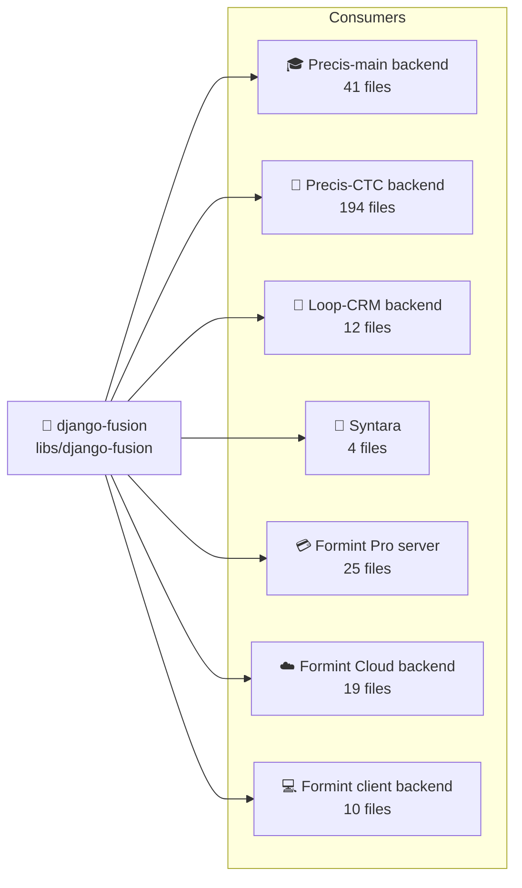
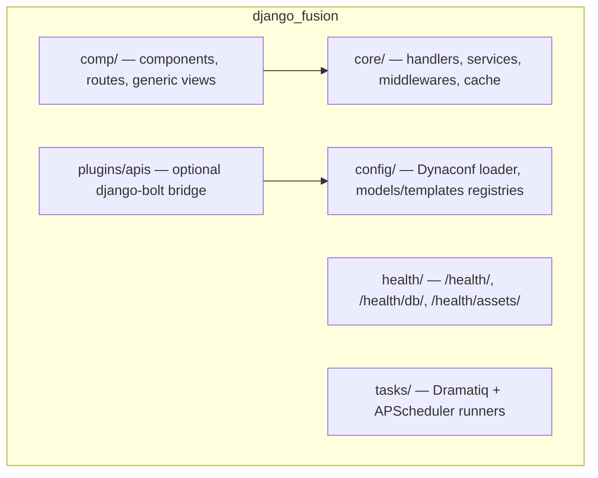

# 🧩 django-fusion — `libs/django-fusion/`

> **Customization level:** 🔴 Not Customizable — use its public API, don't modify internals.
> **Complete package docs** live at [`libs/django-fusion/docs/`](../../libs/django-fusion/docs/INDEX.md) with stable `DF-0NN` IDs.

django-fusion is the shared Django + Wagtail toolkit every Structa Cloud web product is built on:
**component system (``), declarative routing, forms/tables mixins, allauth auth,
Wagtail integration, health checks, and Dynaconf configuration.**

## 🗺️ Where & How It's Used



| Project | Backend path | Usage | Highlights |
|---------|-------------|-------|------------|
| 🎓 Precis (main) | `projects/precis/precis-main/backend/` | Components, routing, fragments, pages | Reference consumer; `` + Viewset pattern throughout |
| 🏥 CTC Research | `projects/precis/precis-ctc/backend/` | Heaviest consumer (194 files) | Health checks, scheduler, Dynaconf, full fusion road |
| 🤝 Loop-CRM | `projects/loop-crm/backend/` | Pages, seed commands, config | `seed_demo`, `seed_pages` management commands |
| 🤖 Syntara | `projects/syntara/` | Config loader, model/template registries | `django_fusion.config.loader` for Dynaconf |
| 💳 Formint Pro | `projects/formints/formint-pro/server/` | Ninja API + fusion viewsets | Merged Django + fusion road |
| ☁️ Formint Cloud | `projects/formints/formint-cloud/backend/` | Cloud master admin + API | Unfold admin + fusion contract |
| 💻 Formint client | `projects/formints/formint-client/backend/` | Purchase app backend | Mirrors precis-landing conventions |

## 🏗️ Framework Map



## Canonical Import Paths

All re-export shims have been removed. Use these paths directly:

```python
# Routing (comp.routes)
from django_fusion.comp.routes import (
    Site, Application, Viewset, BaseViewset,
    ModelViewset, ReadonlyModelViewset,
    route, menu_path, viewprop,
    RoutableComponent, FragmentComponent,
)

# Generic views (comp.generic)
from django_fusion.comp.generic import (
    ListModelView, CreateModelView, UpdateModelView,
    DeleteModelView, DetailModelView, TableView,
    SearchableViewMixin, Action,
)

# Core
from django_fusion.core.handlers import PageHandler
from django_fusion.core.services import BaseService
from django_fusion.core.middlewares import SiteMiddleware
from django_fusion.core.cache import cache_manager
```

## Template Tags

```django
{# Render a component by name #}


{# Tracked include (registers path for component tracking) #}


{# Legacy include (only for dynamic template names) #}

```

## Component Conventions

```
components/
├── blocks/           # Full content blocks
│   ├── contact/
│   │   ├── contact_profile.html
│   │   └── sections/
│   │       └── form.html
│   └── blog/
├── partials/         # Small UI fragments
│   ├── buttons.html
│   └── icons.html
└── tags/             # Custom template tags
```

**Naming rule:** don't repeat the folder name — use `components/blocks/contact/contact_profile.html`, NOT `contact/contact/contact_profile.html`.

## Fragment Convention

Always use `fragment_name` for fragment identifiers:

```python
context['fragment_name'] = 'login-form'   # ✅ correct
context['fragment'] = 'login-form'        # ❌ wrong
context['name'] = 'login-form'            # ❌ wrong
```

## Viewset Pattern

```python
class ProductViewset(ModelViewset):
    model = Product
    fields = ['name', 'price', 'category']
    list_display = ['name', 'price']
    search_fields = ['name']
```

## 📚 Package Docs (DF-0NN)

The library ships its own complete guide under `libs/django-fusion/docs/`:

| Area | Guide |
|------|-------|
| Getting started | [DF-001](../../libs/django-fusion/docs/01-getting-started.md) |
| Component system | [DF-003](../../libs/django-fusion/docs/03-component-system.md) |
| `` tag | [DF-004](../../libs/django-fusion/docs/04-component-tag.md) |
| Routing & viewsets | [DF-005](../../libs/django-fusion/docs/05-routing.md) |
| Forms & tables | [DF-006](../../libs/django-fusion/docs/06-forms-and-tables.md) |
| Health checks | [DF-009](../../libs/django-fusion/docs/09-health.md) |
| Wagtail integration | [DF-010](../../libs/django-fusion/docs/10-wagtail-integration.md) |
| Troubleshooting & FAQ | [DF-013](../../libs/django-fusion/docs/13-troubleshooting.md) · [DF-014](../../libs/django-fusion/docs/14-faq.md) |

## Remarks & Notes

- Import the real symbol from its owning module — no re-export shims, no forwarding `__init__.py`.
- The former `django_fusion.comp.templatetags` names remain the live tag library; do not invent a `comp.tags` alias in product code.
- For routed backend views use `RoutableComponent` / `FragmentComponent` from `django_fusion.routes.components.*`.
- Framework changes belong in `libs/django-fusion/`, never in product code.
