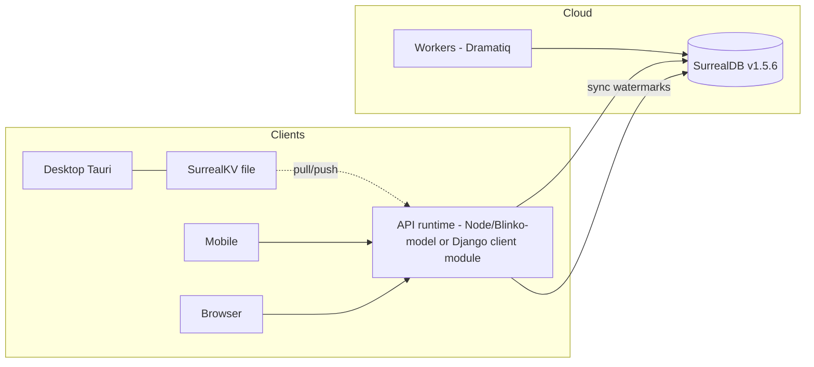

# SurrealDB Migration Plan — Formints + Loop CRM

> Status: DRAFT — awaiting user review before any implementation.
> Companion to `tauri-multi-platform-plan.md`.

## 1. Goal

Move **Formints (POS editions)** and **Loop CRM** onto SurrealDB as the
primary datastore, matching the architecture already proven by the Blinko
runtime (`application/tools/planing/runtime`, SurrealDB v1.5.6 in production),
and link both to the cloud so desktop/mobile clients sync through one
datastore shape.

## 2. Why SurrealDB — benefits

| Benefit | Concrete effect for these projects |
|---|---|
| Single engine from edge to cloud | Same SurrealQL for a desktop-embedded file store (SurrealKV), a small server (Formint store sync), and the cloud master — no SQL dialect drift between desktop/cloud/mobile shells from the Tauri plan |
| Record links + graph clauses | CRM relations (`deal → company → contact`, pipeline stage chains, POS order→line→payment) become native graph edges instead of join tables; backlinks (Blinko's wiki-link model) map directly to CRM activity timelines |
| Schema-flexible + `DEFINE FIELD` | Custom CRM fields/objects (already requested for Loop CRM) can be added per workspace without Django migrations on every tenant change |
| Live queries (LIVE SELECT) | Kanban boards, calendar grids, and POS dashboards update without polling; removes most Dramatiq/Redis notification glue |
| Built-in auth scopes | Per-workspace scoping that Blinko already models (accounts, memberships, roles) can be enforced at the database layer |
| Embeddable, single binary | Formint desktop (Tauri) can embed SurrealKV with zero DBA; one file per POS terminal |
| Multi-model in one query | Documents (notes/orders), graphs (links), and aggregates (dashboards) without a second engine |

Honest tradeoffs: smaller ecosystem than PostgreSQL, weaker BI/reporting
tooling, and Django ORM does not talk to SurrealDB — the runtime layer must be
either a thin client service (Blinko model) or Django with a dedicated
SurrealDB client module.

## 3. Reference architecture (proven by Blinko)

Blinko's deployed pattern to copy:
- SurrealDB pinned (`v1.5.6`), Docker volume, healthcheck (`isready`), dedicated network.
- One Node runtime owns all queries; clients never touch SurrealDB directly.
- Schema defined in code (`DEFINE FIELD`), idempotent bootstrap, workspace-scoped records.
- Auth: accounts + bcrypt + scoped JWT; workspace membership edges.

## 4. Per-project scope

### 4.1 Loop CRM (start here — smaller blast radius)

| Step | Work | Notes |
|---|---|---|
| L1 | Add SurrealDB service to `projects/loop-crm/docker-compose.yml` | Pin v1.5.6, volume, healthcheck, dedicated network (copy Blinko compose stanza) |
| L2 | Choose runtime road | Option A: Node sidecar mirroring Blinko's `server.mjs` pattern; Option B: Django client module (`surrealdb` Python, async) inside django-fusion conventions |
| L3 | Mirror core resources | workspaces, accounts/memberships, companies, contacts, deals, pipelines, stages, activities, campaigns — with `DEFINE FIELD` schema + workspace edge scoping |
| L4 | Dual-write shadow period | Existing PostgreSQL stays authoritative; a sync service writes to SurrealDB; parity tests compare both stores |
| L5 | Read-path cutover per resource | Kanban + calendar + graph first (they benefit most from LIVE SELECT); then lists |
| L6 | Write-path cutover + drop dual-write | Only after parity dashboards are green for 2 weeks |

### 4.2 Formints

| Step | Work | Notes |
|---|---|---|
| F1 | Edition-specific stores | `formint-community`/`formint-pro`: SurrealKV embedded file per terminal (replaces SQLite); `formint-cloud`: SurrealDB server (replaces its Django-served DB for POS domain) |
| F2 | Sync protocol | Terminal → cloud: `updated_at` watermark push/pull per record family (orders, line items, payments, shifts); offline-first, idempotent record IDs |
| F3 | Cloud master consolidation | POS domain in SurrealDB; Django keeps auth/admin or is replaced by a thin runtime (decision point) |
| F4 | Migration tooling | One-shot importer: SQLite/Postgres dump → SurrealQL; dry-run mode + checksum verification |

## 5. Cloud linking (both projects)

- One SurrealDB cluster per environment (dev/stage/prod), namespace per product
  (`loopcrm`, `formints`), database per environment — same engine, hard
  namespace isolation.
- Desktop/mobile shells (Tauri plan) authenticate with scoped JWTs; sync via
  watermark pull/push; conflict policy server-wins first, field merge later.
- Backups: `surreal export` cron + volume snapshots; restore drill documented.
- Observability: query latency + LIVE subscription counts exported with the
  existing metrics stack.

## 6. Risks & mitigations

| Risk | Mitigation |
|---|---|
| Django ORM has no SurrealDB backend | Thin client module + repository pattern; no ORM pretend-layer |
| Migration data loss | Dual-write + parity tests + checksums; cutover is per-resource, reversible |
| Team unfamiliarity | Blinko runtime is the in-repo reference; its schema/auth/sync patterns are production-proven here |
| Transaction semantics differ from Postgres | Keep multi-record invariants (deal totals, order totals) in service-layer recomputation, as Blinko does |
| Version pinning | Pin SurrealDB like Blinko does; upgrade via staged environments only |

## 7. Sequencing & estimates

| Phase | Content | Estimate |
|---|---|---|
| P0 | Decision points below + Loop CRM compose service | 1 w |
| P1 | Loop CRM schema + dual-write + parity tests | 2–3 w |
| P2 | Loop CRM read cutover (kanban/calendar/graph) | 1–2 w |
| P3 | Loop CRM write cutover | 1–2 w |
| P4 | Formints embedded SurrealKV + importer | 2–3 w |
| P5 | Formints cloud master + sync protocol | 3–4 w |

## 8. Decision points for review

1. Loop CRM runtime road: Node sidecar (Blinko parity) vs Django client module?
2. Formint cloud: keep Django for auth/admin, or replace with a thin runtime?
3. Dual-write tolerance: how long must parity be green before write cutover?
4. Namespace layout: per-product namespaces on one cluster, or separate clusters?
5. Go/no-go on LIVE SELECT adoption in the first pass, or defer to P3?

## 9. Review notes (2026-09-17)

<!-- AI-generated: review needed -->
Grounded against production experience gained since the draft was written —
the Planing/Blinko runtime has since accumulated more SurrealDB patterns that
directly de-risk this plan:

- **SCHEMAFULL object fields strip untyped inner keys** (§6 risk table
  addition): storing `option<object>` custom fields requires declaring
  sub-fields (`custom_fields.*: flexible`) — discovered the hard way when
  Blinko support-ticket custom fields came back empty. The §2 benefit "schema
  flexibility" needs this caveat in any custom-CRM-fields milestone (L3).
- **Aggregate subqueries return arrays, not scalars**: `(SELECT count() …
  GROUP ALL).count` fails `option<number>` validation. Use `VALUE`-extracting
  scalar selects. Affects dashboard/aggregate milestones (L5, F3).
- **The proven pattern set is now larger**: tickets with custom field
  definitions + replies + seeded samples, kanban/calendar editors, and a
  force-graph all run on the Blinko-model runtime (SurrealDB v1.5.6,
  schema-in-code, idempotent bootstrap, workspace scoping) — §3's "reference
  architecture" claim is stronger than at draft time. 37/37 Playwright tests
  green against it.
- **Per-suite test isolation maps to namespace isolation** (§5): the Playwright
  restructure showed shared engines cause bootstrap-admin collisions; the
  per-product namespace layout in §5 is validated — keep one namespace per
  product per environment, and never share namespaces between test suites.
- **`updated_at` watermark sync (§4.2/F2)**: Blinko's `updatedAt`-driven
  timeline and graph payloads already model the client-side filtering pattern;
  extend rather than invent.

**Sequencing suggestion:** P0 unchanged; P1 should include the two
SurrealQL-shape fixes above as acceptance criteria, since they cost hours when
known and days when discovered in production.

## Remarks & Notes
- The honest tradeoffs in §2 remain accurate; add "SCHEMAFULL inner-key declaration" to any developer onboarding for this migration.
- Blinko's engine pin is v1.5.6 — keep the same pin across products until a staged upgrade crosses all environments; CBOR record links must be `RecordId` instances in the JS SDK.
