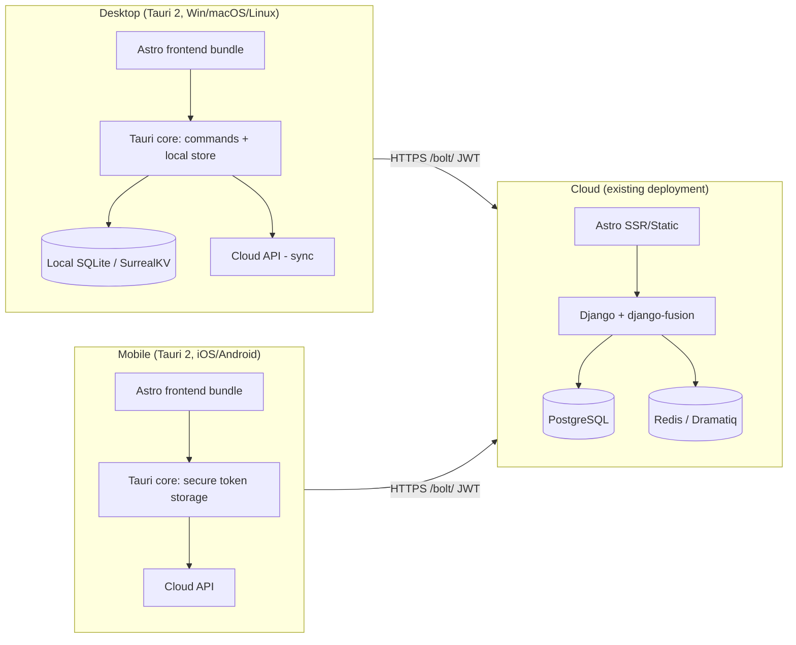

# Loop CRM — Tauri Multi-Platform Plan (Desktop / Cloud / Mobile)

> Status: DRAFT — awaiting user review before any implementation.
> Scope: architecture plan only; no code changes were made for this plan yet.

## 1. Goal

Give Loop CRM the same three deployment surfaces Formints already has, using
Tauri 2 as the shared shell:

| Surface | Formints reference | Loop CRM target |
|---|---|---|
| Desktop app | `formint-community` / `formint-pro` (`src-tauri/`, Rust + SQLite) | Tauri 2 desktop wrapping the Astro frontend, embedded or remote backend |
| Cloud app | `formint-cloud` (Django serves the API; browsers connect) | Existing Django + Astro cloud deployment at `crm.structa.cloud` |
| Mobile app | Tauri 2 mobile capability (`tauri android build` / iOS) | Tauri 2 iOS/Android shells reusing the same frontend and API contracts |

The principle copied from Formints: **one UI codebase, many shells, one API
contract.** The Django backend stays the cloud master; the desktop/mobile
shells talk to either the cloud API or a local embedded sidecar.

## 2. Current state (audited)

- `projects/loop-crm/frontend/` — Astro + React islands + HTMX/Alpine, talks to
  Django via `/apis/core/` (session cookie road) and `/bolt/` (JWT token road).
- `projects/loop-crm/backend/` — Django + Wagtail + django-fusion,
  workspace-scoped resources, Dramatiq workers, Redis.
- No `src-tauri/` directory exists in Loop CRM yet.
- Formints reference implementations exist locally:
  `projects/formints/formint-pro/` (desktop + pro API) and
  `projects/formints/formint-cloud/` (cloud master).

## 3. Target architecture

### 3.1 Frontend reuse strategy

- The Astro frontend builds to a static bundle; Tauri loads it from
  `dist/` on desktop/mobile exactly as Formints loads its UI.
- API base URL becomes configurable per shell:
  - desktop local mode → `http://127.0.0.1:<sidecar-port>`
  - desktop/mobile cloud mode → `https://crm.structa.cloud/bolt/`
- `configSlice.ts` already carries an API base; extend it rather than adding a
  new config road.

### 3.2 Backend modes

**Mode A — Cloud-first (recommended first milestone):** desktop/mobile are
thin clients against the existing Django API. No offline mode. This is the
smallest change that ships all three surfaces.

**Mode B — Offline-capable desktop (phase 2):** embed a local data plane.
Formints uses SQLite; Loop CRM would embed either SQLite (via Tauri SQL
plugin) or SurrealKV to match the SurrealDB direction planned separately.
Sync to cloud via the same resource APIs with `updated_at` watermarks and
per-workspace conflict policy (`server-wins` first, then field-level merge).

## 4. Milestones

| # | Milestone | Key work | Estimate |
|---|---|---|---|
| 1 | Tauri scaffold | `src-tauri/` with Tauri 2, CSP, updater config, icons, CI builds | 2–3 d |
| 2 | Cloud-mode desktop | Static frontend in Tauri, JWT login via `/bolt/`, deep links `loopcrm://` | 3–5 d |
| 3 | Mobile shells | iOS/Android targets, secure token storage (Keychain/Keystore), push-ready | 3–5 d |
| 4 | Packaging + signing | Notarization (macOS), code signing (Win), Play Store/APK + TestFlight | 2–4 d |
| 5 | Offline mode (phase 2) | Embedded SQLite/SurrealKV sidecar, watermark sync, conflict UI | 2–3 w |

## 5. Risks

- **JWT secret management on mobile** → store in Keychain/Keystore via Tauri
  secure store plugins, never in localStorage.
- **HTMX islands assume Django-rendered HTML.** In Tauri shells the React
  islands + `/bolt/` JSON road must cover every route the shell exposes; HTMX
  partials remain cloud-browser-only. Needs a route-by-route parity audit.
- **CSP + devtools in production** → lock `csp` in `tauri.conf.json`, strip
  devtools in release builds.
- **App-store policy for embedded databases** — SurrealKV file store keeps
  mobile packages smaller than bundling a full SurrealDB server.

## 6. Open questions for review

1. Offline desktop (Mode B) — required at launch or phase 2?
2. Mobile: both stores, or Android-first?
3. Local store choice: SQLite (formints parity) vs SurrealKV (database-plan parity)?
4. Branding: ship as "Loop CRM" or under the Precis umbrella?

## 7. Review notes (2026-09-17)

<!-- AI-generated: review needed -->
Grounded against work completed since the draft was written:

- **Monorepo rename does not affect this plan.** The unified Precis product now
  lives at `projects/structa.cloud` (formerly `projects/precis/precis-main`);
  Loop CRM is unchanged at `projects/loop-crm/`. Proxy host
  `crm.structa.cloud` and the `/bolt/` JWT road are untouched.
- **Frontend reuse strategy (§3.1) is validated by Formints' model** — one UI
  codebase across shells is exactly how `formint-community`/`formint-pro`
  ship, and Blinko's zero-build static shell proves a Tauri-loadable `dist/`
  works with no server dependency for the UI layer itself.
- **Milestone 1 (Tauri scaffold) has an in-repo template**: copy the Tauri
  config conventions (CSP, updater, icons) from `formints/*/src-tauri/`
  rather than starting from the Tauri docs.
- **Offline mode (Mode B) leans on the SurrealDB plan** — if SurrealKV is the
  local store, the watermark-sync protocol in
  `surrealdb-migration-plan.md` §4.2/F2 is the same protocol; do not design
  two sync stories.
- **Risk validated**: the HTMX-islands parity audit (§5) is real — the
  Planing/Blinko redesign pass showed every server-rendered fragment needs an
  owner before shells can drop the cloud browser.

**Suggested answer defaults** (user still decides): Mode A first with Mode B
phase 2 (matches §4 sequencing); Android-first for mobile (Formints' POS
audience and TestFlight cost both point that way); local store follows the
SurrealDB plan's outcome, not SQLite, if F1 proceeds.

## Remarks & Notes
- Estimates in §4 assume the cloud-mode milestone reuses the existing Astro build; a separate Tauri-tuned build (no SSR, asset paths) may add ~1 day to milestone 2.
- Deep links (`loopcrm://`) need registering per OS in milestone 2, not milestone 4 — signing/notarization does not cover protocol handlers.
