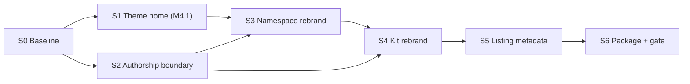

# Structa Cloud — Publish & ThemeForest Rebrand

> **Status:** Proposed — awaiting review · **Owner:** Mahmoud · **Validator:** Moustafa
> **Scope owner:** the structa.cloud product (client checkout)
> **Depends on:** [`THEME_DIRECTORY_STRATEGY.md`](../THEME_DIRECTORY_STRATEGY.md) · [`workspace-crm/04`](../workspace-crm/04-theme-files-and-components.md), [`05`](../workspace-crm/05-landing-sample-library.md), [`06`](../workspace-crm/06-theme-guidelines-and-themeforest.md) · [`repository/precis-main-render-flow.md`](../repository/precis-main-render-flow.md)
> **Tags:** `#structa-cloud` `#publish` `#themeforest` `#rebrand` `#licensing` `#packaging` `#variations`

<!-- AI-generated: review needed -->

## Goal

The defining plan for taking **structa.cloud** to a sellable ThemeForest item.
It does three things and refuses to do a fourth:

1. **Inventories** every existing plan that already owns a slice of structa.cloud,
   so this program extends them instead of forking them.
2. **Fixes the four surfaces** that still carry retired or third-party identity.
3. **Defines the publish path** — pack, listing metadata, licence audit, gates.

It does **not** create a second product, a second theme library, or a second
publish pipeline. Where a decision already belongs to another plan, this document
points at it.

**One correction up front, because everything else depends on it:** the `fu-*`
theme namespace is not ours to rename yet, and part of
`projects/assets/theme/default/` is a **vendored commercial template**. See
[Blockers](#blockers). Any plan that treats the rebrand as a find-and-replace
will ship a licence problem.

---

## 1. The plans related to structa.cloud

| Plan | Owns | Status | Interaction with this program |
|---|---|---|---|
| [`workspace-crm/06-theme-guidelines-and-themeforest.md`](../workspace-crm/06-theme-guidelines-and-themeforest.md) | Theme guidelines + the 3-item publish pack (`paper-ink-saas`, `loop-crm-ops`, `atelier-learning`) | Proposed | **Consumed, not restated.** This program adds the *structa.cloud* item — `aperture-suite` — making the pack **four** items, and reuses M6's guidelines and gates. All four carry brand-free metadata; see [Product naming standard](#product-naming-standard-decided-2026-09-21). Note: M6's cited precedent `projects/formints/PUBLISH.md` **does not exist in this checkout** (POS now lives at `projects/POS/`), so the kit that survives is the one we rebrand in S4. |
| [`workspace-crm/05-landing-sample-library.md`](../workspace-crm/05-landing-sample-library.md) | `themes/` samples library, `themes/registry.json`, `build-sample.mjs`, `audit-provenance.mjs`, the M5.5 licence gate | Proposed | Supplies the page manifests the structa.cloud item is assembled from. M5.5's provenance gate is reused by **S2** rather than re-implemented. |
| [`workspace-crm/04-theme-files-and-components.md`](../workspace-crm/04-theme-files-and-components.md) | Per-project `theme/` dirs + the portable HTML component layer. **M4.1 — "structa.cloud theme home" — is unanswered.** | Proposed | **S1 answers M4.1** for structa.cloud and records it there. |
| [`THEME_DIRECTORY_STRATEGY.md`](../THEME_DIRECTORY_STRATEGY.md) | Variation-id + token-namespace contract | Active | **S3** implements the structa.cloud rows of it. |
| [`repository/precis-main-render-flow.md`](../repository/precis-main-render-flow.md) | Accepted Compose / Nx / Fusion render-flow contract for the product | Accepted | Do not disturb. Packaging may not change runtime identity. |
| [`repository/active-monorepo-consolidation-2026-08-14.md`](../repository/active-monorepo-consolidation-2026-08-14.md) | Shared Dramatiq, Nx, dev workspace | In progress | Gates the deploy side of the demo host. |
| [`django-fusion/config-cascade-plan.md`](../django-fusion/config-cascade-plan.md) | Base-URL / config cascade | Implemented | The listing and the demo must not leak config values. |
| [`docs/publish/`](../../publish/README.md) | Deploy + release publishing (docker, POS, CI/CD) | Active | **S5 adds the marketplace listing this section is missing.** |
| `…/PUBLISH.md` (structa.cloud checkout) | The existing marketplace kit | **Stale** | **S4** rebrands it; **S2** decides what may legally be inside it. |

> **Path drift — read this before following any link.** `docs/` widely references
> `projects/structa.cloud/`, `projects/formints/`, `projects/syntara/`,
> `projects/loop-crm/`. This checkout actually has `projects/Clients/structa.cloud/`,
> `projects/POS/`, `projects/CMS/`, `projects/CRM/`. The only `PUBLISH.md` in the
> tree sits at the self-nested submodule path
> `projects/Clients/structa.cloud/projects/Clients/structa.cloud/PUBLISH.md`.
> Recorded as blocker **B3** — resolve the real path before editing anything.

---

## 2. The four rebrand surfaces (verified evidence)

| # | Surface | Today | Evidence | Handled by |
|---|---|---|---|---|
| 1 | **Marketplace kit** | Titled *"Precis — Marketplace Publish Kit"*; item *"Precis — Unified LMS & Landing Platform"*; tags begin `prec, lms`; asserts *"This work is entirely my own"* | `…/PUBLISH.md` | **S4** |
| 2 | **Theme base** `projects/assets/theme/` | `default/` is a vendored copy of a commercial education template | `default/tokens/_style.scss:3` → `Template Name: Histudy - Online Courses & Education Bootstrap5 Template`; `default/components/footers/Footer.html:145` → `Copyright © 2023 … Rainbow-Themes. All Rights Reserved`; `default/components/headers/HeaderHomeTechnology.html:14` → upstream checkout link `themeforest.net/checkout/from_item/42846507?license=regular`; **158 `Histudy` occurrences across 32 files** — every one under `theme/default/`, none in an authored surface | **S2 — decided 2026-09-21: exclude, and brand via the authored `fu-attribution` band instead** |
| 3 | **Marketplace metadata + `docs/publish/`** | Only deploy/release pages — no listing, previews, pricing, or per-asset licence audit | `docs/publish/` contains README + `docker-deploy` + `pos-release` + `ci-cd` | **S5** |
| 4 | **Variation / theme naming** | structa.cloud's variation id is `precis-atelier` — named after the retired product; the 8 token-only variations share the `fu-<name>-*` prefix | `THEME_DIRECTORY_STRATEGY.md` variation inventory; `theme/README.md` tokenisation table; `theme/THEME-VARIATIONS.md` | **S3** (after B1) |

### Product naming standard (decided 2026-09-21)

**Marketplace item metadata is brand-free.** The item name, slug, tags, and
listing copy name the *product*, never the vendor brand. The owning product is
identified in the kit's own docs and in this plan — both outside the listing
fields.

| | |
|---|---|
| Pattern | `<Theme Name> - <Purpose descriptor>` |
| Slug | `<theme>-<purpose>` |
| Denied in metadata | `structa`, `precis`, `cypercloud`, `vresume` |

This supersedes the brand-bearing item name recorded in the previous revision of
the map (`Structa Cloud - Unified LMS, Landing & Research Platform`).

**The pack is four items:**

| Item | Theme | Category |
|---|---|---|
| `paper-ink-saas` — Paper & Ink - SaaS & Corporate Kit | `fu-paper-ink` | Business / Corporate |
| `loop-crm-ops` — Loop - CRM & Operations Suite | `loop-crm` | Business / SaaS |
| `atelier-learning` — Atelier - Education & Course Platform | `precis-atelier` | Education |
| **`aperture-suite` — Aperture - LMS, Landing & Research Suite** | *TBD — S1 answers M4.1* | Education / SaaS |

The three M6 items keep M6's slugs verbatim; their titles are derived here from
those slugs so all four read uniformly, and M6 still owns their page sets. The
fourth is the item this program adds. The live list is
`marketplace.pack` in [`tools/rebrand-map.json`](tools/rebrand-map.json).

> **Why the naming rule is not a denylist rule.** It cannot be enforced by a
> file-wide regex: the authored `fu-attribution` band (S2.3) is *required* to
> carry the brand, so a blanket `structa` deny would flag our own colophon. The
> rule is enforced against listing metadata fields at **S5.1**, and against the
> kit's item-name string by **R1/R2**.

---

## 3. Blockers

Nothing is packaged before these are answered with an owner and a decision.

| # | Blocker | Why it blocks | Resolution | Owner |
|---|---|---|---|---|
| **B1** | **`fu-*` namespace provenance is undecided** | Two candidate origins, no recorded decision. *Inherited from the vendored template:* the archive's own markup uses `fu-btn--link`, `fu-link--hover`, `fu-card__title` (`default/components/headers/HeaderHomeTechnology.html:14`, `default/components/footers/Footer.html:145`). *Ours:* `theme/README.md` says the token prefix "matches the existing fusion `--fu-*` convention" and the engine exposes `fu-theme-remap()`. Renaming is a **breaking change to the public class contract** of every consuming product, so it is decided *before* S3, not during it. | Record the origin; set the rename scope to authored surfaces only | Mahmoud |
| **B2** | **Vendored commercial template** | `theme/default/{tokens,templates,components}/` is a copy of a paid ThemeForest item with the upstream author's copyright notice and purchase link intact. The marketplace licence does not permit re-selling derived item source as a separate item. | **DECIDED 2026-09-21 — authored surfaces only.** Excluded from every publish set; never renamed, never re-licensed (same treatment M6 gives AGPL-derived blocks). Structa Cloud branding lands in the authored `fu-attribution` band instead — see S2.3. Recorded in [`tools/rebrand-map.json`](tools/rebrand-map.json) → `decisions[]` | Mahmoud |
| **B3** | **Path drift** (see the note in §1) | Every link in this plan and in the kit may resolve to a path that does not exist in the working checkout | Resolve the real path, or name the dispatcher alias for it | operator |
| **B4** | **Unsubstantiated authorship claim** | *"entirely my own / full rights to sell"* is false while any part of `theme/default/` can enter the set | Becomes true only once **S2** produces an authored-only set; until then the claim stays gated | Mahmoud |
| **B5** | **No live demo target** | The marketplace requires a demo per item | Operator-owned static host | operator |

---

## 4. Milestone chain



| # | Milestone | Outcome | Depends on |
|---|---|---|---|
| S0 | **Baseline** | Recorded counts + B1/B3 answered. No writes | — |
| S1 | **Theme home** | M4.1 answered for structa.cloud and recorded in M4 | S0 |
| S2 | **Authorship boundary** | An authored-only publish set exists, with the excluded list written down and a per-asset licence audit | S0 |
| S3 | **Namespace rebrand** | The variation id and token namespace carry the product's own name; grep checks clean | S1, S2, B1 |
| S4 | **Kit rebrand** | The marketplace kit reads as Structa Cloud end to end, with claim language gated | S2, S3 |
| S5 | **Listing metadata** | A `docs/publish/marketplace.md` page: metadata, previews, pricing guidance, submission notes | S4 |
| S6 | **Package + gate** | One item packaged reproducibly; demo renders from the zip's contents alone | S5 |

---

## 5. Tasks

| # | Task | Done when | Effectful |
|---|---|---|---|
| S0.1 | Baseline the surfaces | `node docs/plans/structa-cloud/tools/rebrand.mjs --check` run and its counts recorded in this plan | no |
| S0.2 | Answer **B1** | The `fu-*` origin is recorded and the rename scope is set to authored surfaces | no |
| S0.3 | Answer **B3** | Every path in this plan and in the kit resolves, or the alias that maps it is named | no |
| S1.1 | Resolve M4.1 for structa.cloud | Theme home recorded in [`workspace-crm/04`](../workspace-crm/04-theme-files-and-components.md) | no |
| S2.1 | Authorship boundary | Publish-set include/exclude list authored; `theme/default/{tokens,templates,components}` explicitly excluded | no |
| S2.2 | Per-asset licence audit | `LICENSES.md` lists every font, icon, image, and diagram with its licence | no |
| S2.3 | Authored attribution band | **Done 2026-09-21** — `engine/components/_fu-attribution.scss` + its use in `preview.html`; carries the Structa Cloud mark, name, and copyright; contains no third-party text; block name deliberately distinct from the vendored `.fu-footer` so the two never collide | no |
| S3.1 | Variation rename | `precis-atelier` → `structa-atelier` across the contract and theme files; `grep -r '^// Variation:'` matches | no |
| S3.2 | Execute the B1 decision | Applied to authored surfaces only; no consumer breaks silently | no |
| S3.3 | Retired identity in fixtures | **Done 2026-09-21** — `tests/fixtures/sites/site_dummy.json` no longer carries `vresume.structa.cloud` (in *both* copies, see §9); the orphan `tests/fixtures/vresume/` pointer dir is removed (deletion-manifest DOC-0036); the fixture READMEs name the current tree instead of `precis-ctc` / `lms` / `VResume` | no |
| S4.1 | Kit rebrand | `rebrand.mjs --apply --surface marketplace-kit` reports clean, and the authorship claim is gated behind S2 | no |
| S4.2 | Previews | Screenshots show the **actual HTML output**, not mockups, and carry no upstream attribute | no |
| S5.1 | Listing page | `docs/publish/marketplace.md` exists and is linked from `docs/publish/README.md` | no |
| S5.2 | Submission notes | Metadata, demo URL, support policy, rejection-recovery list, and how a repo change becomes a marketplace update | no |
| S6.1 | Package | One item assembled from the manifests; `--check` fails when the package is stale | no |
| S6.2 | Gate | `rebrand.mjs --check` exits 0 and the demo renders from the zip alone | no |

---

## 6. Gates

- `rebrand.mjs --check` exits **0**.
- **No third-party-derived path is in the publish set** — not renamed, not re-licensed, not present.
- No `Histudy` / `Rainbow-Themes` / `fu-themes` / `themeforest.net` string survives in the packaged item, and no unsubstantiated `all rights reserved` claim does either.
- Item name ≤ 100 characters, ≤ 15 tags, no HTML or emoji.
- Listing metadata (item name, slug, tags) contains no `marketplace.deniedTokens` value. Enforced against listing fields at S5.1 — **not** as a file-wide denylist (see §2).
- Preview images are captures of the real output.
- The demo renders from the zip's contents alone.
- Runtime identity is untouched: container names `precis-main-*`, images, and `DJANGO_SITE=precis-main` still deploy.

---

## 7. Definition of done

- [ ] **B1–B5** each carry a decision and an owner — no `TBD`.
- [ ] A publish set exists whose every file is authored and licence-listed.
- [ ] The structa.cloud variation id and token namespace carry the product's own name.
- [ ] Internal docs carry the canonical name; **marketplace metadata carries the brand-free item name**; retired names appear nowhere in either.
- [ ] `rebrand.mjs --check` is clean and re-runnable, and the map is the **only** place identity strings live.
- [ ] `docs/plans/README.md` and `workspace-crm/04` record the M4.1 answer.

---

## 8. The tool

`tools/rebrand.mjs` is the executable form of §6. It is dependency-free Node and
was authored **without being run against the product** — the plan is not yet
approved, so nothing here has been rewritten.

```bash
node docs/plans/structa-cloud/tools/rebrand.mjs --list    # surfaces + gates
node docs/plans/structa-cloud/tools/rebrand.mjs           # check (read-only, default)
node docs/plans/structa-cloud/tools/rebrand.mjs --json    # machine-readable report
node docs/plans/structa-cloud/tools/rebrand.mjs --apply --surface marketplace-kit
```

It has **two jobs that are never mixed**:

| Job | Runs on | Behaviour |
|---|---|---|
| **rebrand** | Surfaces marked `rebrandable: true` | Replaces identity strings from `rebrand-map.json`. Any other surface is never written, whatever the map says |
| **gate** | Surfaces marked `publishSet: true` | Scans for denylist violations — third-party attribution, upstream links, retired names, placeholder media, unsubstantiated authorship claims |

Safety properties: dry-run is the default; `--apply` is explicit; paths under
`neverWrite` (sibling submodules) are refused even with a matching rule;
`fu-*`-carrying surfaces are `rebrandable: false` and therefore report as
*blocked by B1* rather than being rewritten. The tool never uploads, prices, or
submits anything.

> When this plan is approved, the tool graduates out of the plan directory into
> the packaging location M6 names, and the map stays its source of truth.

---

## 9. Reconciliation with in-flight work

| Item | Interaction |
|---|---|
| **M6's item table** | M6 lists `atelier-learning` under variation `precis-atelier`. If **S3** renames that id, M6's row moves with it — one recorded change, not two plans disagreeing. This program adds `aperture-suite` as the fourth item, so M6's table is short by one row until it is updated there |
| **Two identical fixture trees** | `tests/fixtures/` (root checkout) and `projects/Clients/structa.cloud/tests/fixtures/` (submodule) are byte-identical copies in two different repos. A fixture fix must land in both or one goes stale — verified by `diff`, not assumed |
| **M5's provenance gate** | S2 reuses M5.5; it does not write a second provenance checker |
| **M5.7 (no second CI system)** | `--check` is a plain node script meant to be invoked from the existing `make check` / Nx target |
| **`precis-main-render-flow.md`** | Packaging must not alter the accepted runtime identity or the Nx command contract |
| **`structa.cloud` theme home** | S1 answers M4.1's open question; if it decides "reuse `fu-paper-ink`", S3's rename scope shrinks accordingly |

---

## 10. Links

- → [`../../README.md`](../../README.md) — Documentation hub
- → [`../README.md`](../README.md) — Plans registry
- → [`../THEME_DIRECTORY_STRATEGY.md`](../THEME_DIRECTORY_STRATEGY.md) — Variation + token contract
- → [`../workspace-crm/06-theme-guidelines-and-themeforest.md`](../workspace-crm/06-theme-guidelines-and-themeforest.md) — Guidelines and gates this program consumes
- → [`../../publish/README.md`](../../publish/README.md) — Deploy/release publishing
- → [`tools/rebrand-map.json`](tools/rebrand-map.json) — The identity source of truth
