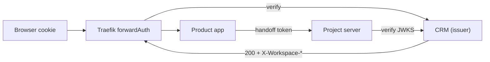

# M2 — Unified workspace session, proxy middleware & secure server navigation

> **Status:** Proposed — awaiting review · **Owner:** Mahmoud · **Validator:** Moustafa
> **Owning products:** `application/proxy/` (edge) · `libs/django-fusion/` (middleware) · `projects/loop-crm/` (issuer)
> **Depends on:** [M1](01-multi-tenant-domain-schemas.md)
> **Tags:** `#session` `#traefik` `#forwardAuth` `#middleware` `#security` `#handoff`

<!-- AI-generated: review needed -->

## Goal

Every product behind the proxy accepts **one** workspace session that already
answers: which domain, which plan, which products, which subscription key — so a
request never re-derives tenancy and a user never re-authenticates between the
landing, the CRM, and a project server.

## The claims set

One signed token, one vocabulary, used by the cookie **and** the handoff token so
they can never disagree:

| Claim | Source | Used for |
|---|---|---|
| `sub` | user id | end-user identity |
| `wid` | `Workspace.id` | the workspace identity (M1 invariant) |
| `sch` | `Workspace.schema_name` | routing / telemetry |
| `dom` | `WorkspaceDomain.domain` | domain↔workspace binding proof |
| `mth` | methodology | methodology profile (M1) |
| `pln` | `Plan.code` | plan gates |
| `prd` | plan product codes | which products the tenant may open |
| `sk` | subscription key | identifies the subscription across products |
| `seats` | plan + seat count | seat enforcement |
| `iat`/`exp`/`jti`/`aud` | issuer | lifetime, replay, audience |

`sk` is stable per subscription, never a secret, and never sufficient alone.

## Two rules that make it safe

1. **Headers are trusted only from the proxy.** The fusion middleware accepts
   `X-Workspace-*` only when the peer is in `TRUSTED_PROXY_CIDRS` **and** the
   shared edge secret matches. Otherwise the headers are stripped and the request
   falls back to the signed cookie — a direct call to an app port never inherits
   a workspace.
2. **Tokens are asymmetric.** The issuer signs; every product verifies locally
   against JWKS. Products never call the issuer on the hot path and cannot mint a
   session.

## Tasks

| # | Task | Done when | Effectful |
|---|---|---|---|
| M2.1 | Claims spec + issuer config | `loop-crm/apps/session/` exists; private key in the secret store, public JWKS served with `kid`; `.env.example` names only | key generation |
| M2.2 | Session endpoints | `POST issue` · `POST refresh` · `GET verify` (headers only) · `POST introspect` · `POST revoke`; verify returns 200 + `X-Workspace-*` or 401 | no |
| M2.3 | Fusion middleware | `WorkspaceSessionMiddleware` sets `request.workspace` with `require(product)` → 403; strips untrusted inbound headers; imports no product model | no |
| M2.4 | Traefik forwardAuth | `workspace-session` on tenant routers, `-optional` on public landings; verify's own router carries no forwardAuth (no loop) | **edge config applies live** |
| M2.5 | Secure handoff | `POST handoff` → allowlisted audience + one-time `jti` + `aud`, `sk` **dropped**; destination derived server-side, no user-supplied `next=` | no |
| M2.6 | Security tests | Tamper, replay, forged header on app port, verify loop, handoff redirect, cross-domain replay, expiry boundary | no |
| M2.7 | Observability | One log line per resolution (`wid`, `sch`, `dom`, source, result); counters for verify 200/401 and handoff outcomes; no tokens or PII | no |

## Gates

- A forged `X-Workspace-*` on the app port authenticates nothing.
- A valid session opens only its own domain (the `dom` claim is checked).
- A handoff token works exactly once.
- `docker compose -f application/proxy/docker-compose.traefik.yml config -q` is
  clean before any router change is applied.

## Effectful — confirm first

- Editing a live Traefik dynamic config re-routes traffic immediately. Changes are
  made on a dev stack and reviewed before any shared environment.

## Links

- → [`README.md`](README.md) — Program index
- → [`01-multi-tenant-domain-schemas.md`](01-multi-tenant-domain-schemas.md) — The workspace identity this session carries
