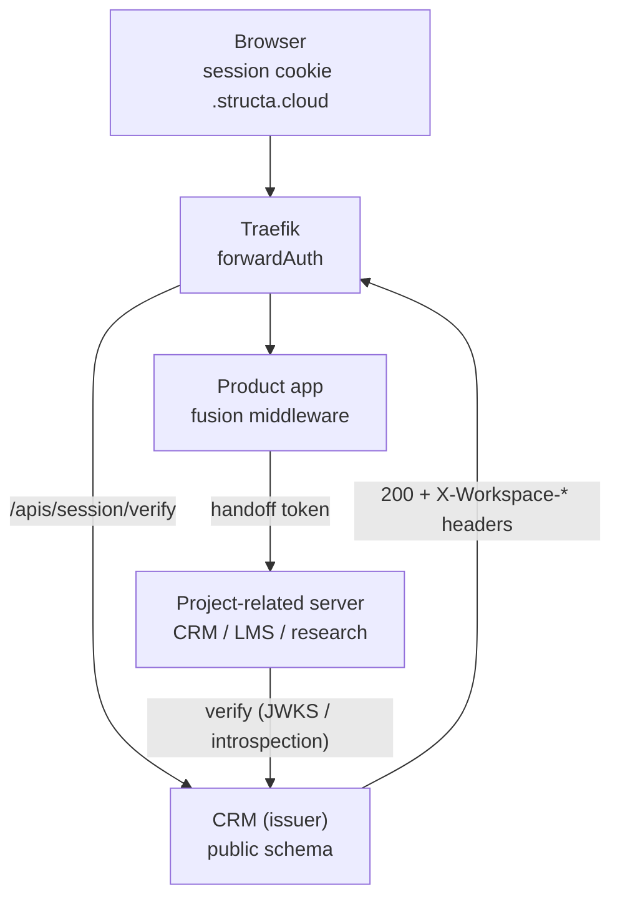

# M2 — Unified Workspace Session, Proxy Middleware & Secure Server Navigation

> **Status:** Proposed — awaiting review
> **Milestone:** M2 of [Workspace CRM Program](README.md)
> **Tags:** `#session` `#proxy` `#traefik` `#forwardAuth` `#middleware` `#security` `#handoff`
> **Owning products:** `application/proxy/` (edge) · `libs/django-fusion/` (middleware) · `projects/loop-crm/` (issuer)

<!-- AI-generated: review needed -->

## 1. Goal

Every product behind the proxy accepts **one** workspace session that already
answers: which domain, which plan, which products, and which subscription key —
so a request never re-derives tenancy and a user never re-authenticates between
the landing, the CRM, and a project server.

## 2. Verified starting point

| Piece | Where | Gap |
|---|---|---|
| Edge routing | `application/proxy/configs/traefik/dynamic/*.yml` — per-host routers (`crm.yml`, `lms-fusion.yml`, `precis-landing.yml`, `ctc-research.yml`, `docs.yml`, `tools.yml`, `space.yml`, `catchall.yml`) + shared `middlewares.yml` | No auth/session middleware; every router is independent |
| Shared middlewares | `libs/django-fusion/src/django_fusion/core/middlewares/{setup,access,errors,site,freeze,language,service,privacy}.py` | No workspace/session middleware |
| CRM session | `loop-crm` allauth + `apps/core/tenancy.py` (`current_workspace_id`) | Session is per-product, not workspace-scoped |
| Subscription state | `loop-crm/apps/billing/` (`Plan`, `BillingAccount`, `Seat`, `gates.py`) | Not readable by other products |

## 3. Identity: the workspace claims set

One signed token, one claim vocabulary, used by the cookie **and** the handoff
token so both can never disagree:

| Claim | Source | Used for |
|---|---|---|
| `sub` | `auth.User.id` | end-user identity |
| `wid` | `Workspace.id` | **the** workspace identity (M1 invariant) |
| `sch` | `Workspace.schema_name` | tenant routing/telemetry |
| `dom` | `WorkspaceDomain.domain` | domain↔workspace binding proof |
| `mth` | `DomainMethodology` | methodology profile (M1) |
| `pln` | `Plan.code` | plan gates |
| `prd` | `Plan.product_codes[]` | which products the tenant may open |
| `sk` | subscription key (`BillingAccount.stripe_subscription_id` or a generated key) | **identifies the subscription** across products |
| `seats` | `Plan` + `Seat` count | seat enforcement |
| `iat`/`exp`/`jti`/`aud` | issuer | lifetime, replay, audience |

`sk` is the subscription identifier the request asked for: it is stable per
subscription, never a secret, and never sufficient on its own to authorise.

## 4. Trust boundary



**Two rules make this safe:**

1. **Headers are trusted only from the proxy.** The fusion middleware accepts
   `X-Workspace-*` solely when (a) the peer is in `TRUSTED_PROXY_CIDRS` and
   (b) the shared `EDGE_SHARED_SECRET` header matches. Otherwise those headers
   are stripped and the request falls back to the signed cookie. A direct
   request to an app port must never inherit a workspace.
2. **Tokens are asymmetric.** The issuer signs with an Ed25519/RSA key; every
   product verifies locally against `/apis/session/jwks/`. Products never call
   the issuer on the hot path, and a product cannot mint a session.

## 5. Milestones (tasks)

### M2.1 — Claims spec + issuer config

- New `loop-crm/apps/session/` (`keys.py`, `tokens.py`, `views.py`, `urls.py`, `tests.py`).
- Key material: private key in the environment/secret store; **public** JWKS served at `/apis/session/jwks/`; `kid` in the token header for rotation.
- `.env.example`: `SESSION_SIGNING_KEY` (path/ref only), `EDGE_SHARED_SECRET`, `TRUSTED_PROXY_CIDRS`, `SESSION_TTL_SECONDS`, `HANDOFF_TTL_SECONDS`.

### M2.2 — Session issue / refresh / verify / introspect endpoints

| Endpoint | Purpose | Auth |
|---|---|---|
| `POST /apis/session/issue` | (re)mint the session after login or plan change | allauth session |
| `POST /apis/session/refresh` | extend a live session, re-read plan/seats | cookie |
| `GET  /apis/session/verify` | forwardAuth target — 200 + `X-Workspace-*`, 401 otherwise | cookie or bearer |
| `POST /apis/session/introspect` | opaque-server fallback for products that cannot verify locally | `EDGE_SHARED_SECRET` |
| `POST /apis/session/revoke` | kill one session (`jti` denylist) on logout/plan cancellation | cookie |

- Response bodies follow the repo's existing envelope; `verify` returns **headers only** (no body) so Traefik can copy them.

### M2.3 — Fusion middleware

- New `libs/django-fusion/src/django_fusion/core/middlewares/workspace.py` exporting `WorkspaceSessionMiddleware`:
  - resolve session: trusted headers → signed cookie → anonymous;
  - set `request.workspace = WorkspaceSession(wid, sch, mth, pln, prd, sk, seats)`;
  - expose `request.workspace.require(product)` raising 403 with a stable code;
  - strip inbound `X-Workspace-*` when the peer is untrusted (defence in depth, independent of the proxy).
- Register in each consuming product's `MIDDLEWARE` after session/auth, before page handlers. Document the position in `libs/django-fusion/AGENTS.md`.
- Keep the module dependency-free of product models: it consumes claims, never imports `loop-crm`.

### M2.4 — Traefik: forwardAuth + header propagation

- `application/proxy/configs/traefik/dynamic/middlewares.yml`:
  ```yaml
  http:
    middlewares:
      workspace-session:
        forwardAuth:
          address: "http://crm-backend:8000/apis/session/verify"
          authResponseHeaders: ["X-Workspace-Id","X-Workspace-Schema","X-Workspace-Plan","X-Workspace-Products","X-Workspace-Subscription","X-Workspace-Methodology"]
          trustForwardHeader: false
      workspace-session-optional:
        forwardAuth:
          address: "http://crm-backend:8000/apis/session/verify?optional=1"
          authResponseHeaders: [...]
  ```
- Attach `workspace-session` to tenant routers (`crm.yml`, `lms-fusion.yml`, research) and `workspace-session-optional` to public landings (`precis-landing.yml`, `ctc-research.yml`, `docs.yml`) so anonymous visitors still get plan/product context for pricing CTAs (M3).
- Public routes stay public: `catchall.yml` and `/apis/session/*` must be excluded to avoid a verify loop — verify's own router carries no forwardAuth.

### M2.5 — Secure navigation to project-related servers

The "secure process to navigate the project" is a **short-lived, single-use handoff token**, never a raw redirect with a session cookie:

1. The launching product asks `POST /apis/session/handoff` with the **target** it wants (`project` / `product_code`) and the user's intent.
2. The issuer checks: session valid → plan `prd` includes the target → target is in the server allowlist → mints a `HANDOFF_TTL_SECONDS` token with `aud=<target>`, `one-time jti`, and the claims set minus `sk` (never forward the subscription key in a URL).
3. The browser navigates to `https://<target-host>/session/handoff?t=<token>`; the target verifies signature + `aud` + `jti` (single use) and then sets its **own** session cookie. No `next=`/`return=` parameter is honoured from user input — the post-handoff destination is derived from server-side state.
4. Failures (expired, wrong audience, reused nonce, target not allowlisted) render a neutral error and log the reason; no fallback that widens access.
5. Server allowlist lives in `application/` config (one place), not in each product.

### M2.6 — Security tests

| Test | Asserts |
|---|---|
| `test_session_tamper.py` | a mutated cookie/claim fails signature; unknown `kid` rejected |
| `test_session_replay.py` | reused `jti` (handoff) rejected; revoked `jti` rejected |
| `test_untrusted_headers.py` | direct-to-app request with forged `X-Workspace-*` + no valid cookie ⇒ anonymous |
| `test_forwardauth_loop.py` | no router causes a verify→verify cycle; verify route is reachable without forwardAuth |
| `test_handoff_redirect.py` | external/`next=` targets ignored; only allowlisted audiences honoured |
| `test_cross_domain.py` | a session for tenant A cannot be replayed on tenant B's domain (`dom` mismatch) |
| `test_expiry.py` | expiry + refresh boundaries behave as documented |

### M2.7 — Observability

- One structured log line per resolution: `wid`, `sch`, `dom`, `source` (header/cookie/anonymous), `result`. No tokens, no keys, no PII in logs.
- Counters: verify 200/401, handoff issued/consumed/failed by reason.

## 6. Verification

```bash
# Edge config is valid before it is applied
docker compose -f application/proxy/docker-compose.traefik.yml config -q

cd projects/loop-crm/backend && python manage.py test apps.session
cd libs/django-fusion && uv run pytest tests/ -k workspace

# Live check (dev stack)
curl -sS -D- -o/dev/null https://crm.localhost/apis/session/verify            # 401 anonymous
curl -sS -b cookies.txt https://crm.localhost/apis/session/verify | head      # 200 + X-Workspace-* headers
curl -sS -H 'X-Workspace-Id: 1' http://localhost:8000/apis/whoami             # must NOT be authenticated
```

Pass criteria: a forged header on the app port grants nothing; a valid session
opens the tenant on its own domain only; a handoff token works exactly once.

## 7. Risks

| Risk | Mitigation |
|---|---|
| Header spoofing if a port is reachable directly | Untrusted-peer stripping in middleware + bind app ports to the proxy network in Compose |
| Cookie scope broader than intended (`.structa.cloud`) | `dom` claim checked per request; cookies `Secure`, `HttpOnly`, `SameSite=Lax`; no cookie on the public catch-all |
| Long-lived sessions survive plan cancellation | `sk`/`pln` re-read on refresh; revoke on cancellation; short `SESSION_TTL_SECONDS` + silent refresh |
| Key rotation breaks live sessions | `kid` in header + JWKS multi-key; publish new key, rotate, keep old for one TTL |
| Dev friction (`*.localhost` certs, no wildcard DNS) | Keep path-based dev resolution (M1) and a dev-only trusted secret; production stays host-based |
| forwardAuth on every request adds latency | Local JWKS verification in products; forwardAuth only at the edge, cached per request; introspect is the fallback, not the default |

## 8. Remarks & Notes

- The session carries **no secrets**: it is an identity proof, so it is signed,
  not encrypted, and never logged.
- `sk` (subscription key) travels in headers/cookie for the CRM's own use but is
  deliberately **dropped from handoff URLs** — a subscription identifier in a
  query string ends up in referrers and logs.
- This plan implements the "unified workspace session ... linked with domain,
  plan, product, and subscription key" requirement; M3 consumes `pln`/`prd` for
  the admin surfaces and the landing CTAs.
- Editing a live Traefik dynamic config file re-routes traffic immediately.
  Config changes here are applied on a dev stack and reviewed before any shared
  environment.
