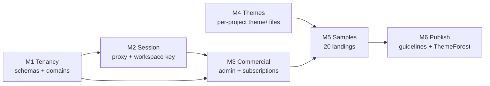

# Workspace CRM Program — Plans Index

> **Status:** Proposed — awaiting review
> **Date:** 2026-09-12
> **Tags:** `#workspace` `#crm` `#multi-tenant` `#django-tenants` `#subscriptions` `#unfold` `#wagtail` `#themes` `#themeforest` `#landing-samples`
> **Scope owner:** `projects/loop-crm/` (the CRM) · **Depends on:** [`repository/precis-dev-multitenant.md`](../repository/precis-dev-multitenant.md), [`editions/08-tenant-schemas.md`](../editions/08-tenant-schemas.md), [`THEME_DIRECTORY_STRATEGY.md`](../THEME_DIRECTORY_STRATEGY.md)

<!-- AI-generated: review needed -->

## What this program is

Six workstream plans that turn the existing **Loop-CRM** into a
**multi-domain, schema-per-tenant workspace CRM** with a unified session
propagated by the proxy, subscription surfaced on the landing pages, Unfold +
Wagtail admin surfaces, and a separable theme/samples layer that can be
published commercially.

**The CRM already exists.** `projects/loop-crm/` ships a `Workspace` model
(`backend/apps/core/models.py`), workspace scoping (`apps/core/tenancy.py` →
`current_workspace_id`), a Stripe-shaped billing app (`apps/billing/` — `Plan`
with `stripe_price_id`, `BillingAccount` with `stripe_customer_id` /
`stripe_subscription_id`, `Seat`, permissive `gates.py`), a Wagtail-backed
`apps/pages/` content tree, and an Astro + React frontend. This program
**extends** that product; it does not create a second CRM.

Two sibling implementations are the reference patterns and must be reused, not
re-invented:

| Reference | What to borrow |
|---|---|
| [`repository/precis-dev-multitenant.md`](../repository/precis-dev-multitenant.md) | django-tenants schema-per-tenant, path-based tenant middleware (`PathCenterMiddleware`), provisioning via Dramatiq, SHARED_APPS/TENANT_APPS split, per-tenant groups |
| [`editions/08-tenant-schemas.md`](../editions/08-tenant-schemas.md) + `formint-cloud/backend` | `Tenant`/`Domain` model pair, `DB_ENGINE=django_tenants.postgresql_backend` flip-on, `migrate_schemas` runbook |
| [`loop-crm/wagtail-landing-plan.md`](../loop-crm/wagtail-landing-plan.md) | Wagtail-managed landing pages, Stripe checkout/portal, shared locale |
| [`formint-pro/server/configs/__init__.py`](../../../projects/formints/formint-pro/server/configs/__init__.py) | Unfold admin registration + dashboard cards (the existing Unfold precedent) |
| [`THEME_DIRECTORY_STRATEGY.md`](../THEME_DIRECTORY_STRATEGY.md) | Per-project `theme/` contract, variation ids, `workspace.js` build seam |

## The milestone chain

| # | Plan | Milestone outcome | Depends on |
|---|---|---|---|
| M1 | [`01-multi-tenant-domain-schemas.md`](01-multi-tenant-domain-schemas.md) | A domain resolves to one schema+workspace; `migrate_schemas` provisions a tenant end-to-end | — |
| M2 | [`02-workspace-session-and-proxy.md`](02-workspace-session-and-proxy.md) | Traefik forwardAuth + a fusion middleware give every product one signed workspace session carrying `domain → plan → product → subscription key` | M1 |
| M3 | [`03-admin-and-subscriptions.md`](03-admin-and-subscriptions.md) | Superuser Unfold workspace admin + per-tenant Wagtail CMS, and subscription checkout reachable from the main landing pages | M1, M2 |
| M4 | [`04-theme-files-and-components.md`](04-theme-files-and-components.md) | Every surface has a real `theme/` dir (loop-crm, structa.cloud, ctc-research, Precis LMS) with HTML components, per the existing contract | — |
| M5 | [`05-landing-sample-library.md`](05-landing-sample-library.md) | 20 landing-page samples assembled from merged/related components across existing landings | M4 |
| M6 | [`06-theme-guidelines-and-themeforest.md`](06-theme-guidelines-and-themeforest.md) | Theme guidelines doc + ThemeForest publish pack (previews, docs, licensing) for the reference-derived themes | M5 |

## Cross-cutting invariants

1. **One workspace identity.** A subscription, a session, a schema, and a
   domain all resolve to the same `Workspace.id`. No plan may introduce a
   parallel tenant key.
2. **Tenant resolution is server-side.** Every plan assumes `Host`/path →
   schema resolution happens in middleware, never in a template or client.
3. **Frontmatter/Docs conventions.** All plans land in `docs/plans/`, are
   registered in [`../README.md`](../README.md), and carry the
   `<!-- AI-generated: review needed -->` marker until reviewed.
4. **Grammar of the database.** Schema creation, `SHARED_APPS`/`TENANT_APPS`
   changes, and `migrate_schemas` are **effectful** operations — they run on a
   dev database first and are recorded in the plan's verification section.
5. **Themes never fork tokens.** Per `THEME_DIRECTORY_STRATEGY.md` § 3.4, a
   variation may inherit another variation (`@use … as <prefix>` +
   `$theme-variation` assert); it never re-declares another theme's tokens.
6. **Publishing respects licensing.** `formint-community` is AGPL-3.0; anything
   derived from it cannot ship in a ThemeForest (non-AGPL-compatible) bundle.
   M6 forbids AGPL-derived sources in the publishable set.

## Reconciliation with in-flight work

| In-flight item | Interaction |
|---|---|
| `docs/plans/editions/11-community-client-ui-mode.md` (Formint client → Community UI mode) | Moves the client's theme surface from `formint-client/src/assets/css/` to `formint-community/client/`. M4 depends on that move for the `formint-bezel` variation and must not target `formint-client/` paths |
| `precis-dev-multitenant.md` (Phase 1 done) | M1 reuses its middleware and provisioning service **as a library pattern**; if the schema machinery is generalised, it must be shared rather than copied |
| `loop-crm/wagtail-landing-plan.md` | M3 extends it (landing subscription CTA) instead of re-planning landing pages |
| `THEME_DIRECTORY_STRATEGY.md` | M4 implements its Phases 2/5/8; the strategy file stays the contract and M4 only adds the missing pieces (ctc-research, structa.cloud, samples) |

## Program-level definition of done

- [ ] `migrate_schemas` provisions a fresh tenant from a domain row with no manual SQL.
- [ ] One signed session cookie is accepted by the CRM, the LMS, and the landings; tampering, cross-domain replay, and expired keys are covered by tests.
- [ ] A superuser can inspect workspaces, plans, seats, and subscriptions in Unfold, and edit each tenant's pages in Wagtail admin.
- [ ] A visitor can start a subscription from a landing page and land in the correct tenant workspace.
- [ ] `grep -r '^// Variation:' <project>/assets/styles/theme` returns exactly the project's variation id for loop-crm, ctc-research, precis-main (LMS), structa.cloud.
- [ ] `themes/` holds 20 sample landings, each building standalone (`make check`) and each traced to source components.
- [ ] Theme guidelines + ThemeForest pack exist, with an explicit licensing gate excluding AGPL-derived assets.

## Remarks & Notes

- The phrase "desktop themes dir `documents/themes`" from the request maps to
  **two homes** in this program: per-project `theme/` dirs (the source of truth,
  per the existing strategy) and a root `themes/` shared **samples** library.
  A repo-root `documents/` directory does not exist and is not created.
- "rock lms" was resolved to the **Precis LMS** (`projects/precis/precis-main/`)
  — it already has `assets/styles/theme/{_light,_dark}.scss`, so M4 completes
  rather than creates it.
- The root `structa.cloud/` directory exists but is **empty**; M4 must confirm
  whether the structa.cloud theme belongs to that directory or to
  `projects/precis/precis-landing/` before creating anything (flagged in M4 § 1).
- Nothing in this program runs migrations, provisions tenants, or publishes to
  an external marketplace without an explicit operator action.
