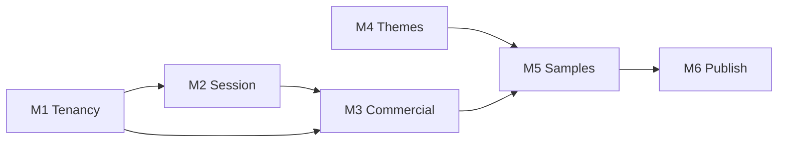

# Workspace CRM Program — Plans Index

> **Status:** Proposed — awaiting review · **Date:** 2026-09-12
> **Scope owner:** `projects/loop-crm/` (the CRM)
> **Depends on:** [`repository/precis-dev-multitenant.md`](../repository/precis-dev-multitenant.md) · [`editions/08-tenant-schemas.md`](../editions/08-tenant-schemas.md) · [`THEME_DIRECTORY_STRATEGY.md`](../THEME_DIRECTORY_STRATEGY.md)
> **Tags:** `#workspace` `#crm` `#multi-tenant` `#subscriptions` `#admin` `#themes` `#themeforest`

<!-- AI-generated: review needed -->

## What this program is

Six plans that turn the existing **Loop-CRM** into a **multi-domain,
schema-per-tenant workspace CRM**: a unified session propagated by the proxy,
subscriptions surfaced on the landing pages, Unfold + Wagtail admin surfaces, and
a separable theme/samples layer that can be published commercially.

**The CRM already exists.** `projects/loop-crm/` ships `Workspace`,
`apps/core/tenancy.py`, a Stripe-shaped `apps/billing/`, a Wagtail-backed
`apps/pages/`, and an Astro + React frontend. This program **extends** that
product; it does not create a second CRM.

Sibling patterns to reuse, not re-invent:

| Reference | What to borrow |
|---|---|
| [`precis-dev-multitenant.md`](../repository/precis-dev-multitenant.md) | Schema-per-tenant, path-based middleware, provisioning actor, app split, per-tenant groups |
| [`editions/08-tenant-schemas.md`](../editions/08-tenant-schemas.md) + `formint-cloud` | Tenant/Domain pair, engine flip-on, `migrate_schemas` runbook |
| [`formint-pro/server/configs/`](../../../projects/formints/formint-pro/server/configs/__init__.py) | Unfold registration + dashboard cards |
| [`THEME_DIRECTORY_STRATEGY.md`](../THEME_DIRECTORY_STRATEGY.md) | Per-project `theme/` contract, variation ids, build seam |

## The milestone chain

| # | Plan | Outcome | Depends on |
|---|---|---|---|
| M1 | [`01-multi-tenant-domain-schemas.md`](01-multi-tenant-domain-schemas.md) | A domain resolves to one schema + workspace; provisioning creates a tenant end to end | — |
| M2 | [`02-workspace-session-and-proxy.md`](02-workspace-session-and-proxy.md) | One signed session carrying domain → plan → product → subscription key, enforced at the edge | M1 |
| M3 | [`03-admin-and-subscriptions.md`](03-admin-and-subscriptions.md) | Superuser Unfold admin + per-tenant Wagtail CMS + checkout reachable from the landing | M1, M2 |
| M4 | [`04-theme-files-and-components.md`](04-theme-files-and-components.md) | Every surface has a real `theme/` dir with portable HTML components | — |
| M5 | [`05-landing-sample-library.md`](05-landing-sample-library.md) | 20 landing samples composed from merged components | M4 |
| M6 | [`06-theme-guidelines-and-themeforest.md`](06-theme-guidelines-and-themeforest.md) | Guidelines + a publish pack with previews, docs, and licensing gates | M5 |

## Cross-cutting invariants

1. **One workspace identity.** Subscription, session, schema, and domain all
   resolve to the same `Workspace.id`. No plan mints a parallel tenant key.
2. **Tenant resolution is server-side.** Host/path → schema happens in middleware,
   never in a template or a client.
3. **Schemas and migrations are effectful.** They run on a dev database first and
   need operator approval for anything shared.
4. **Themes never fork tokens.** A variation may inherit another; it never
   redeclares its values.
5. **Publishing respects licensing.** `formint-community` is AGPL-3.0 and cannot
   ship in a non-AGPL-compatible marketplace bundle.

## Reconciliation with in-flight work

| In-flight item | Interaction |
|---|---|
| [`editions/11-community-client-ui-mode.md`](../editions/11-community-client-ui-mode.md) | Moves the client theme surface to `formint-community/client/`; M4 targets that path, not `formint-client/` |
| `precis-dev-multitenant.md` (Phase 1 done) | M1 reuses its middleware and provisioning service; if generalised, share the piece rather than copying it |
| [`loop-crm/wagtail-landing-plan.md`](../loop-crm/wagtail-landing-plan.md) | M3 extends it instead of re-planning landing pages |
| `THEME_DIRECTORY_STRATEGY.md` | Stays the contract; M4 implements its phases and adds the missing surfaces |

## Definition of done

- [ ] A fresh tenant provisions from a domain row with no manual SQL.
- [ ] One session cookie is accepted by the CRM, the LMS, and the landings; tamper, cross-domain replay, and expiry are covered by tests.
- [ ] A superuser can inspect workspaces, plans, seats, and subscriptions, and edit each tenant's pages.
- [ ] A visitor can start a subscription from a landing page and land in the right workspace.
- [ ] Each surface's theme banner grep matches its variation id exactly.
- [ ] `themes/` holds 20 samples, each building standalone and traced to source blocks.
- [ ] Guidelines and a publish pack exist, with an explicit licensing gate.

## Notes

- "`documents/themes`" maps to two homes: per-project `theme/` (source of truth)
  and a root `themes/` samples library. No `documents/` directory is created.
- "rock lms" resolved to **Precis LMS** (`projects/structa.cloud/`).
- The root `structa.cloud/` directory exists but is **empty**; M4.1 must confirm
  the theme home before anything is created there.
- Nothing here runs migrations, provisions tenants, or publishes externally
  without an explicit operator action.
