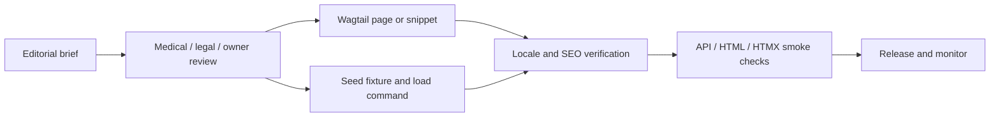

# 📝 CTC Research — Publishing Workflow & Production Notes

> **Canonical project:** `projects/precis/precis-ctc/`  
> **Public site:** `ctc-research.com`  
> **Applies to:** blog posts, publications, courses/lessons, Wagtail pages,
> translated copy, and production releases.

<!-- AI-generated: review needed -->

## 🧭 Operating principle

CTC publishing is a controlled content operation, not a copy-and-paste task.
The editorial brief comes from the
[content strategy](content-strategy.md); the release must preserve Wagtail's
source of truth, the render-first/data-API/HTMX contracts, locale parity, and
medical-content review.

There are two content tracks, but one release discipline:



A piece is not published when it is merely saved. It is published when the
content, translations, metadata, routes, and public responses have all passed
the relevant gates.

## 👥 Roles and ownership

| Role | Owns | Cannot waive |
|---|---|---|
| Content producer | Brief, draft, sources, internal links, CTA | Medical or legal review |
| CTC subject-matter reviewer | Clinical/methods accuracy and risk | Deployment verification |
| Legal/privacy reviewer | Ethics, privacy, rights, regulated claims | Technical release checks |
| Linguistic reviewer | Arabic/English meaning, terminology, RTL readability | Medical accuracy |
| Site editor | Wagtail entry, scheduling, metadata, publish state | Required sign-offs |
| Release owner | Fixture load, build, smoke tests, rollback record | Missing content approvals |

Assign one named person to each role in the brief. “Team reviewed” is not an
audit trail.

## 📨 1. Intake and brief

Create a brief before drafting. It must contain:

- working title, intended route/slug, format, and target locale;
- primary editorial ICP, job-to-be-done, search intent, and one takeaway;
- product surface and one primary CTA;
- source list with ownership/rights notes;
- claims risk: routine, methods/clinical, legal/privacy, or client-specific;
- Wagtail page/snippet or fixture target;
- reviewer names and due dates;
- acceptance checks and rollback owner.

Reject or return a brief when its audience, source, route, or owner is unclear.
A vague topic is not a production-ready request.

## ✍️ 2. Draft and evidence pass

Write against the medical-content rules in
`projects/precis/docs/precis-ctc/CONTENTS.md`:

1. Lead with the research question, population, method, evidence, and outcome
   where those details are relevant.
2. Give every factual claim a source, or label it as interpretation/opinion.
3. Do not invent statistics, trial results, patient outcomes, approvals,
   endorsements, or institutional relationships.
4. Label educational material clearly and never imply individualized clinical
   advice.
5. Keep the primary CTA aligned with the brief; do not turn an educational
   article into an unsupported sales claim.

### Editorial acceptance checklist

- [ ] One audience, job-to-be-done, takeaway, and CTA are explicit.
- [ ] Sources are named, current enough for the claim, and permission-safe.
- [ ] Headline and description match the actual content.
- [ ] Internal links connect the pillar, course/publication, and next action.
- [ ] Images have rights status, meaningful alt text, and appropriate captions.
- [ ] No patient-identifying, confidential, or unsupported medical content is present.

## ✅ 3. Blocking review gates

| Gate | Required when | Evidence of completion |
|---|---|---|
| **Medical** | Any clinical, research-methods, health, or outcome claim | Named reviewer + date + comments resolved |
| **Legal/privacy** | Ethics, privacy, publication rights, testimonials, or regulated claims | Named reviewer + source/rights record |
| **CTC owner** | Public positioning, pricing, services, case studies, or client copy | Owner approval in the brief |
| **Linguistic** | Any non-English public copy or terminology-sensitive translation | Locale reviewer approval |
| **Technical** | Every page, snippet, fixture, route, or template change | Check output and smoke-test record |

A technical check cannot replace a subject-matter sign-off. If a required gate
is skipped, keep the content in draft/private state and record the reason.

## 🗃️ 4. Choose the source-of-truth track

| Track | Source of truth | Edit surface | Use for |
|---|---|---|---|
| **Wagtail pages** | Localized Wagtail `Page` tree | Wagtail admin `/admin/` | About, Services, Events, Contact, landing pages |
| **Wagtail snippets** | Registered snippet models | Wagtail admin | `Publication`, `PublicationCategory`, reusable records |
| **Seed fixtures** | `backend/assets/fixtures/*.json` | Versioned fixture + command | Courses, curriculum, publications, repeatable baseline data |
| **Translations** | `assets/locale/<lang>/LC_MESSAGES/django.po` | `makemessages` → edit → compile | UI strings and shared translated copy |
| **Code/templates** | Product source tree | Pull request + checks | Layout, components, API, route, or style behavior |

Do not edit generated bundles, collected static files, `content/`, or runtime
media as if they were authored sources.

## 🌐 5. Localization and SEO pass

For each locale being released:

1. Confirm the page/record exists in the locale tree and its slug resolves.
2. Check terminology against the approved medical glossary.
3. Review Arabic directionality, line breaks, numerals, punctuation, and CTA
   labels in the rendered page, not only in the translation file.
4. Set Wagtail `seo_title` and `search_description` for page-specific metadata.
5. Confirm the canonical URL, language alternate behavior, social preview, and
   meaningful image alt text.
6. Compile locale catalogs after editing `.po` files and verify the `.mo` is
   newer than its source `.po`.

Current catalog locations are:

```text
projects/precis/precis-ctc/assets/locale/{en,sv,fr,de,es,ar,pt_BR}/LC_MESSAGES/django.po
```

The locale catalog is not proof that editorial content is translated. Course
copy and publication records require separate content review.

## 🚀 6. Release procedure

### Wagtail page or snippet

1. Enter or update the localized page/snippet in Wagtail.
2. Save as draft, run the review gates, then publish or schedule it.
3. Verify the page API, server-rendered response, and HTMX fragment.
4. Verify SEO metadata and the primary CTA in each released locale.
5. Record the URL, editor, publication time, and smoke-test result.

### Fixture-backed course, curriculum, or publication

1. Edit the versioned fixture under the owning backend `assets/fixtures/` path.
2. Run the relevant management command in a safe local/staging environment.
3. Confirm IDs, localized rows, ordering, and publication state.
4. Run API and route checks before any production load.
5. Never use `--replace` against a shared or production database without
   explicit approval.

### Code or template change

Use the owning project's checks and keep both rendering roads intact:

```bash
cd projects/precis/precis-ctc
make check
make frontend-check

cd projects
make check WEBSITE=precis-ctc
```

Only after checks pass should the release owner run the project's approved
redeploy command. For the current publish sequence, see the
[CTC research publish plan](../plans/repository/ctc-research-publish-2026-08-18.md).

## 🔍 7. Post-release verification

Run checks against the local or approved staging URL. Do not assume a 200 from
one road proves the others work.

```bash
# Publication API/data road
curl -sS 'http://localhost:5070/apis/research/publications/?lang=en&q=cohort&limit=10'

# Render-first page road
curl -sS http://localhost:5070/apis/pages/about/

# HTMX fragment road
curl -sS http://localhost:5070/fragment/pages/about/

# OpenAPI surface
curl -sS http://localhost:5070/apis/openapi.json
```

For a changed piece, verify:

- expected title, body, locale, SEO fields, and CTA;
- no empty Wagtail-managed sections or frontend hard-coded fallback copy;
- publication/course filters, pagination, and ordering where applicable;
- canonical links, language switching, images, and alt text;
- admin access remains backend-owned and public content remains on the intended
  frontend/backend route;
- worker/scheduler logs are clean when asynchronous work is involved.

The publication endpoint supports `lang`, `q`, `category`, `ordering`
(`published_at`, `-published_at`, `title`, `-title`), `limit`, `page`, and
offset. The implementation contract is in
`backend/apps/pages/pages/landing_api.py`; OpenAPI wiring is in
`backend/apps/core/openapi.py`.

## ↩️ 8. Rollback and incident notes

For a bad content release:

1. Unpublish or revert the Wagtail page/snippet to the last approved revision.
2. For fixture data, restore the previous version and use the approved safe
   load procedure; do not perform an unreviewed destructive replacement.
3. If the issue is code or assets, use the last known-good application release
   and preserve the failed release logs.
4. Re-run the affected API, HTML, HTMX, locale, and SEO checks.
5. Record the incident, affected URL/locale, cause, reviewer, and corrective
   action in the release record.

Escalate medical, privacy, rights, or client-identifying issues to the relevant
owner immediately; do not silently patch public copy.

## Remarks & Notes

- The render-first, data-API, and HTMX roads are **separate contracts**. Do not
  replace a server-rendered fragment with JSON or add frontend fallback content
  to hide missing Wagtail data.
- `backend/assets/fixtures/dump-data.json` is the canonical backend load source
  and is kept in sync with the project copy `assets/fixtures/dump-data.json`.
- Generated bundles, collected static, runtime media, and authored content are
  different asset classes; follow `ENVIRONMENT.md` rather than copying between
  them.
- Every public medical, legal, research, image-rights, and client claim needs
  the appropriate sign-off. This guide describes the release mechanism, not
  clinical validation.
