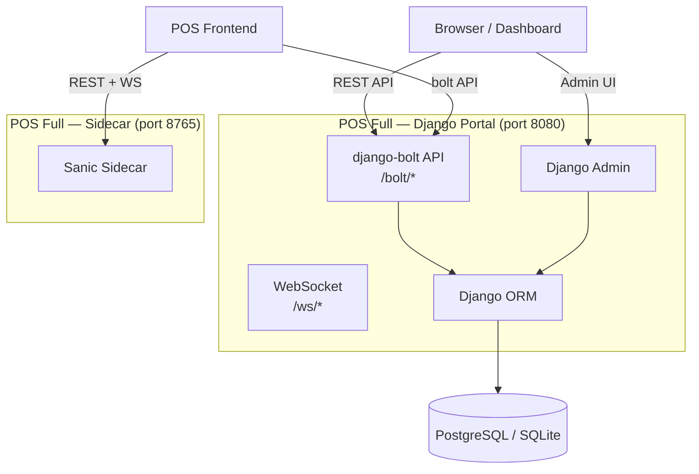

# ⚡ django-bolt Integration — Full Edition

> Integration plan: django-bolt high-performance API for POS Full edition Django portal.

---

## Why django-bolt?

| Aspect | Django Views | django-bolt |
|--------|:-----------:|:-----------:|
| Runtime | Python (WSGI/ASGI) | Rust-powered (Actix Web + PyO3) |
| Throughput | ~2k RPS | 60k+ RPS |
| Async | `async_to_sync` / `sync_to_async` | Native async |
| OpenAPI | Django Ninja | Built-in (Swagger, ReDoc, Scalar) |
| Serialization | DRF / Django Ninja | msgspec (10x faster than json) |
| Validation | Django Forms / DRF | msgspec + Pydantic adapter |
| WebSocket | Channels / Daphne | Native WebSocket |
| Django ORM | ✅ | ✅ (via `aget`/`afilter`) |
| Auth | Session / JWT | Built-in JWT + guard system |

---

## Architecture



---

## Route Migration: Django Views → django-bolt

### Current (Django Viewset)

```python
# portal/views.py
from django_fusion.comp.routes import ModelViewset

class ProductViewSet(ModelViewset):
    model = Product

    def list(self, request):
        return Product.objects.all()[:100]

    def retrieve(self, request, pk):
        return Product.objects.get(pk=pk)
```

### Target (django-bolt API)

```python
# bolt_api.py
from django_bolt import BoltAPI, Request
from posapp.models import Product

bolt = BoltAPI(prefix="/bolt", namespace="pos-bolt")

@bolt.get("/products")
async def list_products(request: Request) -> list[dict]:
    products = Product.objects.all()[:100]
    return [{"id": p.id, "name": p.name} async for p in products]

@bolt.get("/products/{product_id}")
async def get_product(request: Request, product_id: int) -> dict:
    product = await Product.objects.aget(id=product_id)
    return {"id": product.id, "name": product.name, "price": str(product.price)}
```

---

## BoltAPI Configuration

```python
# bolt_api.py
from django_bolt import BoltAPI
from django_bolt.middleware import DjangoMiddleware, TimingMiddleware
from django.contrib.sessions.middleware import SessionMiddleware
from django.contrib.auth.middleware import AuthenticationMiddleware

bolt = BoltAPI(
    prefix="/bolt",
    namespace="pos-bolt",
    trailing_slash="strip",
    middleware=[
        DjangoMiddleware(SessionMiddleware),
        DjangoMiddleware(AuthenticationMiddleware),
        TimingMiddleware,
    ],
    openapi_config=OpenAPIConfig(
        title="POS Full Edition API",
        version="1.0.0",
        path="/bolt/docs",
    ),
)
```

---

## Endpoint Map

| Purpose | Current (Django) | Target (django-bolt) |
|---------|-----------------|---------------------|
| Product list | `GET /api/products/` | `GET /bolt/products` |
| Product detail | `GET /api/products/{id}/` | `GET /bolt/products/{id}` |
| Order list | `GET /api/orders/` | `GET /bolt/orders` |
| Order create | `POST /api/orders/` | `POST /bolt/orders` |
| Customer list | `GET /api/customers/` | `GET /bolt/customers` |
| Inventory | `GET /api/inventory/` | `GET /bolt/inventory` |
| Sales report | `GET /api/reports/sales/` | `GET /bolt/reports/sales` |
| CRM contacts | `GET /api/crm/contacts/` | `GET /bolt/crm/contacts` |
| WebSocket chat | Django Channels | `bolt.websocket("/ws/chat/{room}")` |

---

## Pydantic Integration

django-bolt's pydantic module (`django_bolt.pydantic`) provides first-class pydantic support:

```python
from django_bolt import BoltAPI
from django_bolt.pydantic import PydanticModel
from pydantic import Field, EmailStr

class ProductCreate(PydanticModel):
    name: str = Field(min_length=1, max_length=200)
    price: float = Field(gt=0)
    category_id: int
    sku: str | None = None

bolt = BoltAPI()

@bolt.post("/products")
async def create_product(body: ProductCreate) -> ProductCreate:
    # body is auto-validated by pydantic
    product = await Product.objects.acreate(
        name=body.name,
        price=body.price,
        category_id=body.category_id,
        sku=body.sku,
    )
    return body
```

---

## Migration Phases

### Phase 1: Parallel Coexistence (1 day)

- Add `django-bolt[pydantic]` to sidecar `requirements.txt`
- Create `bolt_api.py` with core CRUD endpoints
- Mount bolt API in Django URL config
- Run alongside existing Django views

### Phase 2: Feature Parity (3 days)

- Port all 35+ REST endpoints from Django viewsets to bolt
- Migrate WebSocket chat to bolt native WebSocket
- Add auth guards (JWT + API key)

### Phase 3: Performance Tuning (1 day)

- Enable compression (`CompressionConfig`)
- Add caching headers
- Benchmark vs existing Django views
- Profile and optimize hot paths

---

## URL Configuration

```python
# urls.py
from django.urls import path, include
from .bolt_api import bolt

urlpatterns = [
    path("admin/", admin.site.urls),
    # django-bolt API (high-performance)
    path("bolt/", bolt.urls),
    # Legacy Django views (coexist during migration)
    path("api/", include("portal.urls")),
]
```

---

## Related

| Resource | Path |
|----------|------|
| django-bolt docs | [bolt.farhana.li](https://bolt.farhana.li/) |
| django-bolt GitHub | [dj-bolt/django-bolt](https://github.com/dj-bolt/django-bolt) |
| django-bolt pydantic | [libs/django-bolt/python/django_bolt/pydantic/](../../../../libs/django-bolt/python/django_bolt/pydantic/) |
| POS editions | [../editions.md](../editions.md) |
| Sidecar overview | [sidecar-readme.md](sidecar-readme.md) |
| Cloud sync plan | [../cloud/sync-plan.md](../cloud/sync-plan.md) |
