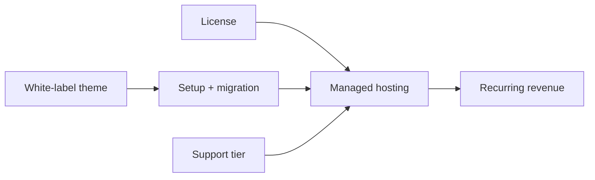

# 💰 Pricing, Offers & Services — 🔒 Private

> Internal price book. One packaging model across all products: **License +
> Managed + Setup + Support**, with white-label theming as the upsell.

<!-- AI-generated: review needed -->

## 1. Packaging model

| Layer | What it is | Billing |
|-------|-----------|---------|
| License | self-hosted product rights + updates | one-time + annual support % |
| Managed | deployed stack (DB, media, proxy, tasks, backups, monitoring) | monthly per site |
| Setup | deploy, DNS/SSL, content migration, branding | one-time project fee |
| Support | L1 chat/email + L2 upgrades | included in managed tiers |
| Customization | white-label theming + configs | setup fee + optional retainer |

## 2. Packages (anchor prices — validate per product)

| Package | Contents | One-time | Monthly | Best for |
|---------|----------|----------|---------|----------|
| **Starter** | 1 site, managed hosting (shared), setup, L1 support | $500 | $49 | single-location businesses |
| **Growth** | 1 site, managed (dedicated), setup + white-label theme, migration, L2 | $1,500 | $149 | training companies, agencies |
| **Premium** | multi-site/tenant, SLA, backups, Arabic/EN support, retainer hours | $3,000 | $399 | institutions, multi-branch |
| **Partner (agency)** | white-label resale, revenue share, per-client setup fee | $2,000 | 20% rev share | web agencies |

> Prices are directional (🟡). Validate willingness-to-pay per segment before
> publishing — see `PLAN.md` goal 3 and the research backlog in each product
> strategy doc.

## 3. Offers & discounts policy

- **Launch offer:** first 3 slots at founder pricing (Starter 1 month free, or
  20% off Growth for 6 months). Cap at 3 to preserve perceived value.
- **Annual prepay:** 2 months free on any managed tier.
- **Bundle discount:** 10% when licensing 2+ products (e.g., Precis + Formint).
- **Referral:** 1 month credit per referred paid client.
- Never discount below cost: floor = hosting cost × 3 + 30 min support/hr.

## 4. Services (side customizations)

| Service | Description | Price posture |
|---------|-------------|---------------|
| White-label theming | branded design system, logo, domain, colors via `configs/theme.yml` | included in Growth+ |
| Content migration | import courses/learners/pages from legacy tools (CSV, old site) | per-project quote |
| Arabic/RTL setup | full Arabic site + RTL parity + AR content | included in Premium |
| Email/SMTP + auth | branded transactional email, social login, MFA | included in managed |
| Integrations | payments (Stripe), newsletter (Mailchimp/Brevo), analytics | per integration quote |
| Training | admin/editor walkthrough (EN/AR) | included in setup |
| Custom dev (phase 2) | beyond configs/theming — separate SOW | hourly/project |

## 5. Bundle logic

- The **managed layer carries the MRR**; license + setup pay for delivery.
- White-label theming is the upsell that converts a deploy into a brand.
- Zero-utilities clients (see `SALES.md`) always land on Managed — never
  license-only — because they have no server or staff to run it.

## 6. Module price book (directional — 🔴 validate)

> Per-module/per-plan prices from the startup pack. Directional inputs only;
> validate willingness-to-pay per segment before publishing (see `PLAN.md`
> goal 3 and the research backlog in each product strategy doc).

### Loop CRM – plans

| Plan | Monthly (per user) | Included modules | Ideal for |
|------|--------------------|------------------|-----------|
| Lite | $0 (up to 3 users) | Sales, contacts, activities, basic analytics | Freelancers, very small teams |
| Professional | $29 / user | Sales, marketing, support, projects, finance, basic AI | SMBs, agencies |
| Business | $59 / user | Professional + HR, advanced AI agents, customer success, workflow automation | Growing companies, service firms |
| Enterprise | Custom (annual) | Business + advanced security, custom integrations, SLA, white-label | Large enterprises, healthcare, government |

### Precis CMS – plans

| Plan | Monthly | Features |
|------|---------|----------|
| Lite | $0 (1 site, 1 language) | Basic pages, blog, 1 tenant |
| Professional | $39 / site | Multi-site, multi-language, versioning, scheduling, REST API |
| Business | $99 / workspace | Headless APIs, GraphQL, AI writer, SEO suggestions, content workflows |
| Enterprise | Custom | Dedicated infrastructure, custom branding, audit logs, SSO |

### Precis Builder – plans

| Plan | Monthly | Features |
|------|---------|----------|
| Starter | $0 (1 site) | Drag-and-drop, basic templates |
| Professional | $49 / workspace | Landing builder, portal builder, dynamic forms, theme system |
| Business | $129 / workspace | App builder, AI generation, reusable components, SEO optimization |
| Enterprise | Custom | White-label, custom design tokens, multi-tenant management |

### Precis LMS – plans (per active learner)

| Plan | Monthly (per learner) | Features |
|------|-----------------------|----------|
| Basic | $1 / learner | Courses, quizzes, certificates, basic reporting |
| Professional | $2.5 / learner | Learning paths, discussions, assignments, AI tutor, advanced analytics |
| Business | $5 / learner | Communities, events, digital badges, CRM integration, white-label |
| Enterprise | Custom | SCORM/xAPI, custom integrations, on-premise, dedicated support |

### Precis Research – plans (per researcher)

| Plan | Monthly (per researcher) | Features |
|------|--------------------------|----------|
| Basic | $19 / researcher | Research workspace, literature review, reference management |
| Professional | $49 / researcher | Manuscript builder, journal finder, submission tracking, statistics hub |
| Enterprise | Custom | Team collaboration, institutional repository, AI research assistant, API access |

> ⚠️ Precis CMS, Builder, and Research are **🔴 vision products** — see
> [`product-profiles.md`](product-profiles.md). Only Loop-CRM and Precis LMS
> prices correspond to shipping products today; even those are unvalidated.

### Add-ons, white-label & OEM

- **AI usage pack** — additional AI tokens for generation and agents.
- **Storage** — extra file storage for media, LMS content, research documents.
- **Integrations** — pre-built connectors (included in Professional+); custom ones via django-fusion or API.
- **Agency partner program** — resell under your brand with multi-tenant management.
- **OEM license** — embed Structa Cloud modules into your own software using django-fusion.
- **Government / sovereign cloud** — dedicated deployment with local compliance.

## Remarks & Notes

- Keep currency conversions (USD ↔ EGP/SAR/AED) in the Arabic sales collateral.
- Update this price book together with `PLAN.md` goals and `STRATEGY.md`.
- ARR projections and unit economics live in [`revenue-model.md`](revenue-model.md).
- Private — pricing assumptions are planning inputs, not commitments.
