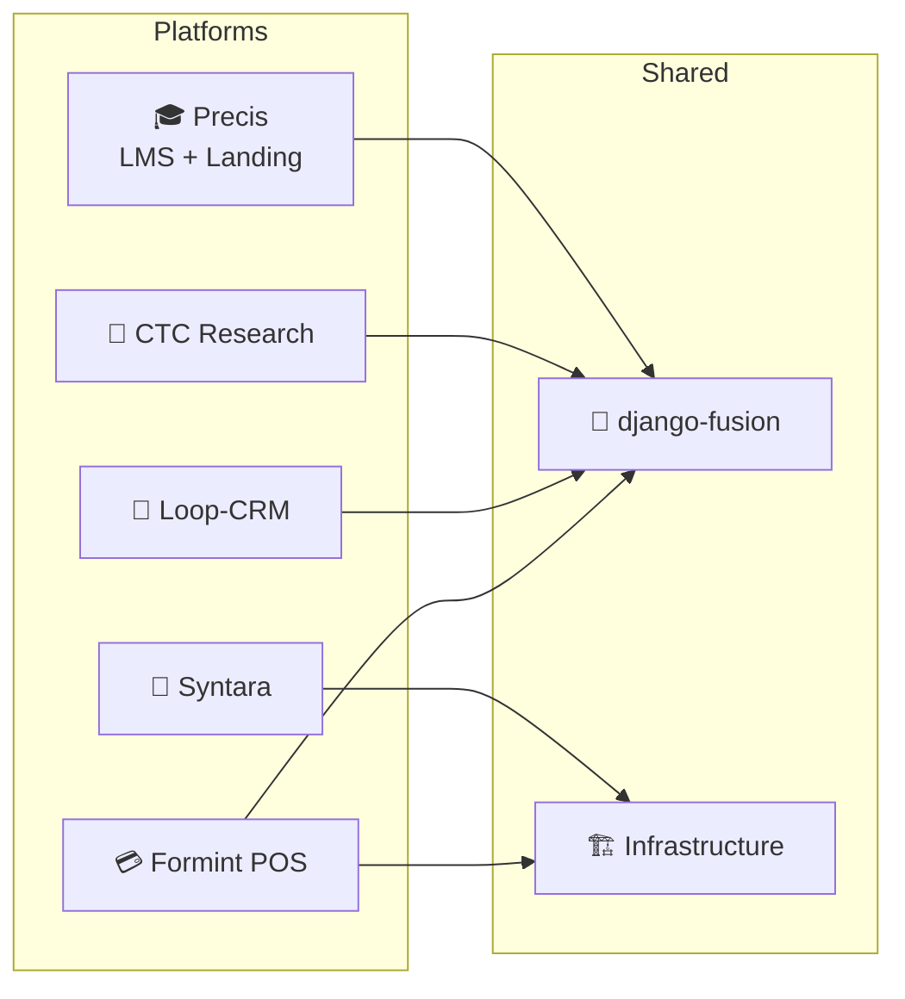

# 🚀 Startup & Market Strategy — 🔒 Private

> **Internal only.** This section is the business layer of the monorepo: for every
> product we keep one living strategy document with market research, a validated
> MVP canvas, TAM/SAM/SOM sizing, SaaS service lines, ideal client personas, and
> an explicit research backlog.

<!-- AI-generated: review needed -->

## 🗺️ Product Portfolio

## 📄 Strategy Documents

| Scope | Doc | Covers |
|-------|-----|--------|
| **Full portfolio master** 🔒 | [`STRATEGY.md`](STRATEGY.md) | Consolidated market strategy, combined MVP canvas, TAM/SAM/SOM table, SaaS service lines, ideal clients, research backlog, sequencing |

| Product | Doc | Core Offering |
|---------|-----|---------------|
| 🎓 Precis (LMS + landing) | [`precis.md`](precis.md) | Learning platform + marketing/catalog shell |
| 🏥 CTC Research | [`precis-ctc.md`](precis-ctc.md) | Medical research center digital presence & publishing |
| 🤖 Syntara (Cypercloud) | [`syntara.md`](syntara.md) | AI chat + template customization runtime |
| 💳 Formint POS | [`formints.md`](formints.md) | Multi-edition restaurant/cafe point-of-sale |
| 🤝 Loop-CRM | [`loop-crm.md`](loop-crm.md) | Unified sales + marketing CRM |

## 📋 What Every Strategy Document Contains

Each product page follows the same template ([`_template.md`](_template.md)):

1. **Market strategy** — positioning, wedge, go-to-market, moat
2. **MVP canvas** — problem, solution, key metrics, unfair advantage, channels
3. **TAM / SAM / SOM** — sizing table with sources and confidence tags
4. **SaaS services** — service lines, pricing posture, packaging
5. **Ideal clients** — personas, pains, buying triggers
6. **Research needed** — the open questions that must be answered before doubling down

## 🔬 Sizing Conventions

| Tag | Meaning |
|-----|---------|
| 🟢 | Verified / sourced number |
| 🟡 | Estimate from public market data |
| 🔴 | Assumption — **research required before relying on it** |

> Numbers are directional planning inputs, not commitments. Every figure carries
> a confidence tag and a "research needed" pointer so it can be upgraded as data
> lands.

## 🧭 How to Use This Section

- **Founders / PM:** update the MVP canvas as you validate; keep TAM/SAM/SOM current.
- **Sales:** pull the ideal-client personas before outreach.
- **Engineers:** the "SaaS services" column explains *why* a platform exists — features map back to revenue intent.
- **Agents:** when asked "market strategy for X", read `startup/<product>.md` and update it, never create a second copy.

## Remarks & Notes

- This section is private by policy; if it is ever published, strip the 🔒 research backlogs and pricing assumptions first.
- Keep `docs/startup/_template.md` in sync — every product doc mirrors its section order.
- Market figures here are starting hypotheses (🔴/🟡), not validated claims — validate before investor or board use.
