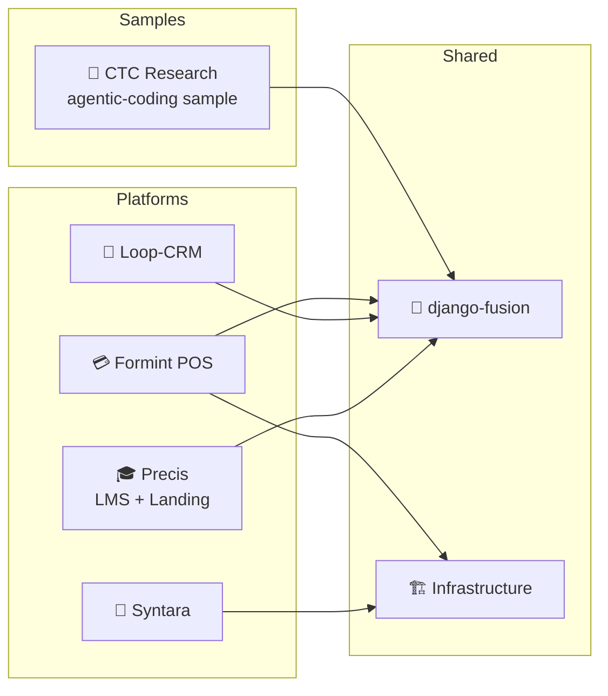

# 🚀 Startup & Market Strategy — 🔒 Private

> **Internal only.** This section is the business layer of the monorepo: for every
> product we keep one living strategy document with market research, a validated
> MVP canvas, TAM/SAM/SOM sizing, SaaS service lines, ideal client personas, and
> an explicit research backlog.

<!-- AI-generated: review needed -->

## 🗺️ Product Portfolio

## 📄 Strategy Documents

| Scope | Doc | Covers |
|-------|-----|--------|
| **Full portfolio master** 🔒 | [`STRATEGY.md`](STRATEGY.md) | Consolidated market strategy, combined MVP canvas, TAM/SAM/SOM table, SaaS service lines, ideal clients, research backlog, sequencing |
| **Portfolio comparison** 🔒 | [`comparison.md`](comparison.md) | Products vs. each other, head-to-head vs. named competitors, bundle logic, decision guide |
| **Product plan & launch** 🔒 | [`PLAN.md`](PLAN.md) | Goals/targets, scope, stakeholders (RACI), roadmap, launch plan, PR calendar |
| **Pricing, offers & services** 🔒 | [`PRICING.md`](PRICING.md) | Packages/tiers, offers, services, side customizations, bundle logic, discount policy |
| **Sales playbook** 🔒 | [`SALES.md`](SALES.md) | Requirements to sell, proposal/contract checklist, zero-utilities/zero-hardware onboarding, delivery handover |
| **Company profile** 🔒 | [`company-profile.md`](company-profile.md) | Overview, mission, vision, focus areas, product ecosystem, tech stack, competitive advantages |
| **Product profiles** 🔒 | [`product-profiles.md`](product-profiles.md) | Consolidated profiles: Loop-CRM, Precis Platform (CMS/Builder/LMS/Research), django-fusion — live 🟢 vs vision 🔴 status |
| **Revenue model** 🔒 | [`revenue-model.md`](revenue-model.md) | Revenue streams, pricing strategy, ARR projections, unit economics (CAC/LTV/churn/margin) |
| **Master deck** 🔒 | [`presentation.md`](presentation.md) | 25-slide executive presentation outline with per-slide source links |
| **Progressive plan** 🔒 | [`../plans/repository/startup-docs-enhancement-plan.md`](../plans/repository/startup-docs-enhancement-plan.md) | Gap analysis of the 14-doc startup pack vs the monorepo — what was added, what was not added, and why |

| Product | Doc | Core Offering |
|---------|-----|---------------|
| 🎓 Precis (LMS + landing) | [`precis.md`](precis.md) | Learning platform + marketing/catalog shell |
| 🤖 Syntara (Cypercloud) | [`syntara.md`](syntara.md) | AI chat + template customization runtime |
| 💳 Formint POS | [`formints.md`](formints.md) | Multi-edition restaurant/cafe point-of-sale |
| 🤝 Loop-CRM | [`loop-crm.md`](loop-crm.md) | Unified sales + marketing CRM |

### Reference samples — agentic coding with Precis

🏥 **CTC Research** (`projects/precis/precis-ctc/`) is a **sample project built
with agentic coding on the Precis stack** — a medical research center site
(ctc-research.com) demonstrating the Precis platform, EN/AR publishing, and the
production workflow. It is not a commercial product with its own market
strategy; the research material that used to live here is retained as reference:

- [Sample record & market research](precis-ctc.md) — agentic-coding sample; MVP/TAM research kept as reference
- [Content strategy, editorial ICP & market research](../precis-ctc/content-strategy.md)
- [Publishing workflow & production notes](../precis-ctc/publishing-and-production.md)
- [Client production case study](../precis-ctc/client-production.md)

## 📋 What Every Strategy Document Contains

Each product page follows the same template ([`_template.md`](_template.md)):

1. **Market strategy** — positioning, wedge, go-to-market, moat
2. **MVP canvas** — problem, solution, key metrics, unfair advantage, channels
3. **TAM / SAM / SOM** — sizing table with sources and confidence tags
4. **SaaS services** — service lines, pricing posture, packaging
5. **Ideal clients** — personas, pains, buying triggers
6. **Competitive landscape** — named competitor map + positioning vs. alternatives
7. **Research needed** — the open questions that must be answered before doubling down

Plus the business layer: **[Plan & Launch](PLAN.md)** (targets, scope, stakeholders, roadmap, PR), **[Pricing & Offers](PRICING.md)** (packages, services, customizations), and the **[Sales Playbook](SALES.md)** (requirements to sell, zero-utilities onboarding, handover).

## 🔬 Sizing Conventions

| Tag | Meaning |
|-----|---------|
| 🟢 | Verified / sourced number |
| 🟡 | Estimate from public market data |
| 🔴 | Assumption — **research required before relying on it** |

> Numbers are directional planning inputs, not commitments. Every figure carries
> a confidence tag and a "research needed" pointer so it can be upgraded as data
> lands.

## 🧭 How to Use This Section

- **Founders / PM:** update the MVP canvas as you validate; keep TAM/SAM/SOM current.
- **Sales:** pull the ideal-client personas before outreach.
- **Engineers:** the "SaaS services" column explains *why* a platform exists — features map back to revenue intent.
- **Agents:** when asked "market strategy for X", read `startup/<product>.md` and update it, never create a second copy.

## Remarks & Notes

- This section is private by policy; if it is ever published, strip the 🔒 research backlogs and pricing assumptions first.
- Keep `docs/startup/_template.md` in sync — every product doc mirrors its section order.
- `PLAN.md` / `PRICING.md` / `SALES.md` are the business layer; per-product strategy docs feed them and stay the source of market facts.
- `company-profile.md`, `product-profiles.md`, `revenue-model.md`, and `presentation.md` are the narrative layer; they link to the strategy docs and never restate TAM/SAM/SOM or pricing.
- The progressive plan that tracks what from the startup pack is added vs declined lives in [`docs/plans/repository/startup-docs-enhancement-plan.md`](../plans/repository/startup-docs-enhancement-plan.md).
- Market figures here are starting hypotheses (🔴/🟡), not validated claims — validate before investor or board use.
