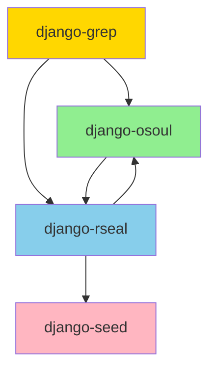

# Dependency Analysis Report

**Generated**: Automated analysis of Python imports across all packages

**Purpose**: Analyze current dependency structure and identify violations of dependency rules

---

## Summary

- **Packages Analyzed**: 3
- **Circular Dependencies Found**: 2
- **Forbidden Dependency Violations**: 18

## Dependency Graph

### Current Package Dependencies



## Package-by-Package Analysis

### django-grep

**Internal Dependencies**:
- django-osoul
- django-rseal

**External Dependencies**:
- assertions
- base
- django
- factories
- faker
- pytest
- selenium
- selenium_base

**Python Files Analyzed**: 18

### django-osoul

**Internal Dependencies**:
- django-rseal

**External Dependencies**:
- __future__
- _typing
- adapters
- apps
- attrs
- base
- calendar
- components
- conf
- contact
- contactMethods
- content
- context
- contrib
- core
- datetime_utils
- decorators
- django
- file
- importlib
- integrations
- interaction
- main
- manager
- managers
- media
- mixins
- models
- ninja
- ninja_extra
- ninja_schema
- notifications
- options
- pageHandler
- paginators
- params
- pluggy
- plugins
- profile
- pydantic
- response
- responses
- staticfiles
- tags
- templates
- templatetags
- text
- traceback
- twilio
- typing_extensions
- validators
- wagtail
- websiteLinks

**Python Files Analyzed**: 108

### django-rseal

**Internal Dependencies**:
- django-osoul
- django-seed

**External Dependencies**:
- __future__
- allauth
- apps
- asgiref
- asyncio
- base
- bs4
- cache
- callbacks
- campaign
- celery
- code
- colorfield
- common_urls
- compatibility
- config
- configs
- confirm
- contact
- contrib
- core
- crispy_forms
- crud
- csv_manager
- csv_parser
- cursor_pagination
- debug_toolbar
- decimal
- default
- designer
- detection
- dev_urls
- development
- django
- django_filters
- django_q
- django_redis
- django_rq
- django_structlog
- django_tables2
- email_config
- email_service
- email_utils
- enhancer
- error_views
- errors
- executor
- extractor
- faker
- filter
- hypothesis
- importlib
- invitation_service
- jose
- livereload
- login
- management
- markdown
- mcp
- mcp_server
- middleware
- mixins
- model
- modelcluster
- models
- modelsearch
- monitoring
- orchestrator
- parser
- password
- pbt
- phone
- platform
- progress
- prometheus
- providers
- queue_manager
- register
- report_generator
- requests
- reset_password
- revision
- scanner
- search
- secrets
- sender
- sentry
- sentry_sdk
- service
- services
- setup
- signals
- signup
- silk
- sites
- snippets
- starlette
- stripe
- subscriber
- subscription
- taggit
- task_log
- templates
- token
- toposort
- traceback
- tracker
- types
- unfold
- urls
- user
- utils
- uvicorn
- validation
- views
- wagtail
- wagtail_components
- wagtail_pipelines

**Python Files Analyzed**: 241

## Circular Dependencies

**Status**: ⚠️ 2 circular dependency chain(s) detected

### Cycle 1

```
django-osoul → django-rseal → django-osoul
```

### Cycle 2

```
django-rseal → django-osoul → django-rseal
```

## Forbidden Dependency Violations

**Status**: ⚠️ 18 violation(s) found

### django-osoul

**Forbidden Dependency**: `wagtail`

Files with violations:
- `src/django_osoul/comp/blocks/base.py`
- `src/django_osoul/comp/blocks/contact/contactCard.py`
- `src/django_osoul/comp/blocks/contact/contactMethods.py`
- `src/django_osoul/comp/blocks/contact/form.py`
- `src/django_osoul/comp/blocks/contact/hours.py`
- `src/django_osoul/comp/blocks/contact/map.py`
- `src/django_osoul/comp/blocks/contact/socialLinks.py`
- `src/django_osoul/comp/blocks/contact/streamBlocks.py`
- `src/django_osoul/comp/blocks/contact/websiteLinks.py`
- `src/django_osoul/comp/blocks/content/heading.py`
- `src/django_osoul/comp/blocks/content/objectives.py`
- `src/django_osoul/comp/blocks/content/paragraph.py`
- `src/django_osoul/comp/blocks/content/quote.py`
- `src/django_osoul/comp/blocks/content/title.py`
- `src/django_osoul/comp/blocks/streamBlocks.py`
- `src/django_osoul/comp/templatetags/apps.py`
- `src/django_osoul/comp/templatetags/components/breadcrumbs.py`
- `src/django_osoul/comp/templatetags/components/gallary.py`

## Dependency Rules Reference

From design document:

### django-grep

**Required Dependencies**:
- Django
- django-osoul
- django-rseal
- pytest
- pytest-django

**Optional Dependencies**:
- `selenium`: selenium
- `playwright`: playwright

**Can Import From**:
- django-osoul
- django-rseal
- nawaai

### django-osoul

**Required Dependencies**:
- Django

**Forbidden Dependencies**:
- wagtail
- celery
- django-q
- openai
- anthropic
- faker
- mcp

**Can Import From**: None (standalone)

### django-rseal

**Required Dependencies**:
- Django
- django-osoul
- wagtail
- celery
- faker
- toposort

**Optional Dependencies**:
- `ai`: nawaai
- `mcp`: mcp

**Can Import From**:
- django-osoul

### nawaai

**Required Dependencies**:
- Faker
- toposort
- hypothesis

**Forbidden Dependencies**:
- Django

**Optional Dependencies**:
- `openai`: openai
- `anthropic`: anthropic
- `mcp`: mcp

**Can Import From**: None (standalone)

## Recommendations

### Circular Dependencies

**Action Required**: Resolve circular dependencies before proceeding with refactoring.

**Resolution Strategy**:
1. Identify shared code causing circular dependency
2. Extract shared code to common package (django-osoul)
3. Update both packages to depend on common package
4. Verify no circular dependencies remain

### Forbidden Dependencies

**Action Required**: Remove or refactor code using forbidden dependencies.

**Resolution Strategy**:
1. Review each violation and determine if dependency is truly needed
2. Move code requiring forbidden dependency to appropriate package
3. Use optional dependencies where appropriate
4. Verify all forbidden dependencies removed

## Appendix: Detailed Import Analysis

### django-grep - All Imports

- `assertions`
- `base`
- `datetime`
- `django`
- `django_osoul`
- `django_rseal`
- `factories`
- `faker`
- `io`
- `json`
- `os`
- `pytest`
- `re`
- `selenium`
- `selenium_base`
- `sys`
- `tempfile`
- `typing`
- `unittest`
- `uuid`
- `warnings`

### django-osoul - All Imports

- `__future__`
- `_typing`
- `adapters`
- `apps`
- `argparse`
- `attrs`
- `base`
- `calendar`
- `collections`
- `components`
- `conf`
- `contact`
- `contactMethods`
- `content`
- `context`
- `contextlib`
- `contrib`
- `copy`
- `core`
- `dataclasses`
- `datetime`
- `datetime_utils`
- `decorators`
- `django`
- `django_osoul`
- `django_rseal`
- `enum`
- `file`
- `functools`
- `hashlib`
- `importlib`
- `integrations`
- `interaction`
- `itertools`
- `json`
- `logging`
- `main`
- `manager`
- `managers`
- `media`
- `mixins`
- `models`
- `multiprocessing`
- `ninja`
- `ninja_extra`
- `ninja_schema`
- `notifications`
- `options`
- `pageHandler`
- `paginators`
- `params`
- `pathlib`
- `pluggy`
- `plugins`
- `profile`
- `pydantic`
- `re`
- `response`
- `responses`
- `staticfiles`
- `sys`
- `tags`
- `templates`
- `templatetags`
- `text`
- `threading`
- `time`
- `traceback`
- `twilio`
- `typing`
- `typing_extensions`
- `urllib`
- `uuid`
- `validators`
- `wagtail`
- `warnings`
- `websiteLinks`

### django-rseal - All Imports

- `__future__`
- `abc`
- `allauth`
- `apps`
- `argparse`
- `asgiref`
- `asyncio`
- `base`
- `bs4`
- `cache`
- `callbacks`
- `campaign`
- `celery`
- `code`
- `collections`
- `colorfield`
- `common_urls`
- `compatibility`
- `config`
- `configs`
- `confirm`
- `contact`
- `contextlib`
- `contrib`
- `copy`
- `core`
- `craftsai`
- `crispy_forms`
- `crud`
- `csv`
- `csv_manager`
- `csv_parser`
- `cursor_pagination`
- `dataclasses`
- `datetime`
- `debug_toolbar`
- `decimal`
- `default`
- `designer`
- `detection`
- `dev_urls`
- `development`
- `django`
- `django_filters`
- `django_osoul`
- `django_q`
- `django_redis`
- `django_rq`
- `django_rseal`
- `django_structlog`
- `django_tables2`
- `email_config`
- `email_service`
- `email_utils`
- `enhancer`
- `enum`
- `error_views`
- `errors`
- `executor`
- `extractor`
- `faker`
- `filter`
- `functools`
- `hashlib`
- `hypothesis`
- `importlib`
- `invitation_service`
- `io`
- `jose`
- `json`
- `livereload`
- `logging`
- `login`
- `management`
- `markdown`
- `mcp`
- `mcp_server`
- `middleware`
- `mixins`
- `model`
- `modelcluster`
- `models`
- `modelsearch`
- `monitoring`
- `orchestrator`
- `os`
- `parser`
- `password`
- `pathlib`
- `pbt`
- `phone`
- `platform`
- `progress`
- `prometheus`
- `providers`
- `queue_manager`
- `random`
- `re`
- `register`
- `report_generator`
- `requests`
- `reset_password`
- `revision`
- `scanner`
- `search`
- `secrets`
- `sender`
- `sentry`
- `sentry_sdk`
- `service`
- `services`
- `setup`
- `shutil`
- `signals`
- `signup`
- `silk`
- `sites`
- `snippets`
- `socket`
- `starlette`
- `string`
- `stripe`
- `subprocess`
- `subscriber`
- `subscription`
- `sys`
- `taggit`
- `task_log`
- `tempfile`
- `templates`
- `threading`
- `time`
- `token`
- `toposort`
- `traceback`
- `tracker`
- `types`
- `typing`
- `unfold`
- `urllib`
- `urls`
- `user`
- `utils`
- `uuid`
- `uvicorn`
- `validation`
- `views`
- `wagtail`
- `wagtail_components`
- `wagtail_pipelines`
- `warnings`
