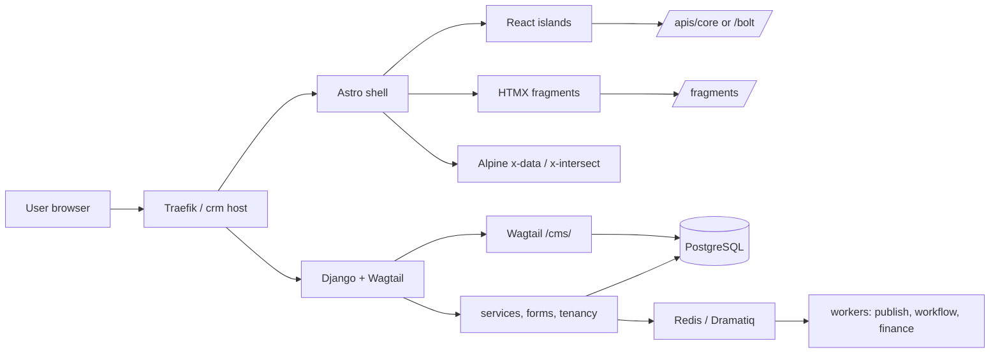
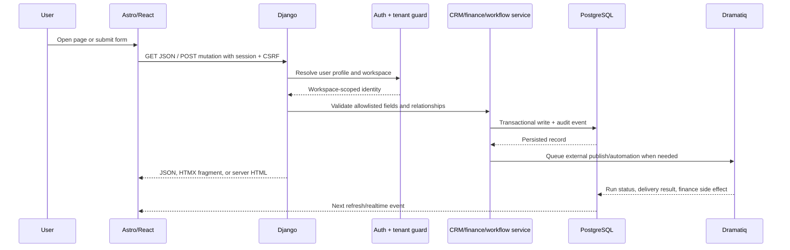
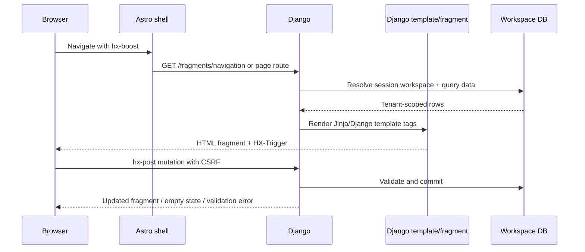
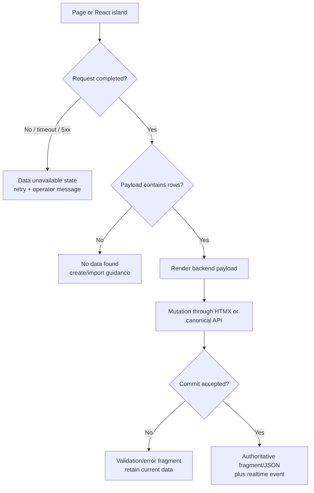
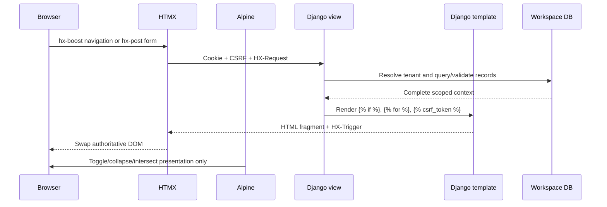
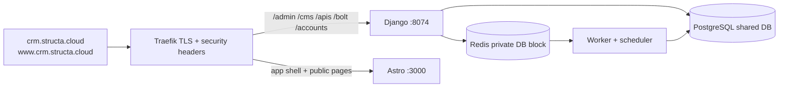

<!-- AI-generated: review needed -->

# 🧭 Loop CRM architecture and extensions

This is the implementation map for Loop CRM: a Django + Wagtail backend,
django-fusion render-first pages, an Astro shell with React islands, and
Dramatiq workers. It records what is actually in this checkout, where a feature
belongs, and how to extend it without splitting tenant or API contracts.

## 🧩 Source parity: Twenty CRM and Postiz

The source repositories are design references, not checked-out runtime
dependencies:

- Twenty CRM: `twentyhq/twenty` — relationship graph, pipelines, custom objects,
  saved views, and workflow concepts.
- Postiz: `gitroomhq/postiz-app` — channel catalog, scheduling, approvals,
  media, analytics, and provider adapters.

No 20CRM/Twenty or Postiz source directory is present under `projects/` in this
checkout. Loop CRM therefore uses the existing Django contracts instead of
copying source trees.

| Source capability | Loop CRM implementation | Owning files |
|---|---|---|
| Companies, contacts, deals | Tenant-scoped ORM + render-first forms + API resources | `backend/apps/crm/models.py`, `forms.py`, `views.py` |
| Pipelines and stages | Ordered stages with probability, closed state, stage move API, board island | `backend/apps/crm/models.py`, `frontend/src/components/board/PipelineBoard.tsx` |
| Custom fields/objects | Definition catalog + validated JSON values; no per-tenant migrations | `backend/apps/crm/custom_fields.py`, `custom_objects.py` |
| Saved list/kanban views | Member/workspace-scoped JSON view configuration | `backend/apps/core/models.py`, `views.py` |
| Posts/calendar/approvals | Post lifecycle, channel capability catalog, media, provider adapters | `backend/apps/marketing/`, `frontend/src/components/dashboard/ContentCalendar.tsx` |
| Finance | Invoice → payment → revenue event, POS ingest, exports, trend reports | `backend/apps/finance/`, `backend/apps/pos/` |
| Workflows | Trigger + ordered actions plus validated DAG graph, queued runs | `backend/apps/core/workflows.py`, `models.py`, `views.py` |

## 🗺️ Runtime request map



### Page and feature ownership

| User action | Browser entry | Backend contract | Persistence/worker path |
|---|---|---|---|
| Open CRM companies | `/crm/companies/` | `CompanyListView`, HTMX create, resource table | `crm.Company` |
| Open contacts | `/crm/contacts/` | `ContactListView`, workspace-scoped form | `crm.Contact` → `crm.Company` |
| Open deals kanban | `/crm/deals/` | `/apis/core/board/`, `/apis/core/deals/<id>/stage/` | `Deal.transition_to_stage()` → workflow/webhook |
| Edit pipeline stages | `/crm/pipelines/` | `pipeline_stages` resource CRUD | `crm.PipelineStage.order`, `probability` |
| Create calendar post | `/marketing/calendar/` | `/apis/core/resources/posts/` CRUD + lifecycle fragments | `marketing.Post` → Dramatiq publisher |
| Record finance event | `/finance/invoices/` | finance ModelForm/HTMX or resource CRUD | `Invoice`, `Payment`, `RevenueEvent` |
| Create workflow | `/settings/workflows/` | `workflow_create`, `workflow_steps_update`, `workflow_graph_update` | `WorkflowDefinition`, `WorkflowRun` |
| Configure fields | `/settings/custom-fields/` | custom-field catalog and validation service | `CustomFieldDefinition` + JSON attributes |
| Collect a public lead | Wagtail page / Astro landing | Wagtail form page or `/apis/pages/` | Wagtail submission + CRM intake service |
| Manage site content | `/cms/` | Wagtail admin panels and revisions | `apps.pages` models + Wagtail tables |

## 🔁 Feature request sequence



## 🧱 CRM pipeline and kanban

A pipeline is the parent; stages are ordered children. Every deal stage move
must use `Deal.transition_to_stage()` or the stage API so cross-pipeline moves,
close dates, deal-won workflows, webhooks, and audit behavior remain intact.

The stage resource is now exposed as `pipeline_stages` for full create, read,
update, and delete operations. The `/crm/pipelines/` Astro route mounts
`frontend/src/components/dashboard/PipelineManager.tsx`, which creates pipelines,
adds stages, edits names/probabilities, deletes stages, and swaps adjacent stage
order values. Example payload:

```json
{
  "pipeline_id": 1,
  "name": "Security review",
  "stage_type": "qualified",
  "probability": 42,
  "order": 2,
  "color": "#8A8A8A"
}
```

The kanban board reads stages and deals from the workspace-scoped board
endpoint. Drag-and-drop sends a CSRF-protected stage mutation; optimistic UI
is rolled back when the backend rejects the move.

## 🖥️ Render-first shell contract

The Astro shell does not invent a second data source. Navigation is requested
from Django with `hx-get="/fragments/navigation/?variant=astro"`; backend
navigation templates use Django tags and the workspace navigation context.
Server-rendered module pages use `dashboard/*.html` and
`dashboard/partials/*.html`, with ``, ``, ``,
`hx-post`, `hx-target`, and `hx-swap` to keep mutation responses authoritative.
Alpine is limited to local presentation state such as `x-data`,
`x-intersect`, and `x-collapse`; it does not own CRM or finance records.

React islands use `/apis/core/` or `/bolt/`. The deprecated `/api/v1/` road is
not a frontend default. If Django fails, the UI shows an explicit data-unavailable
state rather than substituting mock records or localhost content.



Empty states mean a valid workspace has zero rows. Error states mean the
backend did not respond; they must never be rendered as fabricated records.

### No-fabricated-data rule

The frontend may use a transport fallback only for a documented API-road
compatibility concern (`/bolt/` → `/apis/core/` in the shared client). It must
never use fallback records, hard-coded CRM rows, localhost content, or a mock
success response. A failed request renders an explicit **data unavailable**
state with retry guidance; a successful zero-row response renders the page's
**no data found** empty state.



### Shell, HTMX, and Alpine boundaries

The Django shell is the authoritative render-first path. `base.html` enables
`hx-boost`, CSRF headers, SSE refresh hooks, and the content target. The
sidebar and Astro navigation are fetched from Django fragments, not rebuilt
from a frontend-only route list. Alpine is intentionally limited to local UI
state (`x-data`, `x-intersect`, `x-collapse`, menu disclosure); it does not
fetch, mutate, or cache CRM, finance, workflow, or integration records.



The Astro shell uses the same contract: `AppShell.astro` requests
`/fragments/navigation/?variant=astro`, marks a navigation outage explicitly,
and never replaces missing backend data with cached records. React islands are
reserved for dense interactive surfaces (kanban, calendar, analytics, and
pipeline management) and show their own loading, empty, and error states.

## 🚢 Domain, admin, and release readiness

Production routes are aligned to `crm.structa.cloud` and
`www.crm.structa.cloud`. Traefik sends `/accounts`, `/apis`, `/bolt`,
`/billing`, `/admin`, `/django-admin`, `/cms`, `/fragments`, `/connect`,
`/account`, `/sse`, and `/ws` to Django; the remaining shell routes go to
Astro. The operational entry points are:

| Surface | URL | Purpose |
|---|---|---|
| Public application | `https://crm.structa.cloud/` | Astro shell and Wagtail-backed landing |
| Sign in | `https://crm.structa.cloud/accounts/login/` | django-allauth session login |
| Django admin | `https://crm.structa.cloud/admin/` | Users, billing, finance, and app models |
| Wagtail CMS | `https://crm.structa.cloud/cms/` | Editor-managed landing pages |
| Canonical JSON | `https://crm.structa.cloud/apis/core/` | Session-cookie workspace APIs |
| Bolt API | `https://crm.structa.cloud/bolt/` | Optional token API when installed |

The backend creates or updates the configured superuser only when explicitly
seeded (`make seed-demo` with `DEMO_MODE=1`, or `createsuperuser`). Production
must provide `DJANGO_SUPERUSER_USERNAME`, `DJANGO_SUPERUSER_EMAIL`, and a unique
`DJANGO_SUPERUSER_PASSWORD`; never enable the public demo account on a real
workspace. Verify the account through `/admin/` and `/cms/` after deployment,
without printing credentials in logs.



## ⚙️ Workflow creation and task ordering

A workflow has two synchronized representations:

1. `actions`: the execution order used by the worker and linear editor.
2. `graph`: nodes and edges used by the visual editor.

`normalize_workflow_graph()` rejects unknown actions, orphan nodes, cycles, and
missing/duplicate trigger roots. The server derives the topological `actions`
list, so the client cannot silently reorder execution. A workflow run is only
queued while the definition is `active`; each run stores queued, running,
succeeded, failed, or cancelled state.

When adding a new action:

```python
# projects/loop-crm/backend/apps/core/workflows.py
WORKFLOW_ACTION_CATALOG.append({
    "id": "create_follow_up_task",
    "label": "Create follow-up task",
    "description": "Create an auditable CRM task for the deal owner.",
})
```

Then implement the action in `backend/plugins/workers/tasks.py`, add a focused
unit test, and keep the action id in the graph validator allowlist. Do not call
external providers from a form or template.

## 🧾 Custom fields, custom forms, and collected data

### CRM custom fields

Use `CustomFieldDefinition` for fields on companies, contacts, deals, campaigns,
and posts. Its `field_type`, `options`, `validation`, `required`, and `position`
values describe the form. Values are validated by `apps/crm/custom_fields.py`
and stored in the owning model's `custom_attributes` JSON. This avoids a
migration for every workspace field while preserving tenant isolation.

### Public Wagtail form authoring

The checkout already enables `wagtail.contrib.forms` and uses Wagtail StreamField
pages in `backend/apps/pages/models.py`. A public lead form should be added as
an explicit Wagtail page type rather than hidden inside an Astro mock:

```python
# backend/apps/pages/models.py
from wagtail.contrib.forms.models import AbstractEmailForm, AbstractFormField
from wagtail.contrib.forms.panels import FormSubmissionsPanel
from wagtail.fields import StreamField

class LeadFormField(AbstractFormField):
    page = models.ForeignKey("LeadFormPage", related_name="form_fields", on_delete=models.CASCADE)

class LeadFormPage(AbstractEmailForm):
    intro = RichTextField(blank=True)
    thank_you_text = RichTextField(blank=True)
    content_panels = Page.content_panels + [
        FieldPanel("intro"),
        InlinePanel("form_fields", label="Fields"),
        FieldPanel("thank_you_text"),
    ]
    promote_panels = Page.promote_panels
    settings_panels = Page.settings_panels + [FormSubmissionsPanel()]
```

For this repository, place the model in `backend/apps/pages/models.py`, add it
to `apps/pages/admin.py`/panels if needed, create a migration, and add a
`pages/lead_form.html` template. In the POST handler or Wagtail form hook,
resolve the submission to the current intake workspace, validate email and
consent, create or match a `crm.Contact`, optionally create an `Activity`, and
write an `AuditLog`. Never accept a workspace id from an untrusted form field.

Wagtail editors then create a form at `/cms/`:

1. Add a **Lead form page** below the Wagtail home page.
2. Add fields with stable names: `first_name`, `last_name`, `email`, `company`,
   `message`, and `marketing_consent`.
3. Publish the page and test the public URL.
4. Review submissions in the Wagtail **Form submissions** panel.
5. Confirm the CRM contact/activity and audit event in the workspace.

The exact page class must be migrated before editors use it. Do not put secrets
or provider credentials into Wagtail fields.

## 🧰 Frontend and backend file map

```text
projects/loop-crm/
├── frontend/src/pages/[...path].astro          # route catalog + island mounts
├── frontend/src/components/board/PipelineBoard.tsx
├── frontend/src/components/dashboard/PipelineManager.tsx
├── frontend/src/components/AppShell.astro              # HTMX navigation shell + explicit error state
├── frontend/src/components/dashboard/ContentCalendar.tsx
├── frontend/src/components/dashboard/ResourceTable.tsx
├── frontend/src/lib/navigation.ts
├── backend/urls.py                              # root URL composition
├── backend/apps/core/fusion.py                  # render-first application routes
├── backend/apps/core/api.py                     # compatibility JSON road
├── backend/apps/core/apis_core_urls.py          # canonical named JSON road
├── backend/apps/core/resources.py               # CRUD allowlists + tenancy
├── backend/apps/core/workflows.py               # trigger/action/DAG validation
├── backend/apps/core/models.py                  # workspace, workflow, audit
├── backend/apps/crm/models.py                   # CRM graph and pipeline stages
├── backend/apps/crm/forms.py                    # tenant-scoped CRM forms
├── backend/apps/marketing/models.py             # campaigns, channels, posts
├── backend/apps/finance/models.py               # invoices, payments, revenue
├── backend/apps/pages/models.py                 # Wagtail editable landing pages
├── backend/templates/dashboard/                 # HTMX/render-first surfaces
└── backend/plugins/workers/tasks.py             # queued external side effects
```

## 🧪 Extension checklist

1. Search the resource registry and existing fragment before adding a model.
2. Add the model/form/service inside its owning app.
3. Add `workspace` scoping and relation validation.
4. Register CRUD fields in `apps/core/resources.py` only if the resource is
   safe for the data API.
5. Add table metadata and a route/page entry.
6. Add loading, empty, error, success, and keyboard states to islands.
7. Add a render-first test, a JSON contract test, and a cross-tenant test.
8. Update this file with the route and diagram impact.
9. Run `make check` and `make test` in the backend and `npm run check && npm test`
   in the frontend.

## 🧠 Enhanced prompts for future work

Use these prompts with the repository-aware agent:

```text
Audit Loop CRM before coding. Read AGENTS.md, the nearest product guidance,
projects/loop-crm/docs, apps/core/resources.py, apps/core/workflows.py, and the
relevant models/forms/templates. Compare only against the documented Twenty CRM
and Postiz capabilities; do not clone source trees. Report existing contracts,
missing behavior, tenant/security risks, and the smallest shippable diff.
```

```text
Add a Loop CRM feature end to end. Preserve the workspace boundary, the
render-first Django/HTMX road, the canonical /apis/core/ road, and the
compatibility /api/v1/ road. Implement model/service/form/API/template or
React island changes, table metadata, audit/realtime behavior, focused tests,
and a Mermaid request-flow update. Never invent provider success or accept
foreign workspace IDs.
```

```text
Add a Wagtail-managed form to Loop CRM. Confirm whether a page model already
exists, use wagtail.contrib.forms and InlinePanel for editor-defined fields,
add a migration and template, store submissions through Wagtail's submission
model, map the submission into a tenant-scoped CRM contact/activity, add
consent validation and an AuditLog entry, and document the /cms/ editor steps.
Run Django checks and tests; do not load production fixtures.
```

```text
Review a pipeline/workflow change as a data-integrity engineer. Verify stage
moves stay in the deal's pipeline, actions remain topologically ordered, DAG
cycles/orphans are rejected, inactive workflows cannot queue, all writes are
workspace-scoped, and external work is delegated to Dramatiq. Add regression
tests for every rejected case and update the architecture diagram.
```

## 🧪 Frontend/backend validation contract

- `frontend/src/lib/landing.ts` uses the same-origin `/apis/pages/` proxy and
  has no localhost content fallback.
- `ContentCalendar`, `PipelineManager`, and `RevOpsDashboard` use canonical
  `/apis/core/` roads.
- `backend/apps/core/apis_core_urls.py` exposes canonical resource CRUD under
  `/apis/core/resources/<resource>/`.
- Django templates remain the source of truth for render-first pages; React
  islands are used only for data-heavy interactions such as the kanban and
  analytics dashboard.

## Remarks & Notes

- The local checkout does not contain Twenty CRM or Postiz source projects; the
  source URLs in the merge plan are references only.
- `pipeline_stages` is a data API resource; stage transitions still belong to
  the dedicated deal stage endpoint so close workflows cannot be bypassed.
- Wagtail page-model changes require a migration and a template before editors
  can publish them. Keep public form rendering server-backed and review CSRF,
  consent, and workspace assignment before production release.
- External OAuth, publishing, Stripe, and email behavior remains credential and
  environment dependent. Local tests verify contracts, not third-party account
  approval.
