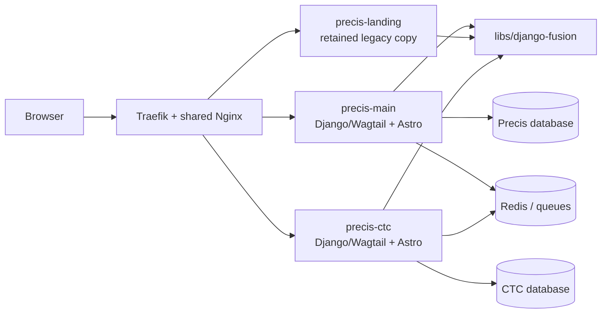

# Precis relationships and boundaries

> **Canonical group:** `projects/precis/`

<!-- AI-generated: review needed -->

## Runtime map



## Ownership table

| Concern | Precis unified | Precis Landing copy | CTC Research |
|---|---|---|---|
| Filesystem | `projects/structa.cloud/` | `projects/precis/precis-landing/` | `projects/precis/precis-ctc/` |
| Runtime identity | `precis-main` | `precis-landing` | `precis-ctc` |
| Main audience | Learners, teams, catalog visitors | Compatibility/legacy landing workflows | Researchers, clinicians, medical writers, learners |
| Backend | Django/Wagtail LMS + marketing | Django/Wagtail landing copy | Django/Wagtail research + learning |
| Frontend | Astro shell | Astro shell | Astro shell |
| Database boundary | Independent Precis DB | Separate legacy runtime if operated | `db_precis_ctc` |
| Release command | Project dispatcher / product Makefile | Legacy alias only | `make redeploy` or `npx nx run precis-ctc:redeploy` |
| Docs source | `projects/precis/docs/precis-main/` | `projects/precis/docs/precis-landing/` | `projects/precis/docs/precis-ctc/` |

## Shared framework relationship

`libs/django-fusion/` is shared framework code, not product content. Precis
products consume its components, route/viewset helpers, fragments, tables,
forms, assets, and task boundaries. Product-specific models, translations,
copy, and deployment configuration remain in the owning product.

## Documentation relationship

```text
projects/precis/docs/<product>/       implementation and operational source
                 │
                 ├── links to shared framework and root runbooks
                 └── links from public reader-facing docs

docs/precis/                           product overview and navigation
 docs/precis-ctc/                      CTC content/publishing strategy
 docs/startup/                         private strategy and market context
```

The project-local tree is authoritative for implementation details. The root
`docs/` tree is authoritative for portfolio navigation, public guides, and
cross-product architecture. A page should have one owner and links elsewhere.

## Deploy cascade

```text
npx nx run precis-ctc:redeploy
  → projects/precis/precis-ctc/Makefile: redeploy
    → backend check + frontend check
    → compose build backend/worker/scheduler/frontend
    → compose recreate the four CTC services
    → compose status
```

Do not route CTC deployment through the Precis unified database or through the
retained Precis Landing copy.

## Remarks & Notes

- Shared proxy configuration lives under `application/proxy/`; it is infrastructure, not product documentation.
- The old `precis-landing` copy remains present by repository policy; do not infer that it is the canonical unified runtime.
- CTC uses the same framework but has independent content, locale, database, media, and release ownership.
