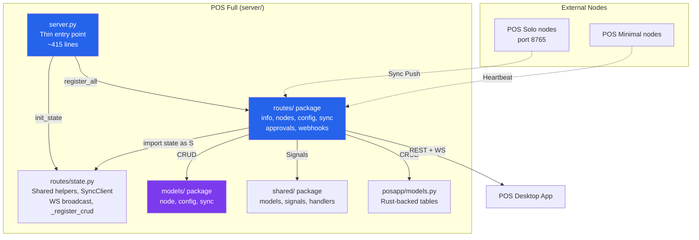

# POS Full — Server Architecture

```
server/
├── server.py                 # 🟢 Thin entry point: bootstrap + middleware + CRUD (~415 lines)
├── routes/                   # 🟢 Route handler modules
│   ├── __init__.py           #   register_all(app)
│   ├── state.py              #   Shared helpers, SyncClient, WS broadcast, _register_crud
│   ├── info.py               #   /, /health, /stats (~60 lines)
│   ├── nodes.py              #   Node CRUD, register, heartbeat, WS /ws/nodes (~350 lines)
│   ├── config.py             #   Device/Master/Cloud config, WS /ws/config (~140 lines)
│   ├── sync.py               #   Sync status, trigger, push/receive (~300 lines)
│   ├── approvals.py          #   Approve, reject, pending (~70 lines)
│   └── webhooks.py           #   Webhook receive, list, stats (~80 lines)
├── models/                   # 🔵 Django ORM models
│   ├── __init__.py
│   ├── node.py               # Node, Heartbeat, NodeEvent
│   ├── config.py              # DeviceConfig, MasterDevice, CloudLink
│   └── sync.py                # SyncLog
├── posapp/                   # 🔵 Django models (Rust-mirror, managed=False)
│   ├── __init__.py
│   └── models.py              # 30+ tables
├── tests/
│   ├── test_server.py        # 53 tests
│   ├── test_webhook_e2e.py   # 10 tests (decoupled from server.py)
│   └── django_setup.py       # Standalone Django bootstrap helper
└── requirements.txt          # Dependencies
```

## Server Components

| Layer | Component | Role |
|-------|-----------|------|
| 🟢 Server | `server.py` | Thin entry point: Django bootstrap, middleware, CRUD registration, `init_state()`, `register_all()` |
| 🟢 Routes | `routes/info.py` | `GET /`, `/health`, `/stats` |
| 🟢 Routes | `routes/nodes.py` | Node CRUD, register, heartbeat, history, WS `/ws/nodes` |
| 🟢 Routes | `routes/config.py` | Device/Master/Cloud config CRUD, WS `/ws/config` |
| 🟢 Routes | `routes/sync.py` | Sync status, trigger, push/receive, cloud push |
| 🟢 Routes | `routes/approvals.py` | Approve, reject, pending, receive endpoints |
| 🟢 Routes | `routes/webhooks.py` | Webhook receive, list, stats |
| 🟢 State | `routes/state.py` | Shared helpers (`_ser`, `_list`, `_register_crud`), `SyncClient`, WS broadcast |
| 🔵 Models | `models/` package | Node, Heartbeat, NodeEvent, SyncLog, DeviceConfig, MasterDevice, CloudLink |
| 🔵 Shared | `shared/` package | DeviceToken, SyncApproval, SignalEvent, signals, handlers, ProductSyncEngine |
| 🔵 Tests | `tests/django_setup.py` | Standalone Django bootstrap (decoupled from server.py) |
| 🔵 Portal | — | Removed — Robyn server.py handles everything |

## Architecture



## Usage

```bash
# Start Robyn server (main API — no Django portal required)
python3 server.py --port 8766

# Run tests (uses standalone django_setup.py helper)
DJANGO_SETTINGS_MODULE='' python3 -m pytest tests/ -v --import-mode=importlib
```

## Test Results (Session: 2026-07-20)

**Run command:**
```bash
DJANGO_SETTINGS_MODULE='' python3 -m pytest tests/test_server.py tests/test_data_sync.py tests/test_webhook_e2e.py -v --import-mode=importlib
```

| Suite | Tests | Passed | Failed | Skipped |
|-------|------:|------:|------:|------:|
| `test_server.py` | 53 | 53 | 0 | 0 |
| `test_data_sync.py` (ModelParity) | 6 | 6 | 0 | 0 |
| `test_data_sync.py` (RealCrossORM) | 12 | 0 | 0 | 12 |
| `test_webhook_e2e.py` | 10 | 10 | 0 | 0 |
| **TOTAL** | **81** | **69** | **0** | **12** |

### Analysis

- **69/69 non-Rust tests passed (100%)** ✅ — all server, data model parity, and webhook tests pass
- **12 skipped**: `TestRealCrossORM` — requires Rust-built `restaurant.db` with expected tables. Run `cargo build` in `src-tauri/` to populate.
- **Webhook fix**: `WEBHOOK_URLS` now uses lazy env var loading (`_WebhookUrls(dict)` subclass in `shared/handlers/signal.py`) so tests can set env vars after module import.

## Sync State

Current `sync_state.json`:
```json
{
  "enabled": true,
  "cloud_url": "http://127.0.0.1:8082",
  "api_key": "",
  "last_sync": "2026-07-20T07:03:11.277731+00:00",
  "status": "error",
  "items_synced": 0,
  "errors": 1,
  "last_error": "All connection attempts failed"
}
```

- **Status**: `error` — cloud CRM at `http://127.0.0.1:8082` is not running (expected in dev).
- **Sync endpoints**: 13 (status, config, log, trigger, cloud push, API push, receive sales/reports/inventory, push products/configs/catalog)
- **Sync engine**: `ProductSyncEngine` (shared/services/sync.py) — approval-queue workflow for master↔child sync
- **Database**: `restaurant.db` (270 KB, shared with Rust backend)

## Streams (WebSocket)

Two WebSocket channels provided by `streams.py`:

| Endpoint | Event Types | Broadcast Function |
|----------|------------|-------------------|
| `/ws/nodes` | `node_register`, `node_deregister`, `heartbeat`, `sync_complete`, `sync_push` | `_broadcast_node_event()` |
| `/ws/config` | `config_changed`, `config_synced`, `configs_pushed`, `catalog_pushed`, `products_pushed` | `_broadcast_config_event()` |

Filtering: Clients can subscribe to specific `node_id`, `event_type`, or `node_types` via WebSocket filters.

## HTML Serving Capability

The server currently serves **REST JSON + WebSocket only** — no HTML templates. HTML templates exist in the Tauri frontend (`src-tauri/templates/`):
- `support_email.html` — support ticket email body
- `invoice.html` — invoice PDF template (used by ReportLab on server-side)

**Potential additions (not implemented):**
- Dashboard HTML page at `/` (Jinja2/Mako template rendering)
- Node management UI at `/admin/nodes`
- Sync status dashboard at `/sync/dashboard`
- API documentation page (Swagger/ReDoc via Robyn's OpenAPI)

To add HTML serving, Robyn supports `@app.get("/", const=True)` with `serve_file()` or Jinja2 template rendering via `robyn.templating`.

## Models

| Model | File | Table | Purpose |
|-------|------|-------|---------|
| `Node` | `models/node.py` | `full_nodes` | Registered POS nodes |
| `Heartbeat` | `models/node.py` | `full_heartbeats` | Heartbeat audit log |
| `NodeEvent` | `models/node.py` | `full_node_events` | Node lifecycle events |
| `SyncLog` | `models/sync.py` | `full_sync_logs` | Sync operation audit |
| `DeviceConfig` | `models/config.py` | `full_device_configs` | Per-node config |
| `MasterDevice` | `models/config.py` | `full_master_devices` | Master devices |
| `CloudLink` | `models/config.py` | `full_cloud_links` | Cloud connections |
| `SyncApproval` | `shared/models/approval.py` | `pos_sync_approvals` | Approval queue |
| `DeviceToken` | `shared/models/token.py` | `cloud_device_tokens` | Auth tokens |
| `SignalEvent` | `shared/models/audit.py` | `pos_signal_events` | Audit trail |

## Shared Module Map

```
projects/formints/formint-pro/shared/
├── signals/__init__.py       # Signal definitions + fire_* helpers
├── models/
│   ├── audit.py              # SignalEvent
│   ├── approval.py           # SyncApproval
│   └── token.py              # DeviceToken
├── handlers/
│   └── signal.py             # @receiver handlers (log, webhook, audit)
├── services/
│   └── sync.py               # ProductSyncEngine
├── middleware/
│   └── auth.py               # create_auth_middleware, register_auth_routes
└── api/
    └── crud.py               # _ser, _paginate, _register_crud helpers
```
