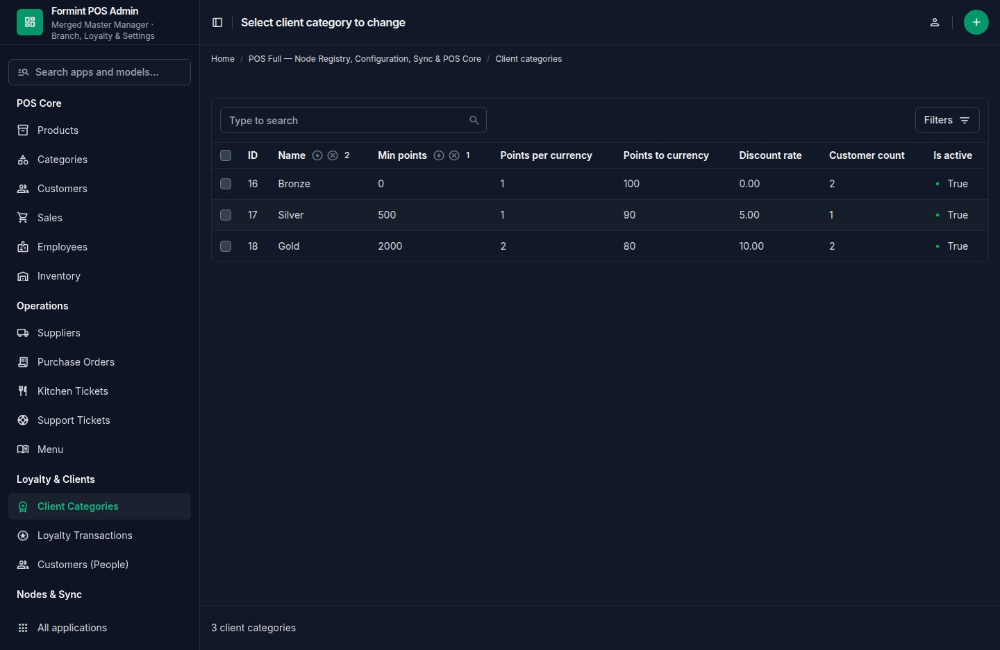

# POS — Restaurant Point of Sale Desktop App

> **v1.1** — Multi-edition system | Tauri 2 + Astro/React/Vue + Rust + Django

<p align="center">
  <a href="CHANGELOG.md"></a>
  <a href="../../docs/sites/pos.md"></a>
  <a href="PUBLISH.md"></a>
  <a href="https://github.com/mammhoud/POS"></a>
</p>

<p align="center">
  
</p>

POS is a modern, offline-first point-of-sale system for restaurants, cafes,
and food-service businesses. Built with Tauri, Astro + React, Rust, Django,
and SQLite — works on Windows, macOS, Linux, Android, and iOS.

---

## 📦 Editions

| Edition | Contents | Target |
|---------|----------|--------|
| **Community** (`formintA/`) | Offline-first desktop POS — Astro 5 + React 19 + Tauri + Rust/Diesel, no sidecar | Offline-only deployments |
| **Standard** (merged into `formint/`) | Standalone tier — Django sidecar + cloud sync client (gated by config) | Branch POS with sync |
| **Pro** (`formint/`) | **Merged package** — Astro + Alpine + HTMX frontend, full Django sidecar (48 models) + django-bolt + Channels WebSockets + Unfold admin + Tauri shell | Enterprise multi-device |
| **Cloud** (`formintB/`) | Hosted multi-terminal SaaS master — full Django setup (viewsets + fusion + bolt) + Astro/React frontend | Cloud CRM master |
| **pos-client** (`formintC/`) | Vue 3 + Tauri desktop client + Django purchase-app backend + Astro (django-fusion) storefront | Separate client app |

> **`formint/`** merges the former `pos-full` + `pos-solo` editions into one
> product boundary; the Robyn sidecar was replaced by a full Django setup. The
> repo layout is `formintA` / `formint` / `formintB` / `formintC` — the old
> `forge-pos`, `formint-pos`, `pos-client` and `pos-cloud` directory names are
> gone. See [`docs/architecture/editions.md`](docs/architecture/editions.md)
> for the complete per-edition analysis.

---

## 🚀 Quick Start

### Community Edition (no sidecar)
```bash
cd formintA
pnpm install
make dev          # Astro dev server (port 1420)
make dev:desktop  # Full Tauri desktop app
```

### Pro (merged package — recommended)
```bash
cd formint
make install      # backend .venv + deps + migrate + frontend npm install
make env          # sidecar :8767 + frontend :4321 (tmux)
make test         # backend + frontend contract tests
make check        # django check + astro check
```

### pos-client (Vue 3 + Django shop)
```bash
cd formintC
pnpm install      # Vue 3 desktop client
make dev          # dev server
```

### Using Root Makefile
```bash
make formint-install   # Install merged package
make formint-env       # Run full env (backend + frontend)
make server-test       # Run merged sidecar test suite
make screenshots       # Capture marketplace screenshots
make clean             # Delete build artifacts
```

### Formint POS Professional (merged package)

> **`formint/`** is the merged package that consolidates `pos-full` + `pos-solo`
> into one product boundary with the same Tauri architecture. The backend is a
> **full Django setup** — Django Ninja + ninja-extra REST API (django-fusion
> encoder/decoder on every response), django-fusion data components (tables +
> forms) over HTMX, django-bolt `/bolt/*`, and Channels WebSockets.

```bash
cd formint/sidecar && python3 -m venv .venv && . .venv/bin/activate
pip install -e . && python manage.py migrate
python manage.py runserver 127.0.0.1:8767   # API at /api/v1/, HTMX at /htmx/, admin at /admin/

cd ../frontend && pnpm install && pnpm dev  # Astro shell (proxies /api and /htmx)
```

API surface: `/api/v1/health`, `/api/v1/stats`, `/api/v1/openapi.json`, `/api/v1/docs`,
plus paginated CRUD for 45 resources (products, sales, inventory, suppliers,
purchase orders, loyalty, CRM, HR, …) and django-bolt `/bolt/*` via `manage.py runbolt` (port 8766).

See [`formint/README.md`](formint/README.md) and
[`formint/migration/compatibility-manifest.json`](formint/migration/compatibility-manifest.json).

---

## 📸 Screenshots

| | | |
|:---:|:---:|:---:|
|  |  |  |
| **Unfold Admin — Dashboard** | **Unfold Admin — Products** | **Unfold Admin — Customers** |
|  |  |  |
| **Unfold Admin — Sales** | **Unfold Admin — Loyalty** | **Unfold Admin — Settings** |

---

## 🏗️ Architecture

```
formintA/                    # Community — offline-first desktop POS
├── src/                     # Astro 5 pages (25) + React 19 components
├── src-tauri/               # Tauri 2 + Rust/Diesel (30+ #[command]s), SQLite
├── e2e/ + tests/            # Playwright e2e + Vitest
└── Makefile                 # dev/build/check targets

formint/                     # Pro — merged package (formerly pos-full + pos-solo)
├── frontend/                # Astro + Alpine.js + HTMX shell (32 pages)
├── sidecar/                 # Full Django sidecar (48 models)
│   ├── configs/ + asgi.py   # Django settings, URLconf, ASGI (HTTP + WS)
│   ├── bolt_api.py          # django-bolt REST endpoints (runbolt, :8766)
│   ├── consumers.py         # Channels WebSocket consumers (ws/nodes|entities|config)
│   ├── views_django.py      # Django-native REST surface (replaces Robyn routes)
│   ├── services/            # sync engine (ProductSyncEngine)
│   ├── models/              # Django ORM models (organized packages)
│   └── tests/               # Pytest suites (all files green individually)
├── src-tauri/               # Tauri 2 desktop shell (Django is data authority)
├── migration/               # compatibility-manifest.json
└── Makefile                 # install/env/test/check/build orchestration

formintB/                    # Cloud (pos-cloud) — hosted SaaS master
├── backend/                 # Django apps: core (models+viewsets), domain (sync), handlers (API+WS)
├── frontend/                # Astro 5 + React 19 (Community UI + telemetry, 26 pages)
└── Makefile                 # cloud install/run/test targets

formintC/                    # pos-client
├── src/ + src-tauri/        # Vue 3 + Pinia desktop client (4 views)
├── backend/                 # Django purchase-app (shop + employee, 6 models)
└── frontend/                # Astro storefront on django-fusion
```

---

## 🔧 Tech Stack

| Layer | Technology |
|-------|-----------|
| Frontend | Astro 5 + React 19 (Community/Cloud) · Astro + Alpine + HTMX (Pro) · Vue 3 + Pinia (pos-client) |
| Backend | Django 5 + Ninja + django-fusion + django-tables2 · django-bolt |
| Sidecar | Python 3, Django + Channels WebSocket + django-bolt + django-fusion |
| Admin | django-unfold (dashboard, KPI cards, charts) |
| Desktop | Rust (Tauri 2, Diesel) |
| Testing | pytest (sidecar + backend), Vitest (frontend contract), Playwright (e2e) |
| Build | make, pnpm/npm, pip/.venv |

---

## ✨ Key Features

- **Cross-platform desktop POS** — Windows, macOS, Linux, Android, iOS
- **Merged Formint package** — one boundary for frontend + backend + sidecar
- **Django Ninja REST API** — 45 paginated resources with django-fusion encoder/decoder
- **Unfold admin panel** — KPI dashboard, charts, loyalty & settings management
- **Django sidecar** — Django + Channels WebSocket streams + django-bolt `/bolt/*` API + django-fusion fragments
- **Role-based auth** — Superuser with 2FA support
- **Inventory tracking** — Low-stock alerts, purchase orders, supplier management
- **Kitchen display system** — Ticket flow: pending → preparing → ready → delivered
- **POS-KO Gaming Center** — Token-based gaming sessions with time tracking
- **Customer database** — Loyalty points, purchase history
- **Advanced receipts** — Tax, commercial, proforma, credit invoice templates
- **Automated tax reports** — PDF and Excel export
- **Employee management** — Scheduling, payroll, role assignments
- **HTMX data components** — django-fusion tables + forms server-rendered

---

## 📚 Documentation

| Document | Description |
|----------|-------------|
| [`docs/architecture/editions.md`](docs/architecture/editions.md) | **Editions analysis** — mini vs large scope, versions, per-edition breakdown |
| [`docs/FORMINT_ARCHITECTURE.md`](docs/FORMINT_ARCHITECTURE.md) | Formint POS architecture (merged package) |
| [`docs/SIDECAR_V2.md`](docs/SIDECAR_V2.md) | **Sidecar v2 reference** — Django + Channels + django-bolt, WS streams, signals, approval, sync |
| [`docs/COMMANDS.md`](docs/COMMANDS.md) | All CLI commands reference |
| [`docs/GETTING_STARTED.md`](docs/GETTING_STARTED.md) | Getting started guide |
| [`docs/POS_ARCHITECTURE.md`](docs/POS_ARCHITECTURE.md) | POS architecture (all editions) |
| [`docs/BOLT_INTEGRATION.md`](docs/BOLT_INTEGRATION.md) | django-bolt integration |
| [`docs/RUST_INTEGRATION.md`](docs/RUST_INTEGRATION.md) | Rust/Tauri integration |
| [`CHANGELOG.md`](CHANGELOG.md) | Full version history |
| [`PUBLISH.md`](PUBLISH.md) | Marketplace publish kit (ThemeForest, CodeCanyon, Gumroad) |

---

## 🏷️ Environment

Copy `.env.example` to `.env`:

```bash
SUPERUSER_EMAIL=admin@pos.local
SUPERUSER_PASSWORD=changeme
SUPERUSER_NAME=Admin
DATABASE_URL=restaurant.db
SIDECAR_HOST=127.0.0.1
SIDECAR_PORT=8767   # Django sidecar (django-bolt API on 8766)
```

---

## 📄 License

AGPL-3.0 — See [LICENSE](LICENSE)

---

## 🔗 Links

- **Website**: [structa.cloud](https://structa.cloud)
- **GitHub**: [github.com/mammhoud/POS](https://github.com/mammhoud/POS)
- **Marketplace**: See [`PUBLISH.md`](PUBLISH.md) for listing instructions
