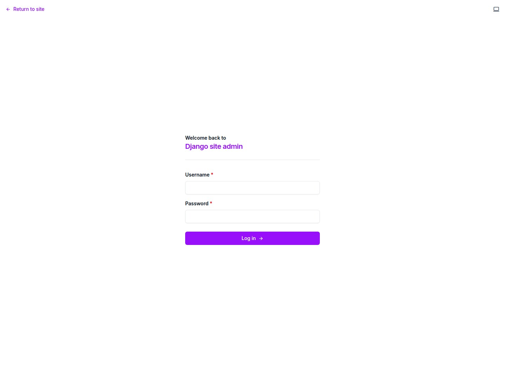
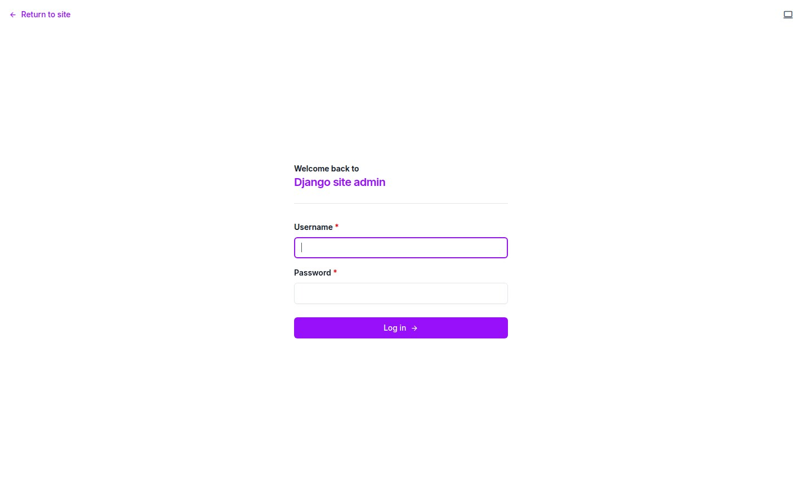

# POS — Restaurant Point of Sale Desktop App

> **v1.1** — 3 Edition System | Tauri 2 + React 19 + Rust + SQLite

<p align="center">
  <a href="CHANGELOG.md"></a>
  <a href="../../docs/sites/pos.md"></a>
  <a href="PUBLISH.md"></a>
  <a href="https://github.com/mammhoud/POS"></a>
</p>

<p align="center">
  
</p>

POS is a modern, offline-first desktop point-of-sale application for
restaurants, cafes, and food-service businesses. Built with Tauri, React,
Rust, and SQLite — works on Windows, macOS, Linux, Android, and iOS.

---

## 📦 Editions

| Edition | Contents | Target |
|---------|----------|--------|
| **Mini** (`forge-pos/`) | Core POS (Tauri + Rust + SQLite) | Offline-only deployments |
| **Formint** (`formint-pos/`) | **Merged package** — Astro frontend + Django Ninja backend + Robyn sidecar + Unfold admin (consolidates the former Full + Solo editions) | Enterprise multi-device |
| **Client** (`pos-client/`) | Vue 3 + Tauri desktop | Separate client app |
| **Cloud** (`pos-cloud/`) | Django ASGI + Unfold + Bolt dashboard | Cloud CRM master |

> **`formint-pos/`** merges the former `pos-full` + `pos-solo` editions into one
> product boundary. The legacy React UIs are archived under `formint-pos/legacy-react/`.

---

## 🚀 Quick Start

### Mini Edition (no sidecar)
```bash
cd forge-pos
pnpm install
cd src-tauri && cargo fetch && cd ..
pnpm dev          # Vite dev server at localhost:1420
pnpm dev:desktop  # Full Tauri desktop app
```

### Formint POS (merged package — recommended)
```bash
cd formint-pos
make install      # backend .venv + deps + migrate + frontend npm install
make env          # backend :8767 + frontend :4321 (tmux)
make test         # backend + frontend contract tests
make check        # django check + astro check
```

### Using Root Makefile
```bash
make formint-install   # Install merged package
make formint-env       # Run full env (backend + frontend)
make server-test       # Run merged sidecar test suite
make screenshots       # Capture marketplace screenshots
make clean             # Delete build artifacts
```

### Formint POS Professional (merged package)

> **`formint-pos/`** is the merged package that consolidates `pos-full` + `pos-solo`
> into one product boundary with the same Tauri architecture. The backend uses
> **Django Ninja + ninja-extra** for the REST API (django-fusion encoder/decoder
> on every response) and **django-fusion data components** (tables + forms) for
> HTMX fragments.

```bash
cd formint-pos/backend && python3 -m venv .venv && . .venv/bin/activate
pip install -e . && python manage.py migrate
python manage.py runserver 127.0.0.1:8000   # API at /api/v1/, HTMX at /htmx/

cd ../frontend && pnpm install && pnpm dev  # Astro shell (proxies /api and /htmx)
```

API surface: `/api/v1/health`, `/api/v1/stats`, `/api/v1/openapi.json`, `/api/v1/docs`,
plus paginated CRUD for 45 resources (products, sales, inventory, suppliers,
purchase orders, loyalty, CRM, HR, …).

See [`formint-pos/README.md`](formint-pos/README.md) and
[`formint-pos/migration/compatibility-manifest.json`](formint-pos/migration/compatibility-manifest.json).

---

## 📸 Screenshots

| | | |
|:---:|:---:|:---:|
|  |  |  |
| **Unfold Admin — Dashboard** | **Unfold Admin — Products** | **Unfold Admin — Customers** |
|  | | |
| **Unfold Admin — Sales** | | |

---

## 🏗️ Architecture

```
formint-pos/                 # Merged package (formerly pos-full + pos-solo)
├── frontend/                # Astro + Alpine.js + HTMX shell
│   └── src/                 # Pages, components, contract tests
├── backend/                 # Django + Ninja + django-fusion + Unfold admin
│   ├── formint/             # Models (45), views, api, fusion, handlers
│   ├── configs/             # Settings + URL routing
│   └── Makefile             # dev/check/migrate/test/seed targets
├── sidecar/                 # Merged Robyn sidecar (streams, ws_client, sync)
│   ├── server.py            # Robyn REST + WebSocket (60-70+ endpoints)
│   ├── routes/              # CRUD + state + webhooks + reports
│   ├── services/            # sync, scheduler, webhook services
│   ├── models/              # Django ORM models (organized packages)
│   └── tests/               # Pytest suites (171 passing)
├── src-tauri/               # Tauri 2 desktop shell (Django is data authority)
├── legacy-react/            # Archived React UIs (pos-full + pos-solo)
├── docs/                    # Screenshots + architecture docs
└── Makefile                 # install/env/test/check/build orchestration

forge-pos/                   # Mini edition — Tauri + Rust/Diesel
pos-client/                  # Vue 3 + Tauri desktop client
pos-cloud/                   # Django ASGI + Unfold + Bolt cloud CRM master
```

---

## 🔧 Tech Stack

| Layer | Technology |
|-------|-----------|
| Frontend | Astro, Alpine.js, HTMX (merged) · React 19 (archived legacy) |
| Backend | Django 5 + Ninja + django-fusion + django-tables2 |
| Sidecar | Python 3, Robyn, Django ORM (mirror), WebSocket streams |
| Admin | django-unfold (dashboard, KPI cards, charts) |
| Desktop | Rust (Tauri 2) |
| Testing | pytest (sidecar + backend), Vitest (frontend contract) |
| Build | make, pnpm/npm, pip/.venv |

---

## ✨ Key Features

- **Cross-platform desktop POS** — Windows, macOS, Linux, Android, iOS
- **Merged Formint package** — one boundary for frontend + backend + sidecar
- **Django Ninja REST API** — 45 paginated resources with django-fusion encoder/decoder
- **Unfold admin panel** — KPI dashboard, charts, loyalty & settings management
- **Robyn sidecar** — WebSocket streams, data sync, webhooks, scheduler
- **Role-based auth** — Superuser with 2FA support
- **Inventory tracking** — Low-stock alerts, purchase orders, supplier management
- **Kitchen display system** — Ticket flow: pending → preparing → ready → delivered
- **POS-KO Gaming Center** — Token-based gaming sessions with time tracking
- **Customer database** — Loyalty points, purchase history
- **Advanced receipts** — Tax, commercial, proforma, credit invoice templates
- **Automated tax reports** — PDF and Excel export
- **Employee management** — Scheduling, payroll, role assignments
- **HTMX data components** — django-fusion tables + forms server-rendered

---

## 📚 Documentation

| Document | Description |
|----------|-------------|
| [`SIDECAR_V2.md`](docs/SIDECAR_V2.md) | **Sidecar v2 reference** — Robyn + Django ORM, 70+ APIs, WS streams, signals, approval, sync, cloud plan |
| [`CHANGELOG.md`](CHANGELOG.md) | Full version history |
| [`PUBLISH.md`](PUBLISH.md) | Marketplace publish kit (ThemeForest, CodeCanyon, Gumroad) |
| [`docs/README.md`](docs/README.md) | Editions overview & architecture |
| [`docs/START_HERE.md`](docs/START_HERE.md) | Getting started guide |
| [`docs/commands.md`](docs/commands.md) | All CLI commands reference |
| [`docs/project-tree.md`](docs/project-tree.md) | Full project tree |
| [`docs/rust-code.md`](docs/rust-code.md) | Rust backend documentation |
| [`docs/customization-react.md`](docs/customization-react.md) | React customization guide |
| [`docs/customization-tauri.md`](docs/customization-tauri.md) | Tauri customization guide |
| [`docs/i18n-conventions.md`](docs/i18n-conventions.md) | Translation conventions |
| [`docs/server/README.md`](docs/server/README.md) | Sidecar API reference [Solo/Full] |
| [`docs/back-env/README.md`](docs/back-env/README.md) | Backend environment setup [Full] |

---

## 🏷️ Environment

Copy `.env.example` to `.env`:

```bash
SUPERUSER_EMAIL=admin@pos.local
SUPERUSER_PASSWORD=changeme
SUPERUSER_NAME=Admin
DATABASE_URL=restaurant.db
SIDECAR_HOST=127.0.0.1
SIDECAR_PORT=8765
```

---

## 📄 License

AGPL-3.0 — See [LICENSE](LICENSE)

---

## 🔗 Links

- **Website**: [structa.cloud](https://structa.cloud)
- **GitHub**: [github.com/mammhoud/POS](https://github.com/mammhoud/POS)
- **Marketplace**: See [`PUBLISH.md`](PUBLISH.md) for listing instructions
