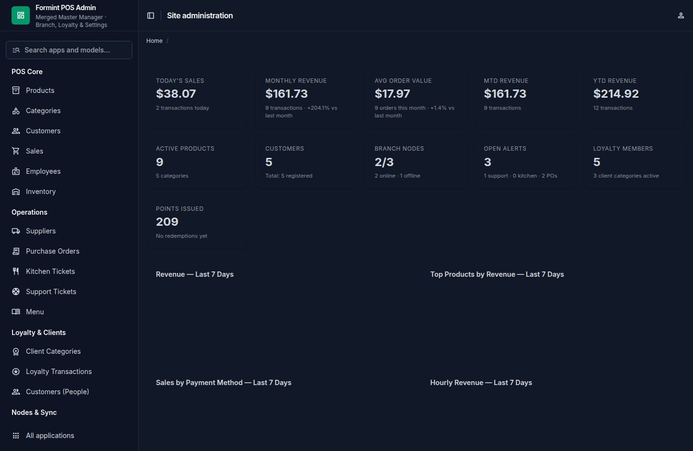
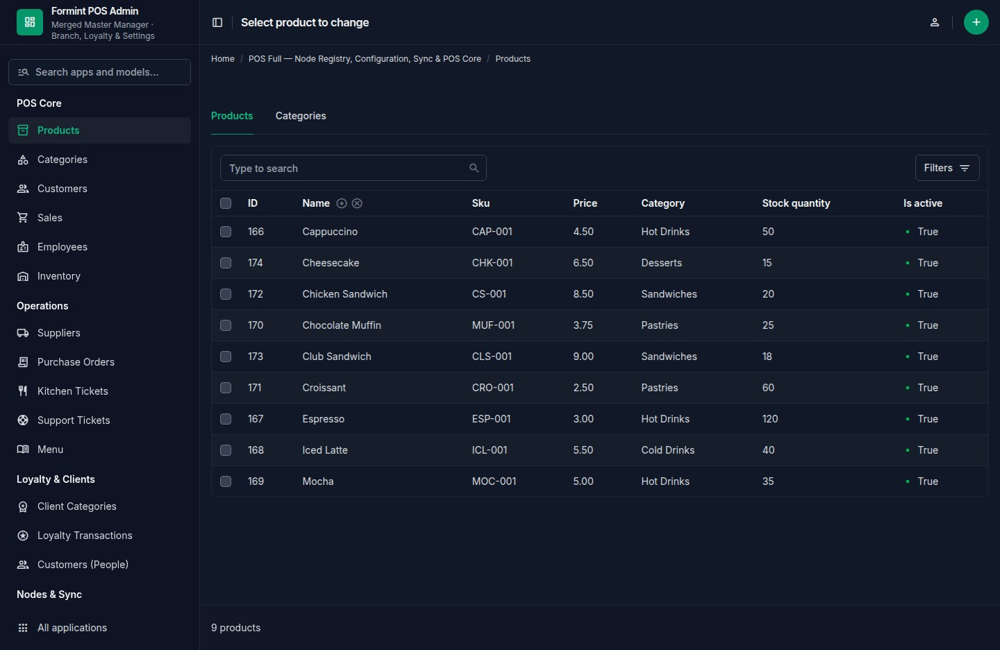
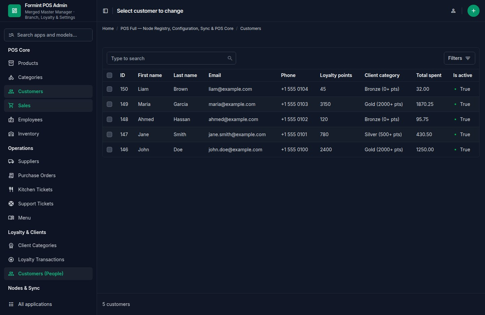
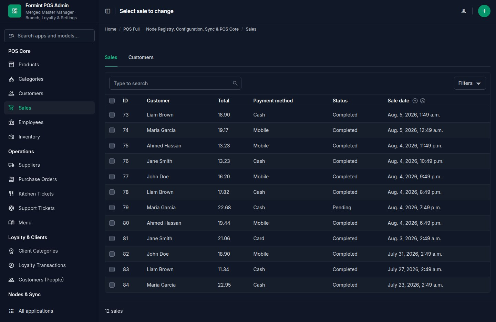
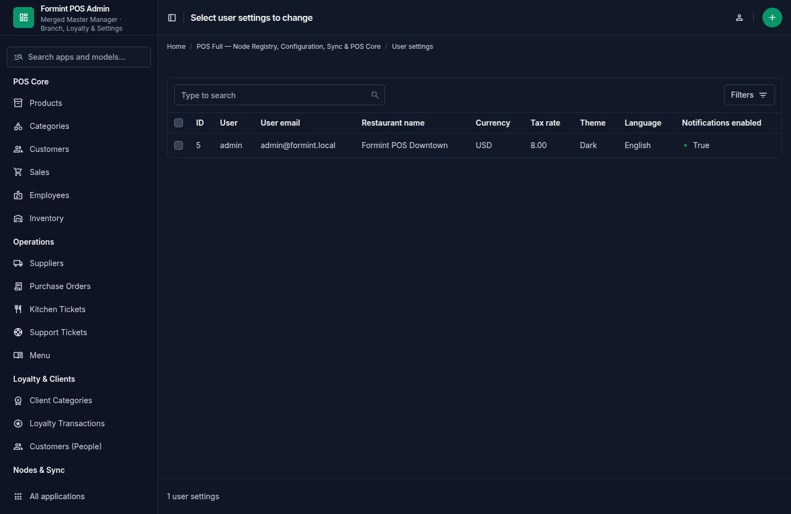
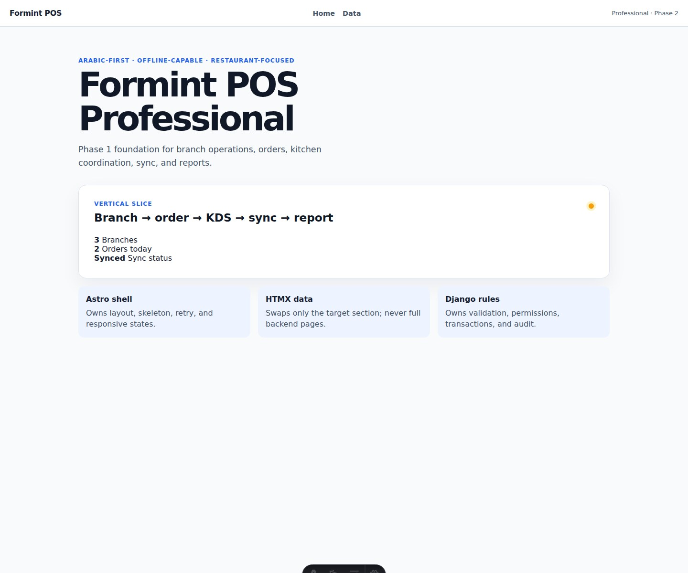
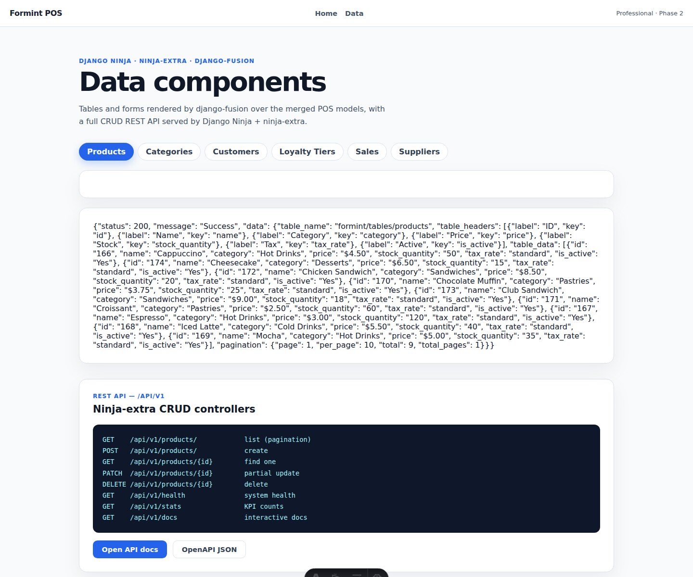

# Formint POS — Architecture

> **Formint POS Professional** is the merged package that consolidates
> `pos-full` (cloud master manager) and `pos-solo` (standalone device) into a
> single product boundary with the same Tauri shell architecture.

| | |
|---|---|
| **Location** | [`../formint-pos/`](../formint-pos/) |
| **Status** | Phase 2 — merge complete + landing-fusion render-mode parity |
| **API** | Django Ninja + ninja-extra (fusion encoder/decoder) |
| **Admin** | Django Unfold dashboard (loyalty/settings focus) |
| **Data components** | django-fusion tables + forms (HTMX) |
| **Render mode** | Dual-mode contract (render-first / data-API), mirroring landing-fusion |
| **Frontend** | Astro + Alpine.js + HTMX |
| **Desktop** | Tauri v2 shell |
| **Manifest** | [`../formint-pos/migration/compatibility-manifest.json`](../formint-pos/migration/compatibility-manifest.json) |

---

## 1. Purpose

Formint is the canonical Professional POS product name. The legacy React
editions (`pos-full`, `pos-solo`) were merged into this package and their
dead React code removed; `forge-pos` and `pos-cloud` remain in
`projects/pos/` for parity/rollback. All new work uses `formint-pos` /
`Formint` identifiers.

The package keeps the established Tauri architecture (Rust shell + sidecar
backend + web frontend) while upgrading the backend to a fully typed REST API
with server-rendered data components and a modern admin panel.

---

## 2. Directory map

```text
formint-pos/
├── sidecar/                     # merged Django boundary — no Wagtail
│   ├── configs/                 # settings (Unfold + fusion render-mode), URLs
│   ├── manage.py                # CLI + --ensure-superuser bootstrap
│   ├── server.py                # Robyn sidecar server (API + WebSocket, :8766)
│   ├── bolt_api.py              # django-bolt REST API
│   ├── models/                  # pos_full model layer (single source of truth)
│   ├── formint/
│   │   ├── models/              # re-exports pos_full models (unified layer)
│   │   ├── schemas.py           # ninja_schema Out schemas + writable/patch factory
│   │   ├── controllers.py       # ninja-extra ModelController CRUD (45 resources)
│   │   ├── api.py               # NinjaAPI + fusion JSONRenderer + system endpoints
│   │   ├── components.py        # django-fusion table/form data components
│   │   ├── fusion_components.py # branch summary fragment (FusionDualModeMixin)
│   │   ├── core.py              # FormintSite (django-fusion Site — nav source of truth)
│   │   ├── fusion.py            # render-mode/nav/assets contract + FusionCodec pointer
│   │   ├── handlers.py          # HTMX fragment handlers + FormintPageView (PageHandler)
│   │   ├── views.py             # thin URL-facing delegation to handlers + /fusion/* endpoints
│   │   ├── admin.py             # canonical Unfold ModelAdmin registrations (superset)
│   │   ├── dashboard.py         # Unfold dashboard callback (KPIs/charts/tables)
│   │   └── templates/           # fusion table + form templates
│   ├── django_templates/admin/  # Unfold admin index override (dashboard UI)
│   └── Makefile                 # sidecar targets (dev/check/migrate/test/seed/server)
├── Makefile                     # root orchestrator (frontend + sidecar + full + env)
├── frontend/                    # Astro shell
│   ├── Makefile                 # frontend targets (install/dev/build/check/test)
│   ├── astro.config.mjs         # dev proxy → sidecar :8767 (/api, /htmx, /fusion)
│   └── src/                     # pages/ (index, data) + components/ui/Skeleton + lib/htmx-bootstrap + tests/
├── src-tauri/                   # Tauri shell (sidecar supervision + native)
├── assets/                      # shared static assets
└── migration/
    └── compatibility-manifest.json
```

---

## 3. Backend

### 3.1 Stack

- **Django** — models, migrations, admin
- **django-ninja + ninja-extra** — typed REST API with `ModelControllerBase`
- **django_fusion encoder/decoder** — every API response wrapped in the fusion
  envelope `{ status, message, data }`
- **django_fusion.fragments.tables / .forms** — server-rendered data
  components as tables and forms
- **django-unfold** — modern admin theme with custom dashboard

### 3.2 REST API (`/api/v1/`)

| Endpoint | Method | Description |
|---|---|---|
| `/api/v1/health` | GET | Service health + product + model count (fusion envelope) |
| `/api/v1/stats` | GET | System stats (counts per resource) |
| `/api/v1/openapi.json` | GET | OpenAPI schema |
| `/api/v1/docs` | GET | Swagger UI |
| `/api/v1/{resource}` | GET | List (paginated, `results` array) |
| `/api/v1/{resource}` | POST | Create |
| `/api/v1/{resource}/{id}` | GET | Retrieve |
| `/api/v1/{resource}/{id}` | PATCH | Partial update (all-optional schema) |
| `/api/v1/{resource}/{id}` | DELETE | Delete (204) |

**Resources** (45 controllers): products, categories, customers, sales,
sale-items, inventory-transactions, employees, menu-items, menus,
menu-assignments, nodes, heartbeats, node-events, device-configs,
master-devices, cloud-links, sync-logs, suppliers, purchase-orders,
purchase-order-items, kitchen-tickets, support-tickets, payroll,
employee-schedules, tax-reports, notes, ingredients, recipes,
receipt-templates, roles, inventory-adjustments, client-categories,
loyalty-transactions, user-settings, sync-approvals, device-tokens,
signal-events, crm/companies, crm/pipelines, crm/stages, crm/contacts,
crm/deals, crm/activities, crm/notes.

### 3.3 Schema factory

`schemas.py` builds writable (create/update) and patch schemas dynamically via
`ninja_schema`:

- **writable schema** — `include` of editable fields only; read-only
  (`created_at`, `updated_at`) and `URLField` columns excluded.
- **patch schema** — same fields, all optional (`optional` config) so
  partial updates work.
- Static `*Out` schemas mirror the model fields with `include`.

### 3.4 HTMX data components (`/htmx/`)

| Endpoint | Description |
|---|---|
| `/htmx/tables/{resource}/` | Server-rendered fusion table (`X-Formint-Table-Resource`) |
| `/htmx/forms/{resource}/` | Fusion form (GET) / save (POST, `X-Formint-Saved`, `HX-Trigger`) |
| `/htmx/branches/summary/` | Branch summary fragment (phase-1 vertical slice) |

All fragments support the fusion **render-first** contract when
`X-Fusion-Render-First: true` is sent — the response becomes a fusion JSON
envelope. Resource names use hyphens; template files use underscores
(`client-categories` → `client_categories.html`).

### 3.5 Fusion render-mode contract (landing-fusion parity)

The backend mirrors landing-fusion's dual-mode content delivery — the same
contract as `projects/landing-fusion/backend/apps/pages/api.py`:

| Endpoint | Description |
|---|---|
| `/api/v1/render-mode` | Report active mode (`fusion-render` vs `data-api`) |
| `/api/v1/navigation` | Nav items from `FormintSite` (single source of truth) |
| `/api/v1/assets` | `FUSION_ASSETS` manifest (bundle parity) |
| `/fusion/render-mode/` | Same report at the fragment path (HTMX shell) |
| `/fusion/navigation/` | Nav JSON at the fragment path |
| `/fusion/assets/` | Asset manifest at the fragment path |
| `/fusion/pointer/` | `FusionCodec`-encoded fragment pointer (session-aware) |
| `/fusion/session-mode/` | Settings-UI toggle — GET report / POST store / DELETE clear (`FusionSessionChecker`, csrf-exempt) |
| `/fusion/health/` | django-fusion `contrib.api` health (render-strategy preference) |
| `/fusion/branding/` | django-fusion `contrib.api` branding (env/snippet fallback) |
| `/fusion/layouts/` | django-fusion `contrib.api` layouts (available/default) |
| `/fusion/page/` | Full-page render via `PageHandler` (HTMX → fragment, else layout) |

* **`formint/fusion.py`** — `get_effective_render_first(request)` precedence:
  `X-Fusion-Render-First` header → **session preference**
  (`django_fusion.routes.rendering.session.get_session_render_first`) →
  `FUSION_RENDER_FIRST_DEFAULT` (env `FUSION_RENDER_FIRST`, default `1`).
  The header still wins per-request; the session preference (set/cached by
  `FusionSessionChecker`) sits above the configured default.
* **`formint/core.py`** — `FormintSite(Site)` from `django_fusion.routes.core.sites`
  with `NAV_ITEMS` (Home / Data / Admin) — mirrors landing-fusion's
  `apps/core/site.py`.
* **`formint/handlers.py`** — class-based HTMX fragment handlers
  (`BranchSummaryHandler`, `TableFragmentHandler`, `FormFragmentHandler`)
  mirroring landing-fusion's `apps/handlers/views.py` organization;
  `views.py` stays a thin URL-facing delegation layer so routes never break.

Settings (`sidecar/configs/`):

```python
FUSION_RENDER_FIRST_DEFAULT = os.environ.get('FUSION_RENDER_FIRST', '1') == '1'
COMPONENTS_FUSION_RENDER_FIRST_DEFAULT = FUSION_RENDER_FIRST_DEFAULT
# §12 — component registry + block attrs + session preference
COMPONENTS_DIR_NAMES = ("components", "partials", "tags")
COMPONENTS_ENABLE_BLOCK_ATTRS = True
COMPONENTS_INCLUDE_PATH_ROOTS = ("components", "partials", "formint")
# TEMPLATES OPTIONS.libraries: {"components": "django_fusion.comp.templatetags.components"}
FUSION_ASSETS = {...}  # frontend bundle parity
FUSION_ASSET_PIPELINE = {...}
```

### 3.6 Unfold admin (`/admin/`)

The admin panel is the master-manager surface with special focus on
**loyalty & settings**:

| Section | Models |
|---|---|
| Loyalty & Clients | Client Categories (people as a client category), Loyalty Transactions, Customers |
| Settings | User Settings, Users, Groups |
| POS Core | Products, Categories, Sales, Employees, Inventory |
| Operations | Suppliers, Purchase Orders, Kitchen Tickets, Support Tickets, Menu |
| Nodes & Sync | Nodes, Heartbeats, Events, Device Configs, Master Devices, Cloud Links, Sync Logs |
| CRM | Companies, Pipelines, Stages, Contacts, Deals, Activities, Notes |

The admin index is overridden by `django_templates/admin/index.html`, which
renders the dashboard injected by `UNFOLD["DASHBOARD_CALLBACK"]` →
`configs.dashboard.pos_dashboard_callback` (the richer of the two merged
dashboard callbacks; `formint/dashboard.py` kept as a reference copy):

- **10 KPI cards** — today's sales, monthly revenue, AOV, active products,
  customers, branch nodes, loyalty members, points issued/redeemed, settings
  rows + 2FA coverage, open alerts.
- **5 charts** — daily revenue (bar), top products (pie), payment methods
  (doughnut), hourly revenue (bar), loyalty transaction mix (doughnut).
- **3 tables** — recent sales, recent loyalty transactions, node status.

**Screenshots** (seeded dev environment):

| Dashboard | Products | Customers |
|-----------|----------|-----------|
|  |  |  |

| Sales | Loyalty | Settings |
|-------|---------|----------|
|  |  |  |

Superuser bootstrap (idempotent): `python manage.py --ensure-superuser`,
which reads `FORMINT_ADMIN_EMAIL` / `FORMINT_ADMIN_PASSWORD` /
`FORMINT_ADMIN_NAME` (defaults in `sidecar/configs/`) and seeds a
`UserSettings` row. **When `DJANGO_DEBUG=0` the default password is refused.**

**Operator-facing render-mode setting** — `UserSettings.fusion_render_mode`
(`default` / `fusion` / `data`) lets non-technical operators switch content
delivery from the admin Settings page, mirroring the `/fusion/session-mode/`
toggle without touching HTTP or cookies:

- `FormintSessionModeMiddleware` seeds each authenticated session from the
  stored value once (`_fusion_settings_synced` flag; no per-request DB hit).
- `UserSettingsAdmin.save_model` re-seeds the operator's session immediately
  on save, so the change applies on their next page load.
- Mapping: `fusion` → `FusionSessionChecker.set_preference(True)`,
  `data` → `set_preference(False)`, `default` → `clear_preference`
  (configured `FUSION_RENDER_FIRST_DEFAULT` applies).

---

## 4. Frontend

- **Astro shell** with Alpine.js + HTMX; frontend owns layout, skeletons,
  retry, and empty/error states.
- `astro.config.mjs` proxies `/api`, `/htmx` and `/fusion` to the sidecar at `:8767`.
- `src/pages/index.astro` + `src/pages/data.astro` showcase the API + HTMX
  table/form components with landing-fusion skeleton loading
  (`src/components/ui/Skeleton.astro`, `src/lib/htmx-bootstrap.ts`, global
  indicator in `src/layouts/Layout.astro`).
- **`src/pages/fusion.astro`** (`/fusion/`) consumes the §12 enhancement
  surface end-to-end:
  - **PageHandler full page** — the section HTMX-swaps `/fusion/page/`
    (browser request → fragment strategy → `formint/fragments/page.html`),
    with a “Reload fragment” button re-fetching the same contract.
  - **FusionDecoder pointer** — fetches `/fusion/pointer/`, decodes the
    `fusion_v1:…` payload with `src/lib/fusion-decoder.ts` (the TS
    counterpart of `FusionCodec`, Formint pointer shape
    `{component, fusion_render_first, htmx}`), and applies the session
    preference via a “Toggle session mode” button — mirroring the backend's
    header → session → default precedence.
- `src/lib/fusion-decoder.ts` + `src/lib/fusion-types.ts` — Formint-adapted
  `FusionDecoder` (decode / decodeFragmentPointer / shouldRenderFragmentFirst /
  session helpers with an in-memory fallback for node/SSR).
- Frontend contract tests live in `src/tests/` (`index.test.ts`,
  `fusion.test.ts`) and `src/lib/fusion-decoder.test.ts` (round-trips a real
  backend-encoded pointer fixture); all are collected by the unified vitest
  config (`tests/js/vitest.config.ts`). They are kept out of `src/pages/` so
  Astro never treats them as routes.

**Screenshots** (seeded dev environment):

| Home — branch summary | Data — tables |
|-----------------------|---------------|
|  |  |

---

## 5. Tauri shell

`src-tauri/` keeps the same desktop shell architecture as the merged
editions: Rust supervises the sidecar process and exposes native
capabilities; Django owns domain rules, persistence, permissions, audit, and
fusion fragment rendering. The Django entry point is `sidecar/manage.py`
(`DJANGO_SETTINGS_MODULE=configs`); `server.py` runs the Robyn sidecar
(API + WebSocket on `:8766`) and `bolt_api.py` the django-bolt API layer.

---

## 6. Migration & compatibility

- `migration/compatibility-manifest.json` records the merge (phase 2
  `merge-complete`), canonical identifiers, and retirement gates.
- Legacy table names are preserved (`full_*`, `pos_crm_*`, …) so existing POS
  databases remain readable during the migration window.
- Legacy React directories (`pos-full`, `pos-solo`) were merged and removed;
  `forge-pos` and `pos-cloud` stay preserved for parity/rollback.

---

## 7. Testing

Unified test directory: [`../tests/`](../tests/)

| Suite | Location | Runner |
|---|---|---|
| Backend (66 tests) | `tests/py/formint/run.sh` | `manage.py test formint` |
| Frontend contract | `tests/js/vitest.config.ts` | `npx vitest run` |
| Admin selenium | `tests/selenium/formint/` | `pytest tests/selenium/formint/` |

**Live browser verification** (Chrome DevTools automation against the dev
stack: Astro `:4321` → Django sidecar `:8767`) — all steps passed with no
console errors or failed network requests:

- Page loads: title `Fusion — Formint POS`, heading `Fusion render contract`.
- Encoded pointer decodes to `formint.branch_summary` (`fusion_v1:` prefix).
- Session-mode toggle ON → `POST /fusion/session-mode/` stores `true`;
  OFF → `DELETE` clears (indicator flips to explicit `false` / `data-api`).
- `Reset to default` → preference back to unset; effective strategy falls
  back to the settings default (`fusion-render`).
- `Reload fragment` → HTMX swap re-fetches `/fusion/page/` successfully.

Backend coverage: ninja CRUD (create/list/patch/delete), pagination,
openapi, fusion envelope, HTMX table/form fragments, render-first + data-
mode (header + session override), render-mode/navigation/assets endpoints,
§12 enhancement surface (include-path registry, block attrs, FusionCodec
pointer, `is_htmx_request`, PageHandler full page + fragment, ``,
`contrib.api` health/branding/layouts), admin login/dashboard/changelists
for loyalty + settings models.

---

## 8. Quick start

```bash
# One-shot: install + seed + run both servers (backend :8767 + frontend :4321)
cd projects/pos/formint-pos
make install        # backend .venv + deps + migrate + frontend npm install
make seed           # migrate + idempotent superuser (admin@formint.local / admin123)
make env            # tmux: backend :8767 + frontend :4321 (proxies /api, /htmx, /fusion)
#   API      → http://127.0.0.1:8767/api/v1/docs
#   Admin    → http://127.0.0.1:8767/admin/
#   Shell    → http://127.0.0.1:4321/
#   Render   → http://127.0.0.1:4321/fusion/render-mode/

make status         # show tmux sessions + endpoint health
make stop           # stop the tmux env
```

---

## 9. Make commands

The package ships three Makefiles with full delegation (mirrors
landing-fusion's root + backend split):

**`formint-pos/Makefile`** (root orchestrator)

| Command | Action |
|---|---|
| `make install` | Backend .venv + deps + migrate + frontend npm install |
| `make seed` | Migrate + idempotent superuser |
| `make env` | Run backend (:8767) + frontend (:4321) in tmux + health check |
| `make dev-backend` / `make dev-frontend` | Foreground servers |
| `make stop` / `make status` | Manage the running env |
| `make check` | Django check + astro check |
| `make test` | Backend 66-test suite + frontend contract tests |
| `make build` / `make preview` | Frontend build (+ collectstatic) / preview |
| `make clean` | Remove db + staticfiles + node_modules |
| `make backend-*` / `make frontend-*` | Delegate to the layer Makefiles |
| `make tauri` / `make tauri-dev` / `make tauri-build` | Tauri CLI / dev / build |

**`formint-pos/sidecar/Makefile`** — `install`, `migrate`, `dev` (:8767),
`server` (Robyn, :8766), `check`, `test`, `seed`, `ensure-superuser`,
`shell`, `collectstatic`, `clean`.

**`formint-pos/frontend/Makefile`** — `install`, `dev` (:4321), `build`,
`preview`, `check`, `test` (vitest), `clean`.

Parent `projects/pos/Makefile` delegates: `make formint-install`,
`make formint-run` (:8767), `make formint-env`, `make formint-stop`,
`make formint-test`, `make formint-check`, `make formint-clean`.

---

## 10. Extending

- **New model** → add to `formint/models/` + export in `models/__init__.py`,
  run `makemigrations`/`migrate`, register a controller in `controllers.py`
  (via `_config(model, OutSchema)`), and add an admin class in `admin.py`.
- **New API endpoint** → add a `@http_get/@http_post` on a controller or the
  `SystemController` in `api.py`; responses render through the fusion
  encoder automatically.
- **New table/form fragment** → add a component in `components.py`, register
  it in `TABLE_COMPONENTS` / `FORM_COMPONENTS`, and add templates under
  `formint/templates/formint/{tables,forms}/`.
- **Dashboard KPI/chart** → add to the relevant `compute_*` function in
  `dashboard.py`; the template renders any list entry automatically.

---

## 11. Related docs

- [`README.md`](../formint-pos/README.md) — package readme
- [`compatibility-manifest.json`](../formint-pos/migration/compatibility-manifest.json)
- [`POS_ARCHITECTURE.md`](POS_ARCHITECTURE.md) — all-editions architecture
- [`SIDECAR_V2.md`](SIDECAR_V2.md) — sidecar API reference
- [`tests/README.md`](../tests/README.md) — unified test suite

## 12. django-fusion enhancement surface (all wired)

All seven features previously listed as “available to enable” are now wired
into Formint (see `configs/__init__.py`, `formint/apps.py`, `formint/fusion.py`,
`formint/handlers.py`, `formint/urls.py`, `formint/templates/`):

**In use (long-standing):**

- `FusionDualModeMixin` + `FragmentComponent` — `formint/fusion_components.py`
  (render-first vs data-mode with header/session precedence).
- `TableMixin` + `RowGenerator` (`django_fusion.fragments.tables`) —
  `formint/components.py` table fragments.
- `FormMixin` + `FormTagGenerator` (`django_fusion.fragments.forms`) —
  form fragments with model defaults patched.
- `ModelSchema` (`django_fusion.routes.schemas.model_schema`) — decoders for
  every Out schema; `JSONRenderer` (encoder) wraps every API response.
- `Site` (`django_fusion.routes.core.sites`) — `FormintSite` nav context.
- `fusion_json_response` (`routes.rendering.renderers`) — render-first
  table responses.

**Wired in this pass:**

1. **Include-path component bridge** — `formint/apps.py::ready()` calls
   `register_include_paths()` for every `formint/templates/formint/**/*.html`
   file; `configs` sets `COMPONENTS_INCLUDE_PATH_ROOTS = ("components",
   "partials", "formint")`. The registry is pre-warmed at startup and all
   formint fragment templates are resolvable as path-style components
   (verified by `FormintFusionEnhancementTests.test_formint_templates_registered_as_components`).
2. **`COMPONENTS_ENABLE_BLOCK_ATTRS = True`** — components emit
   `data-block-*` / `data-block-id` attributes (used by the headless/CMS
   tooling in the broader fusion stack).
3. **Session render-mode preference + `FusionCodec`** —
   `get_effective_render_first()` consults an explicitly stored session
   value (header → session → default; no UA auto-seeding), and
   `formint/fusion.py` exposes `encode_fragment_pointer()` (session-aware)
   plus `/fusion/pointer/` returning the encoded + decoded pointer
   (pairs with the TS `FusionDecoder`).
   The **settings-UI toggle** at `/fusion/session-mode/` (GET report /
   POST store / DELETE clear) writes the preference through
   `FusionSessionChecker.set_preference` / `clear_preference` — the library
   gained `set_preference()` (7-day expiry matching `get_preference`). The
   frontend checkbox on `/fusion/` persists server-side and mirrors
   `sessionStorage`, so `FusionDecoder` and the server agree. The endpoint
   is `@csrf_exempt` on the URL-resolved view (a benign per-session hint; a
   `Client(enforce_csrf_checks=True)` test guards the exemption).
   The **admin settings bridge** (see §3.6) exposes the same preference as
   `UserSettings.fusion_render_mode` — `FormintSessionModeMiddleware` seeds
   each operator session from the stored value, and `UserSettingsAdmin`
   re-seeds on save, so non-technical operators can switch render modes
   from the Unfold settings page.
4. **`is_htmx_request`** (`django_fusion.plugins.htmx`) — replaces the
   manual `HX-Request` header checks in `formint/handlers.py`.
5. **`PageHandler` full-page pipeline** — `FormintPageView(PageHandler)`
   renders `formint/page.html` for full requests and
   `formint/fragments/page.html` for HTMX (same layout/flags contract as
   landing-fusion's `LandingPageView`); exposed at `/fusion/page/`.
6. **`` tags + component registry** — ``
   (registered via the TEMPLATES `libraries` option) and self-closing
   `` reuse the registered
   components in the page + fragment templates.
7. **`django_fusion.contrib.api`** — `health`, `branding`, `layouts` wired
   at `/fusion/health/`, `/fusion/branding/`, `/fusion/layouts/` (a latent
   `layouts` view bug — missing `LAYOUTS` on the settings façade — was
   fixed upstream in `libs/django-fusion` with a safe fallback set).

All seven are covered by `FormintFusionEnhancementTests` in
`formint/tests.py` (66 backend tests total).
